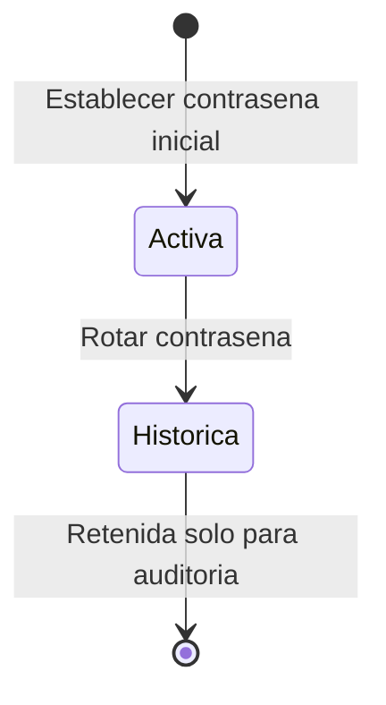

# PasswordCredential - Diseño de Entidad Propia

> **Idioma:** [English](../../domain/identity/password-credential.md) | [Español](./password-credential.md)

**Bounded Context:** Identity  
**Agregado Propietario:** `UserAccount`  
**Trazabilidad Funcional:** FS-18

## Propósito

`PasswordCredential` representa el secreto protegido de autenticación local de un `UserAccount`. Solo existe para cuentas que usan autenticación interna. La aplicación web lo gestiona desde `Cuentas de Usuario > Credenciales`; nunca lee un hash de contraseña ni un identificador de credencial histórica.

## Reglas de Negocio

1. Una cuenta federada no debe recibir una contraseña local activa.
2. Un usuario puede tener como máximo una contraseña local activa.
3. Rotar una contraseña crea una nueva credencial activa y conserva las anteriores inactivas para auditoría.
4. Los hashes son de solo escritura desde la perspectiva del cliente y nunca deben aparecer en errores visibles ni en logs.

## Ciclo de Vida

## Contrato de Aplicación

| Superficie | Contrato | Comportamiento |
| :--- | :--- | :--- |
| Comando REST | `POST /user-accounts/{userAccountId}/passwords` | Establece o rota la contraseña local. La API genera el hash BCrypt. |
| Consulta GraphQL | Campos de usuario `hasActivePassword`, `passwordUpdatedAtUtc` | Retorna únicamente información de estado. |
| Vista web | `Cuentas de Usuario > Credenciales` | Ofrece un formulario compacto para establecer o rotar contraseña en cuentas internas elegibles. |

## Seguridad y Observabilidad

- La solicitud entrega la contraseña temporal únicamente mediante transporte seguro hacia la API; la API persiste el hash BCrypt.
- `PasswordHash` nunca se retorna en proyecciones REST o GraphQL.
- Las cuentas federadas muestran orientación para administrar sus credenciales mediante el proveedor externo.
- Las respuestas de error seguras muestran una razón comprensible y `ErrorId`; el diagnóstico completo permanece en logs Serilog/Grafana Loki.
