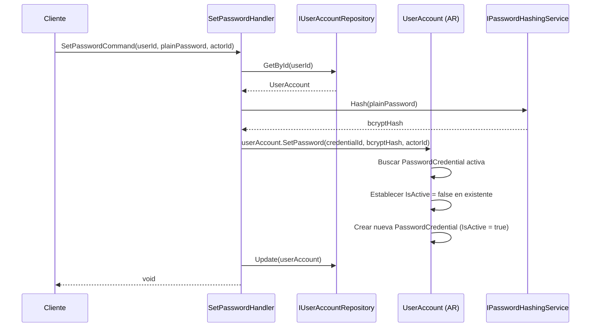
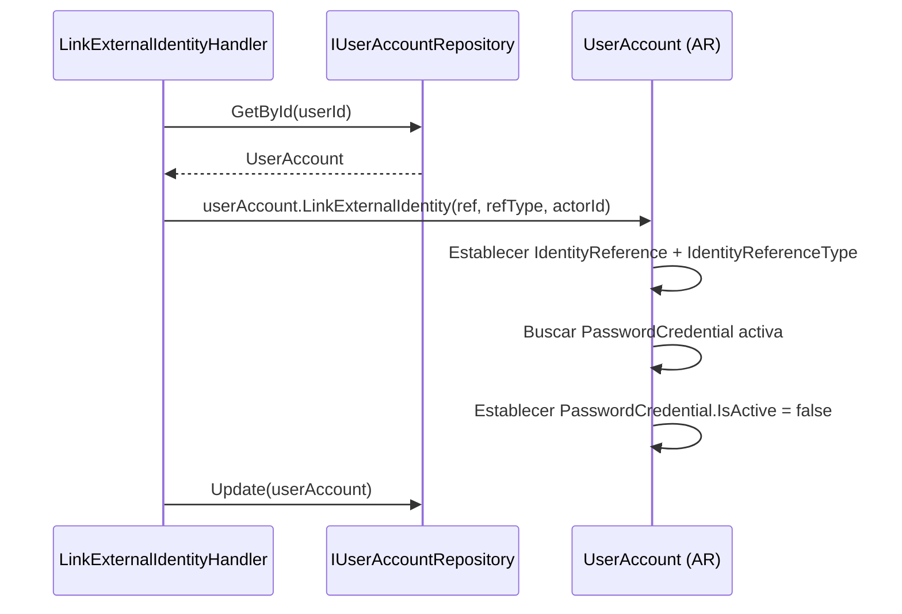
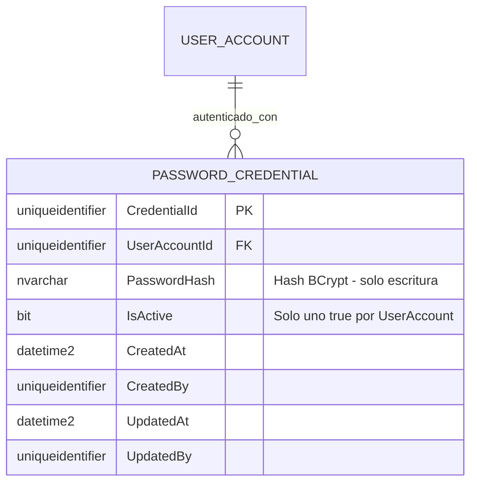
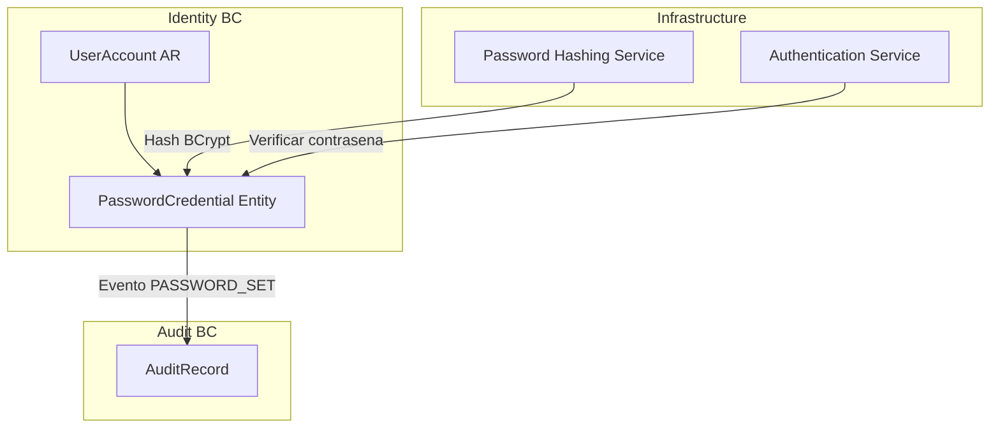

# PasswordCredential — Arquitectura del Agregado

> **Idioma:** [English](../../domain/identity/password-credential.md) | [Español](./password-credential.md)

**Bounded Context:** Identity  
**Aggregate Root:** `UserAccount` (PasswordCredential es una entidad propia)  
**Modulo:** `Ums.Domain.Identity.UserAccount.PasswordCredential`  
**Estado:** Produccion

> **Nota DDD:** `PasswordCredential` es una entidad propia dentro de `UserAccount`. Se documenta por separado por sus semanticas de seguridad distintas, ciclo de vida de rotacion de credenciales y controles de acceso estrictos que justifican documentacion explicita.

---

## 1. Descripcion del Agregado

### Proposito
`PasswordCredential` almacena el hash BCrypt de la contrasena para un `UserAccount` con estrategia de autenticacion local. Soporta rotacion de credenciales — conservando registros historicos (inactivos) mientras mantiene exactamente una credencial activa en cualquier momento.

### Responsabilidad de Negocio
- Almacenar el hash BCrypt activo actual para autenticacion basada en contrasena.
- Soportar rotacion segura de credenciales con retencion completa del historial.
- Asegurar que usuarios federados (con `IdentityReference`) no tengan una credencial activa.

### Invariantes y Reglas de Consistencia
1. A lo sumo una `PasswordCredential` con `IsActive = true` por `UserAccount`.
2. Establecer una nueva contrasena desactiva automaticamente la credencial activa anterior.
3. Un usuario `FEDERATED` (tiene `IdentityReference`) no debe tener `IsActive = true`.
4. `PasswordHash` debe ser un hash BCrypt valido (validado por servicio de dominio antes de la asignacion).
5. Las credenciales historicas (`IsActive = false`) se conservan para auditoria — nunca se eliminan fisicamente.

### Eventos de Dominio
*(Elevados en UserAccountDomainEventsManager — no hay eventos dedicados para PasswordCredential, pero las operaciones de contrasena alimentan la auditoria)*

### Comandos / Casos de Uso
| Comando | Descripcion |
|---|---|
| `SetPasswordCommand` | Crear o rotar la credencial de contrasena activa |
| `DeactivatePasswordCommand` | Desactivar credencial (ej. en federacion de cuenta) |

---

## 2. Modelo de Objetos

```
UserAccount (Aggregate Root)
└── PasswordCredential (Entidad Propia, 0..N almacenadas, 0..1 activa)
    └── Props: PasswordCredentialProps
        ├── Id: IdValueObject
        ├── UserAccountId: UserAccountId
        ├── PasswordHash: PasswordHash
        ├── IsActive: bool
        └── Audit: AuditValueObject
```

### Atributos Principales
| Atributo | Tipo | Notas |
|---|---|---|
| `Id` | `Guid` | PK |
| `UserAccountId` | `Guid` | FK a UserAccount |
| `PasswordHash` | `string` | Hash BCrypt — solo escritura |
| `IsActive` | `bool` | Solo uno `true` a la vez |

### Ciclo de Vida
```
Nueva Credencial (IsActive = true)
    ↓ (en SetPassword)
Credencial Anterior (IsActive = false) — retenida para historial
```

---

## 3. Diagramas de Secuencia

### Flujo: Establecer Contrasena


### Flujo: Desactivar Credencial (en federacion)


---

## 4. Modelo Entidad-Relacion



---

## 5. Modelo de Bounded Context



---

## 6. Contrato de Capa de Aplicacion

### Comandos
| Comando | Entrada | Salida |
|---|---|---|
| `SetPasswordCommand` | `userId, plainPassword, actorId` | `void` |

### Casos de Error
| Codigo | Condicion |
|---|---|
| `USER_NOT_FOUND` | userId desconocido |
| `USER_IS_FEDERATED` | No se puede establecer contrasena en usuario federado |
| `PASSWORD_HASH_INVALID` | Fallo en validacion del hash |

---

## 7. Notas de Persistencia

### Indices
| Indice | Columnas | Tipo |
|---|---|---|
| `IX_PasswordCredential_UserAccountId_IsActive` | `UserAccountId, IsActive` | No unico |

### Seguridad
- La columna `PasswordHash` nunca debe aparecer en proyecciones de consultas retornadas a clientes.
- `PasswordHash` nunca debe aparecer en payloads `AuditRecord.WhatChanged`.
- La columna debe estar encriptada en reposo (SQL Server Always Encrypted o TDE).

---

## 8. Seguridad y Auditoria

### Reglas de Autorizacion
| Operacion | Rol Requerido |
|---|---|
| Establecer Contrasena | Usuario mismo o Tenant:Admin |
| Leer Credencial (solo IsActive) | Tenant:Admin |
| Leer Hash | Nadie — solo escritura |

### Datos Sensibles
- `PasswordHash` es el campo mas sensible del sistema. El acceso de lectura debe ser bloqueado a nivel de repositorio.

### Eventos de Auditoria
- `PASSWORD_SET` — registrado con `actorId`, `userId`, timestamp. Hash nunca registrado.

### Cumplimiento
- GDPR: El hash no es PII, pero la presencia de un registro de credencial implica cuenta local. Al borrar cuenta, el hash debe ser anulado.
- NIST 800-63B: BCrypt con factor de costo apropiado requerido.
