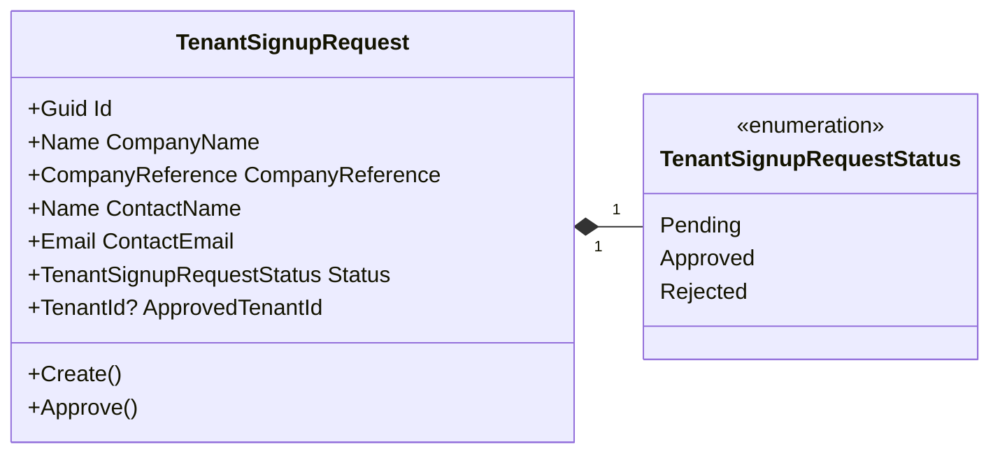
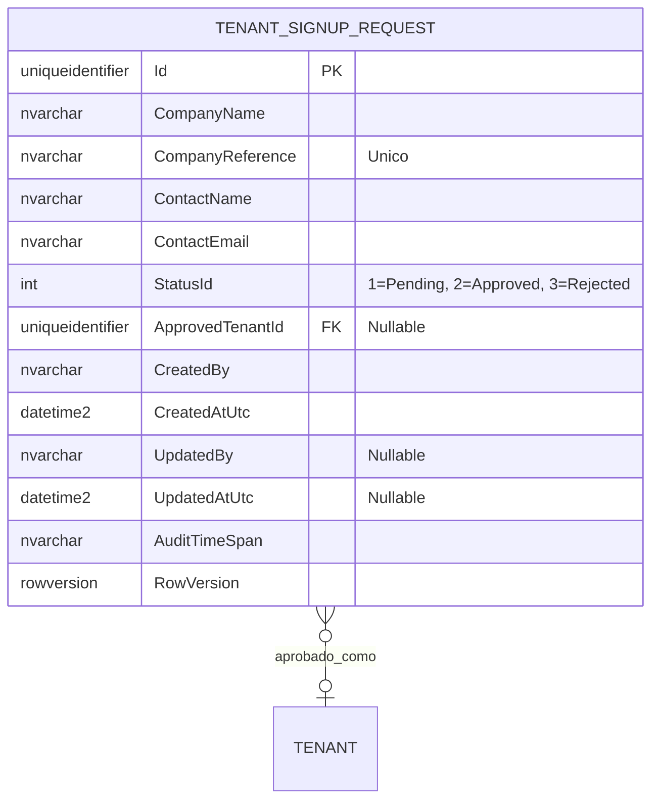

# TenantSignupRequest - Arquitectura del Agregado

**Contexto Delimitado:** Identity  
**Raiz de Agregado:** `TenantSignupRequest`  
**Modulo:** `Ums.Domain.Identity.TenantSignupRequest`  
**Estado:** Implementado para Phase 4 tenant onboarding

---

## 1. Vista General del Agregado

### Proposito
`TenantSignupRequest` representa una solicitud publica de onboarding de empresa enviada antes de que exista el tenant. Un administrador global la revisa y, cuando se aprueba, queda vinculada al tenant creado.

### Responsabilidad de Negocio
- Capturar nombre de empresa, referencia de empresa, nombre de contacto y correo de contacto desde el formulario publico de alta de tenant.
- Mantener la solicitud en `Pending` hasta que un administrador global la apruebe.
- Vincular la solicitud con el tenant creado mediante `ApprovedTenantId`.
- Proveer el registro origen para la bandeja global de onboarding.

### Modelo de Estados Implementado
| Estado | Valor de Codigo | Significado | Transicion Implementada |
|---|---:|---|---|
| `Pending` | 1 | Solicitud enviada y en espera de revision global. | Creada por `TenantSignupRequest.Create`. |
| `Approved` | 2 | El tenant fue creado y vinculado a la solicitud. | `Approve(tenantId, updatedBy)`. |
| `Rejected` | 3 | Reservado en el enum para solicitudes de empresa denegadas. | El enum existe; el comando del agregado aun no esta implementado. |

### Entidades / Value Objects Relacionados
| Entidad / VO | Tipo | Propiedad |
|---|---|---|
| `TenantSignupRequestStatus` | Enumeracion | Pending, Approved, Rejected |
| `CompanyReference` | Value Object | RUC/codigo/referencia de empresa |
| `Name` | Value Object | Nombres de empresa y contacto |
| `Email` | Value Object | Correo del contacto |
| `TenantId` | Value Object | Referencia nullable asignada despues de aprobar |
| `AuditValueObject` | Value Object | Metadata de creacion y actualizacion |

---

## 2. Modelo de Objetos

---

## 3. Modelo ER

### Mapeo de Persistencia
| Artefacto de Codigo | Mapeo |
|---|---|
| EF record | `TenantSignupRequestRecord` |
| Tabla | `identity.TenantSignupRequests` |
| Indice unico | `CompanyReference` |
| Indice de consulta | `StatusId`, `ContactEmail` |
| Repositorio | `ITenantSignupRequestRepository` |

---

## 4. Alineamiento de Onboarding

Este agregado implementa la solicitud de onboarding de empresa de FS-21 y EP-09. Su alcance es global porque el tenant aun no existe. El aislamiento por tenant inicia despues de la aprobacion, cuando `ApprovedTenantId` referencia el tenant creado.

---

**[Volver al Indice de Identity](./index.md)**
