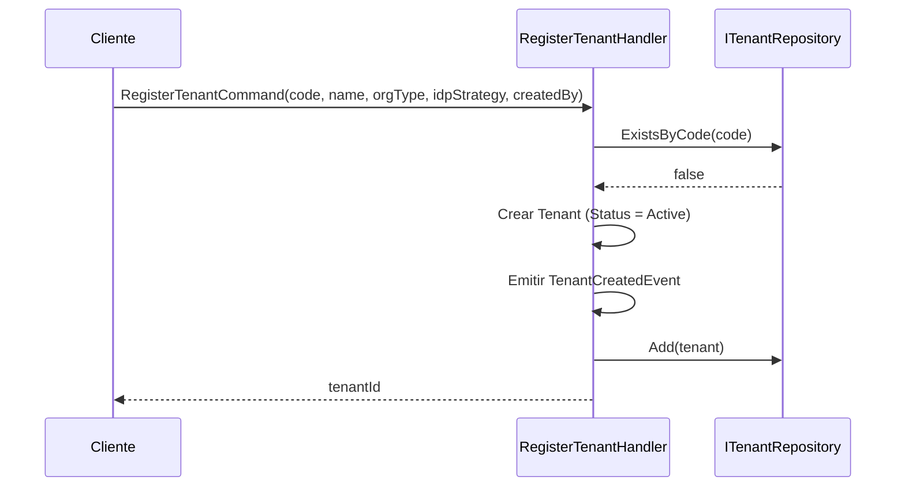
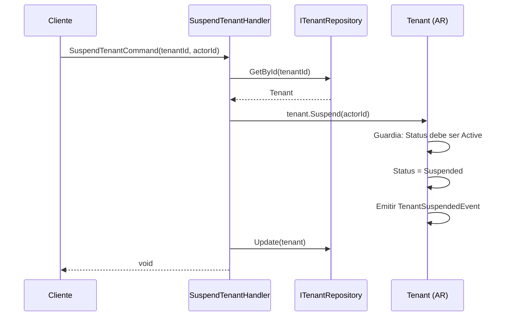
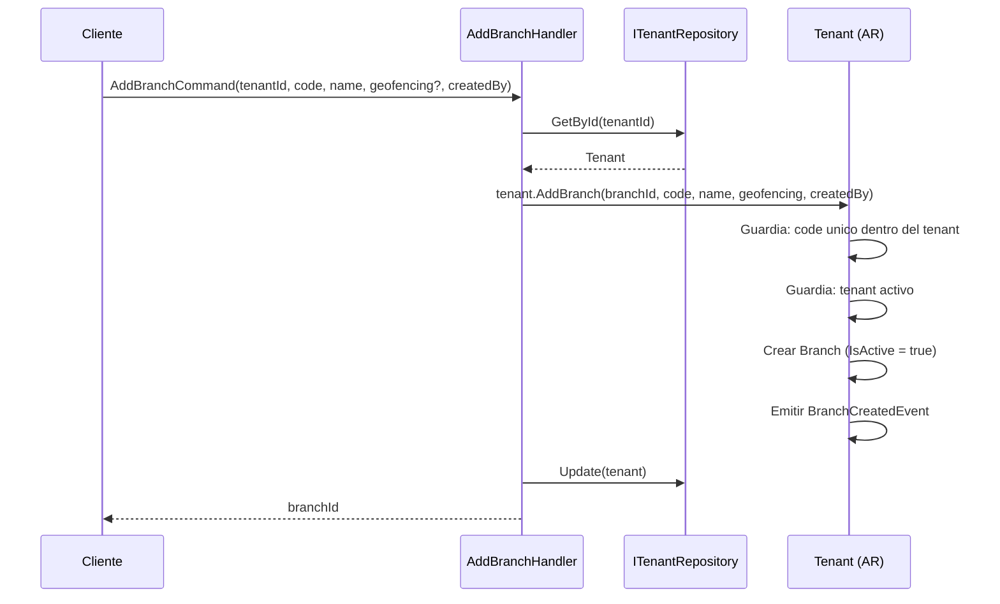
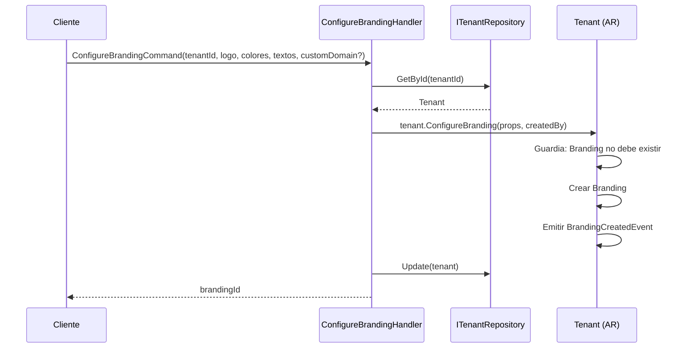
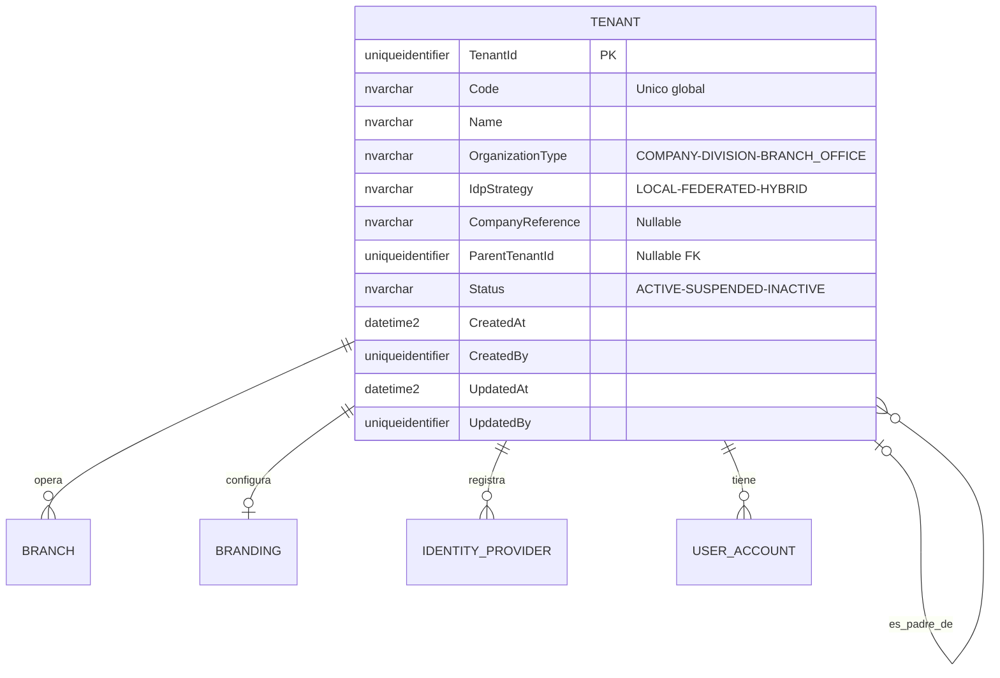
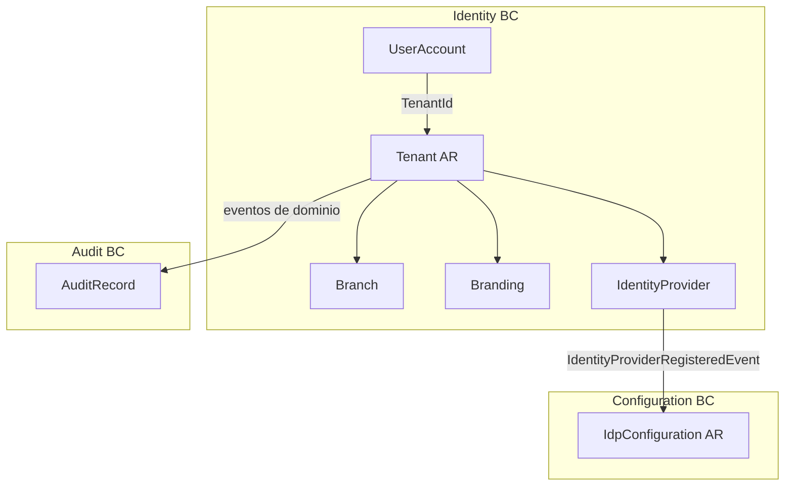

# Tenant — Arquitectura del Agregado

> **Idioma:** [English](../../domain/identity/tenant.md) | [Español](./tenant.md)

**Bounded Context:** Identity  
**Aggregate Root:** `Tenant`  
**Modulo:** `Ums.Domain.Identity.Tenant`  
**Estado:** Produccion

---

## 1. Descripcion del Agregado

### Proposito
`Tenant` es la unidad organizativa raiz del sistema. Representa a una empresa o division que usa UMS como plataforma de gestion de identidades. Agrupa a todos los usuarios, ramas, configuraciones de branding y proveedores de identidad bajo un espacio de nombres unico y aislado.

### Responsabilidad de Negocio
- Proveer aislamiento multi-tenant para todos los datos del sistema.
- Gestionar el ciclo de vida del tenant: registro, suspension y activacion.
- Ser el propietario de `Branch`, `Branding` e `IdentityProvider` como entidades propias.
- Definir la estrategia de autenticacion (`IdpStrategy`) a nivel de dominio.

### Aggregate Root
`Tenant` es su propio aggregate root. Todas las mutaciones de `Branch`, `Branding` e `IdentityProvider` pasan por comandos de `Tenant`.

### Invariantes y Reglas de Consistencia
1. `Code` debe ser globalmente unico en todo el sistema.
2. Un `Tenant` con `TenantStatus = Suspended` bloquea todos los flujos de autenticacion de sus usuarios.
3. Solo puede existir un registro `Branding` por Tenant (relacion 1:1).
4. `IdpStrategy` debe ser coherente: si es `FEDERATED`, debe existir al menos un `IdentityProvider` activo.
5. Un tenant hijo (`ParentTenantId != null`) hereda politicas del tenant padre.

### Entidades Relacionadas / Value Objects
| Entidad / VO | Tipo | Notas |
|---|---|---|
| `Code` | Value Object | Identificador unico global del tenant |
| `Name` | Value Object | Nombre para mostrar |
| `OrganizationType` | Enum | COMPANY · DIVISION · BRANCH_OFFICE |
| `IdpStrategy` | Enum | LOCAL · FEDERATED · HYBRID |
| `CompanyReference` | Value Object | Referencia al sistema ERP (nullable) |
| `TenantStatus` | Enum | Active · Suspended · Inactive |
| `AuditValueObject` | Value Object | CreatedAt/By, UpdatedAt/By |

### Eventos de Dominio
| Evento | Disparador |
|---|---|
| `TenantCreatedEvent` | Nuevo tenant registrado |
| `TenantSuspendedEvent` | Tenant suspendido por admin de plataforma |
| `TenantActivatedEvent` | Tenant reactivado |
| `BranchCreatedEvent` | Nueva rama agregada al tenant |
| `BranchDeactivatedEvent` | Rama desactivada |
| `BranchReactivatedEvent` | Rama reactivada |
| `BranchRemovedEvent` | Rama eliminada definitivamente |
| `BrandingCreatedEvent` | Branding configurado por primera vez |
| `BrandingUpdatedEvent` | Atributos de branding actualizados |
| `BrandingDnsVerifiedEvent` | Dominio personalizado verificado por DNS |
| `IdentityProviderRegisteredEvent` | Nuevo IdP registrado |
| `IdentityProviderActivatedEvent` | IdP activado |
| `IdentityProviderDeactivatedEvent` | IdP desactivado |

### Comandos / Casos de Uso
| Comando | Descripcion |
|---|---|
| `RegisterTenantCommand` | Crear un nuevo tenant |
| `SuspendTenantCommand` | Suspender un tenant activo |
| `ActivateTenantCommand` | Reactivar un tenant suspendido |
| `AddBranchCommand` | Agregar una rama al tenant |
| `DeactivateBranchCommand` | Desactivar una rama |
| `ReactivateBranchCommand` | Reactivar una rama |
| `RemoveBranchCommand` | Eliminar una rama sin dependientes |
| `ConfigureBrandingCommand` | Configurar branding por primera vez |
| `UpdateBrandingCommand` | Actualizar atributos de branding |
| `RegisterIdentityProviderCommand` | Registrar un IdP externo |
| `ActivateIdentityProviderCommand` | Activar un IdP |
| `DeactivateIdentityProviderCommand` | Desactivar un IdP |

### Limites de Repositorio / Servicio
- Acceso via `ITenantRepository`.
- `IBranchDependencyChecker` — servicio de dominio para validar dependencias antes de eliminar rama.
- `IIdpStrategyConsistencyService` — valida que la desactivacion de un IdP no deje al tenant sin ruta de autenticacion.

---

## 2. Modelo de Objetos

```
Tenant (Aggregate Root)
├── Props: TenantProps
│   ├── Id: IdValueObject
│   ├── Code: Code
│   ├── Name: Name
│   ├── OrganizationType: OrganizationType
│   ├── IdpStrategy: IdpStrategy
│   ├── CompanyReference?: CompanyReference
│   ├── ParentTenantId?: TenantId
│   ├── Status: TenantStatus
│   └── Audit: AuditValueObject
├── Branch (Entidad Propia, 0..N)
├── Branding (Entidad Propia, 0..1)
└── IdentityProvider (Entidad Propia, 0..N)
```

### Atributos Principales
| Atributo | Tipo | Notas |
|---|---|---|
| `Id` | `Guid` | PK |
| `Code` | `string` | Unico globalmente |
| `Name` | `string` | Nombre para mostrar |
| `OrganizationType` | `OrganizationType` | COMPANY / DIVISION / BRANCH_OFFICE |
| `IdpStrategy` | `IdpStrategy` | LOCAL / FEDERATED / HYBRID |
| `CompanyReference` | `string?` | Referencia ERP externa |
| `ParentTenantId` | `Guid?` | FK al tenant padre |
| `Status` | `TenantStatus` | Active / Suspended / Inactive |

### Ciclo de Vida
```
Active ──► Suspended ──► Active
Active ──► Inactive (terminal)
```

---

## 3. Diagramas de Secuencia

### Flujo: Registrar Tenant


### Flujo: Suspender Tenant


### Flujo: Agregar Rama


### Flujo: Configurar Branding


---

## 4. Modelo Entidad-Relacion



---

## 5. Modelo de Bounded Context



---

## 6. Contrato de Capa de Aplicacion

### Comandos
| Comando | Entrada | Salida |
|---|---|---|
| `RegisterTenantCommand` | `code, name, orgType, idpStrategy, createdBy` | `Guid tenantId` |
| `SuspendTenantCommand` | `tenantId, actorId` | `void` |
| `ActivateTenantCommand` | `tenantId, actorId` | `void` |
| `AddBranchCommand` | `tenantId, code, name, geofencingMetadata?, createdBy` | `Guid branchId` |
| `RegisterIdentityProviderCommand` | `tenantId, code, name, description, strategy, createdBy` | `Guid idpId` |
| `ConfigureBrandingCommand` | `tenantId, logo, logoFormat, primaryColor, ...` | `Guid brandingId` |

### Consultas
| Consulta | Retorna |
|---|---|
| `GetTenantByIdQuery(tenantId)` | `TenantDto?` |
| `GetTenantByCodeQuery(code)` | `TenantDto?` |

### Casos de Error
| Codigo | Condicion |
|---|---|
| `TENANT_CODE_DUPLICATE` | Code ya existe globalmente |
| `TENANT_NOT_FOUND` | tenantId desconocido |
| `TENANT_NOT_ACTIVE` | Operacion requiere tenant activo |
| `TENANT_SUSPENDED` | Tenant actualmente suspendido |

---

## 7. Notas de Persistencia

### Indices
| Indice | Columnas | Tipo |
|---|---|---|
| `IX_Tenant_Code` | `Code` | Unico |
| `IX_Tenant_ParentTenantId` | `ParentTenantId` | No unico |
| `IX_Branch_TenantId_Code` | `TenantId, Code` | Unico |
| `IX_Branding_TenantId` | `TenantId` | Unico |
| `IX_IdentityProvider_TenantId_Code` | `TenantId, Code` | Unico |

### Consideraciones Multi-Tenant
- Todas las consultas de entidades hijas deben estar filtradas por `TenantId`.
- `Code` es clave unica global — no por tenant.

---

## 8. Seguridad y Auditoria

### Reglas de Autorizacion
| Operacion | Rol Requerido |
|---|---|
| Registrar Tenant | Platform:Admin |
| Suspender / Activar Tenant | Platform:Admin |
| Agregar / Eliminar Branch | Tenant:Admin |
| Configurar Branding | Tenant:Admin |
| Registrar IdP | Tenant:Admin |

### Eventos de Auditoria
- `TENANT_CREATED`, `TENANT_SUSPENDED`, `TENANT_ACTIVATED`
- `BRANCH_CREATED`, `BRANCH_DEACTIVATED`, `BRANCH_REMOVED`
- `BRANDING_CONFIGURED`, `IDP_REGISTERED`
