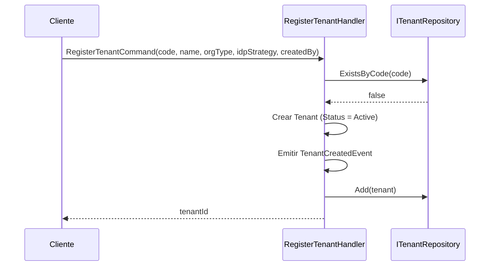
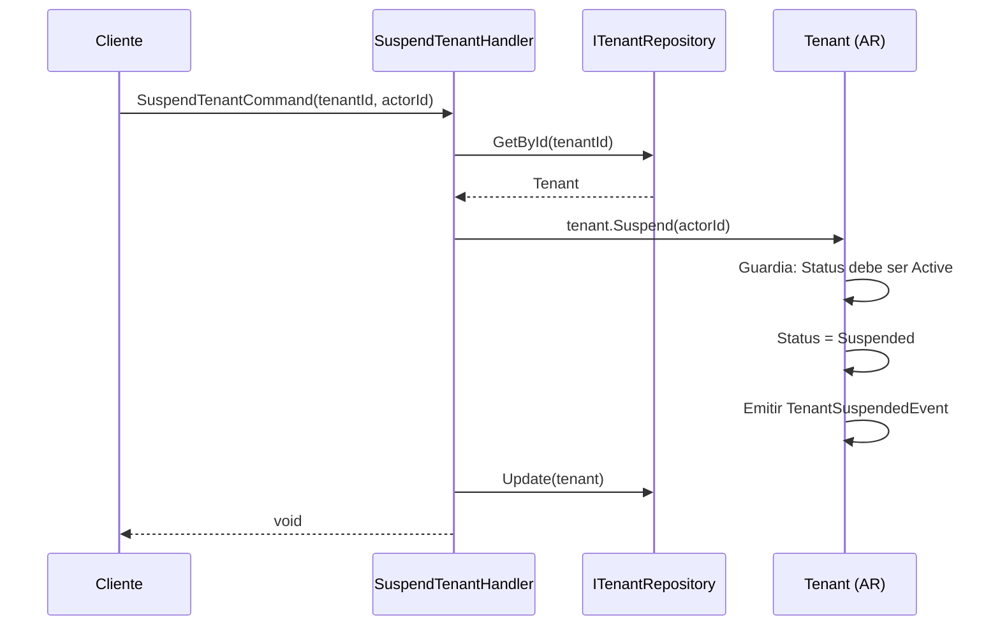
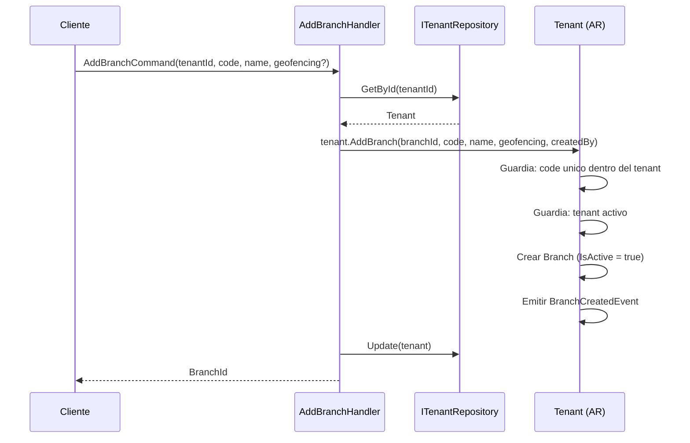
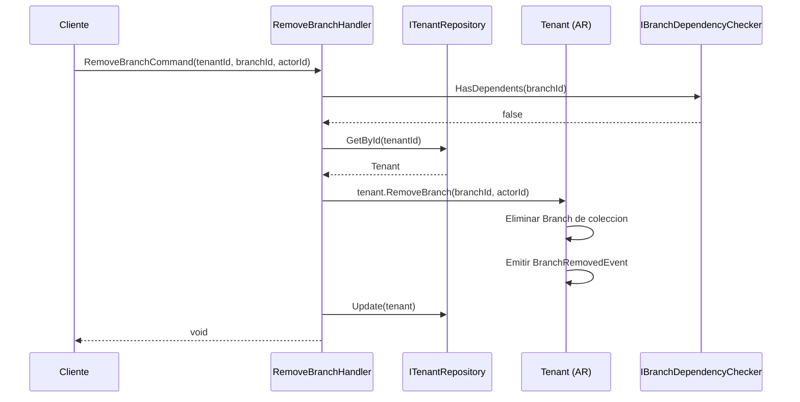
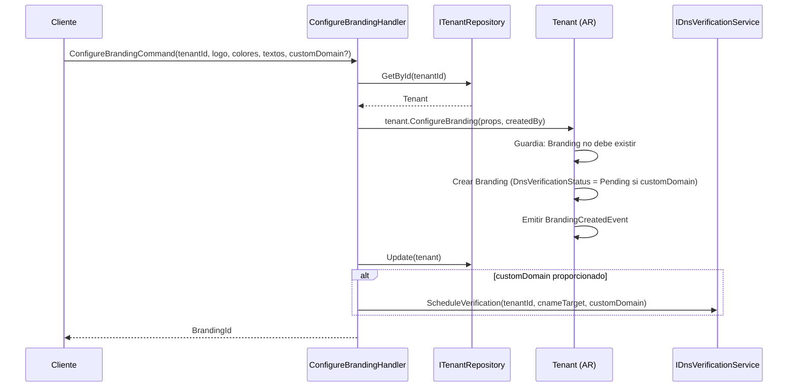
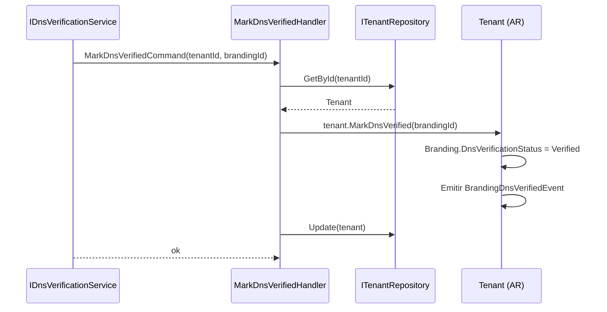
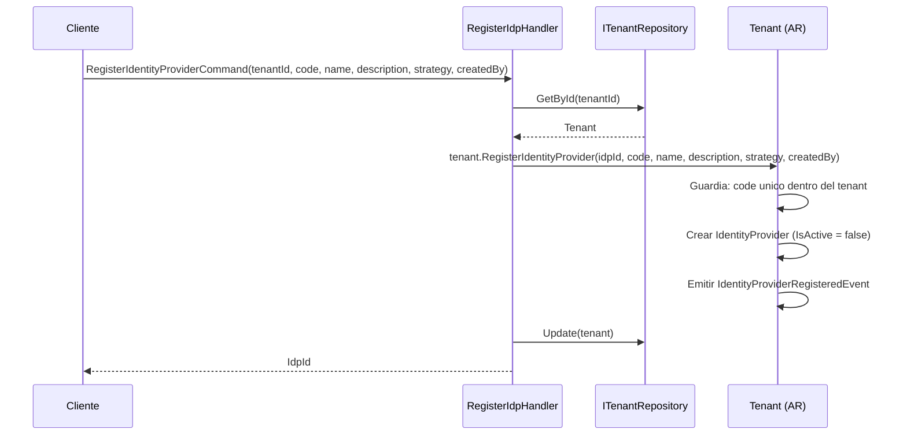
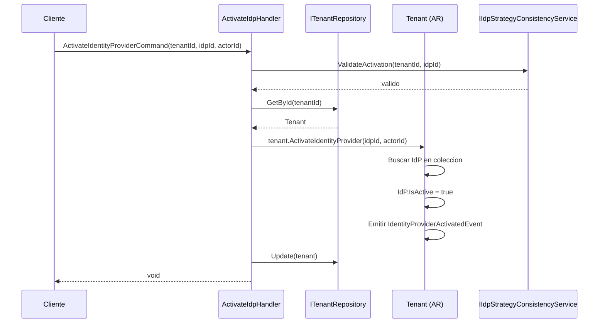
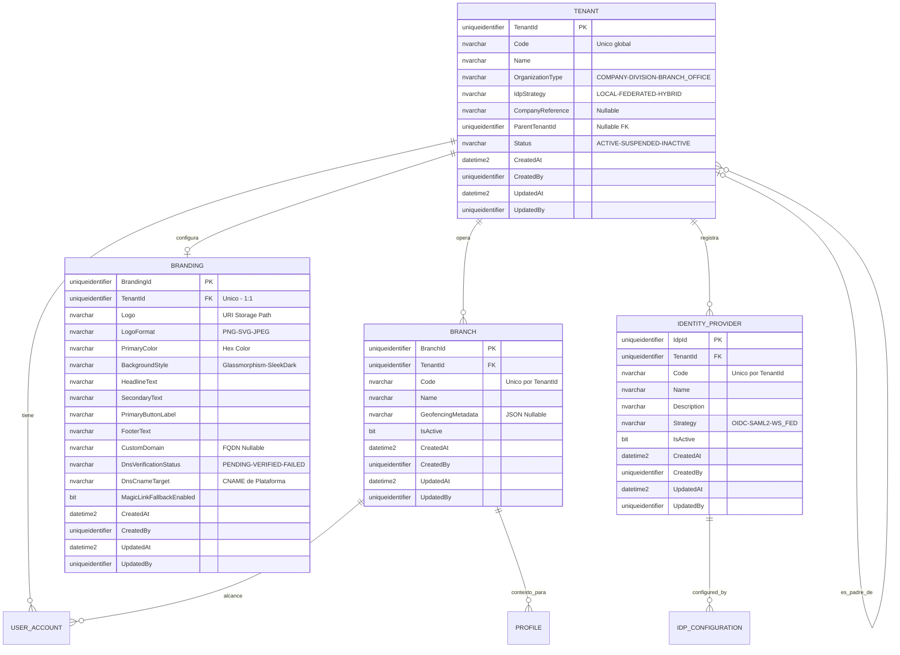
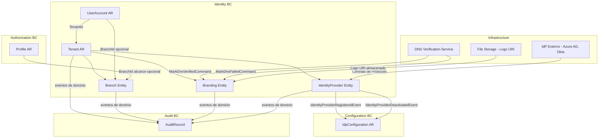

# Tenant — Arquitectura del Agregado

> **Idioma:** [English](../../domain/identity/tenant.md) | [Español](./tenant.md)

**Bounded Context:** Identity
**Aggregate Root:** `Tenant`
**Modulo:** `Ums.Domain.Identity.Tenant`
**Estado:** Produccion

---

## 1. Descripcion del Agregado

### Proposito
`Tenant` es la unidad organizativa raiz del sistema. Representa a una empresa o division que usa UMS como plataforma de gestion de identidades. Agrupa a todos los usuarios, ramas (`Branch`), configuraciones de branding (`Branding`) y proveedores de identidad (`IdentityProvider`) bajo un espacio de nombres unico y aislado.

### Responsabilidad de Negocio
- Proveer aislamiento multi-tenant para todos los datos del sistema.
- Gestionar el ciclo de vida del tenant: registro, suspension y activacion.
- Ser el propietario de `Branch`, `Branding` e `IdentityProvider` como entidades propias.
- Definir la estrategia de autenticacion (`IdpStrategy`) a nivel de dominio.

**Branch**: Representa una unidad de ubicacion fisica o logica. Provee un ambito geográfico u organizacional. Aplica reglas de geocercado y habilita delegación de administración.
**Branding**: Contiene la configuración de identidad visual (logo, colores, textos) y dominio personalizado con verificación DNS. Controla cómo se renderiza el portal de login.
**IdentityProvider**: Representa un proveedor de autenticación externo (OIDC, SAML2, WS_FED). Registra la intención estratégica y el contrato a nivel de negocio para el tenant.

### Aggregate Root
`Tenant` es su propio aggregate root. Todas las mutaciones de `Branch`, `Branding` e `IdentityProvider` pasan por comandos de `Tenant`.

### Invariantes y Reglas de Consistencia
1. **Tenant**: `Code` debe ser globalmente unico en todo el sistema.
2. **Tenant**: Un `Tenant` con `TenantStatus = Suspended` bloquea todos los flujos de autenticacion de sus usuarios.
3. **Tenant**: `IdpStrategy` debe ser coherente: si es `FEDERATED`, debe existir al menos un `IdentityProvider` activo.
4. **Tenant**: Un tenant hijo (`ParentTenantId != null`) hereda politicas del tenant padre.
5. **Branch**: `Code` debe ser unico dentro del `Tenant` propietario.
6. **Branch**: Una `Branch` no puede ser eliminada si existen registros activos de `UserAccount` o `Profile` asociados.
7. **Branch**: `GeofencingMetadata` debe ser JSON valido cuando se proporciona.
8. **Branch**: La desactivacion no elimina; los registros se conservan para trazabilidad historica.
9. **Branding**: Solo puede existir un registro `Branding` por Tenant (relacion 1:1).
10. **Branding**: `CustomDomain` debe ser un hostname valido cuando se proporciona.
11. **Branding**: `DnsVerificationStatus` comienza en `PENDING` cuando se establece `CustomDomain` y no puede establecerse manualmente a `VERIFIED` (solo por el servicio de verificacion DNS).
12. **Branding**: `LogoFormat` debe coincidir con el formato real del URI de `Logo` subido.
13. **IdentityProvider**: `Code` debe ser unico dentro del Tenant propietario.
14. **IdentityProvider**: Un `IdentityProvider` debe ser desactivado antes de ser eliminado.
15. **IdentityProvider**: Desactivar un `IdentityProvider` que es el unico IdP activo para un tenant Federado no esta permitido a menos que se cambie primero el `IdpStrategy`.
16. **IdentityProvider**: `Strategy` no puede cambiarse despues del registro — es inmutable una vez establecida.

### Entidades Relacionadas / Value Objects
| Entidad / VO | Tipo | Notas |
|---|---|---|
| `Code` | Value Object | Identificador unico global del tenant |
| `Name` | Value Object | Nombre para mostrar |
| `OrganizationType` | Enum | COMPANY · DIVISION · BRANCH_OFFICE |
| `IdpStrategy` | Enum | LOCAL · FEDERATED · HYBRID |
| `CompanyReference` | Value Object | Referencia al sistema ERP (nullable) |
| `TenantStatus` | Enum | Active · Suspended · Inactive |
| `AuditValueObject` | Value Object | CreatedAt/By, UpdatedAt/By |

### Eventos de Dominio
| Evento | Disparador |
|---|---|
| `TenantCreatedEvent` | Nuevo tenant registrado |
| `TenantSuspendedEvent` | Tenant suspendido por admin de plataforma |
| `TenantActivatedEvent` | Tenant reactivado |
| `BranchCreatedEvent` | Nueva rama agregada al tenant |
| `BranchDeactivatedEvent` | Rama desactivada |
| `BranchReactivatedEvent` | Rama reactivada |
| `BranchRemovedEvent` | Rama eliminada definitivamente |
| `BrandingCreatedEvent` | Branding configurado por primera vez |
| `BrandingUpdatedEvent` | Atributos de branding actualizados |
| `BrandingRemovedEvent` | Configuracion de branding eliminada |
| `BrandingDnsVerifiedEvent` | Dominio personalizado verificado por DNS |
| `BrandingDnsFailedEvent` | Intento de verificacion DNS fallido |
| `IdentityProviderRegisteredEvent` | Nuevo IdP registrado |
| `IdentityProviderActivatedEvent` | IdP activado |
| `IdentityProviderDeactivatedEvent` | IdP desactivado |
| `IdentityProviderRemovedEvent` | IdP eliminado definitivamente |

### Comandos / Casos de Uso
| Comando | Descripcion |
|---|---|
| `RegisterTenantCommand` | Crear un nuevo tenant |
| `SuspendTenantCommand` | Suspender un tenant activo |
| `ActivateTenantCommand` | Reactivar un tenant suspendido |
| `AddBranchCommand` | Agregar una rama al tenant |
| `UpdateBranchCommand` | Actualizar nombre o metadatos de geocercado |
| `DeactivateBranchCommand` | Desactivar una rama |
| `ReactivateBranchCommand` | Reactivar una rama |
| `RemoveBranchCommand` | Eliminar una rama sin dependientes |
| `ConfigureBrandingCommand` | Configurar branding por primera vez |
| `UpdateBrandingCommand` | Actualizar atributos de branding |
| `SetCustomDomainCommand` | Agregar o reemplazar el dominio personalizado |
| `RemoveBrandingCommand` | Eliminar la configuracion de branding |
| `MarkDnsVerifiedCommand` | Interno — llamado por el servicio de verificacion DNS |
| `MarkDnsFailedCommand` | Interno — llamado por el servicio de verificacion DNS |
| `RegisterIdentityProviderCommand` | Registrar un IdP externo |
| `ActivateIdentityProviderCommand` | Activar un IdP |
| `DeactivateIdentityProviderCommand` | Desactivar un IdP |
| `RemoveIdentityProviderCommand` | Eliminar definitivamente un IdP inactivo |

### Limites de Repositorio / Servicio
- Acceso via `ITenantRepository`.
- `IBranchDependencyChecker` — servicio de dominio para validar dependencias antes de eliminar rama.
- `IIdpStrategyConsistencyService` — valida que la desactivacion de un IdP no deje al tenant sin ruta de autenticacion.

---

## 2. Modelo de Objetos

```
Tenant (Aggregate Root)
├── Props: TenantProps
│   ├── Id: IdValueObject
│   ├── Code: Code
│   ├── Name: Name
│   ├── OrganizationType: OrganizationType
│   ├── IdpStrategy: IdpStrategy
│   ├── CompanyReference?: CompanyReference
│   ├── ParentTenantId?: TenantId
│   ├── Status: TenantStatus
│   └── Audit: AuditValueObject
├── Branch (Entidad Propia, 0..N)
│   └── Props: BranchProps
│       ├── Id: IdValueObject
│       ├── TenantId: TenantId
│       ├── Code: Code
│       ├── Name: Name
│       ├── GeofencingMetadata?: Value (JSON)
│       ├── IsActive: bool
│       └── Audit: AuditValueObject
├── Branding (Entidad Propia, 0..1)
│   └── Props: BrandingProps
│       ├── Id: IdValueObject
│       ├── TenantId: TenantId
│       ├── Logo: Logo
│       ├── LogoFormat: LogoFormat
│       ├── PrimaryColor: HexColor
│       ├── BackgroundStyle: BackgroundStyle
│       ├── HeadlineText: LoginText
│       ├── SecondaryText: LoginText
│       ├── PrimaryButtonLabel: LoginText
│       ├── FooterText: LoginText
│       ├── CustomDomain?: CustomDomain
│       ├── DnsVerificationStatus: DnsVerificationStatus
│       ├── DnsCnameTarget: DnsCnameTarget
│       ├── MagicLinkFallbackEnabled: bool
│       └── Audit: AuditValueObject
└── IdentityProvider (Entidad Propia, 0..N)
    └── Props: IdentityProviderProps
        ├── Id: IdValueObject
        ├── TenantId: TenantId
        ├── Code: Code
        ├── Name: Name
        ├── Description: Description
        ├── Strategy: IdpStrategy
        ├── IsActive: bool
        └── Audit: AuditValueObject
```

### Ciclo de Vida
**Tenant**:
```
Active ──► Suspended ──► Active
Active ──► Inactive (terminal)
```
**Branch**:
```
Activo (IsActive = true) ──► Desactivado (IsActive = false) ──► Activo
                                     └──► Eliminado (si no tiene dependientes)
```
**Branding (DNS)**:
```
(CustomDomain establecido) -> DnsVerificationStatus = Pending
                                 ├──► Verified  (CNAME DNS coincide)
                                 └──► Failed    (CNAME faltante o incorrecto)
                                         └──► Pending (en reintento)
```
**IdentityProvider**:
```
Registrado (IsActive = false) ──► Activado (IsActive = true) ──► Desactivado ──► Eliminado
```

---

## 3. Diagramas de Secuencia

### Flujo: Registrar Tenant


### Flujo: Suspender Tenant


### Flujo: Agregar Rama


### Flujo: Eliminar Rama


### Flujo: Configurar Branding


### Flujo: Verificacion DNS (Branding)


### Flujo: Registrar IdP


### Flujo: Activar IdP


---

## 4. Modelo Entidad-Relacion



---

## 5. Modelo de Bounded Context



---

## 6. Contrato de Capa de Aplicacion

### Comandos
| Comando | Entrada | Salida |
|---|---|---|
| `RegisterTenantCommand` | `code, name, orgType, idpStrategy, createdBy` | `Guid tenantId` |
| `SuspendTenantCommand` | `tenantId, actorId` | `void` |
| `ActivateTenantCommand` | `tenantId, actorId` | `void` |
| `AddBranchCommand` | `tenantId, code, name, geofencingMetadata?, createdBy` | `Guid branchId` |
| `UpdateBranchCommand` | `tenantId, branchId, name?, geofencingMetadata?, updatedBy` | `void` |
| `DeactivateBranchCommand` | `tenantId, branchId, actorId` | `void` |
| `ReactivateBranchCommand` | `tenantId, branchId, actorId` | `void` |
| `RemoveBranchCommand` | `tenantId, branchId, actorId` | `void` |
| `ConfigureBrandingCommand` | `tenantId, logo, logoFormat, primaryColor, backgroundStyle, headlineText, secondaryText, primaryButtonLabel, footerText, customDomain?, cnameTarget, magicLinkFallback, createdBy` | `Guid brandingId` |
| `UpdateBrandingCommand` | `tenantId, brandingId, campos..., updatedBy` | `void` |
| `SetCustomDomainCommand` | `tenantId, brandingId, customDomain, updatedBy` | `void` |
| `RemoveBrandingCommand` | `tenantId, brandingId, actorId` | `void` |
| `MarkDnsVerifiedCommand` | `tenantId, brandingId` | `void` |
| `MarkDnsFailedCommand` | `tenantId, brandingId, reason` | `void` |
| `RegisterIdentityProviderCommand` | `tenantId, code, name, description, strategy, createdBy` | `Guid idpId` |
| `ActivateIdentityProviderCommand` | `tenantId, idpId, actorId` | `void` |
| `DeactivateIdentityProviderCommand` | `tenantId, idpId, actorId` | `void` |
| `RemoveIdentityProviderCommand` | `tenantId, idpId, actorId` | `void` |

### Consultas
| Consulta | Retorna |
|---|---|
| `GetTenantByIdQuery(tenantId)` | `TenantDto?` |
| `GetTenantByCodeQuery(code)` | `TenantDto?` |

### Casos de Error
| Codigo | Condicion |
|---|---|
| `TENANT_CODE_DUPLICATE` | Code ya existe globalmente |
| `TENANT_NOT_FOUND` | tenantId desconocido |
| `TENANT_NOT_ACTIVE` | Operacion requiere tenant activo |
| `TENANT_SUSPENDED` | Tenant actualmente suspendido |
| `BRANCH_CODE_DUPLICATE` | Code ya existe en el tenant |
| `BRANCH_NOT_FOUND` | branchId desconocido en el tenant |
| `BRANCH_HAS_DEPENDENTS` | Eliminacion bloqueada por usuarios o perfiles activos |
| `BRANCH_ALREADY_INACTIVE` | Desactivar una rama ya inactiva |
| `BRANDING_ALREADY_EXISTS` | ConfigureBranding llamado dos veces |
| `BRANDING_NOT_FOUND` | Sin branding configurado para el tenant |
| `DNS_ALREADY_VERIFIED` | Intento de re-verificar un dominio ya verificado |
| `INVALID_CUSTOM_DOMAIN` | No es un formato FQDN valido |
| `IDP_CODE_DUPLICATE` | Code existe en el tenant |
| `IDP_NOT_FOUND` | idpId desconocido en el tenant |
| `IDP_STRATEGY_IMMUTABLE` | Intento de cambiar Strategy |
| `IDP_SOLE_ACTIVE_PROVIDER` | Desactivacion dejaria al tenant sin autenticacion |
| `IDP_NOT_INACTIVE` | Eliminacion intentada en IdP activo |

---

## 7. Notas de Persistencia

### Indices
| Indice | Columnas | Tipo |
|---|---|---|
| `IX_Tenant_Code` | `Code` | Unico |
| `IX_Tenant_ParentTenantId` | `ParentTenantId` | No unico |
| `IX_Branch_TenantId` | `TenantId` | No unico |
| `IX_Branch_TenantId_Code` | `TenantId, Code` | Unico |
| `IX_Branch_IsActive` | `IsActive` | No unico |
| `IX_Branding_TenantId` | `TenantId` | Unico (impone 1:1) |
| `IX_Branding_CustomDomain` | `CustomDomain` | Unico (parcial - no nulo) |
| `IX_IdentityProvider_TenantId_Code` | `TenantId, Code` | Unico |
| `IX_IdentityProvider_TenantId_IsActive` | `TenantId, IsActive` | No unico |

### Consideraciones Multi-Tenant
- Todas las consultas de entidades hijas deben estar filtradas por `TenantId`.
- `Code` en Tenant es clave unica global — no por tenant.
- `CustomDomain` unico entre todos los tenants (un dominio no puede ser reclamado por dos tenants).

---

## 8. Seguridad y Auditoria

### Reglas de Autorizacion
| Operacion | Rol Requerido |
|---|---|
| Registrar Tenant | Platform:Admin |
| Suspender / Activar Tenant | Platform:Admin |
| Agregar / Eliminar Branch | Tenant:Admin |
| Desactivar / Reactivar Branch | Tenant:Admin |
| Listar Branches | Tenant:Admin · Tenant:UserManager |
| Configurar / Actualizar Branding | Tenant:Admin |
| Establecer Dominio Personalizado | Tenant:Admin |
| Marcar DNS Verificado/Fallido | Solo servicio interno |
| Registrar / Eliminar IdP | Tenant:Admin |
| Activar / Desactivar IdP | Tenant:Admin |

### Eventos de Auditoria
- Tenant: `TENANT_CREATED`, `TENANT_SUSPENDED`, `TENANT_ACTIVATED`
- Branch: `BRANCH_CREATED`, `BRANCH_DEACTIVATED`, `BRANCH_REACTIVATED`, `BRANCH_REMOVED`
- Branding: `BRANDING_CONFIGURED`, `BRANDING_UPDATED`, `BRANDING_REMOVED`, `DNS_VERIFIED`, `DNS_FAILED`
- IdentityProvider: `IDP_REGISTERED`, `IDP_ACTIVATED`, `IDP_DEACTIVATED`, `IDP_REMOVED`

### Datos Sensibles
- `IdentityProvider` en si no almacena credenciales. Los secretos viven en `IDP_CONFIGURATION.SecretRef` (ruta al vault).

---

## 9. Arquitectura de Acceso Multi-Tenant

### Tenant Interno de Administración (Administración de Plataforma)

El UMS soporta un tenant especial llamado `INTERNAL_ADMIN` (ID: `11111111-1111-1111-1111-111111111111`) que está reservado para administradores internos de la plataforma. Los usuarios pertenecientes a este tenant tienen privilegios elevados que les permiten:

- Ver y gestionar todos los tenants del sistema
- Cambiar el contexto de tenant para realizar operaciones administrativas
- Acceder a datos de múltiples tenants para soporte y mantenimiento

### Modos de Acceso

| Modo | Descripción | Aislamiento |
|------|-------------|-------------|
| **Acceso por Tenant (Regular)** | Los usuarios solo pueden acceder a datos de su propio tenant | Aislamiento completo via query filters |
| **Acceso Admin Interno** | Los usuarios en tenant `INTERNAL_ADMIN` pueden acceder a múltiples tenants | Acceso cross-tenant via `ITenantContext.EnableCrossTenantAccess()` |

### Cómo Funciona el Acceso Admin Interno

1. **Login**: Cuando un usuario inicia sesión con el código de tenant `INTERNAL_ADMIN`, el sistema establece `isInternalAdmin=true` en los claims del JWT
2. **JWT Claim**: El claim `is_internal_admin` se añade al token
3. **Tenant Context**: `ITenantContext.Initialize()` se llama con `isInternalAdmin=true`
4. **Operaciones Cross-Tenant**: El admin puede llamar a `POST /api/v1/auth/switch-tenant` para:
   - Establecer contexto a un tenant específico: `{ "tenantId": "...", "enableCrossTenantAccess": false }`
   - Habilitar acceso completo cross-tenant: `{ "tenantId": "...", "enableCrossTenantAccess": true }`

### Interfaz ITenantContext

```csharp
public interface ITenantContext
{
    Guid? OrganizationId { get; }
    Guid? OriginalTenantId { get; }
    bool IsInternalAdmin { get; }
    void Initialize(Guid userTenantId, bool isInternalAdmin);
    void EnableCrossTenantAccess();  // Establece OrganizationId = null (bypasses filters)
    void DisableCrossTenantAccess(); // Resetea al tenant original del usuario
    void SetOrganizationId(Guid organizationId);
}
```

### Endpoints Clave

| Método | Endpoint | Descripción |
|--------|----------|-------------|
| POST | `/api/v1/auth/login` | Retorna flag `isInternalAdmin` en la respuesta |
| POST | `/api/v1/auth/switch-tenant` | Cambiar contexto de tenant (solo admins) |
| GET | `/api/v1/auth/session` | Retorna sesión actual con flag de admin |

### Consideraciones de Seguridad

- Los usuarios regulares no pueden cambiar su `OrganizationId` — enforced en `TenantContext.SetOrganizationId()`
- Solo usuarios en tenant `INTERNAL_ADMIN` pueden llamar al endpoint `switch-tenant`
- El acceso cross-tenant es auditado via entradas de `AuditRecord`
- Los query filters se short-circuit cuando `OrganizationId` es `null` (muestra todos los tenants a admins)

### Notas de Implementación

**Consulta GraphQL (Recomendado)**
El endpoint GraphQL `tenantBranches(tenantId: UUID!)` es la forma recomendada para acceder a datos de branches de cualquier tenant. Los admins internos pueden consultar branches de cualquier tenant pasando el parámetro `tenantId` directamente. Este enfoque funciona correctamente sin necesidad de cambiar el contexto de tenant.

**Endpoint REST `/api/v1/auth/switch-tenant`**
- El endpoint valida tokens JWT directamente (bypass al middleware de autenticación de ASP.NET Core)
- Esto permite que funcione en modo desarrollo donde `Authentication:Enabled` puede estar en `false`
- El endpoint inicializa manualmente `ITenantContext` desde los claims del JWT después de la validación
- Requiere que el JWT contenga el claim `is_internal_admin=true`

**Query Splitting de EF Core (SQLite)**
EF Core 7+ usa split query mode por defecto cuando se usan múltiples sentencias `Include()`. Esto causa `SQLite Error: 'near "EXEC": syntax error'` porque las split queries usan sentencias `EXEC` no soportadas por SQLite. Usar `.AsSingleQuery()` para forzar modo single-query:

```csharp
var record = await dbContext.Tenants
    .AsSingleQuery()  // Fuerza single query en lugar de split
    .Include(x => x.Branches)
    .Include(x => x.IdentityProviders)
    .Include(x => x.Branding)
    .FirstOrDefaultAsync(x => x.Id == id);
```

### Estado Actual

| Componente | Estado | Notas |
|-----------|--------|-------|
| Login con `INTERNAL_ADMIN` | Funcionando | Retorna `isInternalAdmin: true` en la respuesta |
| Query GraphQL `tenantBranches` | Funcionando | El admin puede consultar branches de cualquier tenant |
| Endpoint REST `switch-tenant` | Funcionando (con fix) | JWT validado directamente, TenantContext inicializado manualmente |
| Query GraphQL `getTenants` | No disponible | Usar endpoint REST u otra consulta alternativa |
| CRUD de Branch via GraphQL | Funcionando | Modo single query previene problemas con SQLite |

---

## 10. Reset de Contraseña Admin y Gestión de Período de Vigencia de Usuario

### Propósito

Los administradores con permisos apropiados pueden restablecer contraseñas de usuarios y modificar períodos de vigencia de cuentas de usuario. El alcance de estas operaciones está determinado por el tipo de administrador y su asociación de tenant.

### Tipos de Admin y Su Alcance

| Tipo de Admin | Asociación de Tenant | Alcance Operativo |
|------------|-------------------|-------------------|
| **Admin de Plataforma Interno** | Pertenece al tenant `INTERNAL_ADMIN` | Puede operar sobre usuarios en **cualquier tenant** |
| **Admin de Tenant** | Pertenece a un tenant específico | Puede operar sobre usuarios en **su propio tenant únicamente** |

### Reglas de Autorización

1. **Autorización de Admin Interno**
   - Debe tener el permiso `CAN_RESET_PASSWORD` asignado a su rol
   - Debe tener el permiso `CAN_MODIFY_VALIDITY_PERIOD` asignado a su rol
   - Puede realizar operaciones sobre cualquier usuario en el sistema

2. **Autorización de Admin de Tenant**
   - Debe tener los permisos requeridos (`CAN_RESET_PASSWORD` y/o `CAN_MODIFY_VALIDITY_PERIOD`)
   - El usuario objetivo debe pertenecer al mismo tenant que el admin (`targetUser.TenantId == OrganizationId`)
   - Las operaciones cross-tenant son rechazadas con error `AUTH_010`

### Feature Flags

Estas capacidades son controladas por feature flags (configurables a nivel sistema o tenant):

| Feature Flag | Descripción | Default |
|--------------|-------------|---------|
| `ALLOW_PASSWORD_RESET_BY_ADMIN` | Habilita el reset de contraseña por admin | `true` |
| `ALLOW_VALIDITY_PERIOD_MODIFICATION` | Habilita la modificación de período de vigencia | `true` |

### Requisitos de Auditoría

Cada reset de contraseña y modificación de período de vigencia DEBE generar un registro de auditoría con:

| Campo | Descripción |
|-------|-------------|
| `adminUserId` | ID del administrador que realizó la acción |
| `targetUserId` | ID del usuario afectado por la acción |
| `targetTenantId` | ID del tenant del usuario afectado |
| `timestamp` | Fecha y hora de la acción (UTC) |
| `operationType` | `PASSWORD_RESET` o `VALIDITY_PERIOD_MODIFIED` |
| `previousExpiresAt` | Expiración de vigencia anterior (para cambios de vigencia) |
| `newExpiresAt` | Nueva expiración de vigencia (para cambios de vigencia) |
| `reason` | Razón proporcionada por el administrador para la acción |

### Endpoints de API

| Método | Endpoint | Descripción | Alcance |
|--------|----------|-------------|---------|
| POST | `/user-accounts/{userAccountId}/passwords/reset` | Restablecer contraseña para usuario objetivo | Basado en tipo de admin |
| PATCH | `/user-accounts/{userAccountId}/validity` | Modificar período de vigencia del usuario | Basado en tipo de admin |

### Códigos de Error

| Código | Descripción |
|------|-------------|
| `AUTH_009` | Administrador carece del permiso requerido |
| `AUTH_010` | Usuario objetivo fuera del alcance del administrador |
| `USER_015` | Usuario federado no puede tener contraseña local restablecida |
| `CONFIG_003` | Período de vigencia solicitado excede el máximo permitido |

### Parámetros de Configuración (Configurables vía UMS)

| Parámetro | Ubicación de Config | Default | Descripción |
|-----------|-----------------|---------|-------------|
| `MAX_VALIDITY_PERIOD_DAYS` | `AppConfiguration` | 365 | Período de vigencia máximo permitido |
| `MIN_PASSWORD_LENGTH` | `AppConfiguration` | 12 | Requisito de longitud mínima de contraseña |
| `PASSWORD_RESET_NOTIFICATION_CHANNEL` | `AppConfiguration` | email | Canal para notificar a usuarios |

### Consideraciones de Seguridad

- Los valores de contraseñas nunca son mostrados o incluidos en mensajes operativos
- Los usuarios afectados deben ser notificados cuando su contraseña es restablecida o su período de vigencia es modificado
- Las operaciones cross-tenant por admins de tenant son bloqueadas en la capa de autorización
- Todas las operaciones son registradas para cumplimiento y propósitos de auditoría

---

## 11. Gestión de Parámetros del Sistema

### Visión General

UMS proporciona una capacidad centralizada de gestión de parámetros del sistema a través del aggregate `AppConfiguration`. Los parámetros pueden tener scope como **Global** (a nivel de sistema), **Tenant** (específico de tenant), **Suite** (específico de system suite), o **Module** (específico de módulo).

### Scopes de Configuración

| Scope | Descripción | Quién Puede Gestionar |
|-------|-------------|----------------|
| **Global** | Parámetros a nivel de sistema sin asociación de tenant | Solo admins internos |
| **Tenant** | Parámetros específicos de tenant | Admins internos (cualquier tenant), Admins de tenant (solo su propio tenant) |
| **Suite** | Parámetros scope a un system suite específico | Solo admins internos |
| **Module** | Parámetros scope a un módulo específico | Solo admins internos |

### Reglas de Autorización para Gestión de Configuración

1. **Acceso a Configuración Global**
   - Solo usuarios con `IsInternalAdmin=true` pueden acceder a configuraciones globales
   - Los admins de tenant no pueden ver, crear, modificar ni eliminar configuraciones globales
   - Intentar acceder a configs globales retorna `403 Forbidden`

2. **Acceso a Configuración de Tenant**
   - Los admins internos pueden gestionar las configuraciones de cualquier tenant
   - Los admins de tenant solo pueden gestionar las configuraciones de su propio tenant
   - El acceso cross-tenant por admins de tenant retorna `403 Forbidden`

3. **Verificaciones de Autorización en API**
   Todos los endpoints de AppConfiguration verifican:
   - `ITenantContext.IsInternalAdmin` determina si el usuario tiene acceso cross-tenant
   - `ITenantContext.OrganizationId` determina el scope de tenant del usuario
   - El scope de configuración se deriva de la presencia de `TenantId`, `SystemSuiteId`, y `ModuleId`

### Modelo de Parámetro

```csharp
public class AppConfiguration : AggregateRoot<AppConfiguration, AppConfigurationProps>
{
    public TenantId? TenantId { get; }          // Null = global/system-wide
    public SystemSuiteId? SystemSuiteId { get; } // Null si no es específico de suite
    public IdValueObject? ModuleId { get; }      // Null si no es específico de módulo
    public Code Code { get; }                    // Clave única del parámetro
    public ConfigurationValue Value { get; }     // Valor del parámetro
    public Description Description { get; }      // Descripción legible
    public ConfigurationScope Scope { get; }     // Auto-derivado: Global/Tenant/Suite/Module
    public bool IsInheritable { get; }           // ¿Pueden las configs hijas sobrescribir?
    public bool IsEncrypted { get; }             // ¿Está el valor encriptado en reposo?
    public string Version { get; }               // Versionado semántico
    public ConfigStatus Status { get; }          // Draft/Published/Archived
}
```

### Ciclo de Vida del Estado de Parámetro

```
Draft → Published → Archived
         ↑
         └── Solo puede ser modificado en estado Draft
```

### Valores Hardcodeados a Migrar

| Hardcode Actual | Código de Parámetro | Valor Default |
|-----------------|-------------------|---------------|
| Frontend `ACCESS_TOKEN_DURATION` | `ACCESS_TOKEN_DURATION_MS` | 3600000 (1 hora) |
| Frontend `REFRESH_TOKEN_DURATION` | `REFRESH_TOKEN_DURATION_MS` | 604800000 (7 días) |
| Constante `MIN_PASSWORD_LENGTH` | `MIN_PASSWORD_LENGTH` | 12 |
| Constante `MAX_VALIDITY_PERIOD_DAYS` | `MAX_VALIDITY_PERIOD_DAYS` | 365 |

### Endpoints Clave

| Método | Endpoint | Descripción | Autorización |
|--------|----------|-------------|---------------|
| GET | `/app-configurations` | Listar configuraciones (filtradas por scope y permisos) | Basado en scope |
| GET | `/app-configurations/{id}` | Obtener una configuración | Basado en scope y propiedad |
| POST | `/app-configurations` | Crear nueva configuración | Admin interno o admin de tenant (su propio tenant) |
| PUT | `/app-configurations/{id}` | Actualizar configuración draft | Igual que crear |
| POST | `/app-configurations/{id}/publish` | Publicar configuración | Igual que crear |
| POST | `/app-configurations/{id}/archive` | Archivar configuración | Igual que crear |

### Eventos de Auditoría

| Tipo de Evento | Descripción |
|------------|-------------|
| `APP_CONFIG_CREATED` | Nueva configuración creada |
| `APP_CONFIG_UPDATED` | Valor o descripción de configuración modificada |
| `APP_CONFIG_PUBLISHED` | Configuración movida de Draft a Published |
| `APP_CONFIG_ARCHIVED` | Configuración archivada |

### Feature Flags

| Flag | Descripción | Default |
|------|-------------|---------|
| `ALLOW_GLOBAL_CONFIG_MANAGEMENT` | Habilitar gestión de configuración global | `true` |
| `ALLOW_TENANT_CONFIG_MANAGEMENT` | Habilitar gestión de configuración de tenant | `true` |

### Reglas de Precedencia

1. **Nivel Module** los parámetros sobrescriben parámetros de nivel Suite
2. **Nivel Suite** los parámetros sobrescriben parámetros de nivel Tenant
3. **Nivel Tenant** los parámetros sobrescriben parámetros Globales
4. Parámetros con `IsInheritable=true` pueden ser sobrescritos por scopes hijos
