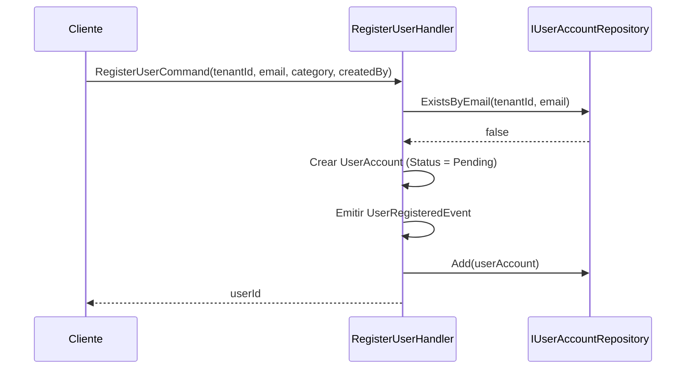
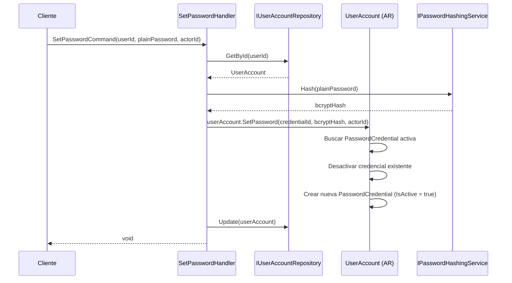
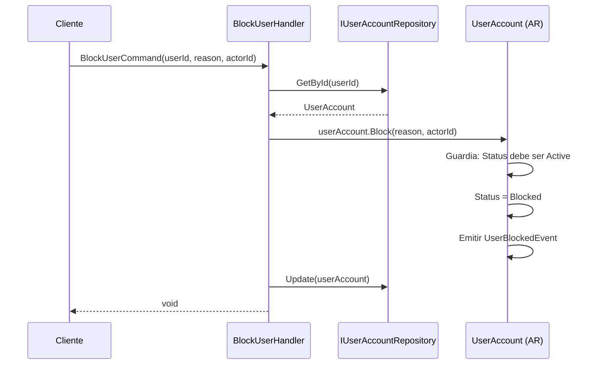
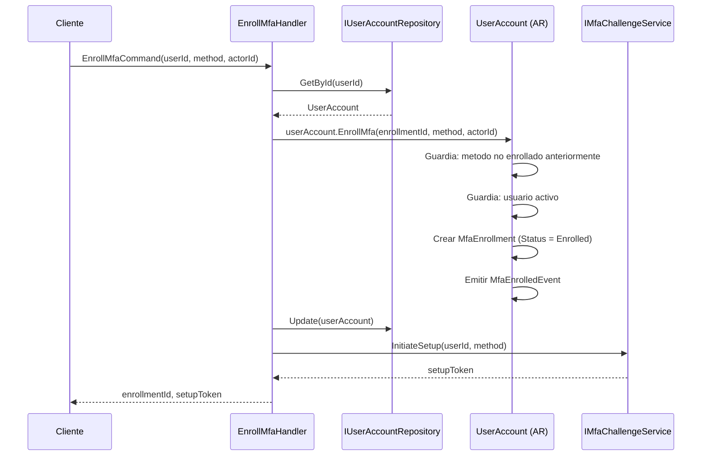
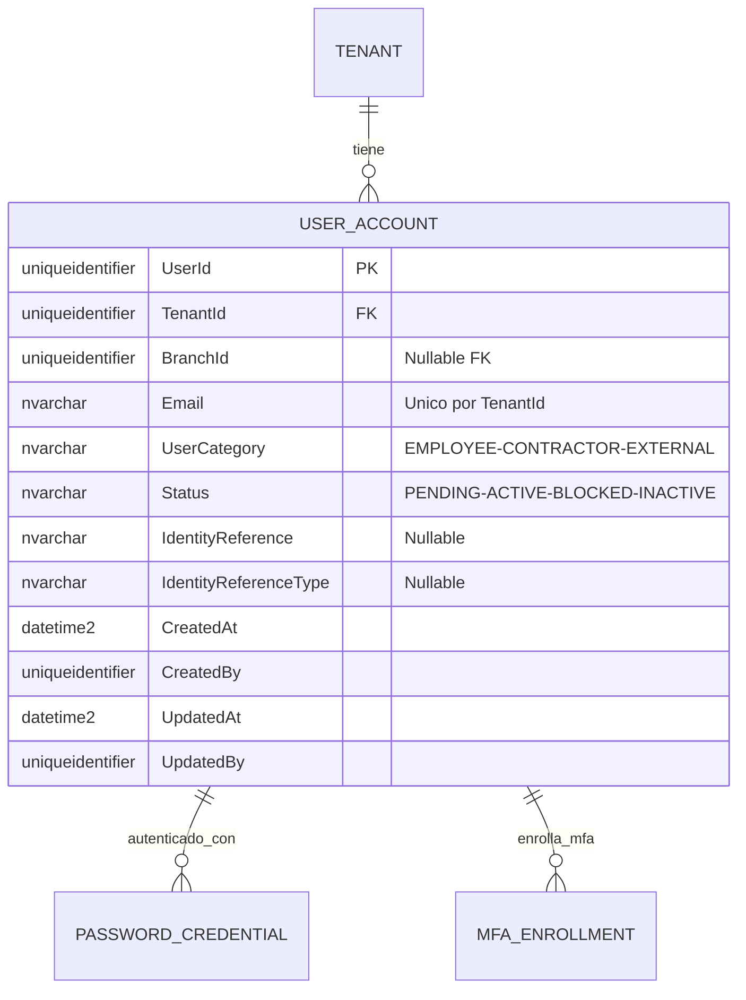
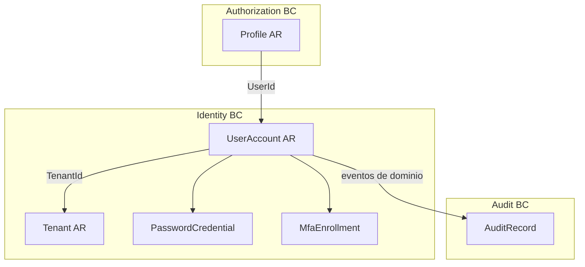

# UserAccount — Arquitectura del Agregado

> **Idioma:** [English](../../domain/identity/user-account.md) | [Español](./user-account.md)

**Bounded Context:** Identity  
**Aggregate Root:** `UserAccount`  
**Modulo:** `Ums.Domain.Identity.UserAccount`  
**Estado:** Produccion

---

## 1. Descripcion del Agregado

### Proposito
`UserAccount` representa la identidad digital de un usuario dentro de un Tenant. Es el punto central de autenticacion, gestion del ciclo de vida de credenciales y configuracion de MFA. Posee `PasswordCredential` y `MfaEnrollment` como entidades propias.

### Responsabilidad de Negocio
- Gestionar el ciclo de vida del usuario: registro, activacion, bloqueo y restauracion.
- Proveer la identidad central para autenticacion local y federada.
- Controlar credenciales de contrasena con historial de rotacion.
- Administrar metodos MFA enrollados por el usuario.

### Aggregate Root
`UserAccount` es su propio aggregate root. Todas las mutaciones de `PasswordCredential` y `MfaEnrollment` pasan por comandos de `UserAccount`.

### Invariantes y Reglas de Consistencia
1. `Email` debe ser unico dentro del mismo `TenantId`.
2. Un usuario `FEDERATED` (con `IdentityReference`) no debe tener `PasswordCredential` activa.
3. A lo sumo una `PasswordCredential` con `IsActive = true` por usuario.
4. Solo un `MfaEnrollment` por metodo por usuario.
5. `UserStatus` debe ser `Active` para enrolar un nuevo metodo MFA.

### Entidades Relacionadas / Value Objects
| Entidad / VO | Tipo | Notas |
|---|---|---|
| `TenantId` | Value Object | FK al Tenant propietario |
| `BranchId` | Value Object | FK opcional a Branch |
| `Email` | Value Object | Unico por TenantId |
| `UserCategory` | Enum | EMPLOYEE · CONTRACTOR · EXTERNAL |
| `UserStatus` | Enum | Pending · Active · Blocked · Inactive |
| `IdentityReference` | Value Object | Sub de IdP externo (nullable) |
| `IdentityReferenceType` | Enum | OIDC · SAML2 · WS_FED (nullable) |
| `AuditValueObject` | Value Object | CreatedAt/By, UpdatedAt/By |

### Eventos de Dominio
| Evento | Disparador |
|---|---|
| `UserRegisteredEvent` | Usuario registrado en el sistema |
| `UserActivatedEvent` | Usuario activado (Pending o Blocked -> Active) |
| `UserBlockedEvent` | Usuario bloqueado |
| `UserRestoredEvent` | Usuario restaurado desde bloqueado |
| `MfaEnrolledEvent` | Nuevo metodo MFA enrollado |
| `MfaVerifiedEvent` | Desafio MFA completado exitosamente |
| `AuthenticationAttemptedEvent` | Intento de autenticacion registrado |

### Comandos / Casos de Uso
| Comando | Descripcion |
|---|---|
| `RegisterUserCommand` | Registrar nuevo usuario |
| `ActivateUserCommand` | Activar usuario pendiente o bloqueado |
| `BlockUserCommand` | Bloquear usuario activo |
| `RestoreUserCommand` | Restaurar usuario bloqueado |
| `SetPasswordCommand` | Crear o rotar credencial de contrasena activa |
| `EnrollMfaCommand` | Enrolar nuevo metodo MFA |
| `VerifyMfaCommand` | Confirmar desafio MFA (Pending -> Enrolled) |
| `RevokeMfaEnrollmentCommand` | Revocar metodo MFA enrollado |
| `LinkExternalIdentityCommand` | Vincular identidad federada |

---

## 2. Modelo de Objetos

```
UserAccount (Aggregate Root)
├── Props: UserAccountProps
│   ├── Id: IdValueObject
│   ├── TenantId: TenantId
│   ├── BranchId?: BranchId
│   ├── Email: Email
│   ├── UserCategory: UserCategory
│   ├── Status: UserStatus
│   ├── IdentityReference?: IdentityReference
│   ├── IdentityReferenceType?: IdentityReferenceType
│   └── Audit: AuditValueObject
├── PasswordCredential (Entidad Propia, 0..N almacenadas, 0..1 activa)
└── MfaEnrollment (Entidad Propia, 0..N)
```

### Atributos Principales
| Atributo | Tipo | Notas |
|---|---|---|
| `Id` | `Guid` | PK |
| `TenantId` | `Guid` | FK al Tenant |
| `BranchId` | `Guid?` | FK opcional a Branch |
| `Email` | `string` | Unico por TenantId |
| `UserCategory` | `UserCategory` | EMPLOYEE / CONTRACTOR / EXTERNAL |
| `Status` | `UserStatus` | Pending / Active / Blocked / Inactive |
| `IdentityReference` | `string?` | Sub del IdP externo |
| `IdentityReferenceType` | `IdentityReferenceType?` | OIDC / SAML2 / WS_FED |

### Ciclo de Vida
```
Pending ──► Active ──► Blocked ──► Active
Active ──► Inactive (terminal)
```

---

## 3. Diagramas de Secuencia

### Flujo: Registrar Usuario


### Flujo: Establecer Contrasena


### Flujo: Bloquear Usuario


### Flujo: Enrolar MFA


---

## 4. Modelo Entidad-Relacion



---

## 5. Modelo de Bounded Context



---

## 6. Contrato de Capa de Aplicacion

### Comandos
| Comando | Entrada | Salida |
|---|---|---|
| `RegisterUserCommand` | `tenantId, email, category, createdBy` | `Guid userId` |
| `ActivateUserCommand` | `userId, actorId` | `void` |
| `BlockUserCommand` | `userId, reason, actorId` | `void` |
| `SetPasswordCommand` | `userId, plainPassword, actorId` | `void` |
| `EnrollMfaCommand` | `userId, method, actorId` | `Guid enrollmentId, setupToken` |
| `RevokeMfaEnrollmentCommand` | `userId, enrollmentId, actorId` | `void` |

### Casos de Error
| Codigo | Condicion |
|---|---|
| `USER_EMAIL_DUPLICATE` | Email ya existe en el tenant |
| `USER_NOT_FOUND` | userId desconocido |
| `USER_NOT_ACTIVE` | Operacion requiere usuario activo |
| `MFA_METHOD_ALREADY_ENROLLED` | Metodo MFA ya enrollado |

---

## 7. Notas de Persistencia

### Indices
| Indice | Columnas | Tipo |
|---|---|---|
| `IX_UserAccount_TenantId_Email` | `TenantId, Email` | Unico |
| `IX_UserAccount_TenantId` | `TenantId` | No unico |
| `IX_PasswordCredential_UserAccountId_IsActive` | `UserAccountId, IsActive` | No unico |
| `IX_MfaEnrollment_UserAccountId_Method` | `UserAccountId, Method` | Unico |

---

## 8. Seguridad y Auditoria

### Reglas de Autorizacion
| Operacion | Rol Requerido |
|---|---|
| Registrar Usuario | Tenant:Admin · Tenant:UserManager |
| Bloquear / Restaurar | Tenant:Admin |
| Establecer Contrasena | Usuario mismo o Tenant:Admin |
| Enrolar MFA | Usuario mismo |

### Datos Sensibles
- `PasswordHash` es de solo escritura — nunca retornado en consultas ni en registros de auditoria.
- `Email` es PII — enmascarado en logs.

### Eventos de Auditoria
- `USER_REGISTERED`, `USER_ACTIVATED`, `USER_BLOCKED`, `USER_RESTORED`
- `PASSWORD_SET`, `MFA_ENROLLED`, `MFA_VERIFIED`, `MFA_REVOKED`
