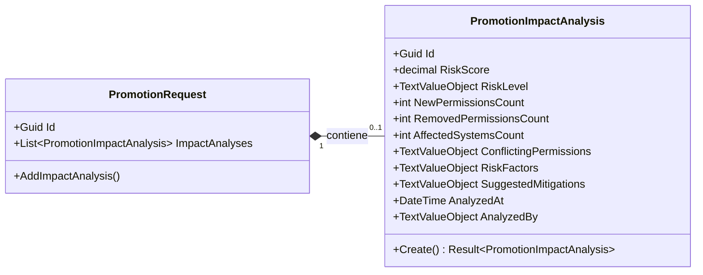
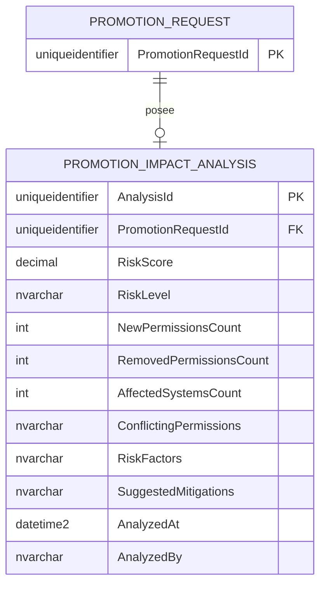

# PromotionImpactAnalysis — Arquitectura de la Entidad

**Contexto Acotado:** IGA  
**Raíz del Agregado:** `PromotionRequest`  
**Módulo:** `Ums.Domain.IGA.PromotionRequest.PromotionImpactAnalysis`  
**Estado:** Producción

---

## 1. Vista General de la Entidad

### Propósito
La entidad `PromotionImpactAnalysis` registra las evaluaciones de riesgo de seguridad generadas durante una solicitud de ascenso de rol. Realiza el seguimiento de indicadores de combinación tóxica, violaciones de segregación de funciones (SOD), estructuras de directorios afectadas y sugerencias de mitigación antes de que se autorice el acceso.

### Responsabilidad de Negocio
- Cuantificar los riesgos del ascenso de accesos en una puntuación unificada (0 a 100).
- Identificar conflictos de permisos y combinaciones tóxicas.
- Enumerar los sistemas de software y recursos afectados.
- Proporcionar a los auditores de seguridad directrices recomendadas de mitigación.

### Raíz del Agregado
Esta es una entidad de propiedad que pertenece al agregado `PromotionRequest`. Se crea y almacena exclusivamente a través de los métodos de la solicitud de ascenso raíz.

### Invariantes y Reglas de Consistencia
1. **INV-PIA1 (Límites de la Puntuación de Riesgo):** El valor de `RiskScore` debe ser un decimal estrictamente entre `0` y `100` inclusive (`DomainErrors.IGA.InvalidPerformanceScore`).
2. **INV-PIA2 (Inmutabilidad de los Análisis):** Una vez calculado y guardado, un análisis de impacto no puede ser editado. Si los alcances de acceso cambian, debe iniciarse un nuevo ciclo completo de ascenso.

### Entidades Relacionadas / Objetos de Valor
| Entidad / VO | Tipo | Propiedad |
|---|---|---|
| `PromotionImpactAnalysisId` | Objeto de Valor | Identificador único de la entidad |
| `PromotionRequestId` | Objeto de Valor | Referencia al identificador del agregado padre |
| `TextValueObject` | Objeto de Valor | Propiedades de texto generales (RiskLevel, Mitigations, ConflictingPermissions) |

---

## 2. Modelo de Dominio

### Clases / Entidades / Objetos de Valor
```
PromotionImpactAnalysis (Entity)
└── Props: PromotionImpactAnalysisProps
    ├── Id: IdValueObject
    ├── PromotionRequestId: PromotionRequestId
    ├── RiskScore: decimal
    ├── RiskLevel: TextValueObject
    ├── NewPermissionsCount: int
    ├── RemovedPermissionsCount: int
    ├── AffectedSystemsCount: int
    ├── ConflictingPermissions: TextValueObject?
    ├── RiskFactors: TextValueObject?
    ├── SuggestedMitigations: TextValueObject?
    ├── AnalyzedAt: DateTime
    └── AnalyzedBy: TextValueObject?
```

---

## 3. Diagramas del Modelo de Objetos



---

## 4. Diagramas de Secuencia
- Las secuencias de creación y validación se coordinan exclusivamente a través del agregado raíz [PromotionRequest](./promotion-request.md#4-sequence-diagrams).

---

## 5. Modelo ER



### Reglas de Aislamiento de Inquilinos (Tenancy)
- Hereda las reglas de delimitación de su agregado raíz padre `PromotionRequest`. El acceso entre inquilinos está implícitamente bloqueado.

---

## 6. Integración del Contexto Acotado
- Mapeado internamente dentro del contexto de `IGA`. Los motores de seguridad leen estos hallazgos para decidir si bloquear acciones o requerir flujos de aprobación de alto riesgo.

---

## 7. Capa de Aplicación
- Gestionado a través del comando `AddImpactAnalysis` coordinado por los manejadores de aplicación de `PromotionRequest`.

---

## 8. Infraestructura/Persistencia
- Mapea las propiedades del esquema dependiente dentro de la tabla o mapeo de la entidad hija. La eliminación en cascada en las llaves foráneas garantiza la consistencia de la base de datos.

---

## 9. Seguridad y Cumplimiento
- Los datos son estrictamente de solo lectura una vez que se han guardado. Esto evita que los actores minimicen las combinaciones tóxicas para eludir la revisión de los auditores.

---

## 10. Decisiones Técnicas
- Desacoplar las tareas de cálculo de permisos de las rutas de procesamiento de comandos a través de colas de ejecución en segundo plano evita bloquear los flujos de ejecución del usuario mientras se ejecutan análisis pesados sobre gráficos de permisos.

---

**[Volver al Índice de IGA](./index.md)**
