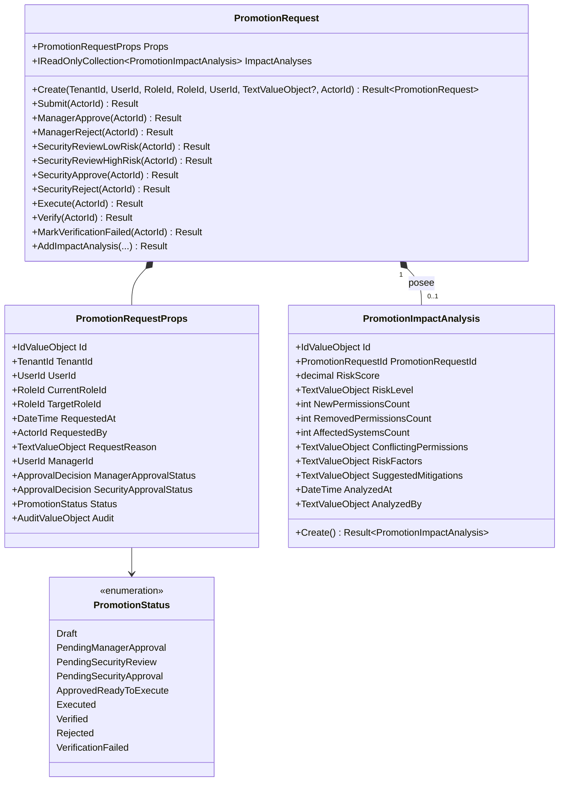
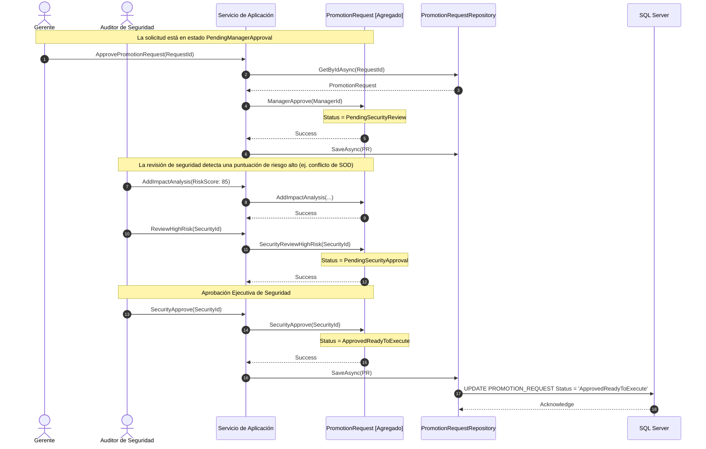
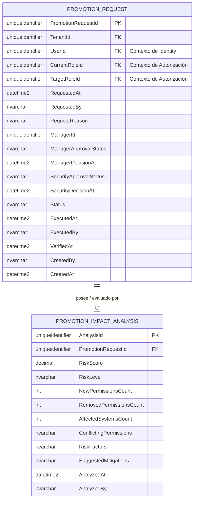

# PromotionRequest — Arquitectura del Agregado

**Contexto Acotado:** IGA  
**Raíz del Agregado:** Sí  
**Módulo:** `Ums.Domain.IGA.PromotionRequest`  
**Estado:** Producción

---

## 1. Vista General del Agregado

### Propósito
El agregado `PromotionRequest` coordina los ascensos de acceso, lo que permite a los usuarios solicitar de manera segura transiciones desde su rol actual hacia un rol de destino más privilegiado. Impone una ruta estricta y auditada de verificación que incluye puntajes de riesgo automáticos, aprobación de gerentes, evaluaciones de seguridad, ejecución de roles y verificación posterior a la ejecución.

### Responsabilidad de Negocio
- Registrar la intención de un usuario de adquirir un rol de destino más senior o privilegiado.
- Controlar el flujo de trabajo de aprobación de múltiples pasos.
- Incrustar los resultados del análisis de impacto de permisos tóxicos (`PromotionImpactAnalysis`).
- Cuantificar los riesgos del ascenso de accesos en una puntuación unificada (0 a 100), identificando conflictos de permisos, combinaciones tóxicas y sistemas afectados.
- Coordinar los estados de ejecución y confirmación posterior al cambio de rol.
- Proporcionar a los auditores de seguridad directrices recomendadas de mitigación.

### Raíz del Agregado
`PromotionRequest` sirve como la raíz del agregado, gestionando el ciclo de vida del proceso de ascenso y albergando a `PromotionImpactAnalysis` como una entidad de propiedad exclusiva.

### Invariantes y Reglas de Consistencia
1. **INV-PR1 (Transiciones de Estado del Flujo de Trabajo):** Las transiciones de estado están estrictamente gobernadas por las siguientes reglas de FSM:
   - La creación coloca la solicitud en `Draft`.
   - `Draft` $\rightarrow$ `PendingManagerApproval` (a través de `Submit`).
   - `PendingManagerApproval` $\rightarrow$ `PendingSecurityReview` (a través de `ManagerApprove`) O `Rejected` (a través de `ManagerReject`).
   - `PendingSecurityReview` $\rightarrow$ `ApprovedReadyToExecute` (a través de `SecurityReviewLowRisk` si la puntuación de riesgo analizada es baja) O `PendingSecurityApproval` (a través de `SecurityReviewHighRisk` si la puntuación de riesgo es alta) O `Rejected` (a través de `SecurityReject`).
   - `PendingSecurityApproval` $\rightarrow$ `ApprovedReadyToExecute` (a través de `SecurityApprove`) O `Rejected` (a través de `SecurityReject`).
   - `ApprovedReadyToExecute` $\rightarrow$ `Executed` (a través de `Execute`).
   - `Executed` $\rightarrow$ `Verified` (a través de `Verify`) O `VerificationFailed` (a través de `MarkVerificationFailed`).
2. **INV-PR2 (Unicidad del Análisis de Impacto):** Solo se puede registrar un análisis de impacto por cada solicitud de ascenso para evitar la reescritura de historiales (`DomainErrors.IGA.ImpactAnalysisAlreadyExists`).
3. **INV-PIA1 (Límites de la Puntuación de Riesgo):** El valor de `RiskScore` en el análisis de impacto debe ser un decimal estrictamente entre `0` y `100` inclusive (`DomainErrors.IGA.InvalidPerformanceScore`).
4. **INV-PIA2 (Inmutabilidad de los Análisis):** Una vez calculado y guardado, un análisis de impacto no puede ser editado. Si los alcances de acceso cambian, debe iniciarse un nuevo ciclo completo de ascenso.

### Entidades Relacionadas / Objetos de Valor
| Entidad / VO | Tipo | Descripción |
|---|---|---|
| `PromotionRequestId` | Objeto de Valor | Identificador único del agregado |
| `TenantId` | Objeto de Valor | Identificador de partición asignado al contexto del inquilino |
| `UserId` | Objeto de Valor | Referencia al usuario objetivo (Contexto de Identity) |
| `RoleId` | Objeto de Valor | Referencia a los roles actual y objetivo (Contexto de Autorización) |
| `PromotionStatus` | Enumerado | Enumerado del estado de la FSM (`Draft`, `PendingManagerApproval`, etc.) |
| `ApprovalDecision` | Enumerado | `None` · `Approved` · `Rejected` |
| `PromotionImpactAnalysis` | Entidad | Entidad hija de propiedad exclusiva que contiene métricas de riesgo |
| `PromotionImpactAnalysisId` | Objeto de Valor | Identificador único de la entidad hija de análisis de impacto |
| `TextValueObject` | Objeto de Valor | Propiedades de texto generales para niveles de riesgo, mitigaciones, conflictos, etc. |

---

## 2. Modelo de Dominio

### Clases / Entidades / Objetos de Valor
```text
PromotionRequest (Aggregate Root)
├── Props: PromotionRequestProps
│   ├── Id: PromotionRequestId
│   ├── TenantId: TenantId
│   ├── UserId: UserId (Ref Externa)
│   ├── CurrentRoleId: RoleId (Ref Externa)
│   ├── TargetRoleId: RoleId (Ref Externa)
│   ├── RequestedAt: DateTime
│   ├── RequestedBy: ActorId
│   ├── RequestReason: TextValueObject?
│   ├── ManagerId: UserId
│   ├── ManagerApprovalStatus: ApprovalDecision
│   ├── ManagerDecisionAt: DateTime?
│   ├── SecurityApprovalStatus: ApprovalDecision
│   ├── SecurityDecisionAt: DateTime?
│   ├── Status: PromotionStatus
│   ├── ExecutedAt: DateTime?
│   ├── ExecutedBy: ActorId?
│   ├── VerifiedAt: DateTime?
│   └── Audit: AuditValueObject
└── ImpactAnalyses: PromotionImpactAnalysis[] (Colección Hija)
    └── Props: PromotionImpactAnalysisProps
        ├── Id: IdValueObject
        ├── PromotionRequestId: PromotionRequestId
        ├── RiskScore: decimal
        ├── RiskLevel: TextValueObject
        ├── NewPermissionsCount: int
        ├── RemovedPermissionsCount: int
        ├── AffectedSystemsCount: int
        ├── ConflictingPermissions: TextValueObject?
        ├── RiskFactors: TextValueObject?
        ├── SuggestedMitigations: TextValueObject?
        ├── AnalyzedAt: DateTime
        └── AnalyzedBy: TextValueObject?
```

---

## 3. Diagramas del Modelo de Objetos



---

## 4. Diagramas de Secuencia

### Proceso de Ascenso de Alto Riesgo

*Nota: Las secuencias de creación y validación para el análisis de impacto se coordinan exclusivamente a través del agregado raíz.*



---

## 5. Modelo ER



### Reglas de Aislamiento de Inquilinos (Tenancy)
- Particionado por `TenantId`. Los envíos se verifican contra las propiedades de configuración del inquilino para evitar la falsificación de solicitudes entre inquilinos.
- La entidad `PromotionImpactAnalysis` hereda las reglas de delimitación de su agregado raíz padre `PromotionRequest`. El acceso entre inquilinos está implícitamente bloqueado.

---

## 6. Integración del Contexto Acotado

Los motores de seguridad leen los hallazgos de `PromotionImpactAnalysis` para decidir si bloquear acciones o requerir flujos de aprobación de alto riesgo.

```mermaid
flowchart TD
    subgraph IdentityContext [Contexto de Identity]
        U[UserAccount]
    end

    subgraph AuthContext [Contexto de Autorización]
        R1[Rol Actual]
        R2[Rol Objetivo]
    end

    subgraph IgaContext [Contexto IGA]
        PR[PromotionRequest]
        PIA[PromotionImpactAnalysis]
    end

    PR -.->|hace referencia a UserId| U
    PR -.->|hace referencia a| R1
    PR -.->|hace referencia a| R2
    PR *--|posee| PIA
```

---

## 7. Capa de Aplicación

### Comandos y Consultas
- **CreatePromotionRequestCommand:** Crea una solicitud en estado `Draft`.
- **SubmitPromotionRequestCommand:** Envía una solicitud a la revisión de la gerencia.
- **ManagerApprovePromotionRequestCommand:** Registra la verificación de un gerente.
- **SecurityReviewPromotionRequestCommand:** Registra el análisis de rendimiento dinámico y activa el ramificado de riesgo.
- **AddImpactAnalysisCommand:** Coordinado por los manejadores de aplicación de `PromotionRequest` para adjuntar los datos del análisis de impacto.
- **ExecutePromotionRequestCommand:** Ejecuta el cambio de rol en los sistemas de destino.
- **VerifyPromotionRequestCommand:** Firma de cumplimiento final que valida la propagación exitosa del ascenso.

---

## 8. Infraestructura/Persistencia

### Configuración del Mapeo de EF Core
```csharp
public class PromotionRequestConfiguration : IEntityTypeConfiguration<PromotionRequest>
{
    public void Configure(EntityTypeBuilder<PromotionRequest> builder)
    {
        builder.ToTable("PROMOTION_REQUEST");
        builder.HasKey(e => e.Id);
        
        builder.OwnsOne(e => e.Props, props =>
        {
            props.Property(p => p.Id).HasColumnName("PromotionRequestId");
            props.Property(p => p.TenantId).HasColumnName("TenantId");
            props.Property(p => p.UserId).HasColumnName("UserId");
            props.Property(p => p.CurrentRoleId).HasColumnName("CurrentRoleId");
            props.Property(p => p.TargetRoleId).HasColumnName("TargetRoleId");
            props.Property(p => p.RequestedAt).HasColumnName("RequestedAt");
            props.Property(p => p.RequestedBy).HasConversion(a => a.GetValue(), s => ActorId.Load(s)).HasColumnName("RequestedBy");
            props.Property(p => p.RequestReason).HasConversion(p => p.GetValue(), s => TextValueObject.Create(s).Value).HasColumnName("RequestReason");
            props.Property(p => p.ManagerId).HasColumnName("ManagerId");
            props.Property(p => p.ManagerApprovalStatus).HasConversion<string>().HasColumnName("ManagerApprovalStatus");
            props.Property(p => p.ManagerDecisionAt).HasColumnName("ManagerDecisionAt");
            props.Property(p => p.SecurityApprovalStatus).HasConversion<string>().HasColumnName("SecurityApprovalStatus");
            props.Property(p => p.SecurityDecisionAt).HasColumnName("SecurityDecisionAt");
            props.Property(p => p.Status).HasConversion<string>().HasColumnName("Status");
            props.Property(p => p.ExecutedAt).HasColumnName("ExecutedAt");
            props.Property(p => p.ExecutedBy).HasConversion(a => a == null ? (Guid?)null : a.GetValue(), s => s == null ? null : ActorId.Load(s.Value)).HasColumnName("ExecutedBy");
            props.Property(p => p.VerifiedAt).HasColumnName("VerifiedAt");
            props.OwnsOne(p => p.Audit);
        });

        // Mapea las propiedades del esquema dependiente. La eliminación en cascada garantiza la consistencia.
        builder.HasMany(e => e.ImpactAnalyses)
               .WithOne()
               .HasForeignKey("PromotionRequestId")
               .OnDelete(DeleteBehavior.Cascade);
    }
}
```

---

## 9. Seguridad y Cumplimiento

- **Segregación de Funciones (SOD - Segregation of Duties):** El gerente (`ManagerId`) autorizado para aprobar una solicitud de ascenso no puede ser el usuario objetivo (`UserId`) ni el auditor de seguridad que realiza la evaluación de seguridad.
- **Ramificación por Riesgo:** Las solicitudes con análisis de impacto de alto riesgo se enrutan a un paso adicional (`PendingSecurityApproval`), evitando adiciones de roles automáticas sin un visto bueno especializado.
- **Inmutabilidad de los Datos de Auditoría:** Los datos del análisis de impacto son estrictamente de solo lectura una vez que se han guardado. Esto evita que los actores minimicen las combinaciones tóxicas para eludir la revisión de los auditores.

---

## 10. Decisiones Técnicas

- **Cálculo de Riesgo Asíncrono:** Generar análisis de permisos tóxicos requiere análisis de grafos complejos. Por lo tanto, se desacopla en una tarea analítica en segundo plano que retorna una entidad `PromotionImpactAnalysis`, en lugar de bloquear síncronamente los flujos de escritura de la capa de aplicación o flujos de ejecución del usuario mientras se ejecutan análisis pesados sobre gráficos de permisos.

---

**[Volver al Índice de IGA](./index.md)**
