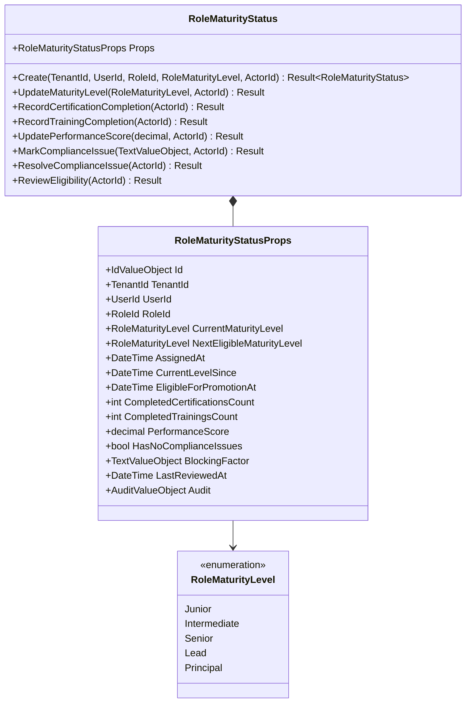
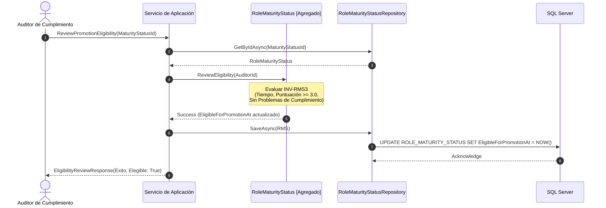
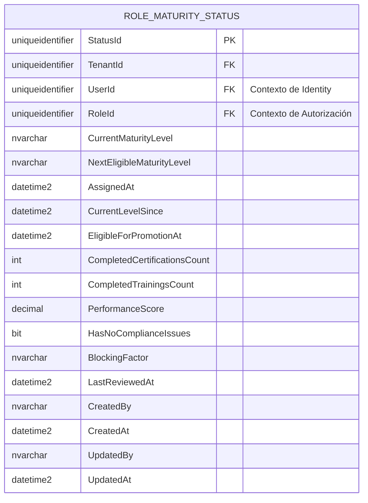
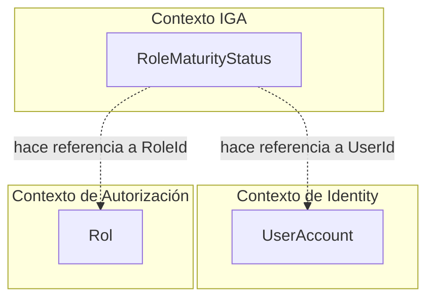

# RoleMaturityStatus — Arquitectura del Agregado

**Contexto Acotado:** IGA  
**Raíz del Agregado:** Sí  
**Módulo:** `Ums.Domain.IGA.RoleMaturityStatus`  
**Estado:** Producción

---

## 1. Vista General del Agregado

### Propósito
El agregado raíz `RoleMaturityStatus` rastrea y evalúa el nivel de madurez operativa de un usuario dentro de un rol de seguridad asignado. Gobierna la elegibilidad para ascensos corporativos coordinando la finalización de certificaciones, el seguimiento de capacitaciones, las evaluaciones de desempeño y los controles activos de cumplimiento de seguridad.

### Responsabilidad de Negocio
- Registrar el nivel de madurez actual y el siguiente objetivo del usuario (por ejemplo, Junior $\rightarrow$ Principal).
- Rastrear indicadores de habilitación profesional (capacitaciones y certificaciones completadas).
- Evaluar las reglas de elegibilidad según el tiempo en el nivel, las puntuaciones de desempeño y los bloqueos de cumplimiento.
- Proporcionar bloqueos automáticos que impidan a los usuarios con problemas de cumplimiento activos solicitar ascensos de acceso.

### Raíz del Agregado
`RoleMaturityStatus` es una raíz de agregado soberana que orquesta las métricas de cumplimiento y realiza el seguimiento de la elegibilidad de los usuarios.

### Invariantes y Reglas de Consistencia
1. **INV-RMS1 (Límites de la Puntuación de Rendimiento):** La puntuación de rendimiento debe ser un valor decimal estrictamente entre `0` y `5` inclusive (`DomainErrors.IGA.InvalidPerformanceScore`).
2. **INV-RMS2 (Conflicto de Transición de Madurez):** Una actualización de nivel de madurez debe apuntar a un nivel diferente al nivel actual (`DomainErrors.IGA.MaturityLevelUnchanged`).
3. **INV-RMS3 (Estándares de Elegibilidad):** Para ser elegible para un ascenso de madurez de rol, el usuario debe cumplir con:
   - Cero problemas de cumplimiento activos (`HasNoComplianceIssues == true`).
   - Una puntuación mínima de rendimiento de `3.0`.
   - La duración mínima requerida desde que ingresó al nivel actual:
     - **Junior $\rightarrow$ Intermediate:** 6 meses.
     - **Intermediate $\rightarrow$ Senior:** 12 meses.
     - **Senior $\rightarrow$ Lead:** 18 meses.
     - **Lead $\rightarrow$ Principal:** 24 meses.
     - **Principal:** No elegible para ascensos adicionales.

### Entidades Relacionadas / Objetos de Valor
| Entidad / VO | Tipo | Descripción |
|---|---|---|
| `RoleMaturityStatusId` | Objeto de Valor | Identificador único del agregado |
| `TenantId` | Objeto de Valor | Asignación del contexto de inquilino propietario |
| `UserId` | Objeto de Valor | Cuenta de usuario propietaria (Contexto de Identity) |
| `RoleId` | Objeto de Valor | Rol de seguridad objetivo (Contexto de Autorización) |
| `RoleMaturityLevel` | Enumerado | `Junior` · `Intermediate` · `Senior` · `Lead` · `Principal` |
| `AuditValueObject` | Objeto de Valor | Metadatos de seguimiento de auditoría del sistema |

---

## 2. Modelo de Dominio

### Clases / Entidades / Objetos de Valor
```
RoleMaturityStatus (Aggregate Root)
└── Props: RoleMaturityStatusProps
    ├── Id: RoleMaturityStatusId
    ├── TenantId: TenantId
    ├── UserId: UserId (Ref Externa)
    ├── RoleId: RoleId (Ref Externa)
    ├── CurrentMaturityLevel: RoleMaturityLevel
    ├── NextEligibleMaturityLevel: RoleMaturityLevel?
    ├── AssignedAt: DateTime
    ├── CurrentLevelSince: DateTime
    ├── EligibleForPromotionAt: DateTime?
    ├── CompletedCertificationsCount: int
    ├── CompletedTrainingsCount: int
    ├── PerformanceScore: decimal
    ├── HasNoComplianceIssues: bool
    ├── BlockingFactor: TextValueObject?
    ├── LastReviewedAt: DateTime?
    └── Audit: AuditValueObject
```

---

## 3. Diagramas del Modelo de Objetos



---

## 4. Diagramas de Secuencia

### Evaluación de Elegibilidad e Inicio de Ascenso



---

## 5. Modelo ER



### Reglas de Aislamiento de Inquilinos (Tenancy)
- Delimitado estrictamente por `TenantId`. Los mecanismos de seguridad multi-inquilino particionan las trayectorias corporativas de evaluación de rendimiento para evitar fugas entre organizaciones.

---

## 6. Integración del Contexto Acotado



---

## 7. Capa de Aplicación

### Comandos y Consultas
- **CreateRoleMaturityStatusCommand:** Registra una nueva asignación de rol de usuario con marcadores de madurez.
- **UpdateRoleMaturityLevelCommand:** Eleva el nivel del rol después de una verificación exitosa de ascenso.
- **UpdatePerformanceScoreCommand:** Registra las revisiones periódicas de evaluación de rendimiento.
- **MarkComplianceIssueCommand:** Bloquea las capacidades de ascenso debido a violaciones de cumplimiento.
- **ResolveComplianceIssueCommand:** Desbloquea la elegibilidad de ascenso.
- **ReviewEligibilityCommand:** Ejecuta las aserciones de reglas estándar para activar los temporizadores de ascenso.

---

## 8. Infraestructura/Persistencia

### Configuración del Mapeo de EF Core
```csharp
public class RoleMaturityStatusConfiguration : IEntityTypeConfiguration<RoleMaturityStatus>
{
    public void Configure(EntityTypeBuilder<RoleMaturityStatus> builder)
    {
        builder.ToTable("ROLE_MATURITY_STATUS");
        builder.HasKey(e => e.Id);
        
        builder.OwnsOne(e => e.Props, props =>
        {
            props.Property(p => p.Id).HasColumnName("StatusId");
            props.Property(p => p.TenantId).HasColumnName("TenantId");
            props.Property(p => p.UserId).HasColumnName("UserId");
            props.Property(p => p.RoleId).HasColumnName("RoleId");
            props.Property(p => p.CurrentMaturityLevel).HasConversion<string>().HasColumnName("CurrentMaturityLevel");
            props.Property(p => p.NextEligibleMaturityLevel).HasConversion(l => l == null ? null : l.ToString(), s => string.IsNullOrEmpty(s) ? null : Enum.Parse<RoleMaturityLevel>(s)).HasColumnName("NextEligibleMaturityLevel");
            props.Property(p => p.AssignedAt).HasColumnName("AssignedAt");
            props.Property(p => p.CurrentLevelSince).HasColumnName("CurrentLevelSince");
            props.Property(p => p.EligibleForPromotionAt).HasColumnName("EligibleForPromotionAt");
            props.Property(p => p.CompletedCertificationsCount).HasColumnName("CompletedCertificationsCount");
            props.Property(p => p.CompletedTrainingsCount).HasColumnName("CompletedTrainingsCount");
            props.Property(p => p.PerformanceScore).HasColumnName("PerformanceScore");
            props.Property(p => p.HasNoComplianceIssues).HasColumnName("HasNoComplianceIssues");
            props.Property(p => p.BlockingFactor).HasConversion(b => b == null ? null : b.GetValue(), s => string.IsNullOrEmpty(s) ? null : TextValueObject.Create(s).Value).HasColumnName("BlockingFactor");
            props.Property(p => p.LastReviewedAt).HasColumnName("LastReviewedAt");
            props.OwnsOne(p => p.Audit);
        });
    }
}
```

---

## 9. Seguridad y Cumplimiento

- **Trazas de Auditoría:** Todos los ajustes de madurez, incrementos de capacitación y bloqueos de cumplimiento actualizan el objeto de valor de auditoría interno `AuditValueObject` para garantizar la responsabilidad.
- **Bloqueos Fuertes de Elegibilidad:** Las reglas de dominio imponen la prevención en tiempo de compilación de los ascensos de acceso para cuentas que posean bloqueos de cumplimiento no resueltos (`HasNoComplianceIssues == false`).

---

## 10. Decisiones Técnicas

- **Progresión de Niveles Determinista:** Los niveles de transición se calculan automáticamente utilizando una máquina de estados determinista dentro del dominio, evitando posibles errores de entrada de los administradores durante los cambios de estado.

---

**[Volver al Índice de IGA](./index.md)**
