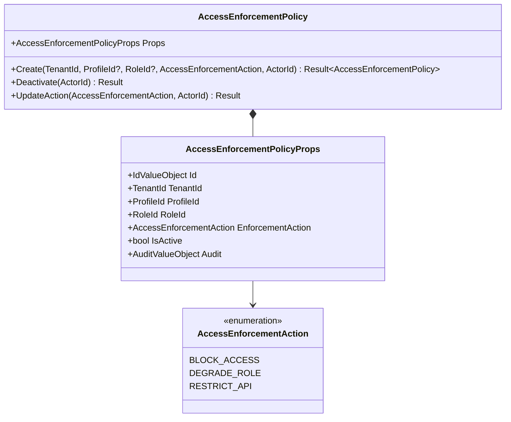
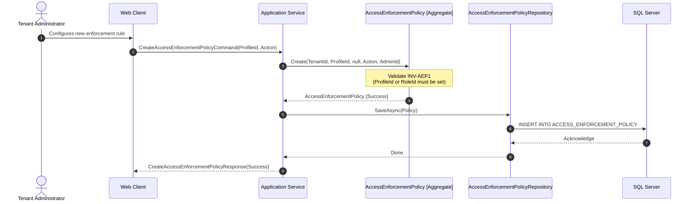
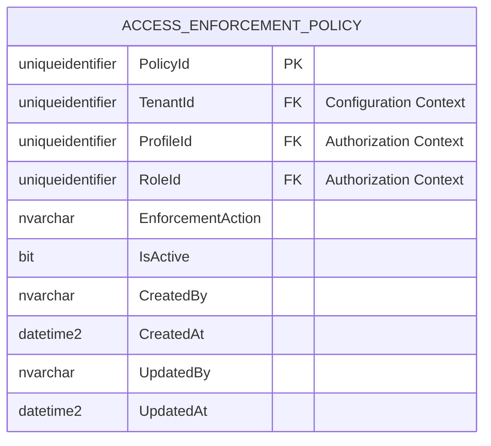
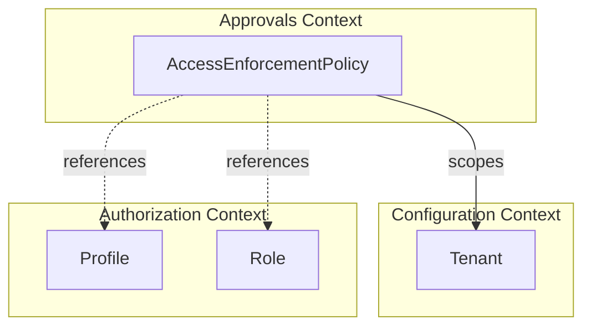

# AccessEnforcementPolicy — Aggregate Architecture

**Bounded Context:** Approvals  
**Aggregate Root:** Yes  
**Module:** `Ums.Domain.Approvals.AccessEnforcementPolicy`  
**Status:** Production

---

## 1. Aggregate Overview

### Purpose
The `AccessEnforcementPolicy` aggregate root establishes broad access restriction rules at the tenant level. It determines which access privileges (such as a profile or role mapping) are blocked, degraded, or restricted when a user falls out of compliance (e.g. missing required valid credentials or expired critical documents).

### Business Responsibility
- Define targeted access blocks mapped to authorization components (Profiles or Roles).
- Handle tenant-specific multi-tenant segregation of policy rules.
- Maintain lifecycle control (Active vs Inactive) over policy executions.
- Enforce strict validation when changing enforcement behaviors.

### Aggregate Root
`AccessEnforcementPolicy` acts as a separate aggregate root from `DocumentType` to separate credential definitions from security reaction rules.

### Invariants and Consistency Rules
1. **INV-AEP1 (Policy Scope Constraint):** A policy must target either a `ProfileId` or a `RoleId` (or both). Creating a policy without specifying either target is prohibited (`DomainErrors.Approvals.PolicyRequiresProfileOrRole`).
2. **INV-AEP2 (Lifecycle Deactivation):** A policy cannot be deactivated if it is already inactive (`DomainErrors.Approvals.PolicyAlreadyInactive`).
3. **INV-AEP3 (Tenant Integrity):** Policies must explicitly map to a `TenantId` to guarantee tenant partition safety.

### Related Entities / Value Objects
| Entity / VO | Type | Description |
|---|---|---|
| `AccessEnforcementPolicyId` | Value Object | Unique aggregate identifier |
| `TenantId` | Value Object | Owner tenant scope identifier |
| `ProfileId` | Value Object | Target Authorization Profile (Optional) |
| `RoleId` | Value Object | Target Authorization Role (Optional) |
| `AccessEnforcementAction` | Enum/VO | `BLOCK_ACCESS` · `DEGRADE_ROLE` · `RESTRICT_API` |
| `AuditValueObject` | Value Object | Multi-user audit history trail |

---

## 2. Domain Model

### Classes / Entities / Value Objects
```
AccessEnforcementPolicy (Aggregate Root)
└── Props: AccessEnforcementPolicyProps
    ├── Id: AccessEnforcementPolicyId
    ├── TenantId: TenantId
    ├── ProfileId: ProfileId?
    ├── RoleId: RoleId?
    ├── EnforcementAction: AccessEnforcementAction
    ├── IsActive: bool
    └── Audit: AuditValueObject
```

---

## 3. Object Model Diagrams



---

## 4. Sequence Diagrams

### Create Access Enforcement Policy



---

## 5. ER Model



### Tenant Isolation Rules
- Policies are partitioned strictly by `TenantId`. Tenancy filters must be applied to all reads and writes to enforce operational borders.

---

## 6. Bounded Context Integration



---

## 7. Application Layer

### Commands & Queries
- **CreateAccessEnforcementPolicyCommand:** Configures a new enforcement policy under the active tenant context.
- **DeactivateAccessEnforcementPolicyCommand:** Disables an active policy, resolving access blocks for target actors.
- **GetAccessEnforcementPolicyByIdQuery:** Retrieves policy details.
- **GetAllAccessEnforcementPoliciesQuery:** Lists policies active under the administrator's tenant.

---

## 8. Infrastructure/Persistence

### EF Core Mapping Configuration
```csharp
public class AccessEnforcementPolicyConfiguration : IEntityTypeConfiguration<AccessEnforcementPolicy>
{
    public void Configure(EntityTypeBuilder<AccessEnforcementPolicy> builder)
    {
        builder.ToTable("ACCESS_ENFORCEMENT_POLICY");
        builder.HasKey(e => e.Id);
        
        builder.OwnsOne(e => e.Props, props =>
        {
            props.Property(p => p.Id).HasColumnName("PolicyId");
            props.Property(p => p.TenantId).HasColumnName("TenantId");
            props.Property(p => p.ProfileId).HasColumnName("ProfileId");
            props.Property(p => p.RoleId).HasColumnName("RoleId");
            props.Property(p => p.EnforcementAction).HasConversion<string>().HasColumnName("EnforcementAction");
            props.Property(p => p.IsActive).HasColumnName("IsActive");
            props.OwnsOne(p => p.Audit);
        });
    }
}
```

---

## 9. Security & Compliance

- **Tenant Isolation:** Tenancy enforcement operates as the primary safeguard; SQL Server RLS acts as a secondary failsafe.
- **Privilege Separation:** Modifying access policies is strictly restricted to platform or tenant security administrators.

---

## 10. Technical Decisions

- **Decoupled Architecture:** Isolating access enforcement policies from user document metadata allows security administrators to easily configure global or role-wide compliance penalties without rewriting individual document templates.

---

**[Back to Approvals Index](./index.md)**
