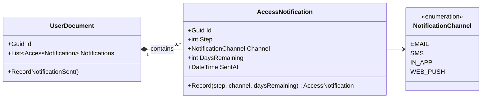
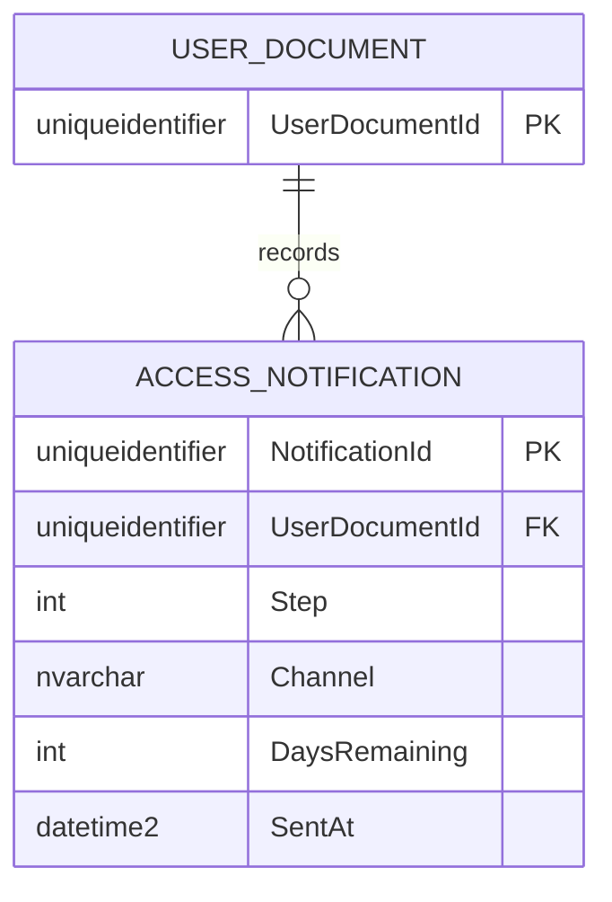

# AccessNotification — Entity Architecture

**Bounded Context:** Approvals  
**Aggregate Root:** `UserDocument`  
**Module:** `Ums.Domain.Approvals.UserDocument.AccessNotification`  
**Status:** Production

---

## 1. Entity Overview

### Purpose
The `AccessNotification` entity records an individual notification transmission sent to a user regarding an upcoming document expiration or a compliance requirement. It serves as an immutable chronological log of system-generated alerts.

### Business Responsibility
- Record the exact point in time when an alert was sent to the user.
- Capture the communication channel utilized (e.g. Email, SMS, Push notification).
- Log the chronological step index and remaining validity window (days remaining) at the time of transmission.

### Aggregate Root
This is an owned entity belonging to the `UserDocument` aggregate root. It is created, updated, and stored strictly under the lifecycle coordination of its parent `UserDocument`.

### Invariants and Consistency Rules
1. **INV-AN1 (Immutable History):** Once an `AccessNotification` is recorded, its properties cannot be modified.
2. **INV-AN2 (Positive Days Remaining):** `DaysRemaining` must be a positive integer or zero, representing the remaining validity span.
3. **INV-AN3 (Step Sequence Coordination):** The `Step` index must correspond to an active warning phase configured in the document type rules.

### Related Entities / Value Objects
| Entity / VO | Type | Ownership |
|---|---|---|
| `AccessNotificationId` | Value Object | Unique entity identifier |
| `NotificationChannel` | Enum |EMAIL · SMS · IN_APP · WEB_PUSH |
| `Step` | Primitive | Step index counter |

---

## 2. Domain Model

### Classes / Entities / Value Objects
```
AccessNotification (Entity)
└── Props: AccessNotificationProps
    ├── Id: IdValueObject
    ├── Step: int
    ├── Channel: NotificationChannel
    ├── DaysRemaining: int
    └── SentAt: DateTime
```

---

## 3. Object Model Diagrams



---

## 4. Sequence Diagrams
- State modifications and entry sequences are coordinated exclusively through the aggregate root [UserDocument](./user-document.md#4-sequence-diagrams).

---

## 5. ER Model



### Tenant Isolation Rules
- Scoped via its parent aggregate `UserDocument`. Multi-tenant safety is guaranteed implicitly.

---

## 6. Bounded Context Integration
- Mapped internally within the `Approvals` context. These historical logs are read by the security compliance engine to verify whether correct notice protocols were fulfilled before invoking access blocks.

---

## 7. Application Layer
- Managed via the parent command `RecordNotificationSent` on `UserDocument`.

---

## 8. Infrastructure/Persistence
- Persisted as a dependent table mapped by EF Core with a cascade delete rule referencing its parent `UserDocument`.

---

## 9. Security & Compliance
- Logs are strictly read-only after creation to prevent tampering with security audit paths.

---

## 10. Technical Decisions
- Persisting notification logs as owned entities rather than dispatching them to an external audit engine ensures aggregate self-sufficiency and high performance during compliance checks.

---

**[Back to Approvals Index](./index.md)**
