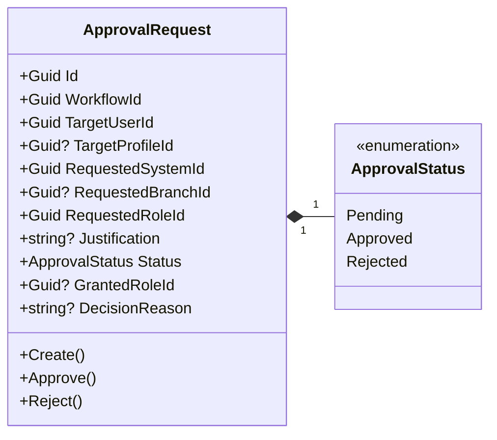
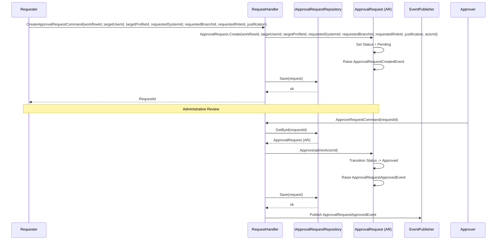
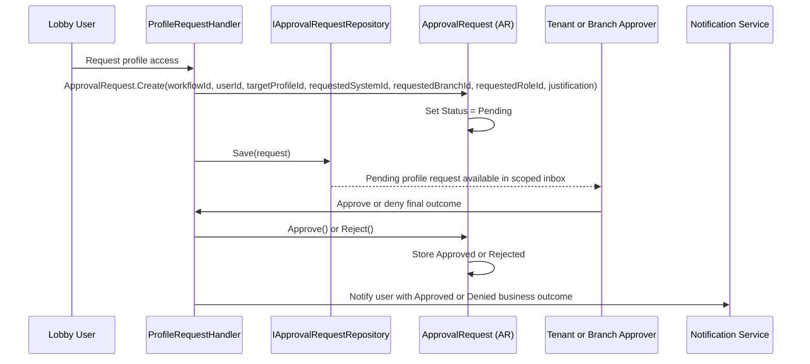
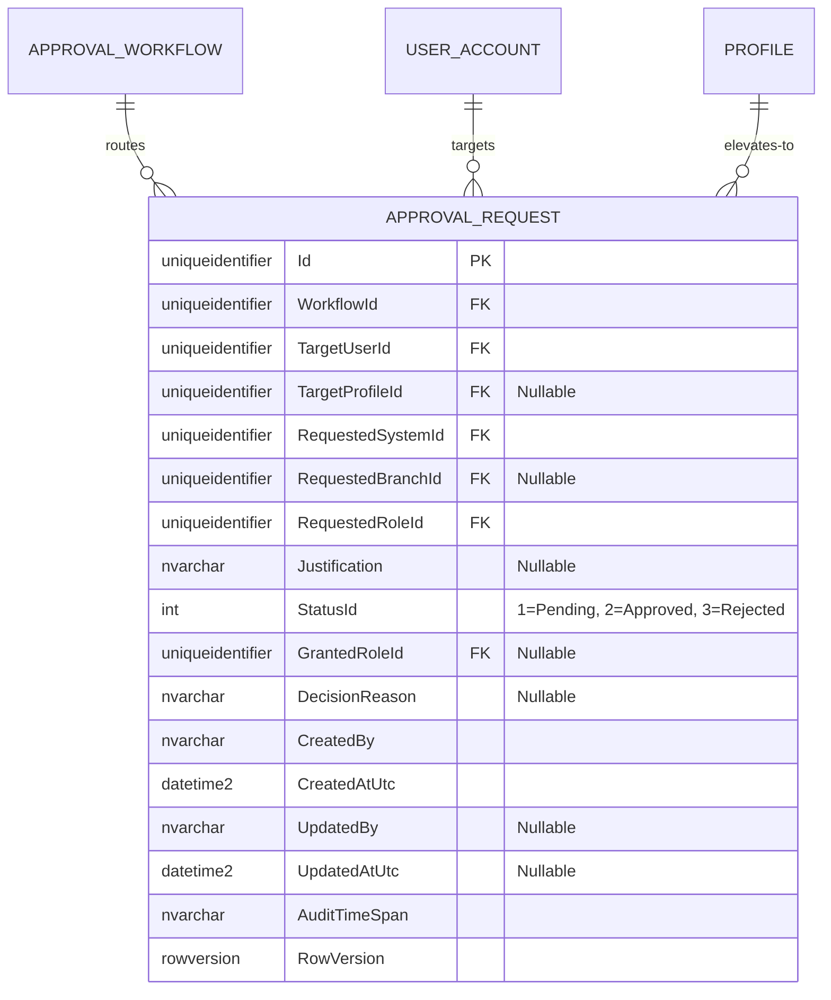

# ApprovalRequest — Aggregate Architecture

**Bounded Context:** Approvals  
**Aggregate Root:** `ApprovalRequest`  
**Module:** `Ums.Domain.Approvals.ApprovalRequest`  
**Status:** Production

---

## 1. Aggregate Overview

### Purpose
The `ApprovalRequest` aggregate represents a concrete runtime execution of an approval process. When a user requests a sensitive action, such as profile assignment, profile promotion, or security configuration modification, UMS instantiates an `ApprovalRequest` linked to a specific `ApprovalWorkflow` to track status and audit details of that operational decision.

### Business Responsibility
- Register and track dynamic approval requests.
- Prevent double execution or state transitions once resolved.
- Authorize transitions from `Pending` to `Approved` or `Rejected` through authenticated signatures.
- Support EP-09 profile access requests by using `Rejected` as the implemented status that maps to the business outcome `Denied`.
- Bind the target user account and target profile.

### Aggregate Root
`ApprovalRequest` is the aggregate root. All state transitions (Approving, Rejecting) must flow through it to ensure constraints.

### Invariants and Consistency Rules
1. A request is born in the `Pending` status.
2. The status can only transition from `Pending` to `Approved` or `Rejected`. Once a request has been finalized (`Approved` or `Rejected`), its status is permanently locked and cannot be edited.
3. Must contain valid references to `WorkflowId` and `TargetUserId`.
4. A user cannot approve their own promotion request (enforced at the application/domain command barrier to prevent collusion).

### Related Entities / Value Objects
| Entity / VO | Type | Ownership |
|---|---|---|
| `ApprovalRequestId` | Value Object | Guid-based aggregate root identifier |
| `ApprovalStatus` | Enum | Pending · Approved · Rejected |
| `SystemSuiteId` | Value Object | Requested system scope |
| `BranchId` | Value Object | Requested branch scope, when applicable |
| `RoleId` | Value Object | Requested or granted role identifier |
| `AuditValueObject` | Value Object | Tracks creation and modification metadata |

### Domain Events
| Event | Trigger |
|---|---|
| `ApprovalRequestCreatedEvent` | A new approval request is registered and set to Pending |
| `ApprovalRequestApprovedEvent` | The request is marked as Approved, triggering downstream activations |
| `ApprovalRequestRejectedEvent` | The request is marked as Rejected. For EP-09 profile requests this is exposed to users as Denied |

### Commands / Use Cases
| Command | Description |
|---|---|
| `CreateApprovalRequestCommand` | Instantiate a profile access request with requested system, branch, role, and justification |
| `ApproveRequestCommand` | Approve a pending request with the authorized actor ID |
| `RejectRequestCommand` | Reject a pending request. User-facing onboarding flows expose this final outcome as Denied |

### Repository / Service Boundaries
- `IApprovalRequestRepository` — Manages request lifecycles.
- Partitioned strictly by the caller's session `TenantId` (inherited via the target workflow and user configurations).

---

## 2. Domain Model

### Classes / Entities / Value Objects
```
ApprovalRequest (Aggregate Root)
└── Props: ApprovalRequestProps
    ├── Id: ApprovalRequestId
    ├── WorkflowId: ApprovalWorkflowId
    ├── TargetUserId: UserId
    ├── TargetProfileId?: ProfileId
    ├── RequestedSystemId: SystemSuiteId
    ├── RequestedBranchId?: BranchId
    ├── RequestedRoleId: RoleId
    ├── Justification?: string
    ├── Status: ApprovalStatus
    ├── GrantedRoleId?: RoleId
    ├── DecisionReason?: string
    └── Audit: AuditValueObject
```

---

## 3. Object Model Diagrams



---

## 4. Sequence Diagrams

### Complete Approval Request Lifecycle


### Profile Request Onboarding Mapping


---

## 5. ER Model



### Tenant Isolation Rules
- Evaluated via target user account and workflow scopes. Operations are filtered by the active tenant boundary at the repository layer.
- Profile request approval remains tenant-scoped or delegated branch-scoped through application-layer authorization checks.

### EP-09 Required Extension
The implemented `ApprovalRequest` record now stores the requested system, branch, role, justification, granted role, and decision reason. Final notification delivery is handled by the notification pipeline, so the remaining FS-24 follow-up is only needed if a persisted notification-result field becomes a design requirement.

---

## 6. Bounded Context Integration
- **Upstream**: Orchestrated by workflows from the `Approvals` context. Directly targets user identifiers from `Identity` and profiles from `Authorization`.
- **Downstream**: Successful approvals trigger user profile promotions inside the `IGA` context.

---

## 7. Application Layer
- `CreateApprovalRequestCommand` -> Inputs: `WorkflowId, TargetUserId, TargetProfileId?, RequestedSystemId, RequestedBranchId?, RequestedRoleId, Justification?` -> Returns: `Guid`
- `ApproveRequestCommand` -> Inputs: `RequestId` -> Returns: `void`
- `RejectRequestCommand` -> Inputs: `RequestId` -> Returns: `void`

---

## 8. Infrastructure/Persistence
- Index: Clustered primary key on `RequestId`, with non-clustered composite index on `TargetUserId, Status`.

---

## 9. Security & Compliance
- Approval actions require administrative credentials distinct from the request initiator (anti-collusion compliance).
- Audit: Finalized requests represent binding digital signatures and are stored permanently for security auditing.

---

## 10. Technical Decisions
- Maintaining a simple flat schema for request status transitions guarantees very low persistence latency during high-velocity administrative executions.

---

**[Back to Approvals Index](./index.md)**
