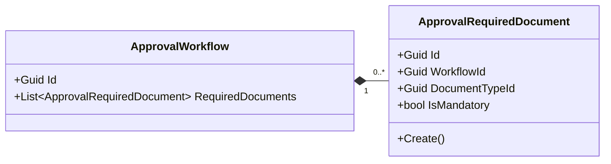
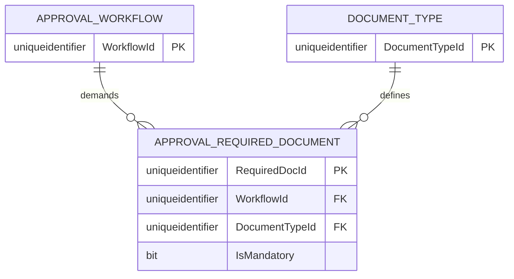

# ApprovalRequiredDocument — Entity Architecture

**Bounded Context:** Approvals  
**Aggregate Root:** `ApprovalWorkflow`  
**Module:** `Ums.Domain.Approvals.ApprovalWorkflow.ApprovalRequiredDocument`  
**Status:** Production

---

## 1. Entity Overview

### Purpose
The `ApprovalRequiredDocument` entity specifies the mappings of a particular document classification (e.g. Identity Proof, Contract) that are declared as mandatory requirements under an `ApprovalWorkflow`.

### Business Responsibility
- Identify the explicit `DocumentTypeId` mandatory for a workflow context.
- Define whether completing the upload is a blocking requirement (`IsMandatory = true`).

### Aggregate Root
This is an owned entity belonging to the `ApprovalWorkflow` aggregate. It cannot exist or be modified outside the scope of its parent `ApprovalWorkflow`.

### Invariants and Consistency Rules
1. Must contain a valid `WorkflowId` and `DocumentTypeId`.
2. Must have a valid `Id` (Guid-based `ApprovalRequiredDocumentId`).
3. Life cycle is bound to the parent `ApprovalWorkflow`.

### Related Entities / Value Objects
| Entity / VO | Type | Ownership |
|---|---|---|
| `ApprovalRequiredDocumentId` | Value Object | Entity unique identifier |
| `ApprovalWorkflowId` | Value Object | Guid reference to parent aggregate |
| `DocumentTypeId` | Value Object | Guid reference to document classification |

---

## 2. Domain Model

### Classes / Entities / Value Objects
```
ApprovalRequiredDocument (Entity)
└── Props: ApprovalRequiredDocumentProps
    ├── Id: ApprovalRequiredDocumentId
    ├── WorkflowId: ApprovalWorkflowId
    ├── DocumentTypeId: DocumentTypeId
    ├── IsMandatory: bool
    └── Audit: AuditValueObject
```

---

## 3. Object Model Diagrams



---

## 4. Sequence Diagrams
- Creation and deletion flows are orchestrated by the parent aggregate [ApprovalWorkflow](./approval-workflow.md#4-sequence-diagrams).

---

## 5. ER Model



### Tenant Isolation Rules
- Acknowledges parent-level tenant scoping rules. Inherits database isolation rules of `APPROVAL_WORKFLOW`.

---

## 6. Bounded Context Integration
- Mapped internally inside the `Approvals` context. Directly targets `DocumentType` configurations.

---

## 7. Application Layer
- Managed via the parent application commands `AddRequiredDocumentToWorkflowCommand` and `RemoveRequiredDocumentFromWorkflowCommand`.

---

## 8. Infrastructure/Persistence
- Index: Clustered primary key on `RequiredDocId` and composite index on `WorkflowId, DocumentTypeId`.

---

## 9. Security & Compliance
- Security rules are inherited from the parent `ApprovalWorkflow`. Only users authorized to design workflows can configure these mappings.

---

## 10. Technical Decisions
- Keeping the entity stateless apart from relational attributes prevents excessive loading overhead during workflow evaluations.

---

**[Back to Approvals Index](./index.md)**
