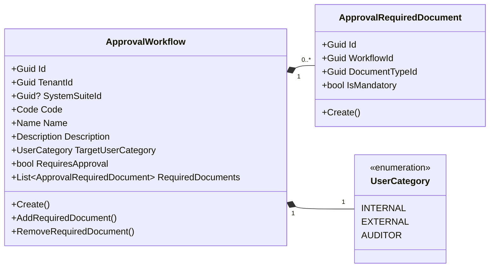
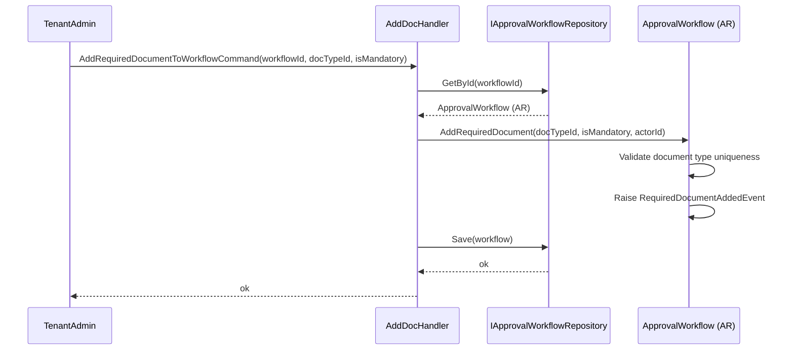
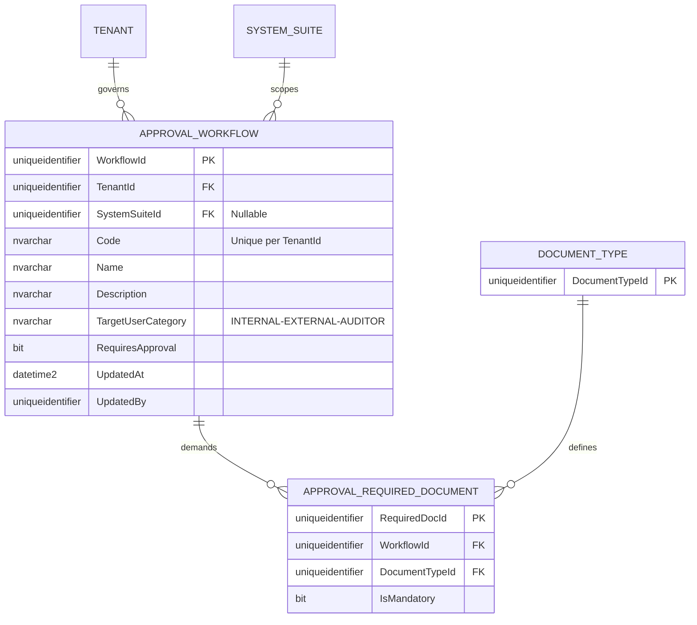

# ApprovalWorkflow — Aggregate Architecture

**Bounded Context:** Approvals  
**Aggregate Root:** `ApprovalWorkflow`  
**Module:** `Ums.Domain.Approvals.ApprovalWorkflow`  
**Status:** Production

---

## 1. Aggregate Overview

### Purpose
The `ApprovalWorkflow` aggregate establishes dynamic routing rules and document checklists for operations requiring administrative oversight. It ensures that certain user actions—such as requesting profile promotions or submitting sensitive files—trigger the appropriate human authorization flows and define what supporting files are mandatory. It specifies the mappings of a particular document classification (e.g. Identity Proof, Contract) that are declared as mandatory requirements.

### Business Responsibility
- Register and coordinate tenant-scoped approval schemas.
- Target workflows to specific suites or user classifications.
- Declare a checklist of required supporting documents.
- Determine whether dynamic approval is active.
- Identify the explicit `DocumentTypeId` mandatory for a workflow context.
- Define whether completing the upload is a blocking requirement (`IsMandatory = true`).

### Aggregate Root
`ApprovalWorkflow` is the aggregate root. Adding or removing required documents must flow through it to maintain integrity. `ApprovalRequiredDocument` cannot exist or be modified outside the scope of its parent `ApprovalWorkflow`.

### Invariants and Consistency Rules
1. Every `ApprovalWorkflow` must follow the code-name-description corporate template.
2. The `Code` parameter must be unique within the active `TenantId`.
3. If `RequiresApproval` is true, the workflow must have at least one valid approver group or checklist criteria defined.
4. Each required document type mapping must be unique; a workflow cannot duplicate required document types.
5. `ApprovalRequiredDocument` must contain a valid `WorkflowId` and `DocumentTypeId`.
6. `ApprovalRequiredDocument` must have a valid `Id` (Guid-based `ApprovalRequiredDocumentId`).
7. Life cycle of `ApprovalRequiredDocument` is bound to the parent `ApprovalWorkflow`.

### Related Entities / Value Objects
| Entity / VO | Type | Ownership |
|---|---|---|
| `ApprovalWorkflowId` | Value Object | Guid-based aggregate root identifier |
| `ApprovalRequiredDocument` | Entity | Owned |
| `ApprovalRequiredDocumentId` | Value Object | Entity unique identifier |
| `DocumentTypeId` | Value Object | Guid reference to document classification |
| `UserCategory` | Enum | INTERNAL · EXTERNAL · AUDITOR |
| `AuditValueObject` | Value Object | Tracks creation and modification metadata |

### Domain Events
| Event | Trigger |
|---|---|
| `ApprovalWorkflowCreatedEvent` | A new workflow definition is registered |
| `RequiredDocumentAddedEvent` | A document requirement mapping is added to the checklist |
| `RequiredDocumentRemovedEvent` | A document requirement mapping is removed |

### Commands / Use Cases
| Command | Description |
|---|---|
| `CreateApprovalWorkflowCommand` | Initialize a new approval workflow mapping |
| `AddRequiredDocumentToWorkflowCommand` | Bind a DocumentType as a mandate to complete the workflow |
| `RemoveRequiredDocumentFromWorkflowCommand` | Remove a DocumentType constraint from the checklist |

### Repository / Service Boundaries
- `IApprovalWorkflowRepository` — Persists and loads workflows.
- Queries are strictly isolated and filtered by the current `TenantId` session.

---

## 2. Domain Model

### Classes / Entities / Value Objects
```text
ApprovalWorkflow (Aggregate Root)
├── Props: ApprovalWorkflowProps
│   ├── Id: ApprovalWorkflowId
│   ├── TenantId: TenantId
│   ├── SystemSuiteId?: SystemSuiteId
│   ├── Code: Code
│   ├── Name: Name
│   ├── Description: Description
│   ├── TargetUserCategory: UserCategory
│   ├── RequiresApproval: bool
│   └── Audit: AuditValueObject
└── Children
    └── IReadOnlyCollection<ApprovalRequiredDocument>
        └── Props: ApprovalRequiredDocumentProps
            ├── Id: ApprovalRequiredDocumentId
            ├── WorkflowId: ApprovalWorkflowId
            ├── DocumentTypeId: DocumentTypeId
            ├── IsMandatory: bool
            └── Audit: AuditValueObject
```

---

## 3. Object Model Diagrams



---

## 4. Sequence Diagrams

### Add Required Document Flow


---

## 5. ER Model



### Tenant Isolation Rules
- All `APPROVAL_WORKFLOW` records are partitioned by `TenantId`. Direct database queries require application repository filtering (R-10).
- `APPROVAL_REQUIRED_DOCUMENT` acknowledges parent-level tenant scoping rules. Inherits database isolation rules of `APPROVAL_WORKFLOW`.

---

## 6. Bounded Context Integration
- **Upstream**: Fetches optional `SystemSuiteId` from Authorization context.
- **Downstream**: Consulted by `ApprovalRequest` to verify submission checklists, and `PromotionRequest` in IGA context to check authorization mandates. Mapped internally inside the `Approvals` context. Directly targets `DocumentType` configurations.

---

## 7. Application Layer
- `CreateApprovalWorkflowCommand` -> Inputs: `TenantId, Code, Name, Description, UserCategory, RequiresApproval, SystemSuiteId?` -> Returns: `Guid`
- `AddRequiredDocumentToWorkflowCommand` -> Inputs: `WorkflowId, DocumentTypeId, IsMandatory` -> Returns: `void`
- `RemoveRequiredDocumentFromWorkflowCommand` -> Inputs: `WorkflowId, DocumentTypeId` -> Returns: `void`

---

## 8. Infrastructure/Persistence
- Index: Unique index on `TenantId, Code` to avoid overlapping codes.
- Index: Clustered primary key on `RequiredDocId` and composite index on `WorkflowId, DocumentTypeId`.
- Transaction: Modifications to the workflow checklist are saved atomically in a single DbContext transaction.

---

## 9. Security & Compliance
- Designing workflows: Restricted to `Tenant:Admin` or higher roles.
- Compliance: Any change to an approval checklist triggers audit logs to secure procedural paths.
- Security rules are inherited from the parent `ApprovalWorkflow`. Only users authorized to design workflows can configure these mappings.

---

## 10. Technical Decisions
- Declaring separate required document junction tables ensures modular relationships between workflows and documents without locking the tables.
- Keeping the entity stateless apart from relational attributes prevents excessive loading overhead during workflow evaluations.

---

**[Back to Approvals Index](./index.md)**
