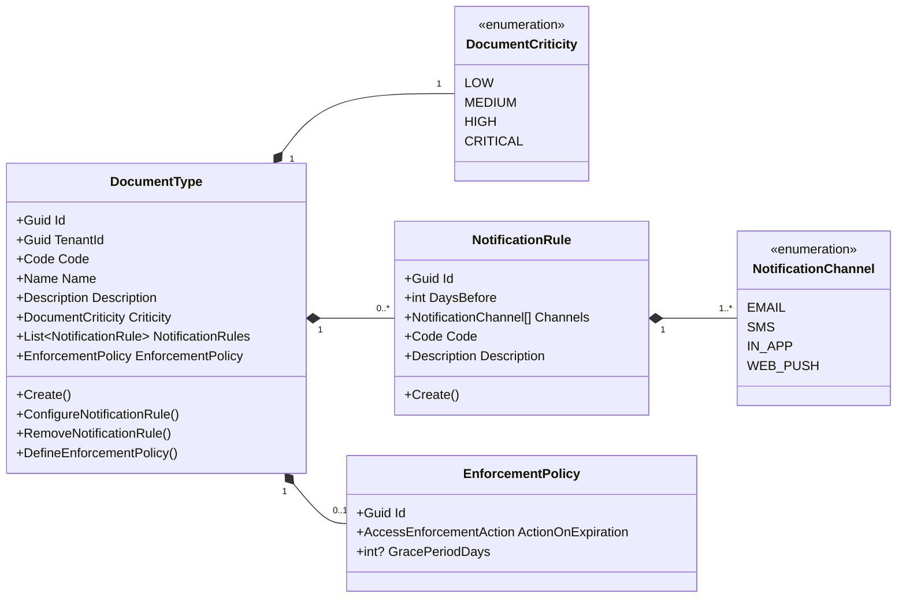
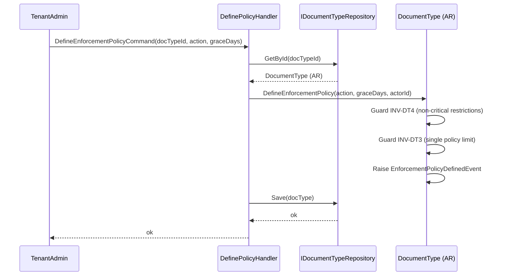
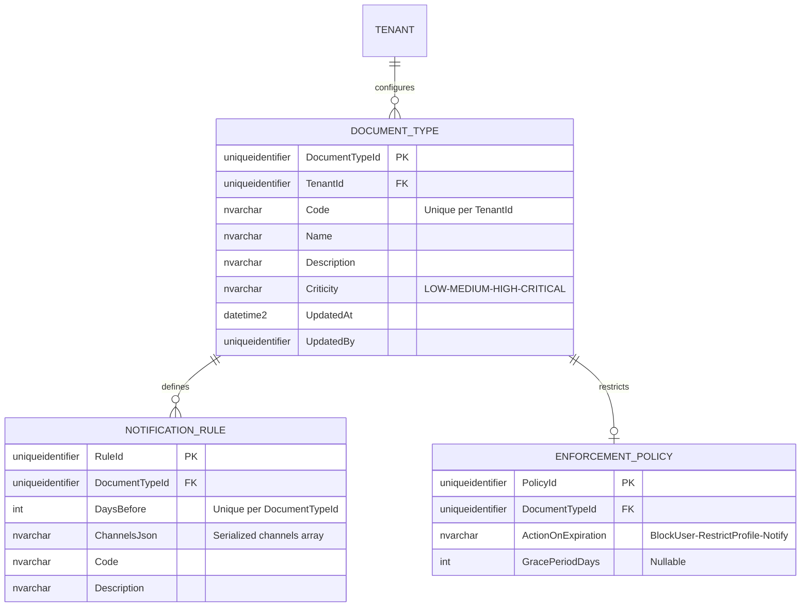

# DocumentType — Aggregate Architecture

**Bounded Context:** Approvals  
**Aggregate Root:** `DocumentType`  
**Module:** `Ums.Domain.Approvals.DocumentType`  
**Status:** Production

---

## 1. Aggregate Overview

### Purpose
The `DocumentType` aggregate governs the classifications, rules, and policy schemas for user-uploaded documents (e.g. Passports, Certification documents). It declares critical thresholds (`Criticity`), binds recurring notification intervals (`NotificationRule` entities), and configures proactive security enforcement actions (`EnforcementPolicy` entity) to run automatically when a mandatory document expires or is deleted. `NotificationRule` specifies how many days before expiration a user must be alerted, and which communication channels are authorized.

### Business Responsibility
- Register and classify corporate verification documents.
- Set criticity guidelines (Low, Medium, High, Critical).
- Maintain dynamic notification intervals to pre-alert users before a document expires.
- Define automatic enforcement blocks (e.g. Blocking access, restricting profiles) when critical compliance items fail.
- Map expiration warning rules to specific document categories and define alert transmission channels.

### Aggregate Root
`DocumentType` is the aggregate root. Defining enforcement actions must go through it to enforce invariants. `NotificationRule` is an independent Aggregate Root in the Approvals BC. `DocumentType` may reference `NotificationRule` entities by ID but does not own their lifecycle.

### Invariants and Consistency Rules
1. Every `DocumentType` must possess a unique `Code` within its `TenantId` namespace.
2. **DaysBefore Uniqueness (INV-DT2)**: The alert thresholds (`DaysBefore`) in the owned `NotificationRules` must be unique across the rules list.
3. **Critical Mandates (INV-DT1)**: If a `DocumentType` is set to `Critical`, it must have exactly one active `EnforcementPolicy` defined to secure system compliance.
4. **Single Policy (INV-DT3)**: Only one active `EnforcementPolicy` is permitted per `DocumentType`.
5. **Criticity Matching (INV-DT4)**: Non-critical/high document types cannot apply `BlockUser` or `RestrictProfile` enforcement actions.
6. Referenced `NotificationRule` aggregates must exist and be active before being associated with a `DocumentType`.

### Related Entities / Value Objects
| Entity / VO | Type | Ownership |
|---|---|---|
| `DocumentTypeId` | Value Object | Guid-based aggregate root identifier |
| `DocumentCriticity` | Enum | LOW · MEDIUM · HIGH · CRITICAL |
| `NotificationRule` | Entity | Related Aggregate Root (external reference by ID) |
| `NotificationRuleId` | Value Object | Entity unique identifier |
| `NotificationChannel` | Enum | EMAIL · SMS · IN_APP · WEB_PUSH |
| `EnforcementPolicy` | Entity | Owned child detailing grace periods and blocks |
| `AuditValueObject` | Value Object | Tracks creation and modification metadata |
| `Code` | Value Object | Alpha-numeric camelCase notification type identifier |

### Domain Events
| Event | Trigger |
|---|---|
| `DocumentTypeRegisteredEvent` | A new document category is successfully registered |
| `NotificationRuleConfiguredEvent` | An expiration pre-alert rule is configured |
| `NotificationRuleRemovedEvent` | A pre-alert rule is removed |
| `EnforcementPolicyDefinedEvent` | An enforcement block is defined |
| `EnforcementPolicyUpdatedEvent` | The enforcement parameters are updated |

### Commands / Use Cases
| Command | Description |
|---|---|
| `CreateDocumentTypeCommand` | Register a new document type with default parameters |
| `ConfigureNotificationRuleCommand` | Configure a new alert threshold and channels |
| `RemoveNotificationRuleCommand` | Remove an existing notification pre-alert rule |
| `DefineEnforcementPolicyCommand` | Add a blocking or profile downgrade enforcement policy |
| `UpdateEnforcementPolicyCommand` | Modify the actions or grace periods of a policy |

### Repository / Service Boundaries
- `IDocumentTypeRepository` — Persists classification schemas.
- Scoped strictly by `TenantId` to prevent multi-tenant configuration cross-overs.

---

## 2. Domain Model

### Classes / Entities / Value Objects
```text
DocumentType (Aggregate Root)
├── Props: DocumentTypeProps
│   ├── Id: DocumentTypeId
│   ├── TenantId: TenantId
│   ├── Code: Code
│   ├── Name: Name
│   ├── Description: Description
│   ├── Criticity: DocumentCriticity
│   └── Audit: AuditValueObject
├── Children
│   └── IReadOnlyCollection<NotificationRule>
│       └── Props: NotificationRuleProps
│           ├── Id: NotificationRuleId
│           ├── DaysBefore: int
│           ├── Channels: NotificationChannel[]
│           ├── Code: Code
│           └── Description: Description
└── Child (Nullable)
    └── EnforcementPolicy
```

---

## 3. Object Model Diagrams



---

## 4. Sequence Diagrams

### Define Enforcement Policy Flow


---

## 5. ER Model



### Tenant Isolation Rules
- Classified schemas are partitioned strictly by `TenantId`. All verification routing queries enforce isolation limits.
- `NotificationRule` is an independent Aggregate Root with its own `TenantId` scope. It is not owned by `DocumentType`.

---

## 6. Bounded Context Integration
- **Upstream**: Inherits context rules from `Identity` (validating tenant registers).
- **Downstream**: Consulted by `UserDocument` to check alert thresholds, and `AccessEnforcementPolicy` during compliance check passes. Alerts triggered are processed by background compliance runners to notify users from the `Identity` context.

---

## 7. Application Layer
- `CreateDocumentTypeCommand` -> Inputs: `TenantId, Code, Name, Description, Criticity` -> Returns: `Guid`
- `ConfigureNotificationRuleCommand` -> Inputs: `DocumentTypeId, DaysBefore, Channels, Code, Description` -> Returns: `void`
- `RemoveNotificationRuleCommand` -> Inputs: `DocumentTypeId, RuleId` -> Returns: `void`
- `DefineEnforcementPolicyCommand` -> Inputs: `DocumentTypeId, Action, GracePeriodDays?` -> Returns: `void`

---

## 8. Infrastructure/Persistence
- Index: Unique index on `TenantId, Code`.
- Index: Composite index on `DocumentTypeId, DaysBefore` to secure threshold uniqueness.
- Transaction: Child updates (policies and pre-alert rule entries) are stored atomically within the parent `DOCUMENT_TYPE` database transaction.

---

## 9. Security & Compliance
- Adjusting critical classification or rules: Restricted strictly to `Tenant:Admin` roles. Rule configurations are inherited from the parent `DocumentType`.
- Compliance: Altering enforcement rules represents a high security impact and triggers high-severity audit logging.

---

## 10. Technical Decisions
- `EnforcementPolicy` is modelled as an owned child entity inside `DocumentType` to protect domain boundaries. `NotificationRule` is an independent Aggregate Root referenced by ID, enabling reuse across multiple document types.
- Storing allowed communication channels as a serialized array (`ChannelsJson`) within a single database column guarantees database flexibility without massive schema join overheads.

---

**[Back to Approvals Index](./index.md)**
