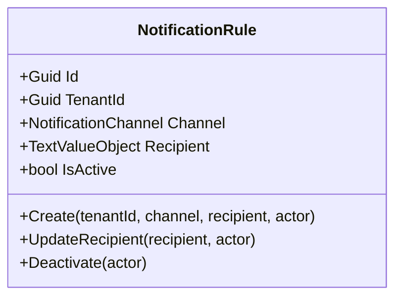
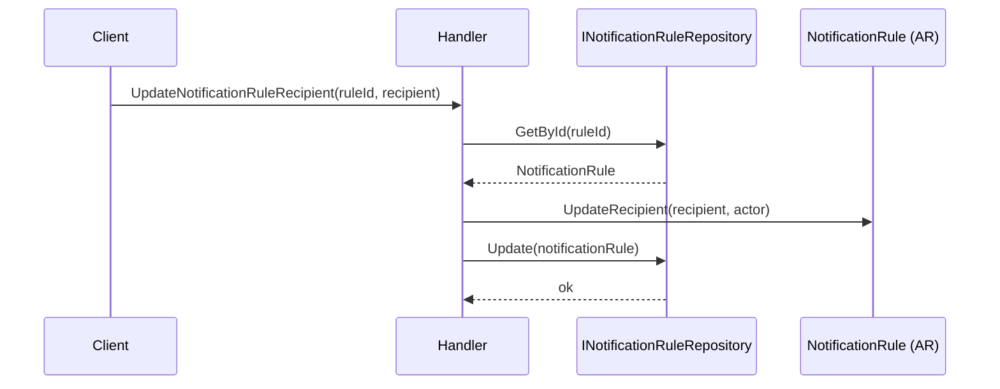
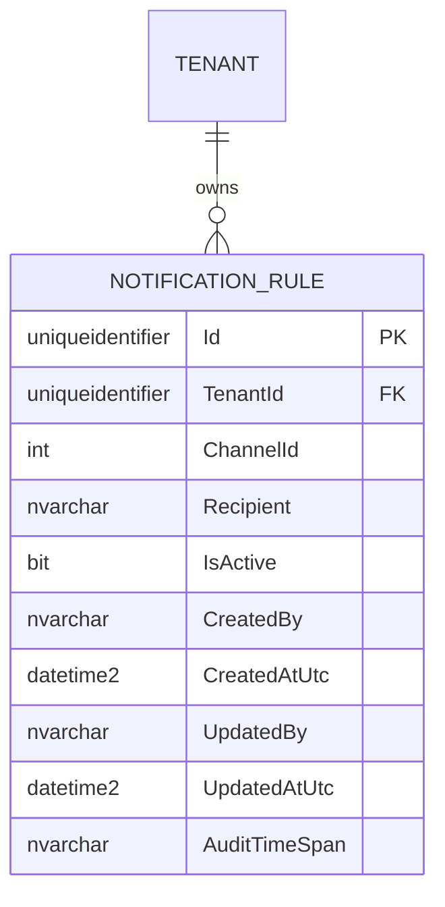

# NotificationRule — Aggregate Architecture

**Bounded Context:** Approvals  
**Aggregate Root:** `NotificationRule`
**Module:** `Ums.Domain.Approvals.NotificationRule`
**Status:** Production

---

## 1. Aggregate Overview

### Purpose
The `NotificationRule` aggregate represents an operational notification endpoint rule used by the approvals/compliance process. It stores who should receive a notification, through which channel, and whether that rule is active.

### Business Responsibility
- Register tenant-scoped notification endpoints.
- Define notification delivery channel.
- Store recipient target data.
- Allow lifecycle deactivation and recipient updates.

### Aggregate Root
`NotificationRule` is a standalone aggregate root in the current implementation. It is not modeled as an owned child of `DocumentType`.

### Invariants and Consistency Rules
1. `TenantId` is mandatory.
2. `Recipient` must be present and non-empty.
3. New rules start active.
4. A rule already inactive cannot be deactivated again.

### Related Entities / Value Objects
| Entity / VO | Type | Ownership |
|---|---|---|
| `NotificationRuleId` | Value Object | Aggregate identifier |
| `TenantId` | Value Object | Tenant ownership boundary |
| `NotificationChannel` | Enumeration | Delivery channel |
| `TextValueObject` | Value Object | Recipient endpoint or address |
| `AuditValueObject` | Value Object | Audit trail |

### Domain Events
- No custom domain events are currently raised from this aggregate in the present implementation.

---

## 2. Domain Model

```text
NotificationRule (Aggregate Root)
└── Props: NotificationRuleProps
    ├── Id: IdValueObject
    ├── TenantId: TenantId
    ├── Channel: NotificationChannel
    ├── Recipient: TextValueObject
    ├── IsActive: bool
    └── Audit: AuditValueObject
```

---

## 3. Object Model Diagrams



---

## 4. Sequence Diagrams

### Update Recipient Flow


---

## 5. ER Model



### Tenant Isolation Rules
- Strictly tenant-owned through `TenantId`.

---

## 6. Bounded Context Integration
- Used by approval and compliance orchestration to resolve runtime notification destinations.

---

## 7. Application Layer
- `CreateNotificationRuleCommand` -> Inputs: `TenantId, Channel, Recipient` -> Returns: `Guid`
- `DeactivateNotificationRuleCommand` -> Inputs: `RuleId` -> Returns: `void`
- Follow-up API work pending: expose recipient updates and richer scheduling/configuration semantics.

---

## 8. Infrastructure/Persistence
- Current repository implementation remains transitional (`in-memory`) for this aggregate.

---

## 9. Security & Compliance
- Notification endpoints may contain sensitive operational routing data and should be tenant-isolated and audited.

---

## 10. Technical Decisions
- `NotificationRule` has been elevated to an aggregate root in the current codebase.
- This supersedes older documentation that modeled it as a child entity of `DocumentType`.

---

**[Back to Approvals Index](./index.md)**
