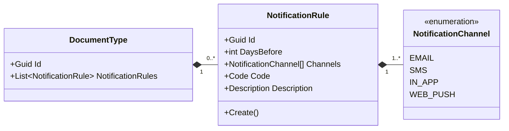
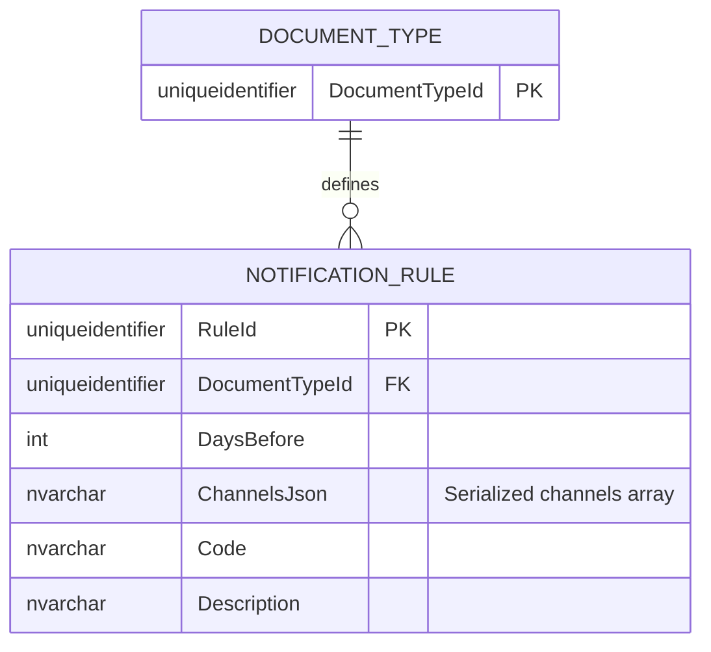

# NotificationRule — Entity Architecture

**Bounded Context:** Approvals  
**Aggregate Root:** `DocumentType`  
**Module:** `Ums.Domain.Approvals.DocumentType.NotificationRule`  
**Status:** Production

---

## 1. Entity Overview

### Purpose
The `NotificationRule` entity defines a reactive warning threshold for document compliance. It specifies how many days before expiration (`DaysBefore`) a user must be alerted, and which communication channels (e.g. Email, SMS, Push Notification) are authorized to transmit the alert message.

### Business Responsibility
- Map expiration warning rules to specific document categories.
- Define alert transmission channels.

### Aggregate Root
This is an owned entity belonging to the `DocumentType` aggregate. It cannot exist or undergo state transitions outside the lifecycle constraints of its parent `DocumentType`.

### Invariants and Consistency Rules
1. `DaysBefore` must be a positive integer strictly greater than zero.
2. The `Channels` collection must contain at least one valid notification channel (Email, SMS, WebPortal) and cannot be null or empty.
3. Life cycle is fully controlled by the parent `DocumentType`.

### Related Entities / Value Objects
| Entity / VO | Type | Ownership |
|---|---|---|
| `NotificationRuleId` | Value Object | Entity unique identifier |
| `NotificationChannel` | Enum | EMAIL · SMS · IN_APP · WEB_PUSH |
| `Code` | Value Object | Alpha-numeric camelCase notification type identifier |

---

## 2. Domain Model

### Classes / Entities / Value Objects
```
NotificationRule (Entity)
└── Props: NotificationRuleProps
    ├── Id: NotificationRuleId
    ├── DaysBefore: int
    ├── Channels: NotificationChannel[]
    ├── Code: Code
    └── Description: Description
```

---

## 3. Object Model Diagrams



---

## 4. Sequence Diagrams
- Addition and removal sequences are coordinated through the aggregate root [DocumentType](./document-type.md#4-sequence-diagrams).

---

## 5. ER Model



### Tenant Isolation Rules
- Scoped via its parent aggregate `DocumentType`. Inherits all platform multi-tenant database filtering constraints.

---

## 6. Bounded Context Integration
- Mapped internally inside the `Approvals` context. Alerts triggered are processed by background compliance runners to notify users from the `Identity` context.

---

## 7. Application Layer
- Managed via the parent application commands `ConfigureNotificationRuleCommand` and `RemoveNotificationRuleCommand`.

---

## 8. Infrastructure/Persistence
- Index: Composite index on `DocumentTypeId, DaysBefore` to secure threshold uniqueness.

---

## 9. Security & Compliance
- Rule configurations are inherited from the parent `DocumentType`. Only users authorized to design document structures can modify these notification channels.

---

## 10. Technical Decisions
- Storing allowed communication channels as a serialized array (`ChannelsJson`) within a single database column guarantees database flexibility without massive schema join overheads.

---

**[Back to Approvals Index](./index.md)**
