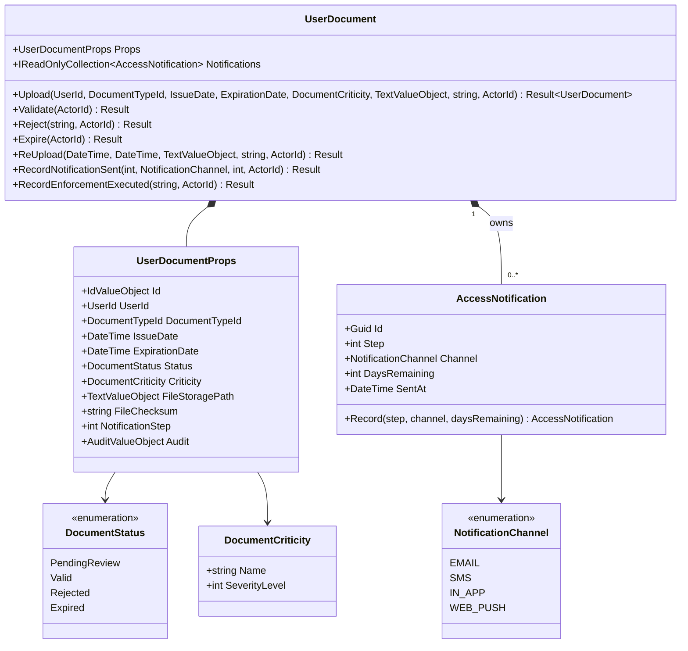
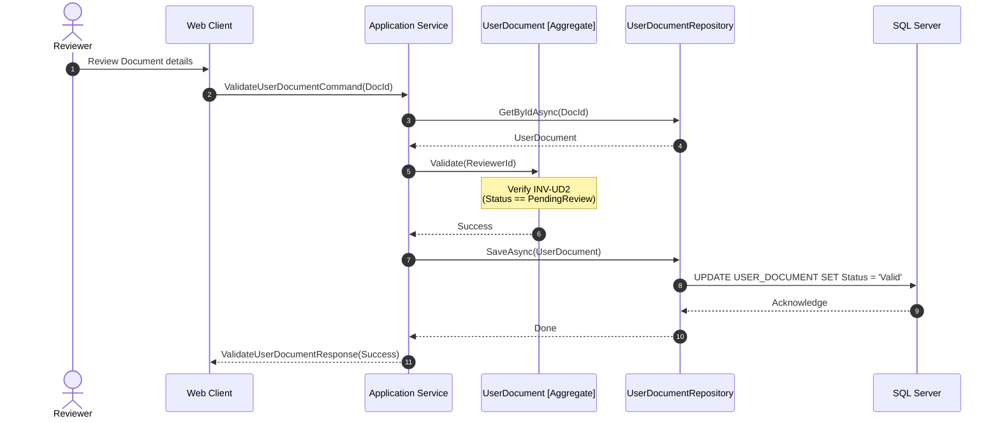
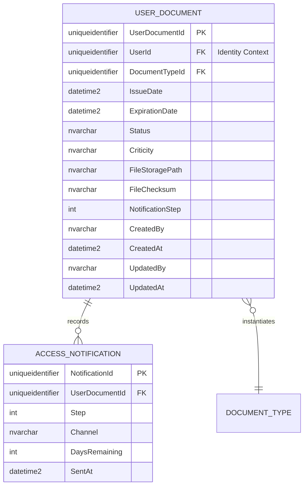

# UserDocument — Aggregate Architecture

**Bounded Context:** Approvals  
**Aggregate Root:** Yes  
**Module:** `Ums.Domain.Approvals.UserDocument`  
**Status:** Production

---

## 1. Aggregate Overview

### Purpose
The `UserDocument` aggregate represents a digital credential or compliance document uploaded by a user (e.g., identity verification, certifications). It manages the document's verification lifecycle, validity state, compliance status, and history of expiration notifications sent to the user (`AccessNotification`). `AccessNotification` records individual notification transmissions sent regarding upcoming expiration.

### Business Responsibility
- Encapsulate document metadata including issue date, expiration date, file storage location, and cryptographic checksum.
- Control state transitions throughout the document lifecycle (Pending Review $\rightarrow$ Valid / Rejected / Expired $\rightarrow$ Re-uploaded).
- House and manage sending histories (`AccessNotification`) as owned entities.
- Ensure strict multi-tenant context mapping.
- Record the exact point in time when an alert was sent to the user, channel used, and remaining validity window.

### Aggregate Root
`UserDocument` is a sovereign aggregate root within the Approvals context. It controls its internal state and guarantees that all children (such as `AccessNotification`) are modified exclusively through root domain methods. `AccessNotification` is strictly coordinated under its lifecycle.

### Invariants and Consistency Rules
1. **INV-UD1 (Date Sequence Validity):** The document's `ExpirationDate` must be chronologically greater than its `IssueDate`.
2. **INV-UD2 (Lifecycle Transitions):** State transitions must follow the strict finite state machine (FSM) rules:
   - Initial state is always `PendingReview`.
   - `PendingReview` can transition to `Valid` (via `Validate`) or `Rejected` (via `Reject`).
   - `Valid` can transition to `Expired` (via `Expire`) when the calendar date passes `ExpirationDate`.
   - Only `Expired` and `Rejected` documents can trigger `ReUpload`, which resets the status to `PendingReview` and resets the notification step counter.
   - `Rejected` cannot transition directly to `Valid` without undergoing a new upload/verification cycle.
3. **INV-UD3 (Integrity Verification):** Every uploaded document must provide a valid cryptographic hash (`FileChecksum`) and reference an existing `DocumentTypeId` structure.
4. **INV-AN1 (Immutable History):** Once an `AccessNotification` is recorded, its properties cannot be modified.
5. **INV-AN2 (Positive Days Remaining):** `DaysRemaining` must be a positive integer or zero, representing the remaining validity span.
6. **INV-AN3 (Step Sequence Coordination):** The `Step` index must correspond to an active warning phase configured in the document type rules.

### Related Entities / Value Objects
| Entity / VO | Type | Description |
|---|---|---|
| `UserDocumentId` | Value Object | Unique aggregate identifier |
| `UserId` | Value Object | Owner reference, linking to the Identity Context |
| `DocumentTypeId` | Value Object | Reference to the definition template aggregate |
| `DocumentStatus` | Enum | `PendingReview` · `Valid` · `Rejected` · `Expired` |
| `DocumentCriticity` | Value Object | Compliance severity classification |
| `TextValueObject` | Value Object | Validated file system storage path |
| `AccessNotification` | Entity | Owned child entity logging alert history |
| `AccessNotificationId` | Value Object | Unique entity identifier |
| `NotificationChannel` | Enum | EMAIL · SMS · IN_APP · WEB_PUSH |
| `Step` | Primitive | Step index counter |

---

## 2. Domain Model

### Classes / Entities / Value Objects
```text
UserDocument (Aggregate Root)
├── Props: UserDocumentProps
│   ├── Id: UserDocumentId
│   ├── UserId: UserId (External Ref)
│   ├── DocumentTypeId: DocumentTypeId (External Ref)
│   ├── IssueDate: DateTime
│   ├── ExpirationDate: DateTime
│   ├── Status: DocumentStatus
│   ├── Criticity: DocumentCriticity
│   ├── FileStoragePath: TextValueObject
│   ├── FileChecksum: string
│   ├── NotificationStep: int
│   └── Audit: AuditValueObject
└── Notifications: AccessNotification[] (Child Collection)
    └── Props: AccessNotificationProps
        ├── Id: IdValueObject
        ├── Step: int
        ├── Channel: NotificationChannel
        ├── DaysRemaining: int
        └── SentAt: DateTime
```

---

## 3. Object Model Diagrams



---

## 4. Sequence Diagrams

### Document Verification Lifecycle



---

## 5. ER Model



### Tenant Isolation Rules
- User documents inherit the tenant structure of their owning user account. Cross-tenant reads are prohibited through application-layer filters on the `UserId`.
- `ACCESS_NOTIFICATION` is scoped via its parent aggregate `UserDocument`. Multi-tenant safety is guaranteed implicitly.

---

## 6. Bounded Context Integration

```mermaid
flowchart TD
    subgraph IdentityContext [Identity Context]
        U[UserAccount]
    end

    subgraph ApprovalsContext [Approvals Context]
        DT[DocumentType]
        UD[UserDocument]
        AN[AccessNotification]
    end

    UD -.->|references UserId| U
    UD -->|instantiates| DT
    UD *--|owns| AN
```
- Logs recorded in `AccessNotification` are read by the security compliance engine to verify notice protocols.

---

## 7. Application Layer

### Commands & Queries
- **UploadUserDocumentCommand:** Handles new user document entry. Verifies expiration sequence and checks template.
- **ValidateUserDocumentCommand:** Authorized for Reviewers to mark documents as `Valid`.
- **RejectUserDocumentCommand:** Marks a document as `Rejected`, including reasons for revision.
- **ReUploadUserDocumentCommand:** Replaces invalid or expired files, transitioning the status back to `PendingReview`.
- **GetUserDocumentByIdQuery:** Returns a single document's metadata.
- **GetAllUserDocumentsQuery:** Query for compliance audits, filterable by status and userId.
- **RecordNotificationSent:** Managed via `UserDocument` to add `AccessNotification`.

---

## 8. Infrastructure/Persistence

### EF Core Mapping Configuration
```csharp
public class UserDocumentConfiguration : IEntityTypeConfiguration<UserDocument>
{
    public void Configure(EntityTypeBuilder<UserDocument> builder)
    {
        builder.ToTable("USER_DOCUMENT");
        builder.HasKey(e => e.Id);
        
        builder.OwnsOne(e => e.Props, props =>
        {
            props.Property(p => p.Id).HasColumnName("UserDocumentId");
            props.Property(p => p.UserId).HasColumnName("UserId");
            props.Property(p => p.DocumentTypeId).HasColumnName("DocumentTypeId");
            props.Property(p => p.IssueDate).HasColumnName("IssueDate");
            props.Property(p => p.ExpirationDate).HasColumnName("ExpirationDate");
            props.Property(p => p.Status).HasConversion<string>().HasColumnName("Status");
            props.Property(p => p.Criticity).HasConversion(c => c.Name, n => DocumentCriticity.FromName(n)).HasColumnName("Criticity");
            props.Property(p => p.FileStoragePath).HasConversion(p => p.GetValue(), s => TextValueObject.Create(s).Value).HasColumnName("FileStoragePath");
            props.Property(p => p.FileChecksum).HasColumnName("FileChecksum");
            props.Property(p => p.NotificationStep).HasColumnName("NotificationStep");
            props.OwnsOne(p => p.Audit);
        });

        builder.HasMany(e => e.Notifications)
               .WithOne()
               .HasForeignKey("UserDocumentId")
               .OnDelete(DeleteBehavior.Cascade);
    }
}
```
- `AccessNotification` is persisted as a dependent table mapped by EF Core with a cascade delete rule referencing its parent `UserDocument`.

---

## 9. Security & Compliance

- **Role-Based Access Control:** Only users with `Role.User` can upload or re-upload documents. Only `Role.Reviewer` can validate or reject.
- **Data Protection:** The physical files on storage (`FileStoragePath`) should be stored within protected directories. Cryptographic verification of `FileChecksum` protects against underlying file tampering.
- Logs (`AccessNotification`) are strictly read-only after creation to prevent tampering with security audit paths.

---

## 10. Technical Decisions

- **Nested Notifications:** Modeling `AccessNotification` as a nested collection guarantees chronological audit traces. Storing history alongside the parent document provides frictionless historical verification without querying generic communication logs. Persisting notification logs as owned entities rather than dispatching them to an external audit engine ensures aggregate self-sufficiency and high performance during compliance checks.

---

**[Back to Approvals Index](./index.md)**
