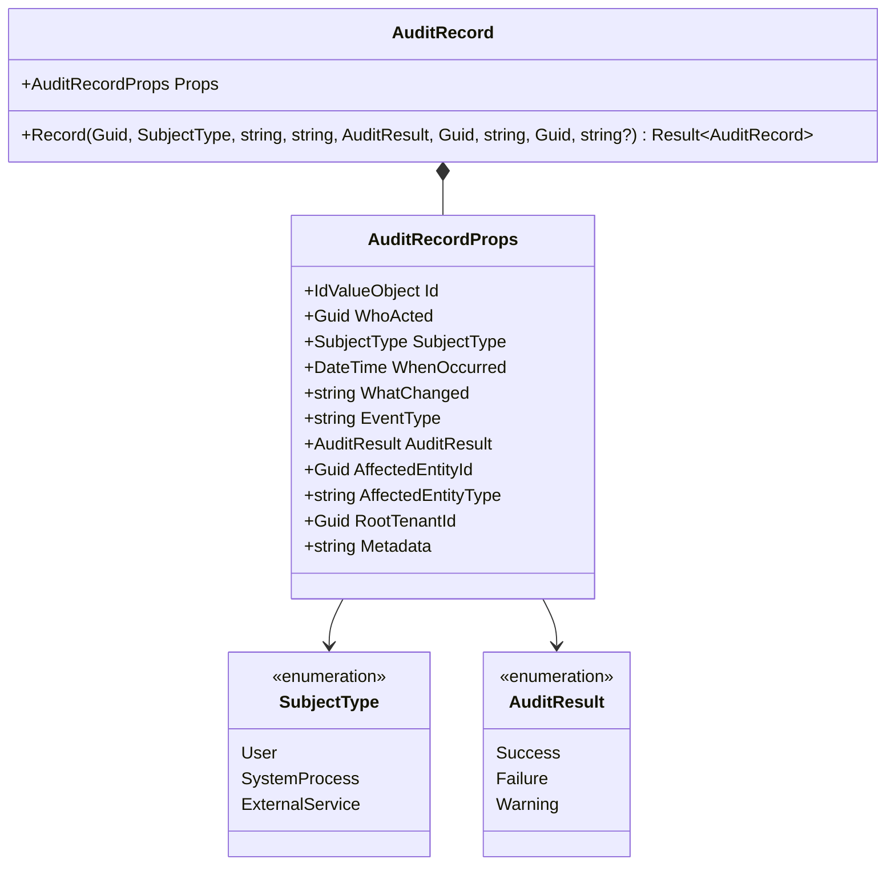
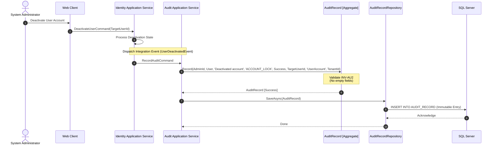
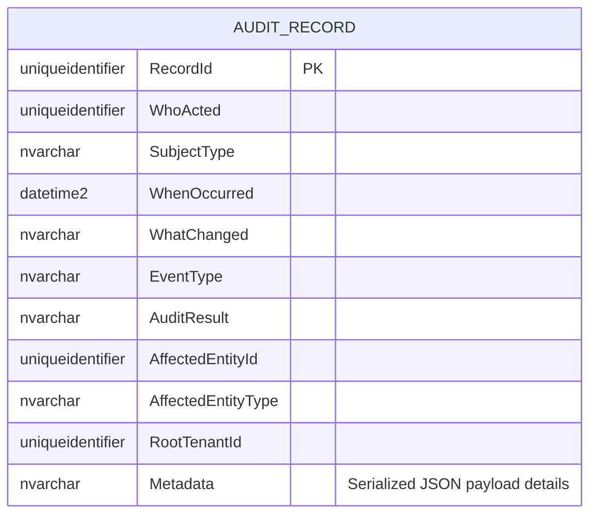
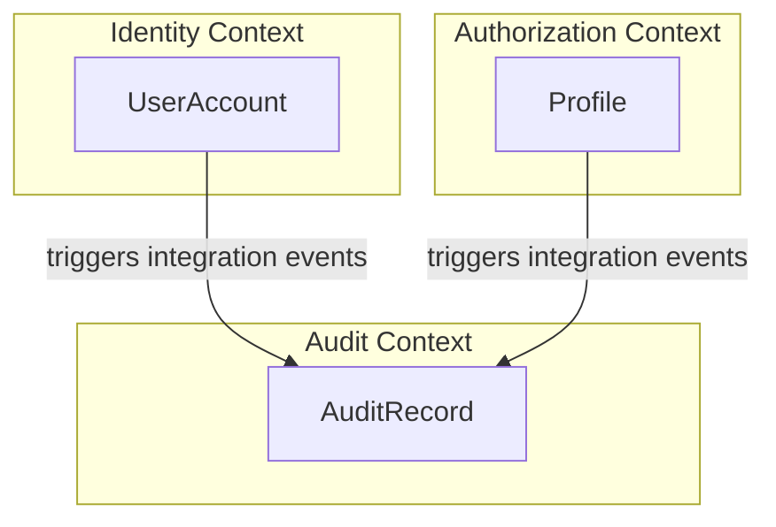

# AuditRecord — Aggregate Architecture

**Bounded Context:** Audit  
**Aggregate Root:** Yes  
**Module:** `Ums.Domain.Audit.AuditRecord`  
**Status:** Production

---

## 1. Aggregate Overview

### Purpose
The `AuditRecord` aggregate root models an immutable, timestamped ledger entry of a critical system event, configuration update, security boundary shift, or transactional state transition. It provides absolute visibility and traceability for regulatory compliance audits and threat detection.

### Business Responsibility
- Record a complete, tamper-proof trace of administrative actions and user requests.
- Track affected entities, actor IDs, process scopes, and transition payloads.
- Maintain a strict append-only transactional persistence scheme.

### Aggregate Root
`AuditRecord` is a sovereign, self-contained aggregate root. Because of its security importance, it has zero child collections and exposes no editing or deletion mechanics.

### Invariants and Consistency Rules
1. **INV-AU1 (Strict Append-Only Store):** An audit record is entirely read-only once saved. The domain aggregate does not define any public setters or state transition mutators.
2. **INV-AU2 (Trace Integrity Validation):** To ensure non-repudiation, the following mandatory properties must be set and cannot be default values during creation:
   - `WhoActed` cannot be empty (`Guid.Empty`).
   - `WhatChanged` must be a valid, non-empty text string (`DomainErrors.Audit.WhatChangedRequired`).
   - `AffectedEntityId` cannot be empty.
   - `AffectedEntityType` must be a valid, non-empty text string (`DomainErrors.Audit.AffectedEntityRequired`).
   - `RootTenantId` must map to a valid tenant identifier.

### Related Entities / Value Objects
| Entity / VO | Type | Description |
|---|---|---|
| `AuditRecordId` | Value Object | Unique aggregate identifier |
| `SubjectType` | Enum | `User` · `SystemProcess` · `ExternalService` |
| `AuditResult` | Enum | `Success` · `Failure` · `Warning` |

---

## 2. Domain Model

### Classes / Entities / Value Objects
```
AuditRecord (Aggregate Root)
└── Props: AuditRecordProps
    ├── Id: AuditRecordId
    ├── WhoActed: Guid
    ├── SubjectType: SubjectType
    ├── WhenOccurred: DateTime
    ├── WhatChanged: string
    ├── EventType: string
    ├── AuditResult: AuditResult
    ├── AffectedEntityId: Guid
    ├── AffectedEntityType: string
    ├── RootTenantId: Guid
    └── Metadata: string? (Serialized JSON Payload)
```

---

## 3. Object Model Diagrams



---

## 4. Sequence Diagrams

### Recording and Archiving Security Changes



---

## 5. ER Model



### Tenant Isolation Rules
- Scoped strictly by `RootTenantId`. Cross-tenant reading is strictly blocked. Inquilinos cannot query security footprints of other tenant spaces.

---

## 6. Bounded Context Integration



---

## 7. Application Layer

### Commands & Queries
- **RecordAuditCommand:** Append-only command that processes security event messages and commits them to the database.
- **GetAllAuditRecordsQuery:** Provides filterable, read-only listings of security events, scoped by `RootTenantId`.
- **GetAuditRecordByIdQuery:** Retrieves a single immutable trace log for security analysis.

---

## 8. Infrastructure/Persistence

### EF Core Mapping Configuration
```csharp
public class AuditRecordConfiguration : IEntityTypeConfiguration<AuditRecord>
{
    public void Configure(EntityTypeBuilder<AuditRecord> builder)
    {
        builder.ToTable("AUDIT_RECORD");
        builder.HasKey(e => e.Id);
        
        builder.OwnsOne(e => e.Props, props =>
        {
            props.Property(p => p.Id).HasColumnName("RecordId");
            props.Property(p => p.WhoActed).HasColumnName("WhoActed");
            props.Property(p => p.SubjectType).HasConversion<string>().HasColumnName("SubjectType");
            props.Property(p => p.WhenOccurred).HasColumnName("WhenOccurred");
            props.Property(p => p.WhatChanged).HasColumnName("WhatChanged");
            props.Property(p => p.EventType).HasColumnName("EventType");
            props.Property(p => p.AuditResult).HasConversion<string>().HasColumnName("AuditResult");
            props.Property(p => p.AffectedEntityId).HasColumnName("AffectedEntityId");
            props.Property(p => p.AffectedEntityType).HasColumnName("AffectedEntityType");
            props.Property(p => p.RootTenantId).HasColumnName("RootTenantId");
            props.Property(p => p.Metadata).HasColumnName("Metadata");
        });
    }
}
```

---

## 9. Security & Compliance

- **Non-Repudiation Assurance:** The database layer enforces that `UPDATE` and `DELETE` privileges are denied on the `AUDIT_RECORD` table for standard application connection strings, restricting them only to emergency security keys.
- **Payload Sanitization:** Serialized data inside `Metadata` must scrub sensitive user information (such as password hashes, PINs, or raw encryption keys) before serialization.

---

## 10. Technical Decisions

- **Dynamic Metadata Payload:** Utilizing a simple `nvarchar(max)` JSON column for `Metadata` allows the logging engine to capture detailed, context-specific action metrics (e.g. before/after properties of security profiles) without forcing a massive, constantly-evolving database table schema join structure.

---

**[Back to Audit Index](./index.md)**
