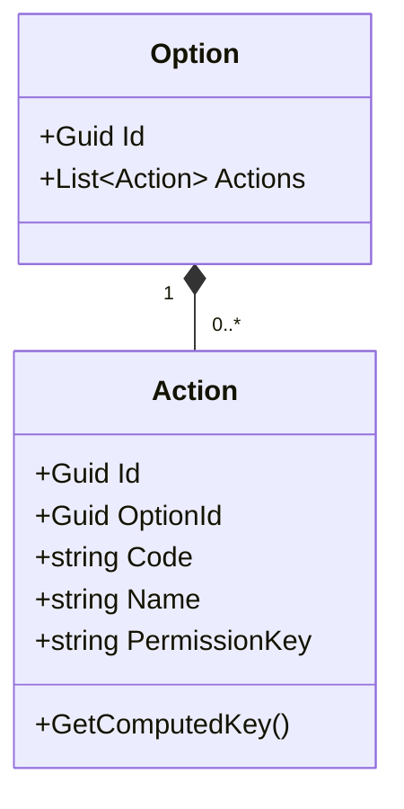
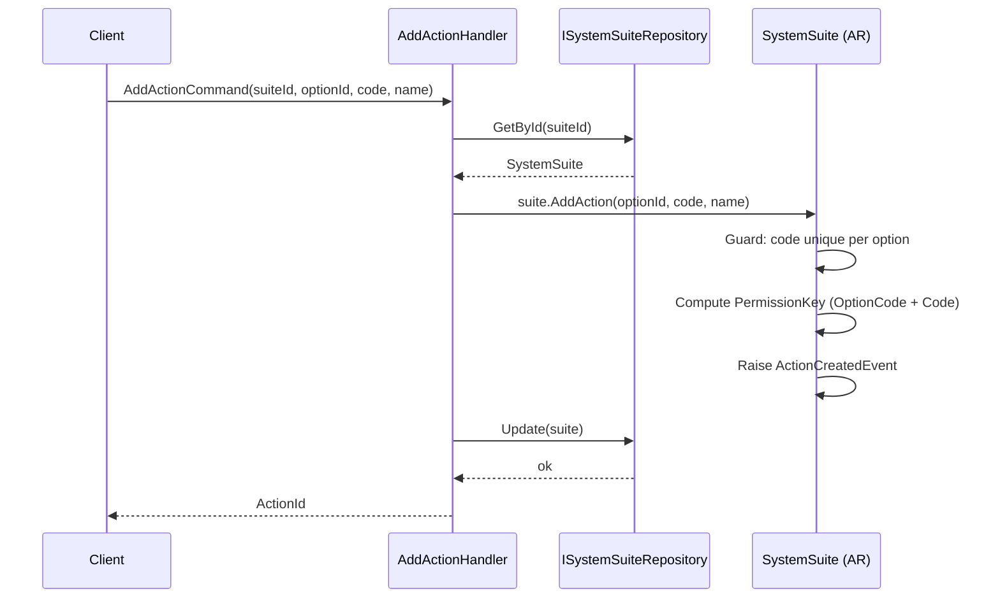
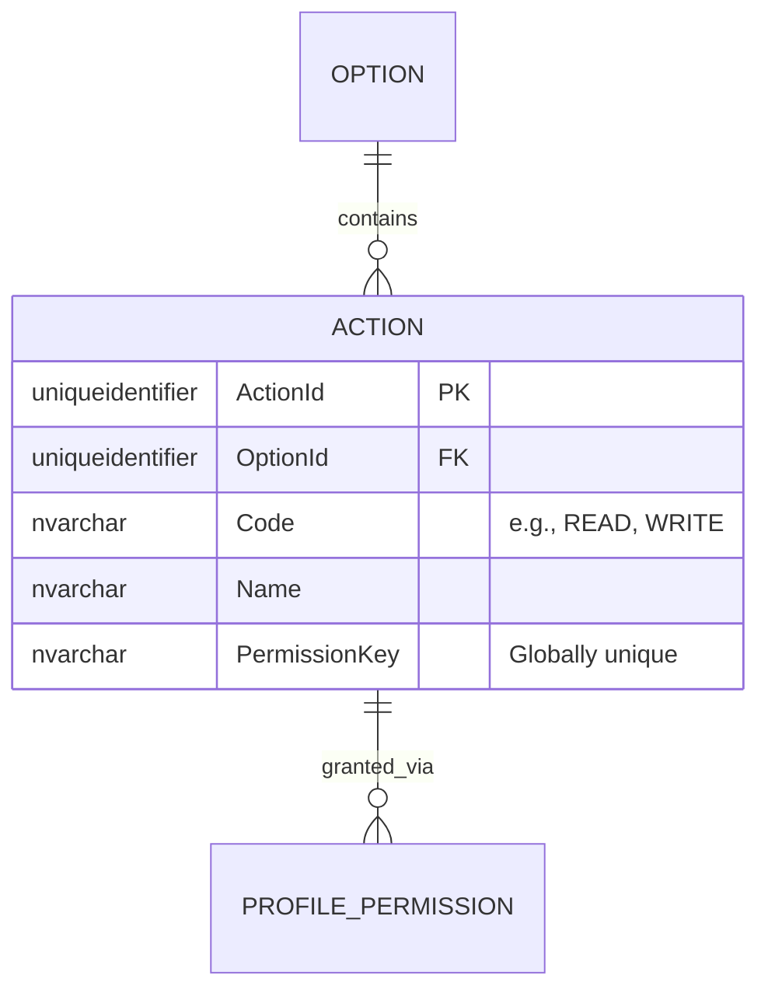

# Action — Owned Entity Architecture

**Bounded Context:** Authorization  
**Aggregate Root:** `SystemSuite` (Action is an owned entity within the SystemSuite aggregate structure)  
**Module:** `Ums.Domain.Authorization.SystemSuite.Module.Menu.SubMenu.Option.Action`  
**Status:** Production

---

## 1. Aggregate Overview

### Purpose
An `Action` represents the most granular execution token within the UMS authorization subsystem. It defines specific permitted behaviors on a screen or resource (e.g., `READ`, `WRITE`, `DELETE`, `EXPORT`, `APPROVE`). It is compiled into user permission keys and mapped dynamically to Profile policies to authorize Web API requests and UI element render boundaries.

### Business Responsibility
- Enforce discrete operation control on application options.
- Serve as the ultimate security token for API route protection.
- Participate in Profile permissions.

### Aggregate Root
`SystemSuite` (via Option). All state modifications are conducted via the parent `SystemSuite` aggregate root.

### Invariants and Consistency Rules
1. `Code` must be unique within the owning `Option` (e.g., an Option cannot have two "WRITE" actions).
2. The combination of Option Code + Action Code produces a globally unique permission key `Suite:Module:Option:Action` (e.g., `UMS:IDENTITY:TENANT:WRITE`).
3. An Action cannot exist without its parent `Option`.

### Related Entities / Value Objects
| Entity / VO | Type | Ownership |
|---|---|---|
| `OptionId` | Value Object | FK reference to parent Option |
| `Code` | Value Object | Operation code (e.g., READ) |
| `PermissionKey` | Value Object | Computed unique string |

### Domain Events
Events are raised on the parent `SystemSuite` domain event manager:
- `ActionCreatedEvent`
- `ActionUpdatedEvent`
- `ActionRemovedEvent`

---

## 2. Domain Model

### Classes / Entities / Value Objects
```
SystemSuite (Aggregate Root)
└── Module (Owned Entity)
    └── Menu (Owned Entity)
        └── SubMenu (Owned Entity)
            └── Option (Owned Entity)
                └── Action (Owned Entity)
                    ├── Props: ActionProps
                    │   ├── Id: IdValueObject
                    │   ├── OptionId: OptionId
                    │   ├── Code: string
                    │   ├── Name: string
                    │   └── PermissionKey: string
                    └── DomainServices
                        └── PermissionKeyGenerator
```

---

## 3. Object Model Diagrams



---

## 4. Sequence Diagrams

### Add Action Flow


---

## 5. ER Model



### Tenant Isolation Rules
- Global system catalog table. Free of RLS.

---

## 6. Bounded Context Integration
- **Downstream**: Map to `ProfilePermission` in the Authorization Context and `AuditRecord` in the Audit Context.
- `PermissionKey` is consumed directly by Authorization Middleware and API Gateways.

---

## 7. Application Layer
- `AddActionCommand` -> Inputs: `SuiteId, OptionId, Code, Name` -> Returns: `Guid`

---

## 8. Infrastructure/Persistence
- Index: Unique index on `OptionId, Code` and globally unique index on `PermissionKey`.
- Transaction: Saved as part of `SystemSuite` SaveChanges context.

---

## 9. Security & Compliance
- Operations require `Platform:Admin` credentials.
- Compliance: Any permission change must instantly invalidate cached session profiles for authorized sessions.

---

## 10. Technical Decisions
- The `PermissionKey` generator strictly sanitizes input characters and capitalizes strings, preventing configuration mistakes from compromising the security barrier.

---

**[Back to Authorization Index](./index.md)**
