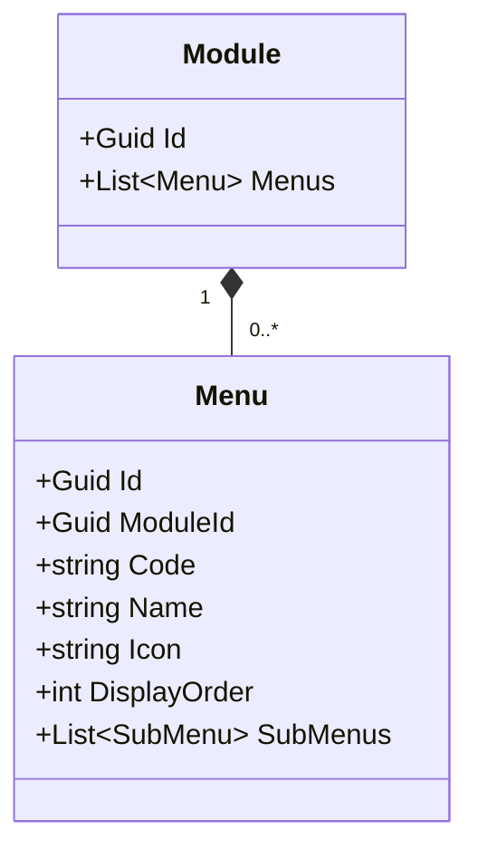
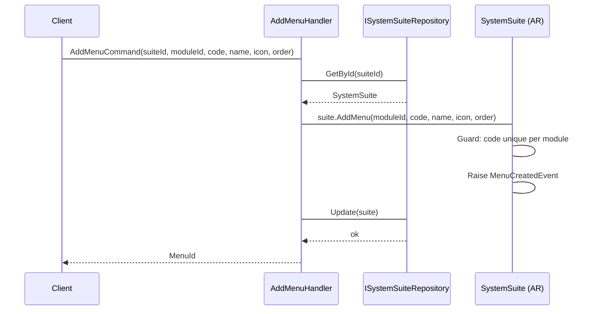
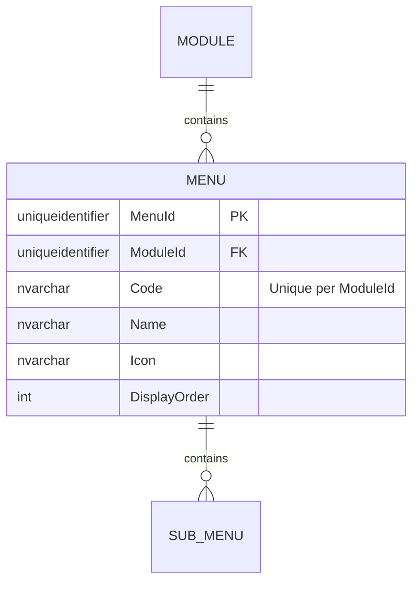

# Menu — Owned Entity Architecture

**Bounded Context:** Authorization  
**Aggregate Root:** `SystemSuite` (Menu is an owned entity within the SystemSuite aggregate structure)  
**Module:** `Ums.Domain.Authorization.SystemSuite.Module.Menu`  
**Status:** Production

---

## 1. Aggregate Overview

### Purpose
A `Menu` represents a graphical menu layout item under a Module. It provides high-level UI categorization and contains children SubMenus or direct Options. It is used to render responsive sidebar navigation structures.

### Business Responsibility
- Act as graphical structural headers in the application portals.
- Host SubMenus for complex tree configurations.
- Dynamically toggle rendering states.

### Aggregate Root
`SystemSuite` (via Module). All mutations occur through the `SystemSuite` aggregate root.

### Invariants and Consistency Rules
1. `Code` must be unique within the owning `Module`.
2. A Menu must have a reference to its parent `Module`.
3. Render status depends on parent activation states.

### Related Entities / Value Objects
| Entity / VO | Type | Ownership |
|---|---|---|
| `ModuleId` | Value Object | FK reference to parent Module |
| `Code` | Value Object | Menu identifier |
| `Name` | Value Object | Display label |
| `SubMenu` | Entity | Owned (see [sub-menu.md](./sub-menu.md)) |

### Domain Events
Events are raised on the parent `SystemSuite` domain event manager:
- `MenuCreatedEvent`
- `MenuUpdatedEvent`
- `MenuRemovedEvent`

---

## 2. Domain Model

### Classes / Entities / Value Objects
```
SystemSuite (Aggregate Root)
└── Module (Owned Entity)
    └── Menu (Owned Entity)
        ├── Props: MenuProps
        │   ├── Id: IdValueObject
        │   ├── ModuleId: ModuleId
        │   ├── Code: string
        │   ├── Name: string
        │   ├── Icon: string
        │   └── DisplayOrder: int
        └── Children
            └── IReadOnlyList<SubMenu>
```

---

## 3. Object Model Diagrams



---

## 4. Sequence Diagrams

### Add Menu Flow


---

## 5. ER Model



### Tenant Isolation Rules
- Global configuration catalog. Free of RLS.

---

## 6. Bounded Context Integration
- Referenced for rendering menus.

---

## 7. Application Layer
- `AddMenuCommand` -> Inputs: `SuiteId, ModuleId, Code, Name, Icon, DisplayOrder` -> Returns: `Guid`

---

## 8. Infrastructure/Persistence
- Index: Unique index on `ModuleId, Code`.
- Transaction: Saved as part of `SystemSuite` aggregate SaveChanges context.

---

## 9. Security & Compliance
- Changes require `Platform:Admin` credentials.

---

## 10. Technical Decisions
- Storing `Icon` as metadata avoids external dependencies on specific asset libraries.

---

**[Back to Authorization Index](./index.md)**
