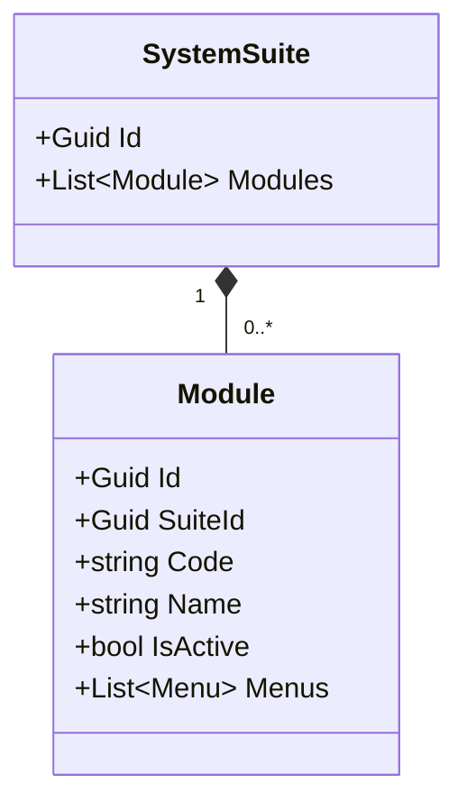
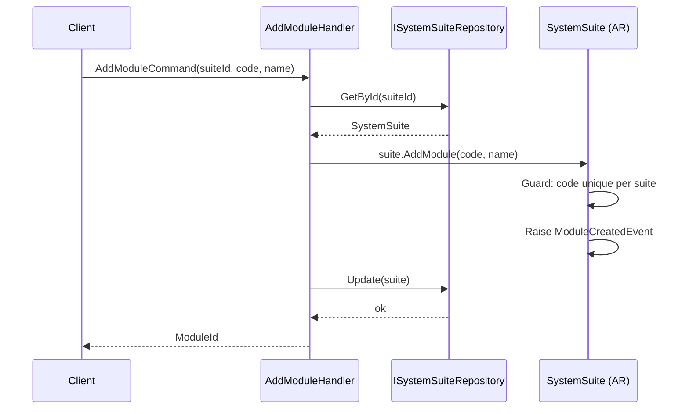
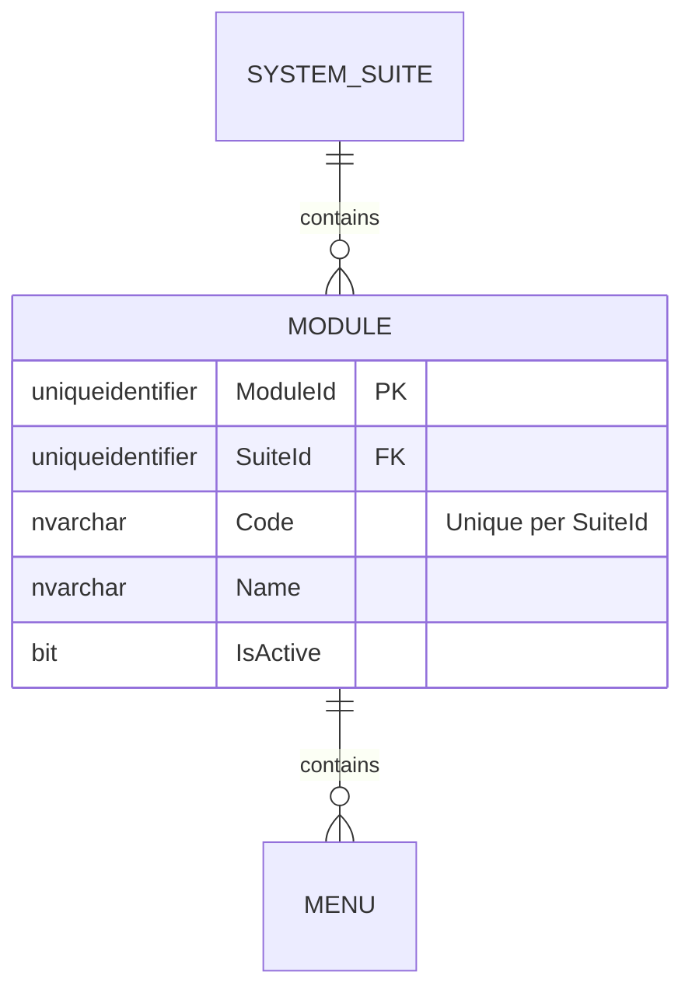

# Module — Owned Entity Architecture

**Bounded Context:** Authorization  
**Aggregate Root:** `SystemSuite` (Module is an owned entity within the SystemSuite aggregate)  
**Module:** `Ums.Domain.Authorization.SystemSuite.Module`  
**Status:** Production

---

## 1. Aggregate Overview

### Purpose
A `Module` represents a functional subsystem or a logical area within a `SystemSuite` (e.g., "User Management", "Billing", "System Configuration"). It serves to group navigations, screens, and permissions logically for user interface generation and granular security scoping.

### Business Responsibility
- Structure a suite's functional capabilities into distinct high-level zones.
- Act as the parent container for navigation Menus.
- Facilitate bulk activation/deactivation of features at the module level.

### Aggregate Root
`SystemSuite` is the parent aggregate root. All dynamic changes to modules must be performed via `SystemSuite` commands.

### Invariants and Consistency Rules
1. `Code` must be unique within the parent `SystemSuite`.
2. A Module cannot exist without its parent `SystemSuite`.
3. If the parent `SystemSuite` is deactivated, the Module is implicitly unavailable.

### Related Entities / Value Objects
| Entity / VO | Type | Ownership |
|---|---|---|
| `SuiteId` | Value Object | FK reference to parent suite |
| `Code` | Value Object | Unique module identifier |
| `Name` | Value Object | User-friendly title |
| `Menu` | Entity | Owned (see [menu.md](./menu.md)) |

### Domain Events
Events are raised on the parent `SystemSuite` domain event manager:
- `ModuleCreatedEvent`
- `ModuleRemovedEvent`
- `ModuleUpdatedEvent`

### Commands / Use Cases
- `AddModuleCommand` -> Adds a module to a suite.
- `RemoveModuleCommand` -> Removes a module.
- `UpdateModuleCommand` -> Modifies module details.

---

## 2. Domain Model

### Classes / Entities / Value Objects
```
SystemSuite (Aggregate Root)
└── Module (Owned Entity)
    ├── Props: ModuleProps
    │   ├── Id: IdValueObject
    │   ├── SuiteId: SuiteId
    │   ├── Code: string
    │   ├── Name: string
    │   └── IsActive: bool
    └── Children
        └── IReadOnlyList<Menu>
```

### Main Attributes
- `Id` (Guid, PK)
- `SuiteId` (Guid, FK)
- `Code` (string, unique per suite)
- `Name` (string)
- `IsActive` (bool)

---

## 3. Object Model Diagrams



---

## 4. Sequence Diagrams

### Add Module Flow


---

## 5. ER Model



### Tenant Isolation Rules
- Global configuration table. Free of RLS.

---

## 6. Bounded Context Integration
- Acts as downstream catalog mapping for UI menus.

---

## 7. Application Layer
- `AddModuleCommand` -> Inputs: `SuiteId, Code, Name` -> Returns: `Guid`
- `GetSuiteModulesQuery` -> Returns List of Modules.

---

## 8. Infrastructure/Persistence
- Saved as part of `SystemSuite` aggregate save context.
- Index: Unique index on `SuiteId, Code`.

---

## 9. Security & Compliance
- Changes require `Platform:Admin` credentials.

---

## 10. Technical Decisions
- Storing modules in a strict hierachy avoids configuration fragmentation.

---

**[Back to Authorization Index](./index.md)**
