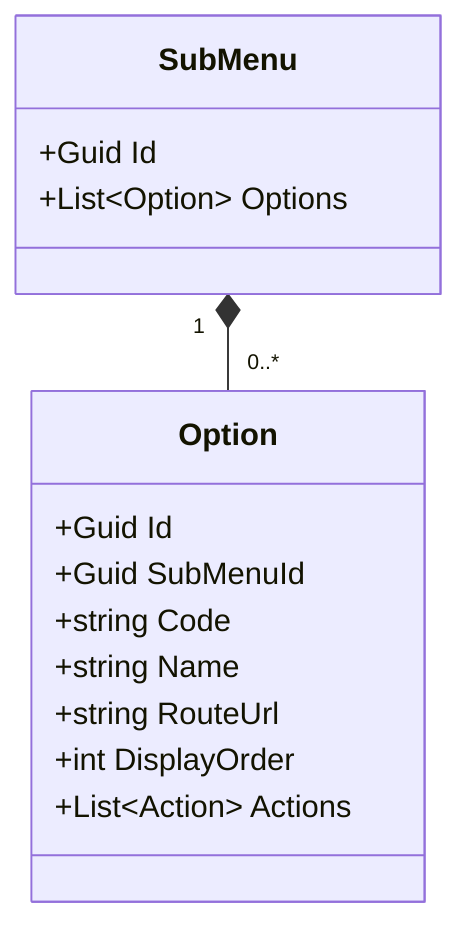
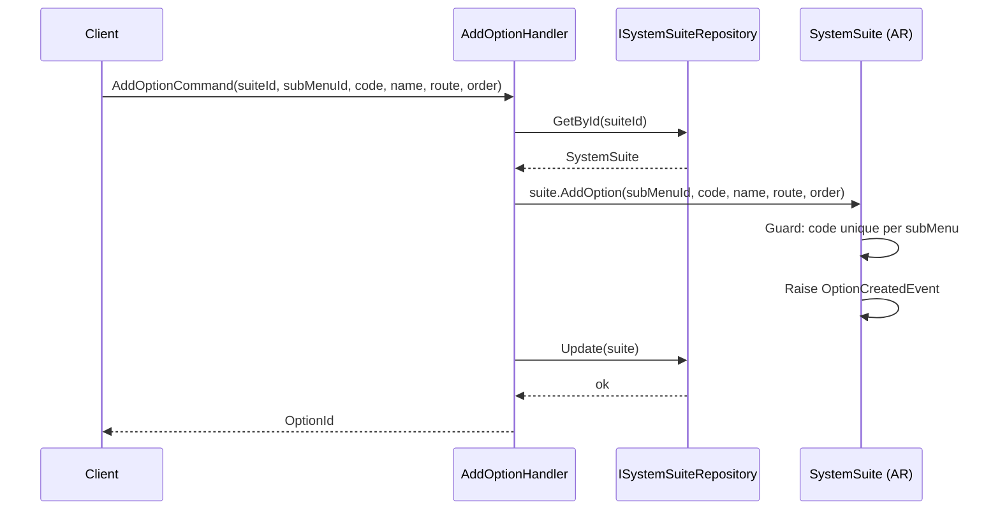
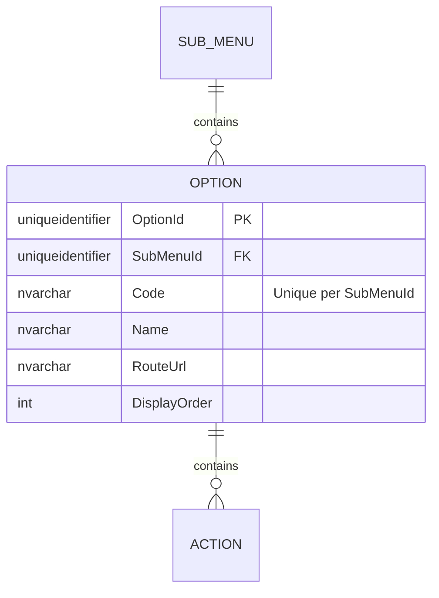

# Option — Owned Entity Architecture

**Bounded Context:** Authorization  
**Aggregate Root:** `SystemSuite` (Option is an owned entity within the SystemSuite aggregate structure)  
**Module:** `Ums.Domain.Authorization.SystemSuite.Module.Menu.SubMenu.Option`  
**Status:** Production

---

## 1. Aggregate Overview

### Purpose
An `Option` represents an actionable option mapping to a specific route or screen/view within the application front-end (e.g., "User Accounts Management", "Security Auditing"). It serves to anchor fine-grained security Actions and link UI components to authorization policy gates.

### Business Responsibility
- Map physical front-end screen routes/components to administrative structures.
- Act as the security gate for viewing functional interfaces.
- Parent structural Actions.

### Aggregate Root
`SystemSuite` (via SubMenu). Managed exclusively through the `SystemSuite` aggregate root.

### Invariants and Consistency Rules
1. `Code` must be unique within the parent `SubMenu`.
2. `RouteUrl` must follow valid URI relative patterns.
3. If parent containers (Module/Menu/SubMenu) are inactive, the Option is automatically inaccessible.

### Related Entities / Value Objects
| Entity / VO | Type | Ownership |
|---|---|---|
| `SubMenuId` | Value Object | FK reference to parent SubMenu |
| `Code` | Value Object | Alpha-numeric unique identifier |
| `RouteUrl` | Value Object | UI route string |
| `Action` | Entity | Owned (see [action.md](./action.md)) |

### Domain Events
Events are raised on the parent `SystemSuite` domain event manager:
- `OptionCreatedEvent`
- `OptionUpdatedEvent`
- `OptionRemovedEvent`

---

## 2. Domain Model

### Classes / Entities / Value Objects
```
SystemSuite (Aggregate Root)
└── Module (Owned Entity)
    └── Menu (Owned Entity)
        └── SubMenu (Owned Entity)
            └── Option (Owned Entity)
                ├── Props: OptionProps
                │   ├── Id: IdValueObject
                │   ├── SubMenuId: SubMenuId
                │   ├── Code: string
                │   ├── Name: string
                │   ├── RouteUrl: string
                │   └── DisplayOrder: int
                └── Children
                    └── IReadOnlyList<Action>
```

---

## 3. Object Model Diagrams



---

## 4. Sequence Diagrams

### Add Option Flow


---

## 5. ER Model



### Tenant Isolation Rules
- Global configuration table. Free of RLS.

---

## 6. Bounded Context Integration
- Used by Authorization middleware to intercept UI routes.

---

## 7. Application Layer
- `AddOptionCommand` -> Inputs: `SuiteId, SubMenuId, Code, Name, RouteUrl, DisplayOrder` -> Returns: `Guid`

---

## 8. Infrastructure/Persistence
- Index: Unique index on `SubMenuId, Code`.
- Transaction: Saved as part of `SystemSuite` aggregate SaveChanges context.

---

## 9. Security & Compliance
- Changes require `Platform:Admin` credentials.

---

## 10. Technical Decisions
- Standardizing the `RouteUrl` within the domain allows multi-platform clients (Web, Mobile) to map their menus dynamically using standard REST queries.

---

**[Back to Authorization Index](./index.md)**
