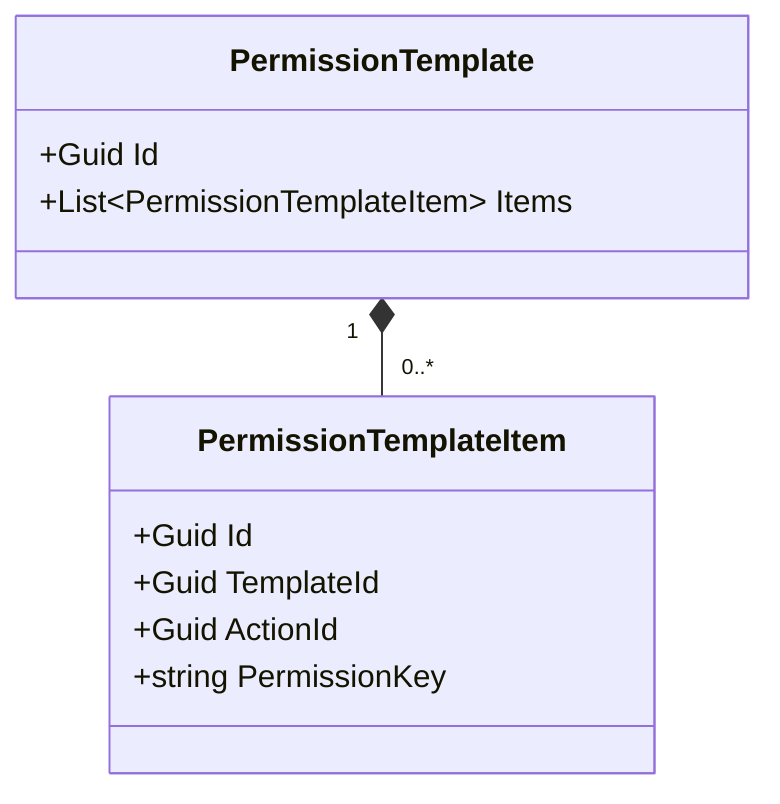
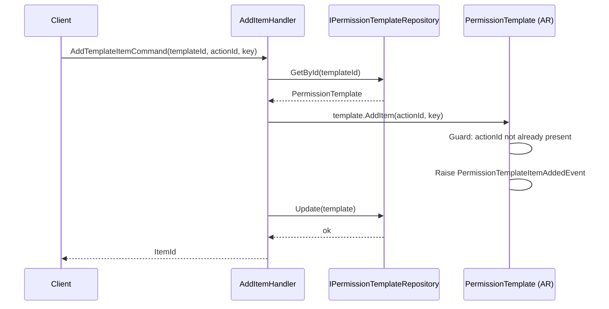
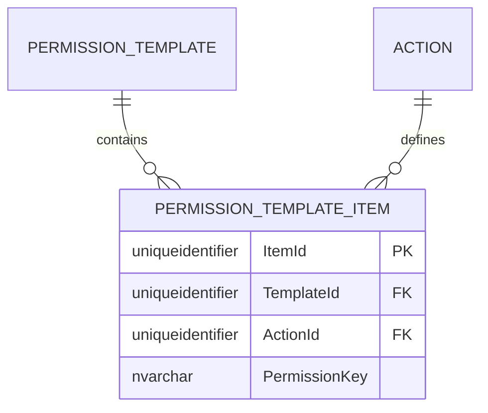

# PermissionTemplateItem — Owned Entity Architecture

**Bounded Context:** Authorization  
**Aggregate Root:** `PermissionTemplate` (PermissionTemplateItem is an owned entity within the PermissionTemplate aggregate)  
**Module:** `Ums.Domain.Authorization.PermissionTemplate.PermissionTemplateItem`  
**Status:** Production

---

## 1. Aggregate Overview

### Purpose
A `PermissionTemplateItem` represents a specific allowed operation mapping inside a reusable `PermissionTemplate`. It maps an external granular `Action` (referenced via `ActionId` and cache-optimized `PermissionKey`) to the template wrapper.

### Business Responsibility
- Bind concrete suite operations to standard templates.
- Act as mapping nodes during bulk profile initialization.

### Aggregate Root
`PermissionTemplate`. Managed strictly via the parent `PermissionTemplate` aggregate.

### Invariants and Consistency Rules
1. A Template cannot contain duplicate `ActionId` mappings.
2. The `PermissionKey` must match exactly the computed key inside the `Action` catalog at validation time.

### Related Entities / Value Objects
| Entity / VO | Type | Ownership |
|---|---|---|
| `TemplateId` | Value Object | FK reference to parent Template |
| `ActionId` | Value Object | FK reference to system Action |
| `PermissionKey` | Value Object | Copied cache key |

### Domain Events
Events are raised on the parent `PermissionTemplate` event manager:
- `PermissionTemplateItemAddedEvent`
- `PermissionTemplateItemRemovedEvent`

---

## 2. Domain Model

### Classes / Entities / Value Objects
```
PermissionTemplate (Aggregate Root)
└── PermissionTemplateItem (Owned Entity)
    └── Props: ItemProps
        ├── Id: IdValueObject
        ├── TemplateId: TemplateId
        ├── ActionId: Guid
        └── PermissionKey: string
```

---

## 3. Object Model Diagrams



---

## 4. Sequence Diagrams

### Add Item Flow


---

## 5. ER Model



### Tenant Isolation Rules
- Inherits isolation scope from parent `PermissionTemplate`.

---

## 6. Bounded Context Integration
- Maps dynamic `Action` ids.

---

## 7. Application Layer
- `AddTemplateItemCommand` -> Inputs: `TemplateId, ActionId, PermissionKey` -> Returns: `Guid`

---

## 8. Infrastructure/Persistence
- Saved as part of `PermissionTemplate` transaction boundary.
- Index: Unique index on `TemplateId, ActionId`.

---

## 9. Security & Compliance
- Scope matches administrative rules of parent `PermissionTemplate`.

---

## 10. Technical Decisions
- Duplicating the computed `PermissionKey` directly inside the table serves as a denormalized caching performance optimization for high-speed permission calculations.

---

**[Back to Authorization Index](./index.md)**
