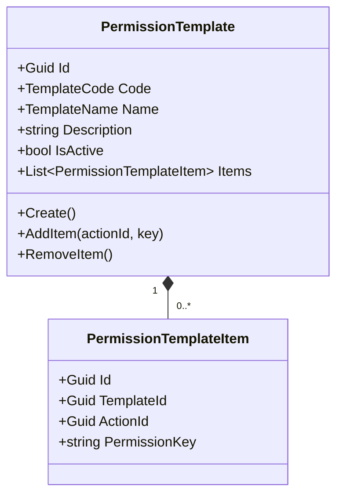
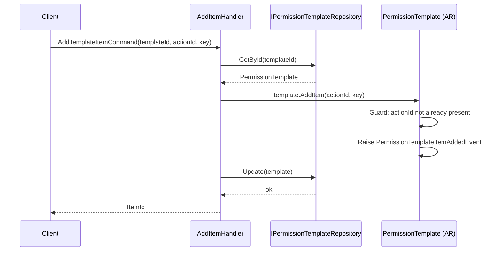
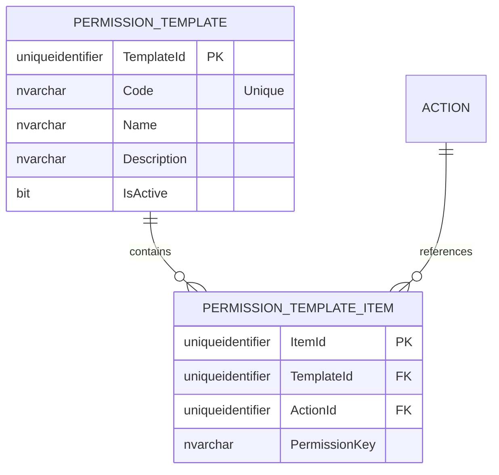

# PermissionTemplate — Aggregate Architecture

**Bounded Context:** Authorization  
**Aggregate Root:** `PermissionTemplate`  
**Module:** `Ums.Domain.Authorization.PermissionTemplate`  
**Status:** Production

---

## 1. Aggregate Overview

### Purpose
The `PermissionTemplate` aggregate defines reusable, standard packages of access rights (permissions) mapped to various system roles (e.g., "Standard Employee", "Branch Manager", "Tenant Financial Administrator"). It acts as a standardized blue-print that simplifies and automates dynamic profile (role) provisioning when new tenants are registered or new users are onboarded. It serves as the parent container for `PermissionTemplateItem` owned entities.

### Business Responsibility
- Author and maintain pre-packaged security templates.
- Link fine-grained suite Actions to a named template via `PermissionTemplateItem`.
- Facilitate consistent and reproducible security setups across tenants.
- Act as mapping nodes during bulk profile initialization.

### Aggregate Root
`PermissionTemplate` is the aggregate root. Child configuration details are managed inside the `PermissionTemplateItem` owned entity collection. Managed strictly via the parent `PermissionTemplate` aggregate.

### Invariants and Consistency Rules
1. **Template**: A Template `Code` must be unique across the system.
2. **Template**: A Template must contain at least one `PermissionTemplateItem` to be active.
3. **Template**: If an underlying `Action` in `SystemSuite` is deleted, the corresponding `PermissionTemplateItem` is automatically cascadingly pruned.
4. **Item**: A Template cannot contain duplicate `ActionId` mappings.
5. **Item**: The `PermissionKey` must match exactly the computed key inside the `Action` catalog at validation time.

### Related Entities / Value Objects
| Entity / VO | Type | Ownership | Description |
|---|---|---|---|
| `PermissionTemplateItem` | Entity | Owned | Specific allowed operation mapping inside a reusable template |
| `TemplateCode` | Value Object | - | Alpha-numeric template code |
| `TemplateName` | Value Object | - | Description and display label |
| `TemplateId` | Value Object | - | FK reference to parent Template |
| `ActionId` | Value Object | - | FK reference to system Action |
| `PermissionKey` | Value Object | - | Copied cache key |

### Domain Events
| Event | Trigger |
|---|---|
| `PermissionTemplateCreatedEvent` | New template created |
| `PermissionTemplateUpdatedEvent` | Template details updated |
| `PermissionTemplateDeletedEvent` | Template deleted |
| `PermissionTemplateItemAddedEvent` | Action mapped to template |
| `PermissionTemplateItemRemovedEvent` | Action removed from template |

---

## 2. Domain Model

### Classes / Entities / Value Objects
```
PermissionTemplate (Aggregate Root)
├── Props: PermissionTemplateProps
│   ├── Id: IdValueObject
│   ├── Code: TemplateCode
│   ├── Name: TemplateName
│   ├── Description: string
│   └── IsActive: bool
└── Children
    └── IReadOnlyList<PermissionTemplateItem>
        └── PermissionTemplateItem
            └── Props: ItemProps
                ├── Id: IdValueObject
                ├── TemplateId: TemplateId
                ├── ActionId: Guid
                └── PermissionKey: string
```

---

## 3. Object Model Diagrams



---

## 4. Sequence Diagrams

### Create Template & Add Item Flow


---

## 5. ER Model



### Tenant Isolation Rules
- Templates can be configured as **Global** (available platform-wide to all tenants) or **Tenant-Scoped** (available only to the tenant that authored them). Tenant-scoped tables include a nullable `TenantId` column. Inherits isolation scope from parent `PermissionTemplate`.

---

## 6. Bounded Context Integration
- Consumes `Action` metadata from `SystemSuite` aggregates.
- Maps dynamic `Action` ids.
- Downstream profiles consume these templates to seed default role permissions.

---

## 7. Application Layer
- `CreatePermissionTemplateCommand` -> Inputs: `Code, Name, Description` -> Returns: `Guid`
- `AddTemplateItemCommand` -> Inputs: `TemplateId, ActionId, PermissionKey` -> Returns: `Guid`

---

## 8. Infrastructure/Persistence
- Saved as part of `PermissionTemplate` transaction boundary.
- Index: Unique index on `Code` and index on `TenantId` for the template.
- Index: Unique index on `TemplateId, ActionId` for items.

---

## 9. Security & Compliance
- Editing global templates is restricted to `Platform:Admin`.
- Tenant-scoped template creation is restricted to `Tenant:Admin`.
- Scope matches administrative rules of parent `PermissionTemplate`.

---

## 10. Technical Decisions
- Standardizing seed templates prevents manual setting fatigue during new organization registration.
- Duplicating the computed `PermissionKey` directly inside the table serves as a denormalized caching performance optimization for high-speed permission calculations.

---

**[Back to Authorization Index](./index.md)**
