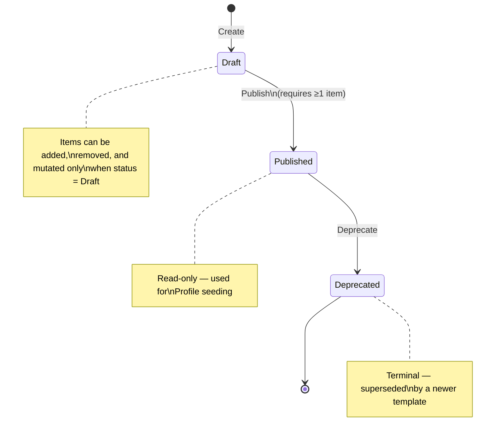
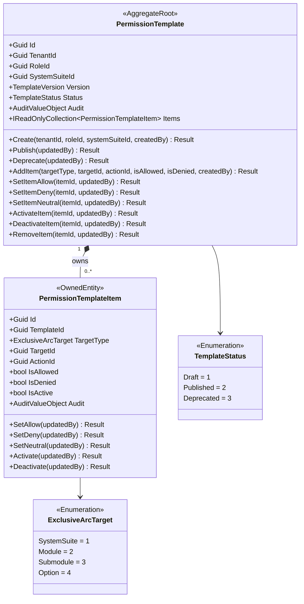
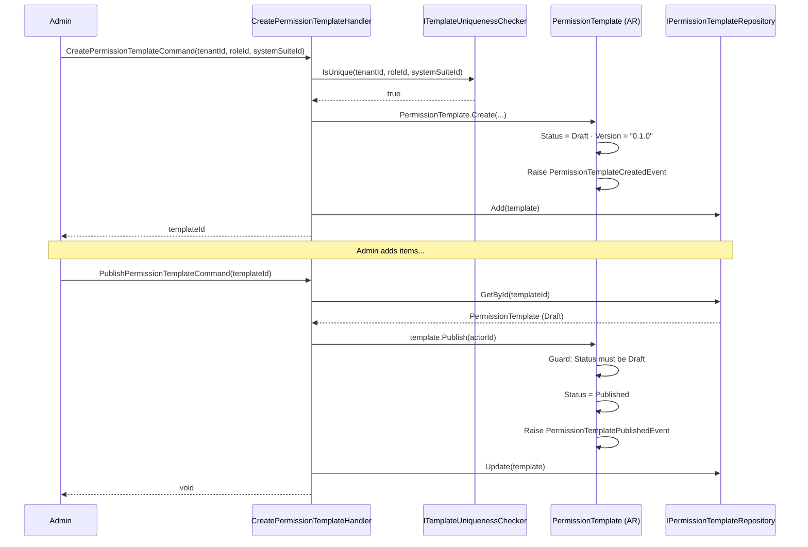
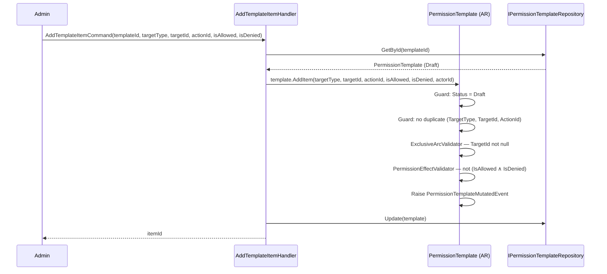
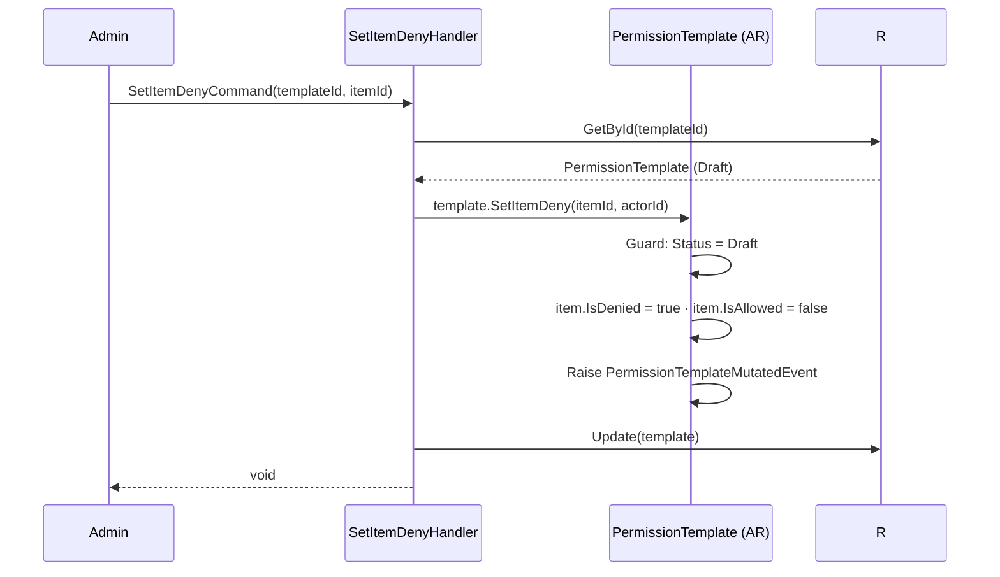
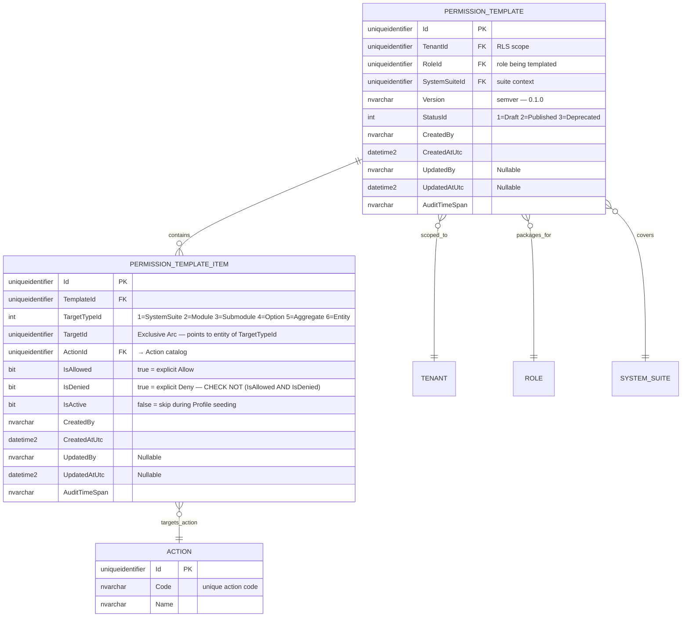
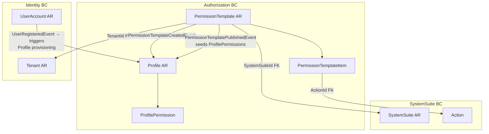

# PermissionTemplate — Aggregate Architecture

**Bounded Context:** Authorization  
**Aggregate Root:** `PermissionTemplate`  
**Module:** `Ums.Domain.Authorization.Template`  
**Status:** Production

---

## 1. Aggregate Overview

### Purpose

`PermissionTemplate` defines a reusable, versioned package of access rules for a specific Role within a SystemSuite. It acts as the authoritative blueprint for seeding `Profile` permissions when a new tenant is onboarded or a new role assignment is activated. Each item in the template targets a level of the SystemSuite hierarchy (suite → module → submodule → option) using an **Exclusive Arc** pattern, with a tri-state effect (`IsAllowed`, `IsDenied`, or neutral).

### Business Responsibility

- Create and version access-rule packages tied to a `(TenantId, RoleId, SystemSuiteId)` combination.
- Manage the template lifecycle: `Draft → Published → Deprecated`.
- Own a collection of `PermissionTemplateItem` entries, each targeting one hierarchy level of a SystemSuite with a specific permission effect.
- Enforce that items can only be added, mutated, or removed while the template is in `Draft` status.
- Provide the canonical rule set consumed by downstream `Profile` provisioning.

### Aggregate Root

`PermissionTemplate` is the sole aggregate root. `PermissionTemplateItem` is an owned child entity managed exclusively through the parent aggregate — never accessed or mutated directly.

### State Machine



### Invariants and Consistency Rules

| ID | Rule | Enforced by |
|---|---|---|
| INV-TPL1 | `(TenantId, RoleId, SystemSuiteId)` combination must be unique per active template | Repository uniqueness check |
| INV-TPL2 | Items can only be added, removed, or mutated when `Status = Draft` | `TemplateNotDraft` guard in every mutating method |
| INV-TPL3 | A `Published` template cannot be re-drafted; a new template must be created | `TemplateNotPublished` guard on `Deprecate` |
| INV-TPL4 | `(TargetType, TargetId, ActionId)` must be unique within a template — no duplicate item mappings | `TemplateItemTargetAlreadyExists` guard in `AddItem` |
| INV-TPL5 | An item cannot have `IsAllowed = true` AND `IsDenied = true` simultaneously | `PermissionEffectValidator` on every item |
| INV-TPL6 | `TargetId` must never be null — Exclusive Arc requires a concrete target reference | `ExclusiveArcValidator` on every item |

### Related Entities / Value Objects

| Entity / VO | Type | Ownership | Notes |
|---|---|---|---|
| `PermissionTemplateItem` | Entity | Owned | One entry per `(TargetType, TargetId, ActionId)` triplet |
| `TenantId` | Value Object | FK ref | Scopes the template to a tenant |
| `RoleId` | Value Object | FK ref | The role this template packages rules for |
| `SystemSuiteId` | Value Object | FK ref | The suite whose hierarchy the items reference |
| `TemplateVersion` | Value Object | — | Semver string (`"0.1.0"`) — starts at `Initial()` |
| `TemplateStatus` | Enumeration | — | `Draft(1) · Published(2) · Deprecated(3)` |
| `ExclusiveArcTarget` | Enumeration | — | `SystemSuite(1) · Module(2) · Submodule(3) · Option(4) · Aggregate(5) · Entity(6)` |
| `ActionId` | Value Object | FK ref | The specific action granted or denied |
| `AuditValueObject` | Value Object | — | `CreatedBy/At`, `UpdatedBy/At` on both AR and item |

### Domain Events

| Event | Trigger | Payload |
|---|---|---|
| `PermissionTemplateCreatedEvent` | Template drafted | `templateId, tenantId, roleId, systemSuiteId, version` |
| `PermissionTemplatePublishedEvent` | Template published | `templateId, version` |
| `PermissionTemplateMutatedEvent` | Item added, removed, or effect changed | `templateId, version` |
| `PermissionTemplateDeprecatedEvent` | Template deprecated | `templateId, version` |

> **Note:** A single `PermissionTemplateMutatedEvent` covers all item-level changes (add, remove, allow/deny/neutral toggle, activate/deactivate). Downstream consumers react to any mutation on the template version, not to individual item operations.

### Commands / Use Cases

| Command | Description | Pre-condition |
|---|---|---|
| `CreatePermissionTemplateCommand` | Draft a new template for `(tenantId, roleId, systemSuiteId)` | No active template for that triplet |
| `PublishPermissionTemplateCommand` | Transition `Draft → Published` | Status = Draft |
| `AddTemplateItemCommand` | Add an item `(targetType, targetId, actionId, isAllowed, isDenied)` | Status = Draft; no duplicate triplet |
| `SetItemAllowCommand` | Set `IsAllowed=true, IsDenied=false` | Status = Draft |
| `SetItemDenyCommand` | Set `IsAllowed=false, IsDenied=true` | Status = Draft |
| `SetItemNeutralCommand` | Set `IsAllowed=false, IsDenied=false` (inherit from parent scope) | Status = Draft |
| `ActivateItemCommand` | Set `IsActive=true` | Status = Draft |
| `DeactivateItemCommand` | Set `IsActive=false` | Status = Draft |
| `RemoveTemplateItemCommand` | Remove an item from the template | Status = Draft |
| `DeprecatePermissionTemplateCommand` | Transition `Published → Deprecated` | Status = Published |

### Repository / Service Boundaries

- `IPermissionTemplateRepository` — persists `PermissionTemplate` including owned items.
- `ITemplateUniquenessChecker` — validates INV-TPL1 before creation (no duplicate active template per triplet).

---

## 2. Object Model

```
PermissionTemplate (Aggregate Root)
├── Props: PermissionTemplateProps
│   ├── Id: IdValueObject
│   ├── TenantId: TenantId
│   ├── RoleId: RoleId
│   ├── SystemSuiteId: SystemSuiteId
│   ├── Version: TemplateVersion          -- semver, starts at "0.1.0"
│   ├── Status: TemplateStatus            -- Draft | Published | Deprecated
│   └── Audit: AuditValueObject
└── Children
    └── IReadOnlyCollection<PermissionTemplateItem>
        └── Props: PermissionTemplateItemProps
            ├── Id: IdValueObject
            ├── TemplateId: TemplateId
            ├── TargetType: ExclusiveArcTarget   -- SystemSuite | Module | Submodule | Option | Aggregate | Entity
            ├── TargetId: IdValueObject           -- FK to the target entity
            ├── ActionId: ActionId                -- FK to the action catalog
            ├── IsAllowed: bool                   -- tri-state: IsAllowed=true,IsDenied=false → Allow
            ├── IsDenied: bool                    -- tri-state: IsAllowed=false,IsDenied=true → Deny
            ├── IsActive: bool                    -- inactive items are skipped during provisioning
            └── Audit: AuditValueObject
```

### Main Attributes

| Attribute | Entity | Type | Notes |
|---|---|---|---|
| `Id` | PermissionTemplate | `Guid` | PK |
| `TenantId` | PermissionTemplate | `Guid` | FK — scopes template |
| `RoleId` | PermissionTemplate | `Guid` | FK — role being templated |
| `SystemSuiteId` | PermissionTemplate | `Guid` | FK — suite context |
| `Version` | PermissionTemplate | `string` | Semver `"major.minor.patch"` |
| `Status` | PermissionTemplate | `TemplateStatus` | `Draft(1)·Published(2)·Deprecated(3)` |
| `Id` | PermissionTemplateItem | `Guid` | PK |
| `TemplateId` | PermissionTemplateItem | `Guid` | FK → PermissionTemplate |
| `TargetType` | PermissionTemplateItem | `ExclusiveArcTarget` | `SystemSuite(1)·Module(2)·Submodule(3)·Option(4)·Aggregate(5)·Entity(6)` |
| `TargetId` | PermissionTemplateItem | `Guid` | FK to the target entity (arc target) |
| `ActionId` | PermissionTemplateItem | `Guid` | FK to Action catalog |
| `IsAllowed` | PermissionTemplateItem | `bool` | Explicit allow — mutually exclusive with `IsDenied` |
| `IsDenied` | PermissionTemplateItem | `bool` | Explicit deny — mutually exclusive with `IsAllowed` |
| `IsActive` | PermissionTemplateItem | `bool` | Inactive items skipped on profile seeding |

---

## 3. Class Diagram



---

## 4. Sequence Diagrams

### Create Template & Publish Flow



### Add Item Flow (Exclusive Arc)



### Permission Effect Override Flow



---

## 5. Entity / Relationship Model

> **Exclusive Arc:** `PERMISSION_TEMPLATE_ITEM.TargetId` is a polymorphic FK — it can reference a `SystemSuite`, `Module`, `Submodule`, `Option`, `Aggregate`, or `Entity` depending on `TargetTypeId`. This is the Exclusive Arc pattern: only one of the possible references is valid per row, identified by `TargetTypeId`. No SQL foreign-key constraint spans all targets; referential integrity is enforced at the application layer.



---

## 6. Bounded Context Model



---

## 7. API / Application Layer Contract

### Commands

| Command | Input | Output | Notes |
|---|---|---|---|
| `CreatePermissionTemplateCommand` | `tenantId, roleId, systemSuiteId` | `Guid templateId` | Starts at Draft · Version "0.1.0" |
| `PublishPermissionTemplateCommand` | `templateId` | `void` | Status must be Draft |
| `DeprecatePermissionTemplateCommand` | `templateId` | `void` | Status must be Published |
| `AddTemplateItemCommand` | `templateId, targetType, targetId, actionId, isAllowed, isDenied` | `Guid itemId` | Status must be Draft |
| `SetItemAllowCommand` | `templateId, itemId` | `void` | Status must be Draft |
| `SetItemDenyCommand` | `templateId, itemId` | `void` | Status must be Draft |
| `SetItemNeutralCommand` | `templateId, itemId` | `void` | Status must be Draft |
| `ActivateItemCommand` | `templateId, itemId` | `void` | Status must be Draft |
| `DeactivateItemCommand` | `templateId, itemId` | `void` | Status must be Draft |
| `RemoveTemplateItemCommand` | `templateId, itemId` | `void` | Status must be Draft |

### Queries

| Query | Returns |
|---|---|
| `GetAllPermissionTemplatesQuery` | `PagedResult<PermissionTemplateDto>` — filterable by `tenantId`, `status` |
| `GetPermissionTemplateByIdQuery` | `PermissionTemplateDetailDto` with items |
| `GetTemplatesByRoleQuery` | `List<PermissionTemplateSummaryDto>` |

### DTO Contract

```csharp
// Application layer read model
public sealed record PermissionTemplateDto(
    Guid TemplateId,
    Guid TenantId,
    Guid RoleId,
    Guid SystemSuiteId,
    string Version,
    string Status);
```

---

## 8. Persistence Notes

### Indexes

| Index | Columns | Type | Purpose |
|---|---|---|---|
| `UQ_PermissionTemplate_Tenant_Role_Suite` | `TenantId, RoleId, SystemSuiteId` | Unique (filtered `StatusId ≠ 3`) | INV-TPL1 — no duplicate active template |
| `IX_PermissionTemplate_TenantId` | `TenantId` | Non-unique | Tenant-scoped listing |
| `IX_PermissionTemplate_StatusId` | `StatusId` | Non-unique | Status filter |
| `UQ_PermissionTemplateItem_Target_Action` | `TemplateId, TargetTypeId, TargetId, ActionId` | Unique | INV-TPL4 — no duplicate item triplet |
| `IX_PermissionTemplateItem_TemplateId` | `TemplateId` | Non-unique | Load all items for a template |

### Transaction Boundary

`PermissionTemplate` and all its `PermissionTemplateItem` children are saved in a single `SaveChanges()` call. The `PermissionTemplatePublishedEvent` is dispatched via Transactional Outbox to trigger downstream Profile seeding.

### Security

| Operation | Required Role |
|---|---|
| Create / mutate / publish global template | `Platform:Admin` |
| Create / mutate / publish tenant-scoped template | `Tenant:Admin` |
| Deprecate any template | `Platform:Admin` |
| Read templates | `Tenant:Admin`, `Platform:Admin` |

---

**[← Authorization Index](./index.md)** | **[Domain Aggregate Index](../index.md)**
