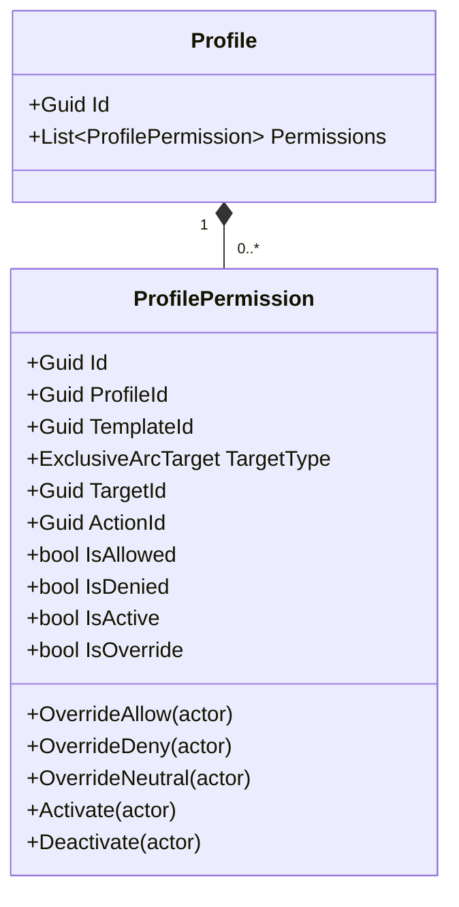
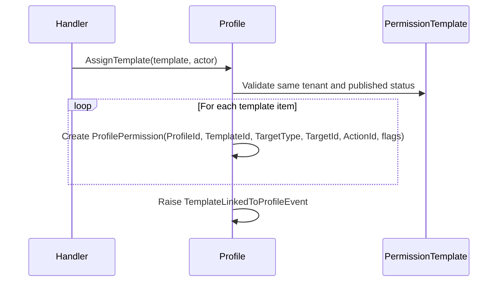
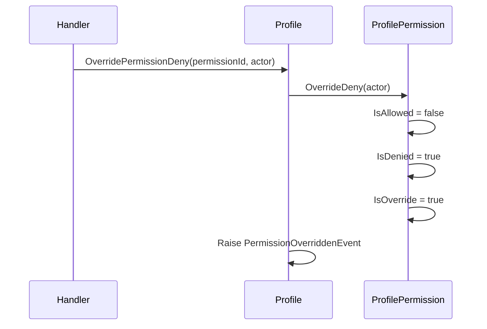
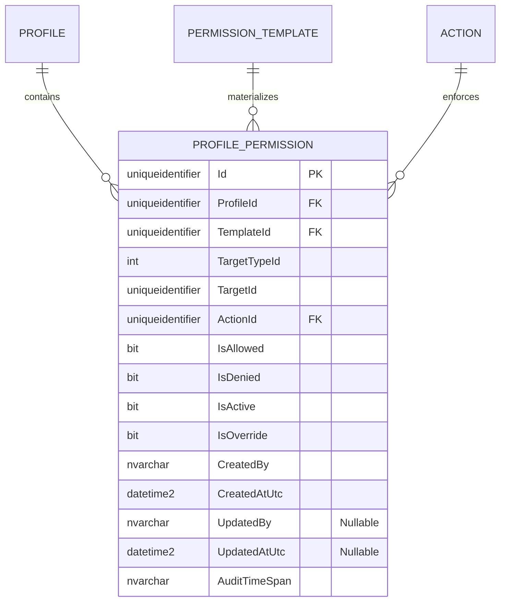

# ProfilePermission — Owned Entity Architecture

**Bounded Context:** Authorization  
**Aggregate Root:** `Profile` (`ProfilePermission` is an owned entity inside the `Profile` aggregate)
**Module:** `Ums.Domain.Authorization.Profile.ProfilePermission`  
**Status:** Production

---

## 1. Aggregate Overview

### Purpose
A `ProfilePermission` represents one effective permission item inside a `Profile`. It is materialized from a published `PermissionTemplate` item and can later be overridden at the profile level without changing the source template.

### Business Responsibility
- Preserve the effective permission outcome assigned to a user profile.
- Keep lineage to the originating template through `TemplateId`.
- Store the target resource level and concrete `ActionId`.
- Support operational overrides such as allow, deny, neutral, activate, and deactivate.

### Aggregate Root
`Profile`. Managed strictly through the parent aggregate.

### Invariants and Consistency Rules
1. Every `ProfilePermission` belongs to exactly one `Profile`.
2. Every `ProfilePermission` keeps lineage to a source `TemplateId`.
3. Override operations must mark `IsOverride = true`.
4. Effective permission semantics come from the combination of `IsAllowed`, `IsDenied`, `IsActive`, and `IsOverride`.

### Related Entities / Value Objects
| Entity / VO | Type | Ownership |
|---|---|---|
| `ProfileId` | Value Object | FK reference to parent `Profile` |
| `TemplateId` | Value Object | Source template lineage |
| `ExclusiveArcTarget` | Enumeration | Target level (`SystemSuite`, `Module`, `Submodule`, `Option`) |
| `TargetId` | Value Object | Concrete target inside the functional topology |
| `ActionId` | Value Object | Action to be enforced |

### Domain Events
Events are raised on the parent `Profile` aggregate:
- `TemplateLinkedToProfileEvent`
- `PermissionOverriddenEvent`

---

## 2. Domain Model

### Classes / Entities / Value Objects
```text
Profile (Aggregate Root)
└── ProfilePermission (Owned Entity)
    └── Props: ProfilePermissionProps
        ├── Id: IdValueObject
        ├── ProfileId: ProfileId
        ├── TemplateId: TemplateId
        ├── TargetType: ExclusiveArcTarget
        ├── TargetId: IdValueObject
        ├── ActionId: ActionId
        ├── IsAllowed: bool
        ├── IsDenied: bool
        ├── IsActive: bool
        ├── IsOverride: bool
        └── Audit: AuditValueObject
```

---

## 3. Object Model Diagrams



---

## 4. Sequence Diagrams

### Materialize Permissions From Template


### Override Effective Permission


---

## 5. ER Model



### Tenant Isolation Rules
- `ProfilePermission` inherits tenant ownership from its parent `Profile`.
- It does not carry its own `TenantId`; isolation flows through `ProfileId`.

---

## 6. Bounded Context Integration
- Consumes `TemplateId` from `PermissionTemplate`.
- Consumes `ActionId` and target topology from `SystemSuite`.
- Is consumed by downstream authorization graph compilation and runtime checks.

---

## 7. Application Layer
- There is no standalone aggregate command surface for `ProfilePermission`; all operations are routed through `Profile`.
- Follow-up API work still pending: expose template linkage and override operations through application handlers and endpoints.

---

## 8. Infrastructure/Persistence
- Saved inside the same transaction boundary as `Profile`.
- Current SQL Server table: `[ums_authorization].[ProfilePermissions]`
- Current indexes: `ProfileId`, `(ProfileId, TemplateId, ActionId, TargetId)`
- Audit metadata is persisted for every permission row.

---

## 9. Security & Compliance
- Profile-level overrides allow tightening access without mutating the authoritative template.
- Inactive permissions must be ignored by runtime access evaluators.
- `IsOverride` distinguishes manual adjustments from template-seeded permissions for audit and rebuild scenarios.

---

## 10. Technical Decisions
- `ProfilePermission` is a materialized effective-permission record, not just a raw action grant.
- `TargetTypeId` + `TargetId` implement the functional exclusive-arc pattern inherited from template items.
- Keeping `TemplateId` on each row preserves provenance and future recalculation options.

---

**[Back to Authorization Index](./index.md)**
