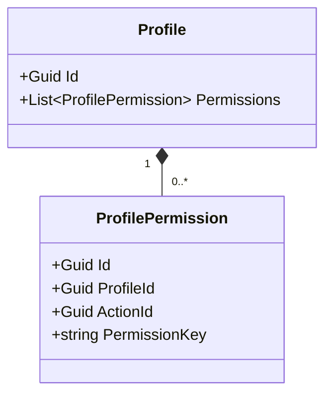
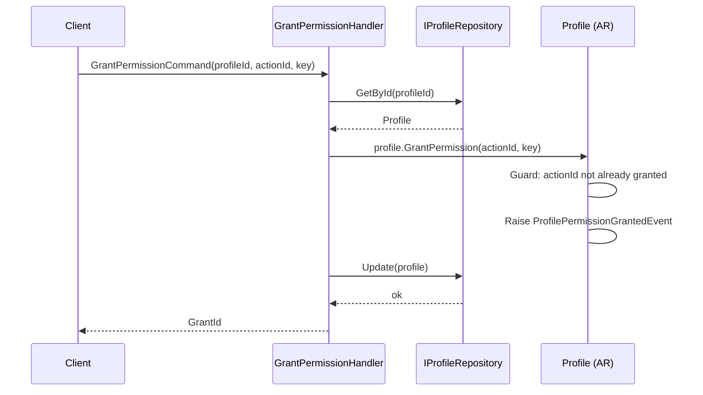
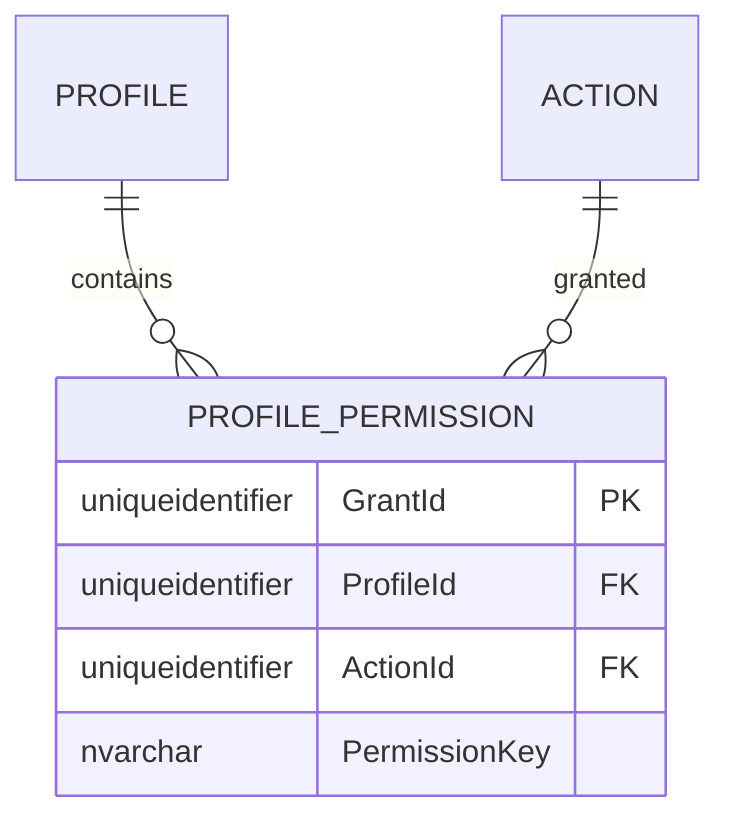

# ProfilePermission — Owned Entity Architecture

**Bounded Context:** Authorization  
**Aggregate Root:** `Profile` (ProfilePermission is an owned entity within the Profile aggregate)  
**Module:** `Ums.Domain.Authorization.Profile.ProfilePermission`  
**Status:** Production

---

## 1. Aggregate Overview

### Purpose
A `ProfilePermission` represents an individual granted permission (action) within a `Profile`. It binds a granular system `Action` (referenced via `ActionId` and cache-optimized `PermissionKey`) to the parent role.

### Business Responsibility
- Bind concrete suite operations to standard user profiles.
- Participate in high-speed session security checks.

### Aggregate Root
`Profile`. Managed strictly via the parent `Profile` aggregate root.

### Invariants and Consistency Rules
1. A Profile cannot contain duplicate `ActionId` mappings.
2. The `PermissionKey` must match exactly the computed key inside the `Action` catalog at assignment validation time.

### Related Entities / Value Objects
| Entity / VO | Type | Ownership |
|---|---|---|
| `ProfileId` | Value Object | FK reference to parent Profile |
| `ActionId` | Value Object | FK reference to system Action |
| `PermissionKey` | Value Object | Copied cache key |

### Domain Events
Events are raised on the parent `Profile` aggregate root domain event manager:
- `ProfilePermissionGrantedEvent`
- `ProfilePermissionRevokedEvent`

---

## 2. Domain Model

### Classes / Entities / Value Objects
```
Profile (Aggregate Root)
└── ProfilePermission (Owned Entity)
    └── Props: PermissionProps
        ├── Id: IdValueObject
        ├── ProfileId: ProfileId
        ├── ActionId: Guid
        └── PermissionKey: string
```

---

## 3. Object Model Diagrams



---

## 4. Sequence Diagrams

### Grant Permission Flow


---

## 5. ER Model



### Tenant Isolation Rules
- Inherits isolation scope from parent `Profile` (which is strictly tenant-partitioned unless global).

---

## 6. Bounded Context Integration
- Maps dynamic `Action` identifiers from `SystemSuite` aggregates.

---

## 7. Application Layer
- `GrantPermissionCommand` -> Inputs: `ProfileId, ActionId, PermissionKey` -> Returns: `Guid`

---

## 8. Infrastructure/Persistence
- Saved as part of `Profile` transaction boundary.
- Index: Unique index on `ProfileId, ActionId`.

---

## 9. Security & Compliance
- Operations require administrative credentials matching parent `Profile` rules.

---

## 10. Technical Decisions
- Denormalizing `PermissionKey` directly into `PROFILE_PERMISSION` enables immediate, high-performance security queries that skip database joins to SystemSuite schemas when computing active session permissions.

---

**[Back to Authorization Index](./index.md)**
