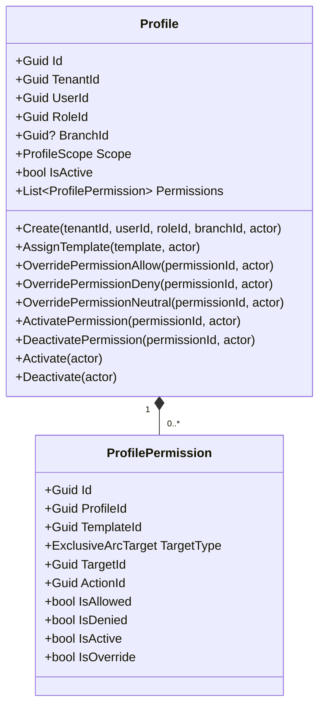
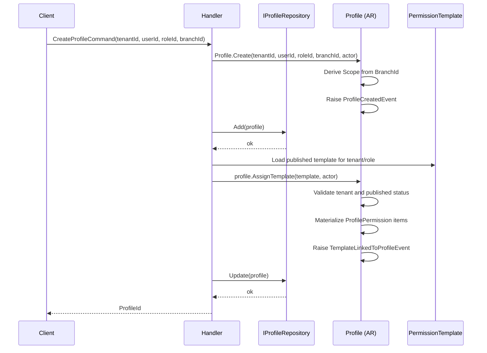
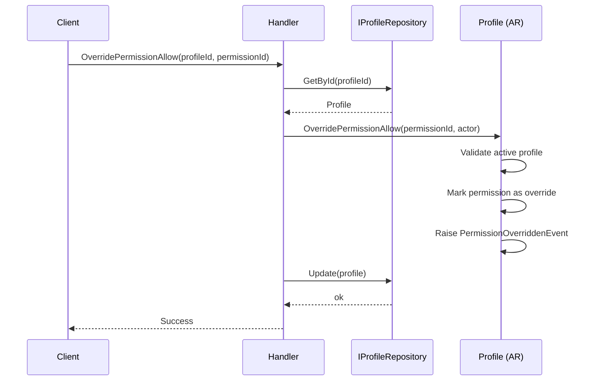
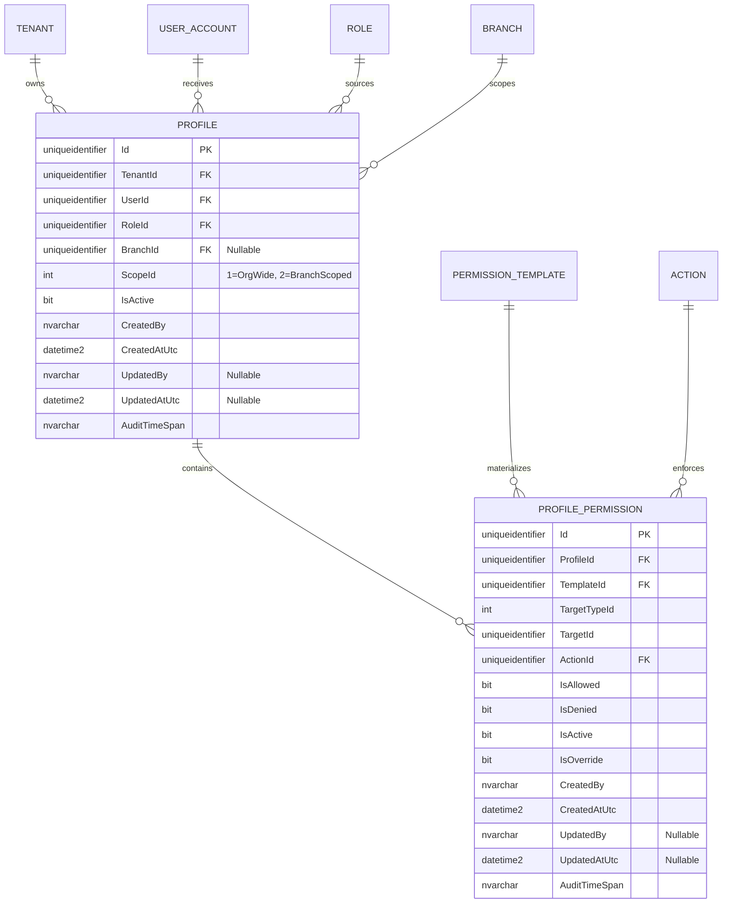

# Profile — Aggregate Architecture

**Bounded Context:** Authorization  
**Aggregate Root:** `Profile`  
**Module:** `Ums.Domain.Authorization.Profile`  
**Status:** Production

---

## 1. Aggregate Overview

### Purpose
The `Profile` aggregate represents an effective authorization assignment for a user inside a tenant. It binds a `UserId` to a `RoleId` and optionally to a `BranchId`, then materializes effective permissions from published `PermissionTemplate` definitions. It is the parent container for `ProfilePermission` owned entities and the operational source used by downstream access checks.

### Business Responsibility
- Represent the active authorization footprint of a user in a tenant.
- Enforce scope boundaries between organization-wide and branch-scoped access.
- Materialize published template items into effective `ProfilePermission` entries.
- Allow controlled per-permission overrides without mutating the source template.
- Control lifecycle state (`Active` / `Inactive`) for the whole profile.

### Aggregate Root
`Profile` is the aggregate root. Template linkage, permission overrides, permission activation/deactivation, and aggregate status changes must go through `Profile`.

### Invariants and Consistency Rules
1. `TenantId`, `UserId`, and `RoleId` are mandatory for every `Profile`.
2. `Scope` is derived from `BranchId`: no branch means `OrgWide`; a branch means `BranchScoped`.
3. A `Profile` can only link `PermissionTemplate` instances from the same tenant.
4. A `Profile` can only link templates that are already `Published`.
5. A `Profile` cannot link the same template twice.
6. Permission overrides and permission state changes are only valid while the parent `Profile` is active.
7. `ProfilePermission` identity is materialized per template item and keeps source lineage through `TemplateId`.

### Related Entities / Value Objects
| Entity / VO | Type | Ownership | Description |
|---|---|---|---|
| `ProfilePermission` | Entity | Owned | Effective permission materialized from a template item |
| `ProfileScope` | Enumeration | - | `OrgWide` or `BranchScoped` |
| `TenantId` | Value Object | - | Tenant ownership boundary |
| `UserId` | Value Object | - | User receiving the effective profile |
| `RoleId` | Value Object | - | Role source for template selection |
| `BranchId` | Value Object | - | Optional branch scoping |
| `TemplateId` | Value Object | - | Source template lineage for materialized permissions |

### Domain Events
| Event | Trigger |
|---|---|
| `ProfileCreatedEvent` | New profile created |
| `TemplateLinkedToProfileEvent` | Published template linked and materialized into permissions |
| `PermissionOverriddenEvent` | Allow / deny / neutral / activate / deactivate applied to a permission |
| `ProfileDeactivatedEvent` | Profile deactivated |
| `ProfileActivatedEvent` | Profile reactivated |

---

## 2. Domain Model

### Classes / Entities / Value Objects
```text
Profile (Aggregate Root)
├── Props: ProfileProps
│   ├── Id: IdValueObject
│   ├── TenantId: TenantId
│   ├── UserId: UserId
│   ├── RoleId: RoleId
│   ├── BranchId?: BranchId
│   ├── Scope: ProfileScope
│   ├── IsActive: bool
│   └── Audit: AuditValueObject
└── Children
    └── IReadOnlyCollection<ProfilePermission>
        └── Props: ProfilePermissionProps
            ├── Id: IdValueObject
            ├── ProfileId: ProfileId
            ├── TemplateId: TemplateId
            ├── TargetType: ExclusiveArcTarget
            ├── TargetId: IdValueObject
            ├── ActionId: ActionId
            ├── IsAllowed: bool
            ├── IsDenied: bool
            ├── IsActive: bool
            ├── IsOverride: bool
            └── Audit: AuditValueObject
```

---

## 3. Object Model Diagrams



---

## 4. Sequence Diagrams

### Create Profile & Assign Template Flow


### Permission Override Flow


---

## 5. ER Model



### Tenant Isolation Rules
- `Profile` is always tenant-owned in the current implementation; `TenantId` is required.
- Organization-wide behavior is modeled through `ScopeId = OrgWide`, not through a null `TenantId`.
- `PROFILE_PERMISSION` inherits isolation scope from its parent `Profile`.

---

## 6. Bounded Context Integration
- **Upstream**: Consumes `TenantId`, `UserId`, and `BranchId` from the Identity Bounded Context.
- Consumes `RoleId` and published `PermissionTemplate` definitions from the Authorization Context.
- Consumes `ActionId` and target topology from `SystemSuite`.
- Is consumed by Approvals, IGA, and runtime authorization evaluators.

---

## 7. Application Layer
- `CreateProfileCommand` -> Inputs: `TenantId, UserId, RoleId, BranchId?` -> Returns: `Guid`
- Follow-up API work still pending: template assignment and permission override commands are implemented in the domain but not fully exposed in endpoints yet.

---

## 8. Infrastructure/Persistence
- Saved as part of the `Profile` transaction boundary.
- Current SQL Server table: `[ums_authorization].[Profiles]`
- Current SQL Server child table: `[ums_authorization].[ProfilePermissions]`
- Current indexes for `Profile`: `TenantId`, `UserId`, `(TenantId, UserId, RoleId, BranchId)`
- Current indexes for `ProfilePermission`: `ProfileId`, `(ProfileId, TemplateId, ActionId, TargetId)`
- Audit metadata is persisted on both the aggregate root and the owned permissions.

---

## 9. Security & Compliance
- Profile mutation is a security-sensitive operation and updates aggregate audit metadata on every state change.
- Effective authorization can be tightened through per-permission deny or neutral overrides without changing the source template.
- Downstream access evaluators should treat inactive profiles and inactive permissions as non-effective.

---

## 10. Technical Decisions
- `Profile` is an effective authorization assignment, not a named catalog role.
- `Scope` is persisted as an enumeration identifier (`ScopeId`) and derived from `BranchId` at creation time.
- Effective permissions preserve lineage through `TemplateId`, allowing re-evaluation, auditing, and future rebuild workflows.
- Manual changes are expressed through `IsOverride` and state toggles in `ProfilePermission`, instead of mutating `PermissionTemplate`.

---

**[Back to Authorization Index](./index.md)**
