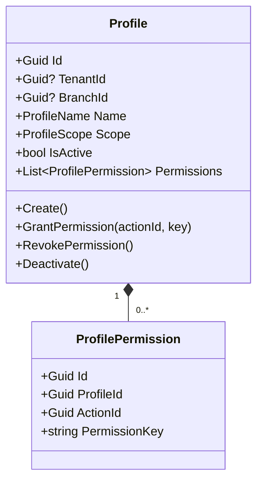
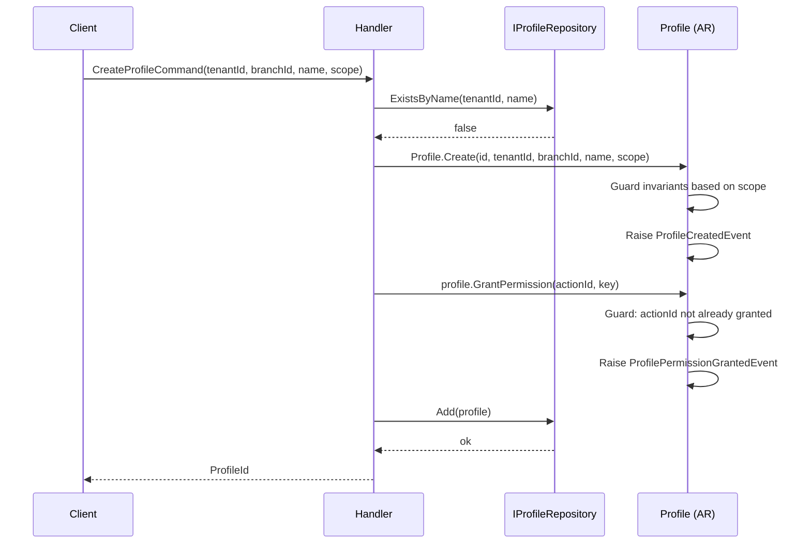
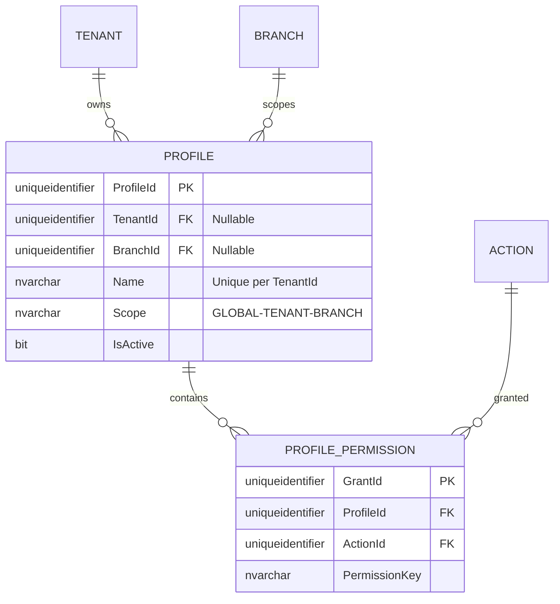

# Profile — Aggregate Architecture

**Bounded Context:** Authorization  
**Aggregate Root:** `Profile`  
**Module:** `Ums.Domain.Authorization.Profile`  
**Status:** Production

---

## 1. Aggregate Overview

### Purpose
The `Profile` aggregate represents a dynamic security role assigned to system users. It orchestrates permission grants by mapping suite operations (actions) to specific access scopes (GLOBAL, TENANT, or BRANCH). This determines what actions a user can execute and precisely which data slices (inquilinos/sucursales) they are allowed to see or modify. It serves as the parent container for `ProfilePermission` owned entities.

### Business Responsibility
- Act as the central authorization role mechanism.
- Enforce the boundaries of security scopes (Global vs. Tenant vs. Branch levels).
- Manage dynamic profile permissions through `ProfilePermission` child entities, binding concrete suite operations to standard user profiles.
- Control assignment rules and life cycles of roles.
- Participate in high-speed session security checks.

### Aggregate Root
`Profile` is the aggregate root. All permission adjustments, status transitions, or `ProfilePermission` modifications must go through `Profile` commands.

### Invariants and Consistency Rules
1. **Profile**: A Profile `Name` must be unique within its `TenantId` scope.
2. **Profile**: A profile marked with `Scope = GLOBAL` cannot have a `TenantId` or `BranchId` scoped constraint.
3. **Profile**: A profile marked with `Scope = TENANT` must have a valid `TenantId`.
4. **Profile**: A profile marked with `Scope = BRANCH` must have a valid `TenantId` and `BranchId`.
5. **Profile**: If the owning Tenant is suspended, all profiles scoped to that tenant are implicitly suspended (R-10).
6. **ProfilePermission**: A Profile cannot contain duplicate `ActionId` mappings.
7. **ProfilePermission**: The `PermissionKey` must match exactly the computed key inside the `Action` catalog at assignment validation time.

### Related Entities / Value Objects
| Entity / VO | Type | Ownership | Description |
|---|---|---|---|
| `ProfilePermission` | Entity | Owned | Individual granted permission (action) within a Profile |
| `ProfileScope` | Enum | - | GLOBAL · TENANT · BRANCH |
| `ProfileName` | Value Object | - | Alpha-numeric display role name |
| `ProfileId` | Value Object | - | FK reference to parent Profile |
| `ActionId` | Value Object | - | FK reference to system Action |
| `PermissionKey` | Value Object | - | Copied cache key |

### Domain Events
| Event | Trigger |
|---|---|
| `ProfileCreatedEvent` | New profile created |
| `ProfileScopeAdjustedEvent` | Profile scope modified |
| `ProfilePermissionGrantedEvent` | Permission mapped to profile |
| `ProfilePermissionRevokedEvent` | Permission removed from profile |
| `ProfileDeactivatedEvent` | Profile deactivated |

---

## 2. Domain Model

### Classes / Entities / Value Objects
```
Profile (Aggregate Root)
├── Props: ProfileProps
│   ├── Id: IdValueObject
│   ├── TenantId?: TenantId
│   ├── BranchId?: BranchId
│   ├── Name: ProfileName
│   ├── Scope: ProfileScope
│   ├── IsActive: bool
│   └── Audit: AuditValueObject
└── Children
    └── IReadOnlyList<ProfilePermission>
        └── ProfilePermission
            └── Props: PermissionProps
                ├── Id: IdValueObject
                ├── ProfileId: ProfileId
                ├── ActionId: Guid
                └── PermissionKey: string
```

---

## 3. Object Model Diagrams



---

## 4. Sequence Diagrams

### Create Profile & Grant Permission Flow


---

## 5. ER Model



### Tenant Isolation Rules
- Global profiles (`TenantId IS NULL`) are shared system-wide.
- Tenant and Branch scoped profiles are strictly partitioned by `TenantId`. All database queries scoped to tenant operations must apply tenant filtering.
- `PROFILE_PERMISSION` inherits isolation scope from parent `Profile`.

---

## 6. Bounded Context Integration
- **Upstream**: Consumes `TenantId` and `BranchId` from Identity Bounded Context.
- Consumes `ActionId` and dynamic `Action` identifiers from `SystemSuite` aggregates.
- Consumed by Approvals and IGA Contexts to validate session requests and promotion proposals.

---

## 7. Application Layer
- `CreateProfileCommand` -> Inputs: `TenantId?, BranchId?, Name, Scope` -> Returns: `Guid`
- `GrantPermissionCommand` -> Inputs: `ProfileId, ActionId, PermissionKey` -> Returns: `Guid`

---

## 8. Infrastructure/Persistence
- Saved as part of `Profile` transaction boundary.
- Index: Unique index on `TenantId, Name` for `Profile`.
- Index: Unique index on `ProfileId, ActionId` for `PROFILE_PERMISSION`.
- Transaction: Modifications to `Profile` and its `ProfilePermission` children are committed within a single EF Core unit-of-work transaction.

---

## 9. Security & Compliance
- Designing / creating Global profiles: Restriced to `Platform:Admin`.
- Tenant / Branch profile configuration: Restricted to `Tenant:Admin` (for their own tenant).
- Compliance: Profile modification is a security audit hot-spot. All changes trigger immediate audit trails and session invalidations. Operations on `PROFILE_PERMISSION` require matching credentials.

---

## 10. Technical Decisions
- Scope constraints (Global vs Tenant vs Branch) are evaluated inside the domain aggregate root logic rather than DB constraints to ensure architectural DDD layer purity.
- Denormalizing `PermissionKey` directly into `PROFILE_PERMISSION` enables immediate, high-performance security queries that skip database joins to SystemSuite schemas when computing active session permissions.

---

**[Back to Authorization Index](./index.md)**
