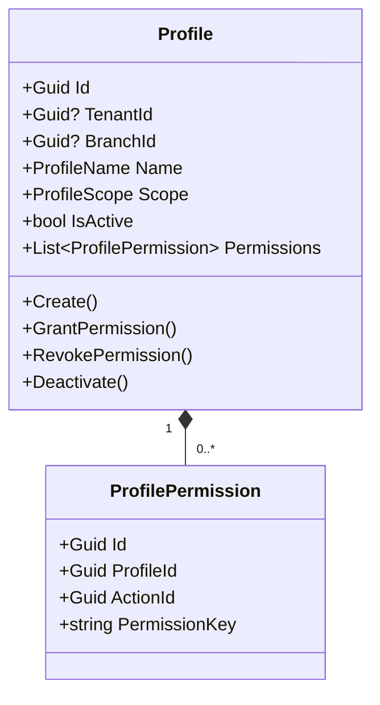
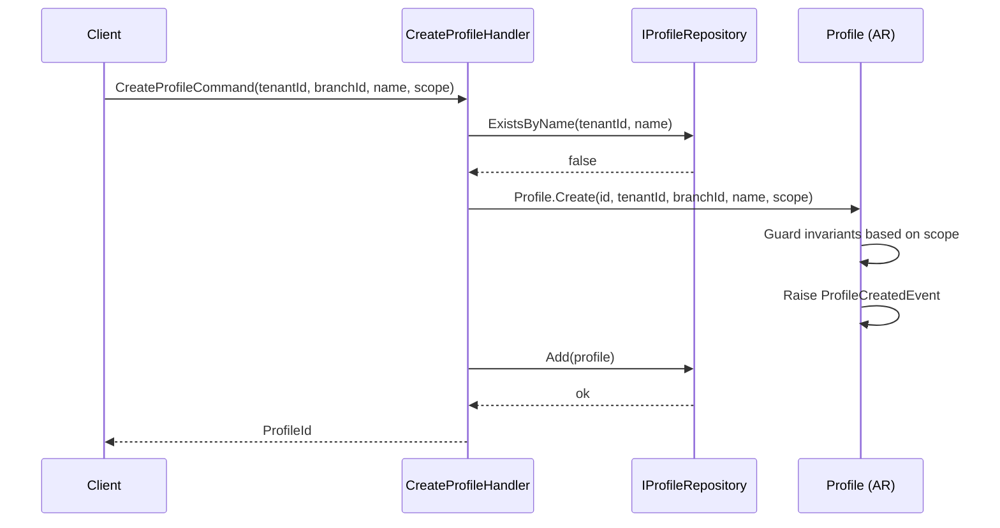
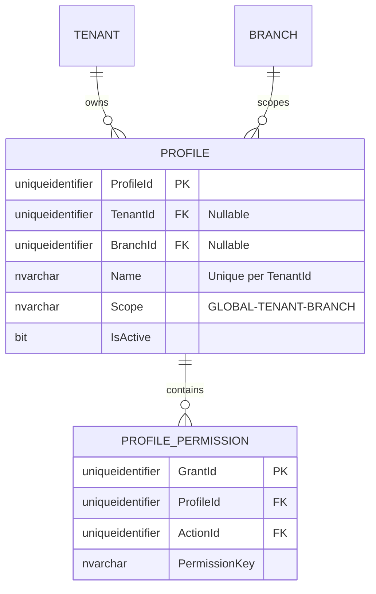

# Profile — Aggregate Architecture

**Bounded Context:** Authorization  
**Aggregate Root:** `Profile`  
**Module:** `Ums.Domain.Authorization.Profile`  
**Status:** Production

---

## 1. Aggregate Overview

### Purpose
The `Profile` aggregate represents a dynamic security role assigned to system users. It orchestrates permission grants by mapping suite operations (actions) to specific access scopes (GLOBAL, TENANT, or BRANCH). This determines what actions a user can execute and precisely which data slices (inquilinos/sucursales) they are allowed to see or modify.

### Business Responsibility
- Act as the central authorization role mechanism.
- Enforce the boundaries of security scopes (Global vs. Tenant vs. Branch levels).
- Manage dynamic profile permissions through `ProfilePermission` child entities.
- Control assignment rules and life cycles of roles.

### Aggregate Root
`Profile` is the aggregate root. All permission adjustments or status transitions must go through `Profile` commands.

### Invariants and Consistency Rules
1. A Profile `Name` must be unique within its `TenantId` scope.
2. A profile marked with `Scope = GLOBAL` cannot have a `TenantId` or `BranchId` scoped constraint.
3. A profile marked with `Scope = TENANT` must have a valid `TenantId`.
4. A profile marked with `Scope = BRANCH` must have a valid `TenantId` and `BranchId`.
5. If the owning Tenant is suspended, all profiles scoped to that tenant are implicitly suspended (R-10).

### Related Entities / Value Objects
| Entity / VO | Type | Ownership |
|---|---|---|
| `ProfilePermission` | Entity | Owned (see [profile-permission.md](./profile-permission.md)) |
| `ProfileScope` | Enum | GLOBAL · TENANT · BRANCH |
| `ProfileName` | Value Object | Alpha-numeric display role name |

### Domain Events
- `ProfileCreatedEvent`
- `ProfileScopeAdjustedEvent`
- `ProfilePermissionGrantedEvent`
- `ProfilePermissionRevokedEvent`
- `ProfileDeactivatedEvent`

---

## 2. Domain Model

### Classes / Entities / Value Objects
```
Profile (Aggregate Root)
├── Props: ProfileProps
│   ├── Id: IdValueObject
│   ├── TenantId?: TenantId
│   ├── BranchId?: BranchId
│   ├── Name: ProfileName
│   ├── Scope: ProfileScope
│   ├── IsActive: bool
│   └── Audit: AuditValueObject
└── Children
    └── IReadOnlyList<ProfilePermission>
```

---

## 3. Object Model Diagrams



---

## 4. Sequence Diagrams

### Create Profile Flow


---

## 5. ER Model



### Tenant Isolation Rules
- Global profiles (`TenantId IS NULL`) are shared system-wide.
- Tenant and Branch scoped profiles are strictly partitioned by `TenantId`. All database queries scoped to tenant operations must apply tenant filtering.

---

## 6. Bounded Context Integration
- **Upstream**: Consumes `TenantId` and `BranchId` from Identity Bounded Context.
- Consumes `ActionId` from SystemSuite aggregates.
- Consumed by Approvals and IGA Contexts to validate session requests and promotion proposals.

---

## 7. Application Layer
- `CreateProfileCommand` -> Inputs: `TenantId?, BranchId?, Name, Scope` -> Returns: `Guid`
- `GrantPermissionToProfileCommand` -> Inputs: `ProfileId, ActionId` -> Returns: `void`

---

## 8. Infrastructure/Persistence
- Index: Unique index on `TenantId, Name` (to ensure name uniqueness within tenant).
- Transaction: Modifications to `Profile` and its `ProfilePermission` children are committed within a single EF Core unit-of-work transaction.

---

## 9. Security & Compliance
- Designing / creating Global profiles: Restriced to `Platform:Admin`.
- Tenant / Branch profile configuration: Restricted to `Tenant:Admin` (for their own tenant).
- Compliance: Profile modification is a security audit hot-spot. All changes trigger immediate audit trails and session invalidations.

---

## 10. Technical Decisions
- Scope constraints (Global vs Tenant vs Branch) are evaluated inside the domain aggregate root logic rather than DB constraints to ensure architectural DDD layer purity.

---

**[Back to Authorization Index](./index.md)**
