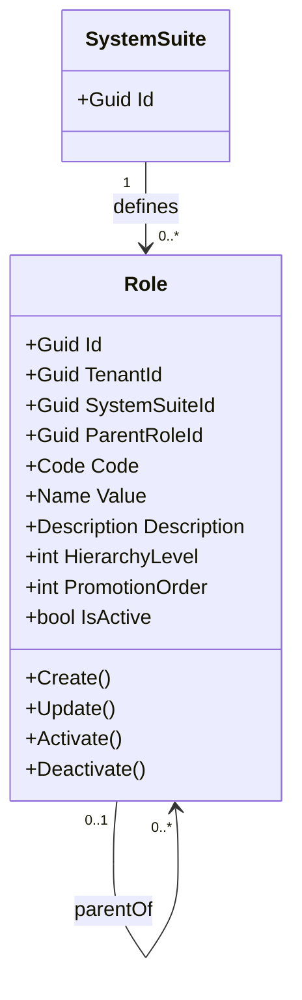

# Role - Aggregate Architecture

**Bounded Context:** Authorization  
**Aggregate Root:** `Role`  
**Module:** `Ums.Domain.Authorization.Role`  
**Status:** Production

## Purpose

`Role` is the tenant-scoped master catalog of responsibilities defined by a `SystemSuite`. It supplies the governed role identifier referenced by permission templates and profiles, while supporting an optional hierarchy for promotion and administration.

## Catalog Contract

| Field | Rule |
|---|---|
| `Code` | Required and unique within `SystemSuiteId`; stable machine code. |
| `Value` | Required display value used by administrators. |
| `Description` | Functional explanation maintained with the catalog item. |
| `ParentRoleId` | Optional role in the same system suite. |
| `HierarchyLevel` | Root is `0`; child is parent level plus one. |
| `PromotionOrder` | Non-negative order used by role governance flows. |
| `IsActive` | Lifecycle state; inactive records remain auditable. |

## Invariants

1. `TenantId` and `SystemSuiteId` are mandatory ownership boundaries.
2. A role code cannot be repeated in a system suite.
3. A parent role must belong to the same system suite.
4. Role parent relationships cannot form cycles.
5. Role operations return `Result` failures for business conditions; they do not use exceptions for flow control.

## Model

## Application Contract

- Commands: REST `POST /system-suites/{systemSuiteId}/roles`, `PUT /system-suites/{systemSuiteId}/roles/{roleId}`, and status endpoints.
- Query: GraphQL `rolesBySystemSuite(systemSuiteId)`.
- User interface: the `Roles` tab belongs to the selected System Suite detail panel.
- User-safe failures identify the corrective cause and expose `ErrorId` for support; stack traces and implementation details are logged only through Serilog/Loki.

## Persistence and Isolation

- SQL Server table: `[ums_authorization].[Roles]`.
- Application query filters constrain records by `TenantId`; SQL Server safeguards are secondary controls.
- FKs enforce suite ownership and optional self-parent linkage.

**[Back to Authorization Index](./index.md)**
