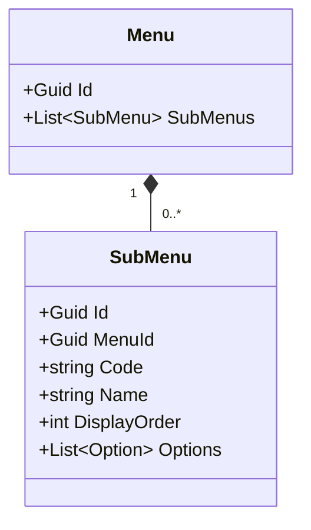
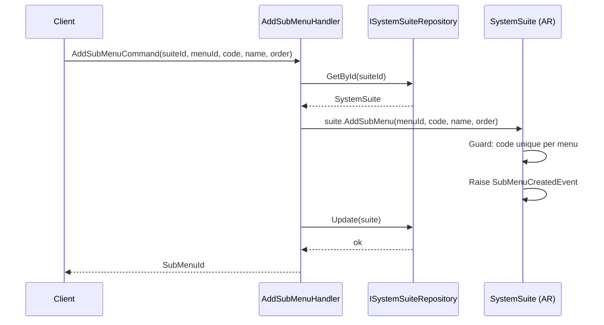
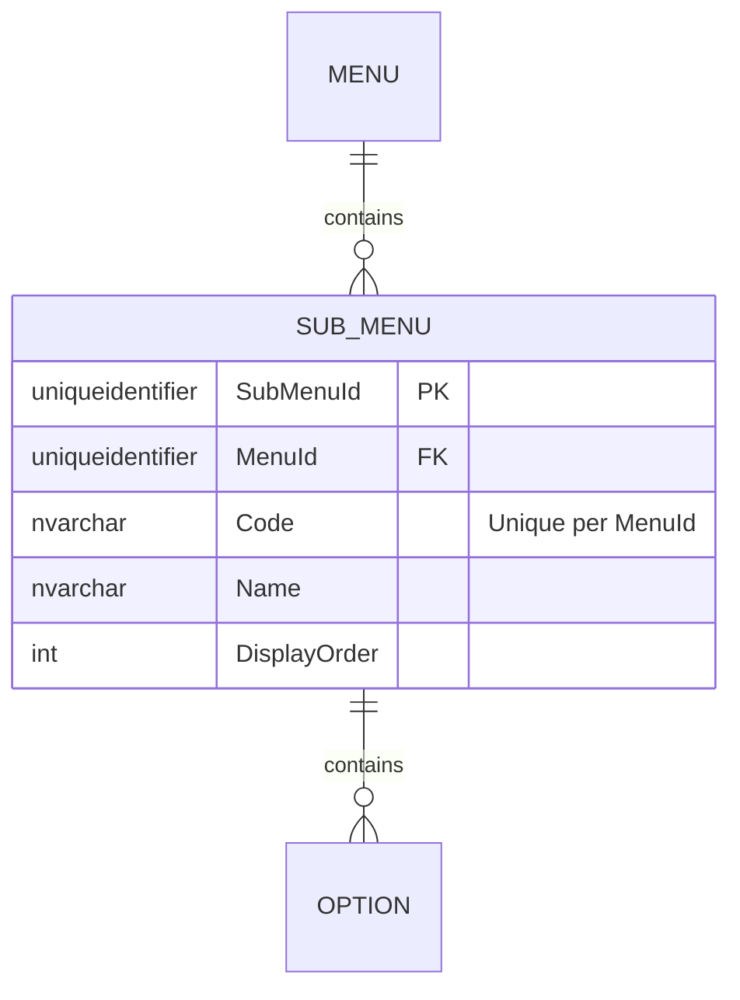

# SubMenu — Owned Entity Architecture

**Bounded Context:** Authorization  
**Aggregate Root:** `SystemSuite` (SubMenu is an owned entity within the SystemSuite aggregate structure)  
**Module:** `Ums.Domain.Authorization.SystemSuite.Module.Menu.SubMenu`  
**Status:** Production

---

## 1. Aggregate Overview

### Purpose
A `SubMenu` represents a logical subcategory or grouping of screen options within a navigational `Menu` (e.g., "User Activities" under "User Management"). It allows the layout structure of complex portal sites to be nested beautifully.

### Business Responsibility
- Structure and group screen Options.
- Provide collapsible section headings within menus.

### Aggregate Root
`SystemSuite` (via Menu). All mutations are managed through the `SystemSuite` aggregate root.

### Invariants and Consistency Rules
1. `Code` must be unique within the owning `Menu`.
2. A SubMenu cannot exist without its parent `Menu`.

### Related Entities / Value Objects
| Entity / VO | Type | Ownership |
|---|---|---|
| `MenuId` | Value Object | FK reference to parent Menu |
| `Code` | Value Object | SubMenu code identifier |
| `Name` | Value Object | Display label |
| `Option` | Entity | Owned (see [option.md](./option.md)) |

### Domain Events
Events are raised on the parent `SystemSuite` domain event manager:
- `SubMenuCreatedEvent`
- `SubMenuUpdatedEvent`
- `SubMenuRemovedEvent`

---

## 2. Domain Model

### Classes / Entities / Value Objects
```
SystemSuite (Aggregate Root)
└── Module (Owned Entity)
    └── Menu (Owned Entity)
        └── SubMenu (Owned Entity)
            ├── Props: SubMenuProps
            │   ├── Id: IdValueObject
            │   ├── MenuId: MenuId
            │   ├── Code: string
            │   ├── Name: string
            │   └── DisplayOrder: int
            └── Children
                └── IReadOnlyList<Option>
```

---

## 3. Object Model Diagrams



---

## 4. Sequence Diagrams

### Add SubMenu Flow


---

## 5. ER Model



### Tenant Isolation Rules
- Global configuration catalog. Free of RLS.

---

## 6. Bounded Context Integration
- Acts as layout metadata for downstream menu rendering.

---

## 7. Application Layer
- `AddSubMenuCommand` -> Inputs: `SuiteId, MenuId, Code, Name, DisplayOrder` -> Returns: `Guid`

---

## 8. Infrastructure/Persistence
- Index: Unique index on `MenuId, Code`.
- Transaction: Saved as part of `SystemSuite` aggregate SaveChanges context.

---

## 9. Security & Compliance
- Changes require `Platform:Admin` credentials.

---

## 10. Technical Decisions
- Maintaining clear hierarchy keys ensures that dynamic navigational grids map exactly to the domain's aggregate boundaries.

---

**[Back to Authorization Index](./index.md)**
