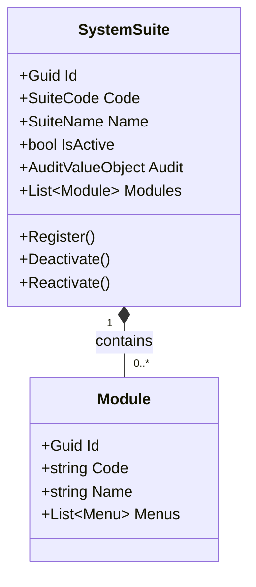
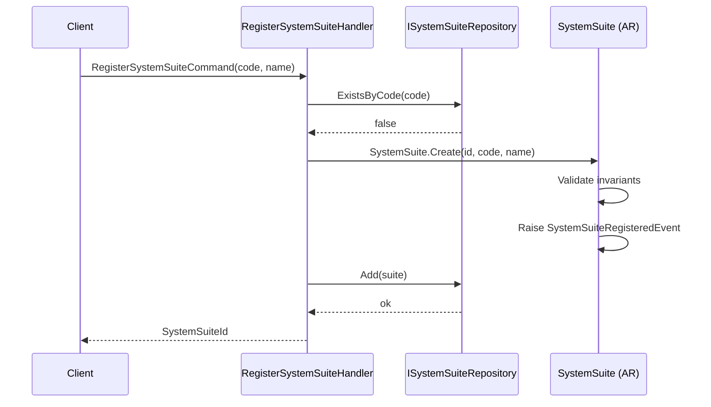
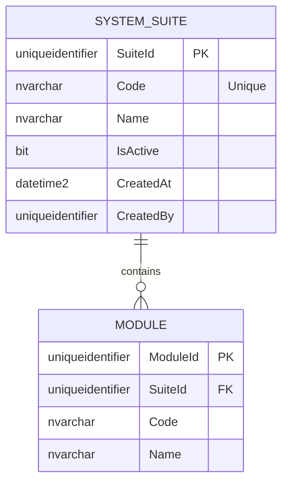
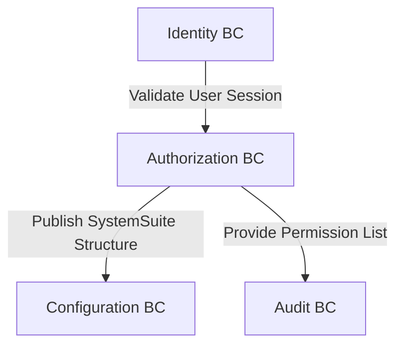

# SystemSuite — Aggregate Architecture

**Bounded Context:** Authorization  
**Aggregate Root:** `SystemSuite`  
**Module:** `Ums.Domain.Authorization.SystemSuite`  
**Status:** Production

---

## 1. Aggregate Overview

### Purpose
The `SystemSuite` aggregate represents the top-level software application suite registered on the UMS platform. It serves as the root container for defining the application's functional modules, hierarchical menus, screen options, and discrete operations (actions). It governs application registration, tenant availability scoping, and serves as the architectural source of truth for all security permissions.

### Business Responsibility
- Register platform applications (e.g., UMS Portal, Customer Support Suite).
- Manage the dynamic layout topology (Modules -> Menus -> SubMenus -> Options -> Actions).
- Control active/inactive application statuses across the system.
- Provide a unified system catalog from which permission templates and profiles can select operations.

### Aggregate Root
`SystemSuite` is the aggregate root. All structural updates to Modules, Menus, Options, and Actions are orchestrated through `SystemSuite` commands to ensure structural integrity.

### Invariants and Consistency Rules
1. A SystemSuite `Code` must be unique across the platform.
2. An application suite must be marked active for its children to be rendered or evaluated in permission checks.
3. Hierarchy is strictly linear: `SystemSuite (1:N) -> Module (1:N) -> Menu (1:N) -> SubMenu (1:N) -> Option (1:N) -> Action`.
4. Deactivation of a `SystemSuite` automatically deactivates all downstream permissions.

### Related Entities / Value Objects
| Entity / VO | Type | Ownership |
|---|---|---|
| `Module` | Entity | Owned (see [module.md](./module.md)) |
| `Menu` | Entity | Owned (see [menu.md](./menu.md)) |
| `SubMenu` | Entity | Owned (see [sub-menu.md](./sub-menu.md)) |
| `Option` | Entity | Owned (see [option.md](./option.md)) |
| `Action` | Entity | Owned (see [action.md](./action.md)) |
| `SuiteCode` | Value Object | Alpha-numeric identifier code |
| `SuiteName` | Value Object | UI display label |

### Domain Events
| Event | Trigger |
|---|---|
| `SystemSuiteRegisteredEvent` | New application registered on the platform |
| `SystemSuiteDeactivatedEvent` | Application suite deactivated |
| `SystemSuiteReactivatedEvent` | Application suite reactivated |
| `SystemSuiteStructureUpdatedEvent` | Hierarchy structure modified |

### Commands / Use Cases
| Command | Description |
|---|---|
| `RegisterSystemSuiteCommand` | Register a new application suite |
| `DeactivateSystemSuiteCommand` | Deactivate an application suite |
| `ReactivateSystemSuiteCommand` | Reactivate a deactivated application suite |
| `ImportSuiteTopologyCommand` | Seed or overwrite the functional hierarchy |

### Repository / Service Boundaries
- `ISystemSuiteRepository` — Persists the entire `SystemSuite` aggregate structure in a single transaction.
- No direct repositories for child entities like Module or Menu.

---

## 2. Domain Model

### Classes / Entities / Value Objects
```
SystemSuite (Aggregate Root)
├── Props: SystemSuiteProps
│   ├── Id: IdValueObject
│   ├── Code: SuiteCode
│   ├── Name: SuiteName
│   ├── IsActive: bool
│   └── Audit: AuditValueObject
└── Children
    └── IReadOnlyList<Module>
```

### Main Attributes
| Attribute | Type | Notes |
|---|---|---|
| `Id` | `Guid` | PK |
| `Code` | `string` | Unique identifier |
| `Name` | `string` | Human-readable name |
| `IsActive` | `bool` | Status flag |

### Lifecycle / Status Fields
```
Active (IsActive = true) ◄──► Inactive (IsActive = false)
```

### Validation Rules
- `Code`: Required, unique, uppercase, alphanumeric + underscores, max 50 chars.
- `Name`: Required, max 100 chars.

---

## 3. Object Model Diagrams



---

## 4. Sequence Diagrams

### Create Flow


---

## 5. ER Model



### Tenant Isolation Rules
- `SYSTEM_SUITE` and its structural children are global platform-wide catalogs. They are NOT tenant-isolated because they define the universal capabilities of the software platform. Downstream assignments (like Profiles) are tenant-isolated using the standard `TenantId` field.

---

## 6. Bounded Context Integration



- **Upstream**: None.
- **Downstream**: Configuration, Approvals, Audit.

---

## 7. Application Layer

### Commands & Queries
- `RegisterSystemSuiteCommand` -> Input: `Code, Name, ActorId` -> Returns: `Guid`
- `GetSystemSuiteByIdQuery` -> Input: `SuiteId` -> Returns: `SuiteDetailDto`
- `ListSystemSuitesQuery` -> Returns: `List<SuiteSummaryDto>`

---

## 8. Infrastructure/Persistence

### Repository Contract
```csharp
public interface ISystemSuiteRepository {
    Task<SystemSuite?> GetByIdAsync(Guid id);
    Task<bool> ExistsByCodeAsync(string code);
    Task AddAsync(SystemSuite suite);
    Task UpdateAsync(SystemSuite suite);
}
```

### Indexes & Transaction Boundary
- Index: Unique index on `Code`.
- Transaction: The entire hierarchy (Modules, Menus, Options, Actions) is persisted inside a single SQL transaction.

---

## 9. Security & Compliance

### Authorization Rules
- Register / Edit / Deactivate: Restricted exclusively to `Platform:Admin` roles.

### Sensitive Data & Audit
- This aggregate contains no sensitive user data.
- State changes (Registration, Deactivation) produce audited entries in the central logs.

---

## 10. Technical Decisions

### Boundary Justification
A Modular Monolith requires a clean registry of its own structure. Consolidating the dynamic structure (Modules, Menus, Options, Actions) under `SystemSuite` allows dynamic menu loading and authorization validation without hardcoded route arrays in the frontend or API gateway.

---

**[Back to Authorization Index](./index.md)**
