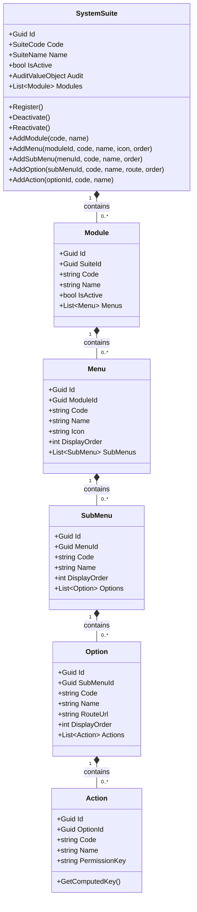
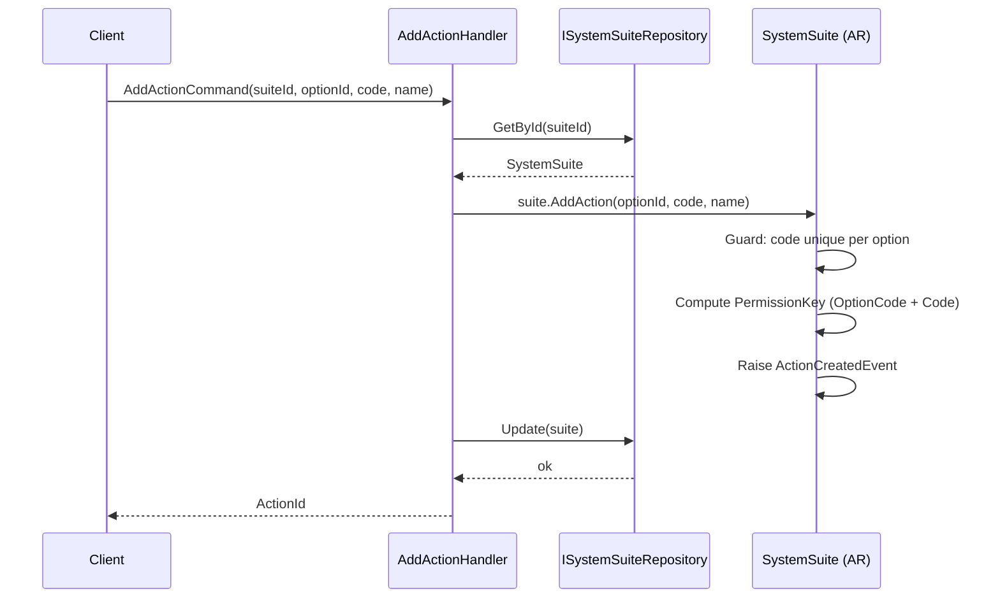
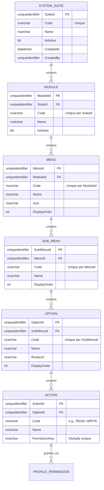
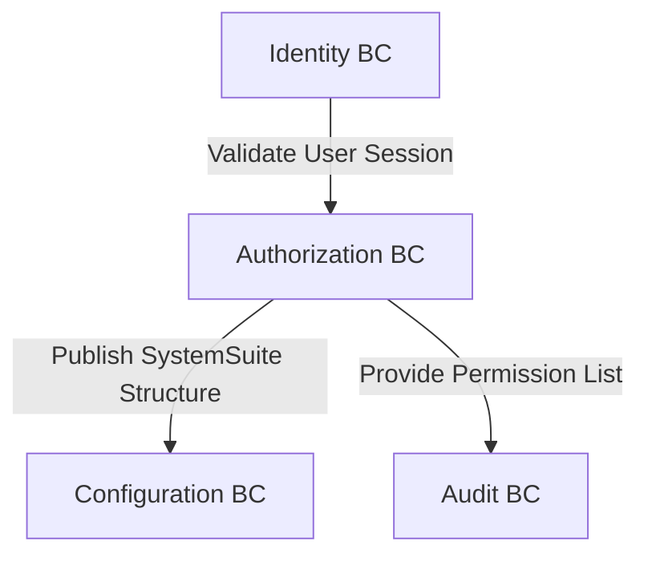

# SystemSuite — Aggregate Architecture

**Bounded Context:** Authorization  
**Aggregate Root:** `SystemSuite`  
**Module:** `Ums.Domain.Authorization.SystemSuite`  
**Status:** Production

---

## 1. Aggregate Overview

### Purpose
The `SystemSuite` aggregate represents the top-level software application suite registered on the UMS platform. It serves as the root container for defining the application's functional modules, hierarchical menus, screen options, and discrete operations (actions). It governs application registration, tenant availability scoping, and serves as the architectural source of truth for all security permissions.
It acts as the single entry point and Aggregate Root for its owned entities: `Module`, `Menu`, `SubMenu`, `Option`, and `Action`.

### Business Responsibility
- Register platform applications (e.g., UMS Portal, Customer Support Suite).
- Manage the dynamic layout topology (Modules -> Menus -> SubMenus -> Options -> Actions) from a single administrative boundary.
- Control active/inactive application statuses across the system.
- Provide a unified system catalog from which permission templates and profiles can select operations.
- Enforce discrete operation control on application options via fine-grained Actions.

### Aggregate Root
`SystemSuite` is the aggregate root. All structural updates to Modules, Menus, SubMenus, Options, and Actions are orchestrated through `SystemSuite` commands to ensure structural integrity and proper emission of domain events.

### Invariants and Consistency Rules
1. **SystemSuite**: A SystemSuite `Code` must be unique across the platform. An application suite must be marked active for its children to be rendered or evaluated in permission checks.
2. **Hierarchy Strictness**: Hierarchy is strictly linear: `SystemSuite (1:N) -> Module (1:N) -> Menu (1:N) -> SubMenu (1:N) -> Option (1:N) -> Action (1:N)`.
3. **Deactivation Cascade**: Deactivation of a `SystemSuite` automatically deactivates all downstream permissions. If parent containers are inactive, children (like Options) are automatically inaccessible.
4. **Module**: `Code` must be unique within the parent `SystemSuite`.
5. **Menu**: `Code` must be unique within the owning `Module`. Render status depends on parent activation states.
6. **SubMenu**: `Code` must be unique within the owning `Menu`.
7. **Option**: `Code` must be unique within the parent `SubMenu`. `RouteUrl` must follow valid URI relative patterns.
8. **Action**: `Code` must be unique within the owning `Option`. The combination of Option Code + Action Code produces a globally unique permission key `Suite:Module:Option:Action`.

### Related Entities / Value Objects
| Entity / VO | Type | Ownership | Description |
|---|---|---|---|
| `Module` | Entity | Owned | Functional subsystem / logical area |
| `Menu` | Entity | Owned | Graphical menu layout item |
| `SubMenu` | Entity | Owned | Logical subcategory within a Menu |
| `Option` | Entity | Owned | Actionable option mapping to a specific route/screen |
| `Action` | Entity | Owned | Granular execution token (e.g., READ, WRITE) |
| `SuiteCode` | Value Object | - | Alpha-numeric identifier code |
| `SuiteName` | Value Object | - | UI display label |
| `PermissionKey`| Value Object | - | Computed unique string (e.g., UMS:IDENTITY:TENANT:WRITE) |

### Domain Events
| Event | Trigger |
|---|---|
| `SystemSuiteRegisteredEvent` | New application registered on the platform |
| `SystemSuiteDeactivatedEvent` | Application suite deactivated |
| `SystemSuiteReactivatedEvent` | Application suite reactivated |
| `SystemSuiteStructureUpdatedEvent` | Hierarchy structure modified broadly |
| `ModuleCreatedEvent` / `Updated` / `Removed` | Module mutations |
| `MenuCreatedEvent` / `Updated` / `Removed` | Menu mutations |
| `SubMenuCreatedEvent` / `Updated` / `Removed`| SubMenu mutations |
| `OptionCreatedEvent` / `Updated` / `Removed` | Option mutations |
| `ActionCreatedEvent` / `Updated` / `Removed` | Action mutations |

---

## 2. Domain Model

### Classes / Entities / Value Objects
```
SystemSuite (Aggregate Root)
├── Props: SystemSuiteProps
│   ├── Id: IdValueObject
│   ├── Code: SuiteCode
│   ├── Name: SuiteName
│   ├── IsActive: bool
│   └── Audit: AuditValueObject
└── Children
    └── IReadOnlyList<Module>
        └── Module
            ├── Props: ModuleProps (Id, SuiteId, Code, Name, IsActive)
            └── Children
                └── IReadOnlyList<Menu>
                    └── Menu
                        ├── Props: MenuProps (Id, ModuleId, Code, Name, Icon, DisplayOrder)
                        └── Children
                            └── IReadOnlyList<SubMenu>
                                └── SubMenu
                                    ├── Props: SubMenuProps (Id, MenuId, Code, Name, DisplayOrder)
                                    └── Children
                                        └── IReadOnlyList<Option>
                                            └── Option
                                                ├── Props: OptionProps (Id, SubMenuId, Code, Name, RouteUrl, DisplayOrder)
                                                └── Children
                                                    └── IReadOnlyList<Action>
                                                        └── Action
                                                            └── Props: ActionProps (Id, OptionId, Code, Name, PermissionKey)
```

### Main Attributes & Lifecycle
- **SystemSuite**: `Id` (Guid, PK), `Code` (Unique), `Name`, `IsActive`
- **Module**: `Id` (Guid, PK), `SuiteId` (FK), `Code` (Unique per SuiteId), `Name`, `IsActive`
- **Menu**: `Id` (Guid, PK), `ModuleId` (FK), `Code` (Unique per ModuleId), `Name`, `Icon`, `DisplayOrder`
- **SubMenu**: `Id` (Guid, PK), `MenuId` (FK), `Code` (Unique per MenuId), `Name`, `DisplayOrder`
- **Option**: `Id` (Guid, PK), `SubMenuId` (FK), `Code` (Unique per SubMenuId), `Name`, `RouteUrl`, `DisplayOrder`
- **Action**: `Id` (Guid, PK), `OptionId` (FK), `Code` (Unique per OptionId), `Name`, `PermissionKey` (Globally unique)

### Lifecycle / Status Fields
```
Active (IsActive = true) ◄──► Inactive (IsActive = false)
```

---

## 3. Object Model Diagrams



---

## 4. Sequence Diagrams

### Create Hierarchy Flow

*(All structural additions follow the same pattern: load the Aggregate Root, invoke the specific Add command, validate rules centrally, raise event, and persist the AR.)*

---

## 5. ER Model



### Tenant Isolation Rules
- `SYSTEM_SUITE` and its structural children (`MODULE`, `MENU`, `SUB_MENU`, `OPTION`, `ACTION`) are global platform-wide configuration catalogs. They are NOT tenant-isolated because they define the universal capabilities of the software platform. Free of RLS. Downstream assignments (like Profiles) are tenant-isolated using the standard `TenantId` field.

---

## 6. Bounded Context Integration



- **Upstream**: None.
- **Downstream**: Configuration, Approvals, Audit.
- Used by Authorization middleware to intercept UI routes. `PermissionKey` is consumed directly by API Gateways. Acts as downstream catalog mapping for UI menus.

---

## 7. Application Layer

### Commands & Queries
- `RegisterSystemSuiteCommand` -> Input: `Code, Name, ActorId` -> Returns: `Guid`
- `GetSystemSuiteByIdQuery` -> Input: `SuiteId` -> Returns: `SuiteDetailDto`
- `ListSystemSuitesQuery` -> Returns: `List<SuiteSummaryDto>`
- `AddModuleCommand` -> Inputs: `SuiteId, Code, Name` -> Returns: `Guid`
- `AddMenuCommand` -> Inputs: `SuiteId, ModuleId, Code, Name, Icon, DisplayOrder` -> Returns: `Guid`
- `AddSubMenuCommand` -> Inputs: `SuiteId, MenuId, Code, Name, DisplayOrder` -> Returns: `Guid`
- `AddOptionCommand` -> Inputs: `SuiteId, SubMenuId, Code, Name, RouteUrl, DisplayOrder` -> Returns: `Guid`
- `AddActionCommand` -> Inputs: `SuiteId, OptionId, Code, Name` -> Returns: `Guid`

---

## 8. Infrastructure/Persistence

### Repository Contract
```csharp
public interface ISystemSuiteRepository {
    Task<SystemSuite?> GetByIdAsync(Guid id);
    Task<bool> ExistsByCodeAsync(string code);
    Task AddAsync(SystemSuite suite);
    Task UpdateAsync(SystemSuite suite);
}
```

### Indexes & Transaction Boundary
- Index: Unique index on `Code` for `SYSTEM_SUITE`. Unique indexes on `(ParentId, Code)` for each child level. Globally unique index on `PermissionKey`.
- Transaction: The entire hierarchy (Modules, Menus, SubMenus, Options, Actions) is persisted inside a single SQL transaction upon aggregate save.

---

## 9. Security & Compliance

### Authorization Rules
- Register / Edit / Deactivate / Add Modules / Menus / Actions: Restricted exclusively to `Platform:Admin` roles.

### Sensitive Data & Audit
- This aggregate contains no sensitive user data.
- State changes (Registration, Deactivation, Structure mutation) produce audited entries in the central logs.
- Compliance: Any permission change (such as adding/modifying an Action) must instantly invalidate cached session profiles for authorized sessions.

---

## 10. Technical Decisions

### Boundary Justification
A Modular Monolith requires a clean registry of its own structure. Consolidating the dynamic structure (Modules, Menus, Options, Actions) under `SystemSuite` allows dynamic menu loading and authorization validation without hardcoded route arrays in the frontend or API gateway.
- Storing `Icon` as metadata avoids external dependencies on specific asset libraries.
- Standardizing the `RouteUrl` within the domain allows multi-platform clients (Web, Mobile) to map their menus dynamically using standard REST queries.
- The `PermissionKey` generator strictly sanitizes input characters and capitalizes strings, preventing configuration mistakes from compromising the security barrier.

---

**[Back to Authorization Index](./index.md)**
