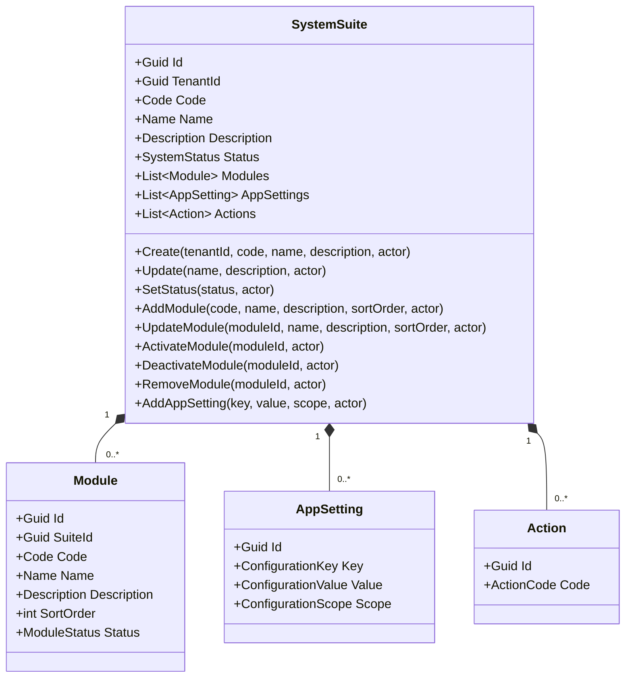
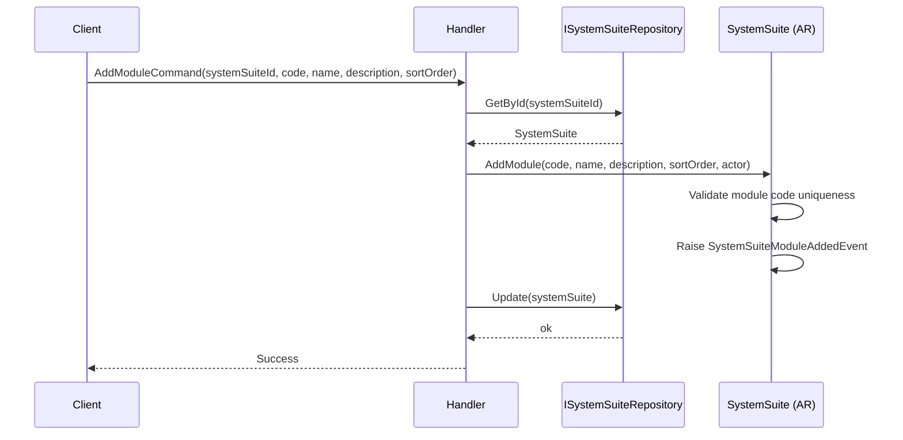
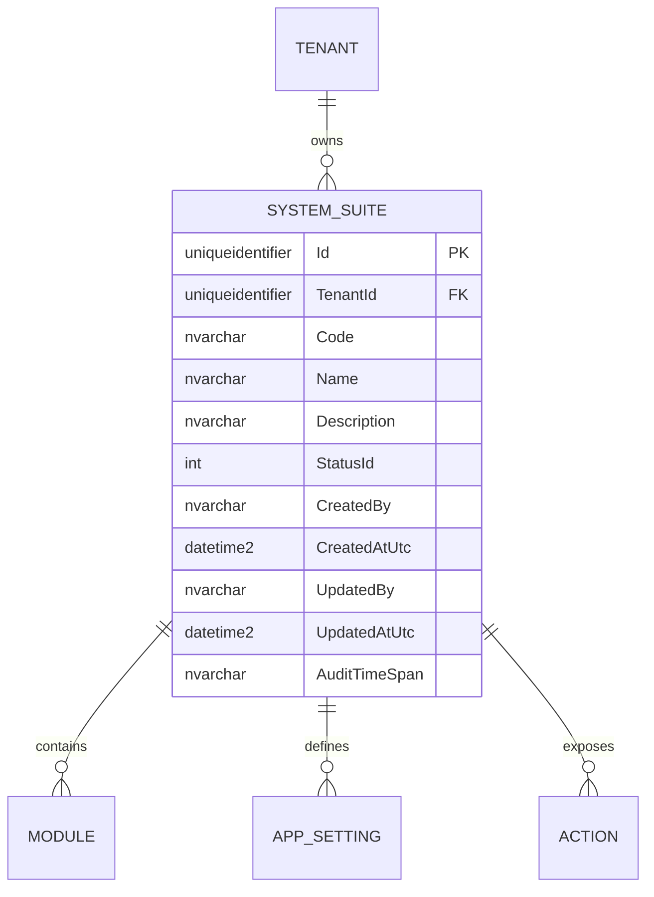

# SystemSuite — Aggregate Architecture

**Bounded Context:** Authorization  
**Aggregate Root:** `SystemSuite`  
**Module:** `Ums.Domain.Authorization.SystemSuite`  
**Status:** Production

---

## 1. Aggregate Overview

### Purpose
The `SystemSuite` aggregate represents a tenant-owned application surface registered in UMS. It defines the functional topology used by downstream authorization models and stores suite-level operational settings. In the current implementation, it owns `Module` and `AppSetting` child entities and exposes a flat `Action` catalog for permission-template targeting.

### Business Responsibility
- Register a tenant-scoped software suite.
- Maintain the suite identity: `Code`, `Name`, `Description`, `Status`.
- Own functional modules and suite-level application settings.
- Expose the action surface consumed by `PermissionTemplate` and effective authorization flows.
- Control activation state through `SystemStatus`.

### Aggregate Root
`SystemSuite` is the aggregate root. Changes to suite identity, modules, app settings, and suite status must go through the aggregate root.

### Invariants and Consistency Rules
1. `TenantId`, `Code`, `Name`, and `Description` are mandatory.
2. `Code` must be unique within the owning tenant boundary.
3. `Module.Code` must be unique inside the suite.
4. App settings cannot duplicate the same `ConfigurationKey` for the same `ConfigurationScope`.
5. Module activation and deactivation are controlled through the parent aggregate.
6. Actions referenced by downstream permission templates must belong to the suite topology governed by this aggregate.

### Related Entities / Value Objects
| Entity / VO | Type | Ownership | Description |
|---|---|---|---|
| `Module` | Entity | Owned | Functional subsystem inside the suite |
| `AppSetting` | Entity | Owned | Suite-scoped configuration entry |
| `Action` | Entity | Owned / catalogued | Action tokens exposed for authorization targeting |
| `TenantId` | Value Object | - | Tenant ownership boundary |
| `Code` | Value Object | - | Technical identifier |
| `Name` | Value Object | - | Display label |
| `Description` | Value Object | - | Functional description |
| `SystemStatus` | Enumeration | - | `Active`, `Inactive`, `Beta`, etc. |

### Domain Events
| Event | Trigger |
|---|---|
| `SystemSuiteRegisteredEvent` | New suite created |
| `SystemSuiteStatusChangedEvent` | Suite status changed |
| `SystemSuiteModuleAddedEvent` | Module added |
| `SystemSuiteModuleRemovedEvent` | Module removed |
| `SystemSuiteModuleStatusChangedEvent` | Module activated or deactivated |

---

## 2. Domain Model

### Classes / Entities / Value Objects
```text
SystemSuite (Aggregate Root)
├── Props: SystemSuiteProps
│   ├── Id: IdValueObject
│   ├── TenantId: TenantId
│   ├── Code: Code
│   ├── Name: Name
│   ├── Description: Description
│   ├── Status: SystemStatus
│   └── Audit: AuditValueObject
├── Children
│   ├── IReadOnlyCollection<Module>
│   └── IReadOnlyCollection<AppSetting>
└── Catalog Surface
    └── IReadOnlyCollection<Action>
```

---

## 3. Object Model Diagrams



---

## 4. Sequence Diagrams

### Add Module Flow


---

## 5. ER Model



### Tenant Isolation Rules
- `SystemSuite` is tenant-owned in the current implementation.
- Modules, app settings, and actions inherit suite ownership through the aggregate boundary.

---

## 6. Bounded Context Integration
- Upstream: tenant context from Identity.
- Downstream: consumed by `PermissionTemplate` and effective authorization resolution.
- Actions exposed by the suite are referenced by authorization templates and profiles.

---

## 7. Application Layer
- `CreateSystemSuiteCommand` -> Inputs: `TenantId, Code, Name, Description` -> Returns: `Guid`
- `UpdateSystemSuiteCommand` -> Inputs: `SystemSuiteId, Name, Description` -> Returns: `void`
- `SetSystemSuiteStatusCommand` -> Inputs: `SystemSuiteId, Status` -> Returns: `void`
- Follow-up API work pending: module, app-setting, and deeper functional-topology endpoints are not fully exposed yet.

---

## 8. Infrastructure/Persistence
- Current repository implementation remains transitional (`in-memory`) for this aggregate.
- The domain shape is authoritative, but SQL Server persistence is still pending for `SystemSuite`.

---

## 9. Security & Compliance
- Suite definition is an administrative capability.
- Module and status changes affect downstream authorization behavior and should be audited.

---

## 10. Technical Decisions
- `SystemSuite` is tenant-owned in the current domain model, even if some older documentation described it as a global catalog.
- The aggregate currently privileges module and setting management plus a flat action surface over the older deep menu tree narrative.

---

**[Back to Authorization Index](./index.md)**
