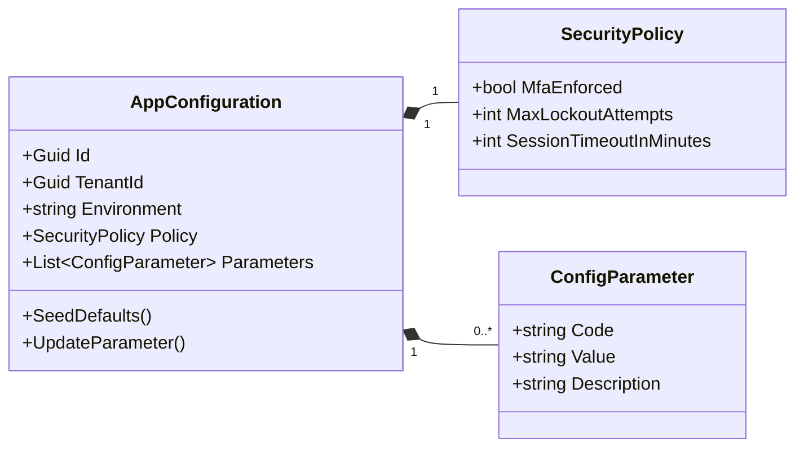
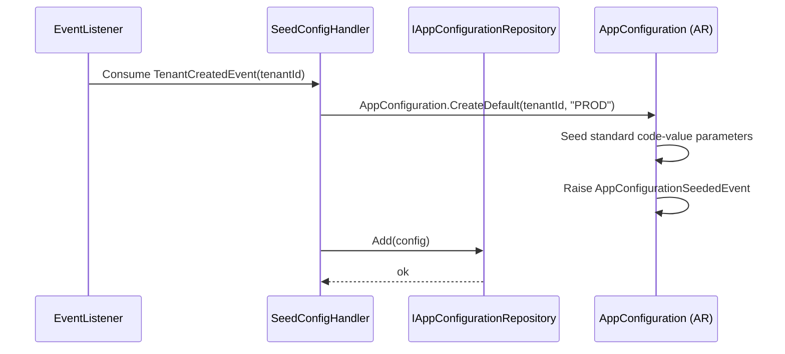
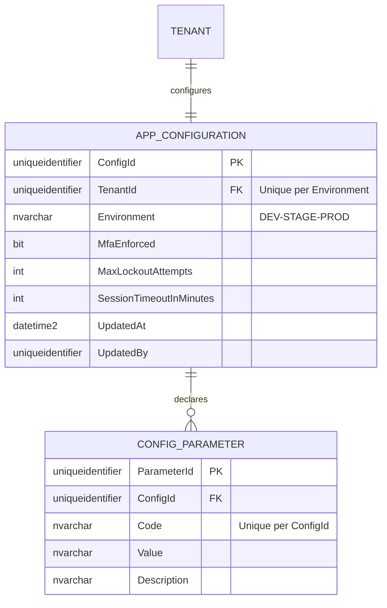

# AppConfiguration — Aggregate Architecture

**Bounded Context:** Configuration  
**Aggregate Root:** `AppConfiguration`  
**Module:** `Ums.Domain.Configuration.AppConfiguration`  
**Status:** Production

---

## 1. Aggregate Overview

### Purpose
The `AppConfiguration` aggregate governs tenant-specific operational settings and policies in UMS. It stores configuration items as code-value-description tuples (complying with corporate standards) and controls runtime behaviors such as user session lifetimes, password lockout limits, password complexity parameters, and Multi-Factor Authentication (MFA) enforcement rules.

### Business Responsibility
- Register and update custom operational parameters for individual tenants.
- Configure corporate security policies (MFA levels, lockouts, password rules).
- Seed default tenant configurations dynamically upon new tenant onboarding.
- Provide a structured, validated catalog of runtime flags and environment variables.

### Aggregate Root
`AppConfiguration` is the aggregate root. All configuration parameter operations must be coordinated through the aggregate root commands.

### Invariants and Consistency Rules
1. Every configuration parameter must follow the strict `Code`, `Value`, and `Description` formatting standards.
2. A Tenant can only have one active configuration sheet per active environment (e.g., Development, Staging, Production).
3. If MFA is set to `ENFORCED`, at least one MFA channel must be active in the tenant's authentication profile.
4. `SessionTimeoutInMinutes` must be a positive integer between 5 and 1440 (24 hours).
5. All operations require a valid, active `TenantId`.

### Related Entities / Value Objects
| Entity / VO | Type | Ownership |
|---|---|---|
| `ConfigurationCode` | Value Object | Alpha-numeric camelCase parameter key |
| `ConfigurationValue` | Value Object | Dynamic parameter value |
| `SecurityPolicy` | Value Object | Enforces MFA, Lockout, and Password rules |
| `AuditValueObject` | Value Object | CreatedAt/By, UpdatedAt/By |

### Domain Events
| Event | Trigger |
|---|---|
| `AppConfigurationSeededEvent` | Default configurations created for a new tenant |
| `ConfigurationParameterUpdatedEvent` | Specific configuration parameter modified |
| `SecurityPolicyChangedEvent` | Lockout or MFA rules adjusted |

### Commands / Use Cases
| Command | Description |
|---|---|
| `SeedDefaultTenantConfigCommand` | Initialize default values on tenant registration |
| `UpdateConfigurationParameterCommand` | Set or modify a config value |
| `UpdateSecurityPolicyCommand` | Modify lockout or authentication policies |

### Repository / Service Boundaries
- `IAppConfigurationRepository` — Persists tenant-scoped settings. All queries are filtered by `TenantId`.
- No cross-tenant modifications allowed.

---

## 2. Domain Model

### Classes / Entities / Value Objects
```
AppConfiguration (Aggregate Root)
├── Props: AppConfigurationProps
│   ├── Id: IdValueObject
│   ├── TenantId: TenantId
│   ├── Environment: string (DEV|STAGE|PROD)
│   ├── SecurityPolicy: SecurityPolicy
│   └── Audit: AuditValueObject
└── Children
    └── IReadOnlyList<ConfigParameter>
```

### Validation Rules
- `Code`: Required, unique per tenant, lowercase alphanumeric + dots (e.g., `security.session.timeout`).
- `Value`: Validated against parameter schema rules.

---

## 3. Object Model Diagrams



---

## 4. Sequence Diagrams

### Seed Defaults Flow


---

## 5. ER Model



### Tenant Isolation Rules
- All `APP_CONFIGURATION` and `CONFIG_PARAMETER` records are partitioned by `TenantId`. Direct table queries are intercepted by the Application repository layer to enforce isolation (R-10).

---

## 6. Bounded Context Integration
- **Upstream**: Consumes `TenantCreatedEvent` from Identity Bounded Context to trigger dynamic seeding.
- **Downstream**: Session policy settings are queried by Identity and Authorization middleware during user authentication.

---

## 7. Application Layer
- `UpdateConfigurationParameterCommand` -> Inputs: `TenantId, Code, Value, ActorId` -> Returns: `void`

---

## 8. Infrastructure/Persistence
- Index: Unique index on `TenantId, Environment` and `ConfigId, Code`.
- Transaction: Modifications to parameters are atomic within the tenant's configuration sheet.

---

## 9. Security & Compliance
- Adjusting app policies: Restricted to `Tenant:Admin` roles.
- Compliance: Security parameter changes (like MFA deactivations) require double-signature approval logs (via Approvals BC).

---

## 10. Technical Decisions
- Standardizing configuration properties inside a dynamic `Code-Value` schema avoids rigid database schema migrations when new client-side features are introduced.

---

**[Back to Configuration Index](./index.md)**
