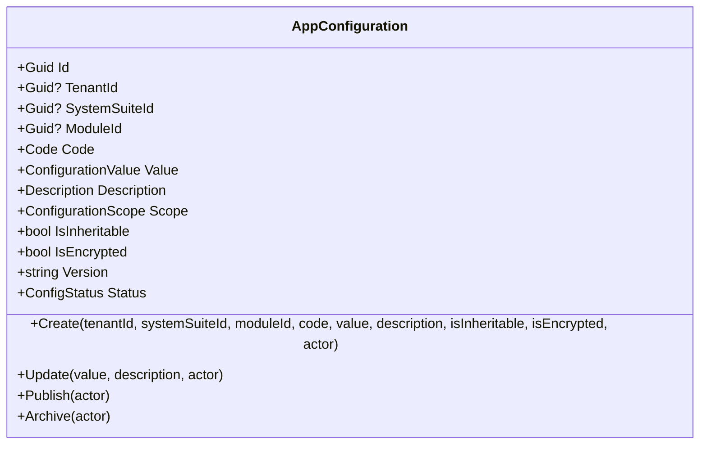
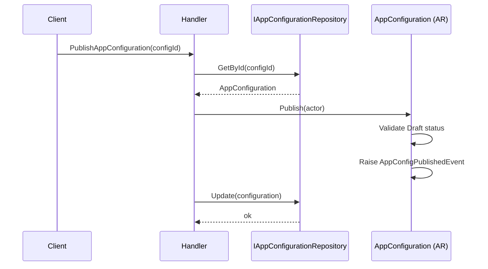
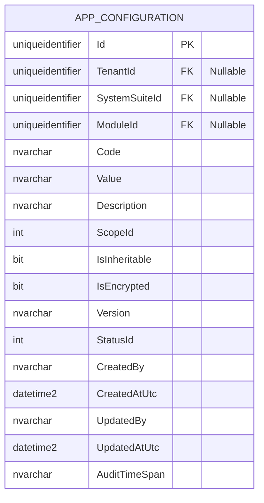

# AppConfiguration — Aggregate Architecture

**Bounded Context:** Configuration  
**Aggregate Root:** `AppConfiguration`  
**Module:** `Ums.Domain.Configuration.AppConfiguration`  
**Status:** Production

---

## 1. Aggregate Overview

### Purpose
The `AppConfiguration` aggregate represents a single hierarchical configuration entry in UMS. It follows the mandatory corporate `code / value / description` pattern and can be scoped globally, by tenant, by suite, or by module.

### Business Responsibility
- Persist configuration entries with explicit business meaning.
- Resolve and preserve configuration scope.
- Support inheritance and encryption flags.
- Control lifecycle from draft to published to archived.
- Version configuration updates over time.

### Aggregate Root
`AppConfiguration` is a standalone aggregate root. Each configuration row is managed independently.

### Invariants and Consistency Rules
1. Every entry must contain `Code`, `Value`, and `Description`.
2. Scope is derived from the presence of `TenantId`, `SystemSuiteId`, and `ModuleId`.
3. New configurations start in `Draft`.
4. Only draft configurations can be updated or published.
5. Only published configurations can be archived.
6. Updates bump the semantic version string.

### Related Entities / Value Objects
| Entity / VO | Type | Ownership |
|---|---|---|
| `AppConfigurationId` | Value Object | Aggregate identifier |
| `TenantId` | Value Object | Optional tenant scope |
| `SystemSuiteId` | Value Object | Optional suite scope |
| `IdValueObject` | Value Object | Optional module scope |
| `Code` | Value Object | Technical key |
| `ConfigurationValue` | Value Object | Operational value |
| `Description` | Value Object | Functional meaning |
| `ConfigurationScope` | Enumeration | `Global`, `Tenant`, `Suite`, `Module` |
| `ConfigStatus` | Enumeration | `Draft`, `Published`, `Archived` |

### Domain Events
| Event | Trigger |
|---|---|
| `AppConfigCreatedEvent` | New configuration created |
| `AppConfigUpdatedEvent` | Draft configuration updated |
| `AppConfigPublishedEvent` | Configuration published |
| `AppConfigArchivedEvent` | Configuration archived |

---

## 2. Domain Model

```text
AppConfiguration (Aggregate Root)
└── Props: AppConfigurationProps
    ├── Id: IdValueObject
    ├── TenantId?: TenantId
    ├── SystemSuiteId?: SystemSuiteId
    ├── ModuleId?: IdValueObject
    ├── Code: Code
    ├── Value: ConfigurationValue
    ├── Description: Description
    ├── Scope: ConfigurationScope
    ├── IsInheritable: bool
    ├── IsEncrypted: bool
    ├── Version: string
    ├── Status: ConfigStatus
    └── Audit: AuditValueObject
```

---

## 3. Object Model Diagrams



---

## 4. Sequence Diagrams

### Publish Configuration Flow


---

## 5. ER Model



### Tenant Isolation Rules
- Global entries may have null `TenantId`.
- Tenant, suite, and module entries are resolved through their explicit scope fields.

---

## 6. Bounded Context Integration
- Consumed by runtime configuration resolution.
- Can serve global, tenant, suite, or module-specific behavior.

---

## 7. Application Layer
- The domain aggregate is exposed through application commands and REST endpoints for create, update, publish, archive, and query flows.

---

## 8. Infrastructure/Persistence
- SQL Server persistence backs the aggregate, and the presentation layer exposes the REST endpoints for this context.

---

## 9. Security & Compliance
- `IsEncrypted` identifies configuration entries that must be handled as sensitive data.
- `Description` must explain purpose, impact, expected behavior, and applicable scope.

---

## 10. Technical Decisions
- `AppConfiguration` is modeled as one configuration entry per aggregate, not as an environment sheet containing child parameters.
- Scope is resolved structurally from ownership fields rather than from a free-text environment dimension.

---

**[Back to Configuration Index](./index.md)**
