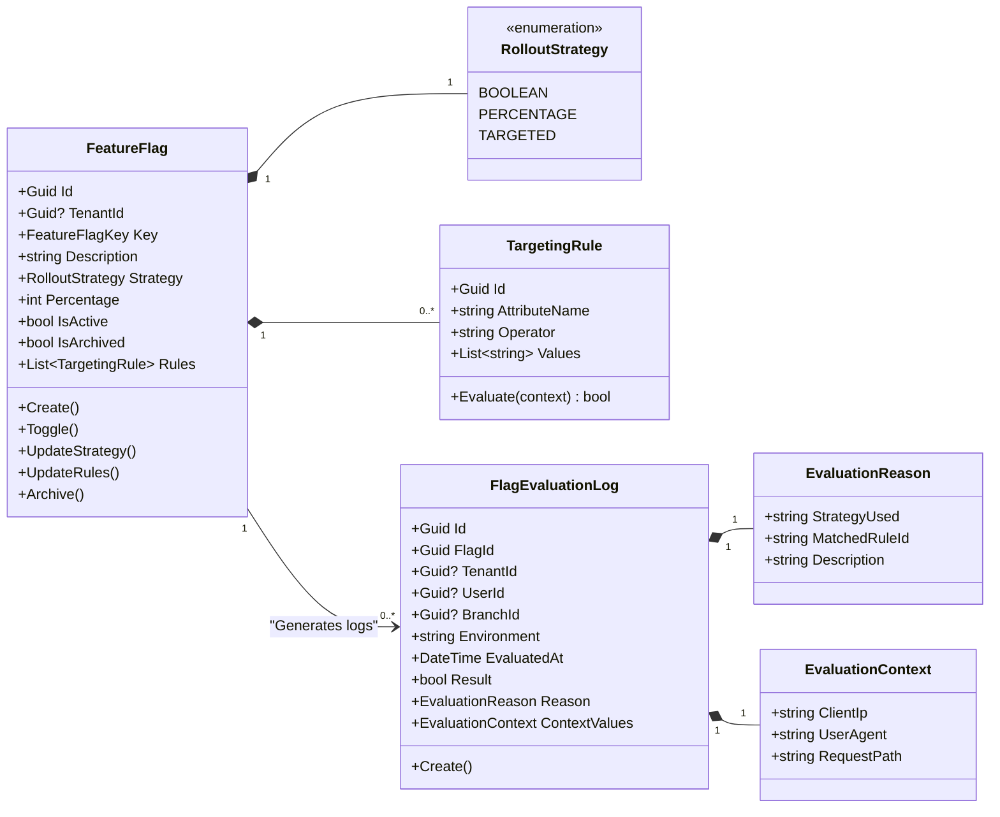
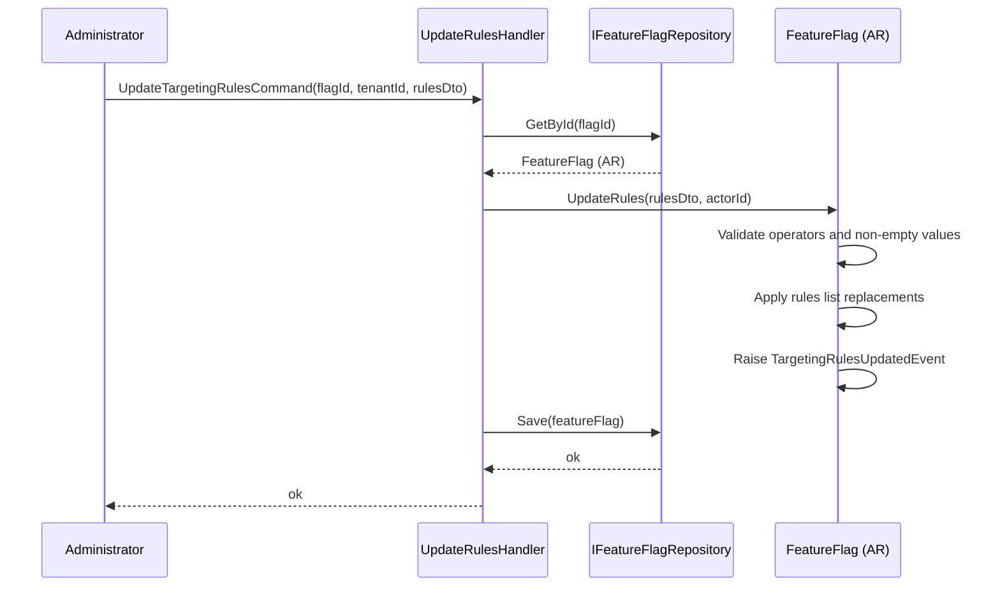
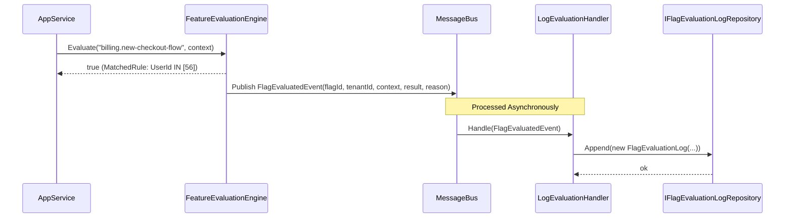
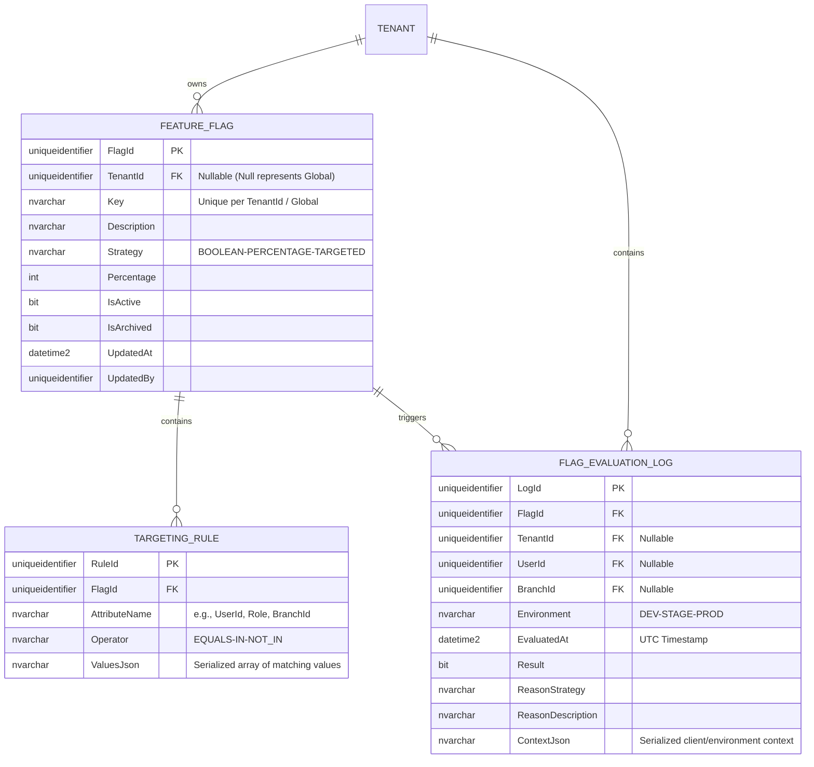

# FeatureFlag — Aggregate Architecture

**Bounded Context:** Configuration  
**Aggregate Root:** `FeatureFlag`  
**Module:** `Ums.Domain.Configuration.FeatureFlag`  
**Status:** Production

---

## 1. Aggregate Overview

### Purpose
The `FeatureFlag` aggregate is the system's operational control switch. It defines platform-wide (global) or tenant-specific feature flags and rules. These flags control dynamic code paths, enabling features like dark launches, canary releases, percentage-based rollouts, and granular user/branch targeting without redeploying code. It also encompasses the `FlagEvaluationLog`, which represents the persistent trace of evaluation events at runtime, vital for debugging complex rollout conditions, checking system compliance, and performing security audits.

### Business Responsibility
- Register and define feature flags with unique identifiers.
- Configure dynamic rollout strategies (boolean toggles, percentage allocations, targeting rules).
- Allow administrative control (enabling, disabling, pausing) over features at runtime.
- Maintain environment-specific toggle states (Development, Staging, Production).
- Enforce targeting based on user roles, branch locations, and system suites.
- Record exact inputs and outputs of evaluations via immutable, append-only logs.

### Aggregate Root
`FeatureFlag` is the aggregate root. All updates to toggle states or dynamic evaluation rules must flow through the aggregate root commands to ensure consistency and validate invariants. `FlagEvaluationLog` behaves as an owned entity but can be written via asynchronous event-driven patterns to maximize write performance.

### Invariants and Consistency Rules
1. A Feature Flag key must be unique. Global flags (`TenantId IS NULL`) must be unique across the entire platform. Tenant-scoped flags must be unique within that `TenantId`.
2. The key must follow the strict kebab-case format (e.g. `billing.new-checkout-flow`).
3. For a `PERCENTAGE` rollout strategy, the rollout percentage must be an integer between 0 and 100 inclusive.
4. For a `TARGETED` strategy, there must be at least one active targeting rule (e.g. specific user list, branch list, or role list).
5. Active feature flags in a production environment cannot be permanently deleted; they must be archived or deactivated to maintain historic context for evaluation logs.
6. `FlagEvaluationLog` is strictly **immutable** and **append-only**. No update or delete operations are exposed.
7. Every log record must reference a valid, existing `FlagId`.
8. The `TenantId` of the log record must match the `TenantId` context in which the evaluation was requested.
9. `EvaluatedAt` must represent the precise UTC timestamp at which the evaluation was resolved.

### Related Entities / Value Objects
| Entity / VO | Type | Ownership |
|---|---|---|
| `FeatureFlagId` | Value Object | Guid-based aggregate root identifier |
| `FeatureFlagKey` | Value Object | Unique, validated kebab-case identifier string |
| `RolloutStrategy` | Enum | BOOLEAN · PERCENTAGE · TARGETED |
| `TargetingRule` | Entity | Owned child entity containing rule match criteria |
| `AuditValueObject` | Value Object | Tracks creation and modification metadata |
| `FlagEvaluationLog` | Entity | Persistent trace of an evaluation event |
| `FlagEvaluationLogId` | Value Object | Guid-based unique record identifier |
| `EvaluationContext` | Value Object | Serialized metadata of the requesting environment and actor |
| `EvaluationReason` | Value Object | Structured text describing the rule or logic that triggered the outcome |

### Domain Events
| Event | Trigger |
|---|---|
| `FeatureFlagCreatedEvent` | A new feature flag is registered in the system |
| `FeatureFlagToggledEvent` | A flag's active status is changed (Enabled/Disabled) |
| `RolloutStrategyChangedEvent` | The strategy or percentage rollout parameters are modified |
| `TargetingRulesUpdatedEvent` | The targeted rules list is added, updated, or cleared |
| `FeatureFlagArchivedEvent` | A flag is archived and rendered unavailable for new evaluations |
| `FlagEvaluationLoggedEvent` | An evaluation result has been committed to the persistent log store |

### Commands / Use Cases
| Command / Query | Description |
|---|---|
| `CreateFeatureFlagCommand` | Register a new feature flag with default settings |
| `ToggleFeatureFlagCommand` | Enable or disable a feature flag instantly |
| `UpdateRolloutStrategyCommand` | Change strategy type or adjust percentage rollout |
| `UpdateTargetingRulesCommand` | Modify specific rules for user/branch segment targetings |
| `ArchiveFeatureFlagCommand` | Archive an active feature flag to prevent further evaluations |
| `LogFlagEvaluationCommand` | Write a new, immutable evaluation record to the database |
| `GetFlagEvaluationLogsQuery` | Retrieve evaluation logs filtered by Flag, Tenant, or User |

### Repository / Service Boundaries
- `IFeatureFlagRepository` — Handles retrieval and persistence of flags.
- `IFlagEvaluationLogRepository` — Handles append-only log insertion and read-only query operations.
- Query filters automatically append `TenantId` for tenant-scoped operations, while permitting read access to Global (`TenantId IS NULL`) entities as appropriate.

---

## 2. Domain Model

### Classes / Entities / Value Objects
```text
FeatureFlag (Aggregate Root)
├── Props: FeatureFlagProps
│   ├── Id: FeatureFlagId
│   ├── TenantId?: TenantId
│   ├── Key: FeatureFlagKey
│   ├── Description: string
│   ├── Strategy: RolloutStrategy
│   ├── Percentage: int (0..100)
│   ├── IsActive: bool
│   ├── IsArchived: bool
│   └── Audit: AuditValueObject
└── Children
    ├── IReadOnlyList<TargetingRule>
    └── FlagEvaluationLog (Log entries)
        ├── Id: FlagEvaluationLogId
        ├── FlagId: FeatureFlagId
        ├── TenantId?: TenantId
        ├── UserId?: UserId
        ├── BranchId?: BranchId
        ├── Environment: string (DEV|STAGE|PROD)
        ├── EvaluatedAt: DateTime
        ├── Result: bool
        ├── Reason: EvaluationReason
        └── ContextValues: EvaluationContext
```

### Validation Rules
- `Key`: Regex matching `^[a-z0-9]+(?:-[a-z0-9]+)*(?:\.[a-z0-9]+(?:-[a-z0-9]+)*)*$` (standard kebab-case with optional dot nesting).
- `Percentage`: Required if strategy is `PERCENTAGE`, must be between 0 and 100.
- `TargetingRule`: Match rules must have valid operators (EQUALS, IN, NOT_IN) and non-empty criteria lists.
- `Environment`: Must be a valid environment code (`DEV`, `STAGE`, `PROD`).
- `EvaluatedAt`: Must be a UTC datetime in the past or present.

---

## 3. Object Model Diagrams



---

## 4. Sequence Diagrams

### Update Targeting Rules Flow


### Log Flag Evaluation Flow (Asynchronous Event)


---

## 5. ER Model



### Tenant Isolation Rules
- Global feature flags (`TenantId IS NULL`) are system-level definitions, read-only to tenant administrators.
- Tenant-scoped feature flags are isolated by `TenantId`. Any modification command checks tenant ownership.
- Logs associated with a tenant-scoped flag or evaluated within a tenant context are strictly partitioned by `TenantId`.

---

## 6. Bounded Context Integration
- **Upstream**: Optionally fetches User, Branch, or Role identifiers from Identity and Authorization bounded contexts to evaluate targeting rules. Features are queried from the `FeatureFlag` aggregate inside the same context.
- **Downstream**: Consulted by routing layers, React components, and API controllers. Feeds into telemetry/analytics platforms to monitor feature usage and error rates.
- Evaluation outcomes trigger `FlagEvaluationLog` entries in the same context via an event-driven mechanism.

---

## 7. Application Layer
- `CreateFeatureFlagCommand` -> Inputs: `TenantId?, Key, Description, Strategy, Percentage?` -> Returns: `Guid`
- `ToggleFeatureFlagCommand` -> Inputs: `FlagId, TenantId?, IsActive` -> Returns: `void`
- `UpdateTargetingRulesCommand` -> Inputs: `FlagId, TenantId?, List<RuleDto>` -> Returns: `void`
- `EvaluateFeatureFlagQuery` -> Inputs: `TenantId?, Key, UserContext` -> Returns: `EvaluationResultDto`
- `LogFlagEvaluationCommand` -> Inputs: `FlagId, TenantId?, UserId?, BranchId?, Environment, Result, Reason, Context` -> Returns: `Guid`
- `GetFlagEvaluationLogsQuery` -> Inputs: `TenantId?, FlagId?, PageIndex, PageSize` -> Returns: `PagedList<FlagEvaluationLogDto>`

---

## 8. Infrastructure/Persistence
- Index: Unique index on `TenantId, Key` where `TenantId IS NOT NULL`. Unique index on `Key` where `TenantId IS NULL` (for Global flags). Non-clustered index on `TenantId, EvaluatedAt` and `FlagId, EvaluatedAt` for high-speed diagnostic queries on logs.
- Transaction: Rules and toggle updates are atomic; updates save both `FEATURE_FLAG` and its associated `TARGETING_RULE` records in a single database transaction.
- Storage: In high-volume systems, the evaluation logs are optimized for high-write tables (e.g., partitioned tables, or columnar store indexes).

---

## 9. Security & Compliance
- Global flags (`TenantId IS NULL`): Restricted to `Platform:Admin` roles.
- Tenant-scoped flags: Modifiable by `Tenant:Admin` for their own tenant.
- Audit Compliance: All toggling actions or rule edits are permanently recorded with actor identifiers to satisfy regulatory auditing protocols.
- Log Tampering Prevention: Enforced by disabling SQL `UPDATE` and `DELETE` permissions for the application user on the `FLAG_EVALUATION_LOG` table.
- Personal Data: Dynamic context attributes (`ContextJson`) must exclude personally identifiable information (PII) like credit cards or cleartext passwords.

---

## 10. Technical Decisions
- Storing targeting values as a serialized JSON array (`ValuesJson`) allows extensible, complex segment matchers without bloating the relational schema with excessive junction tables.
- Writing evaluation logs asynchronously via a message bus protects user transaction latencies from being impacted by the telemetry overhead of evaluating toggles.

---

**[Back to Configuration Index](./index.md)**
