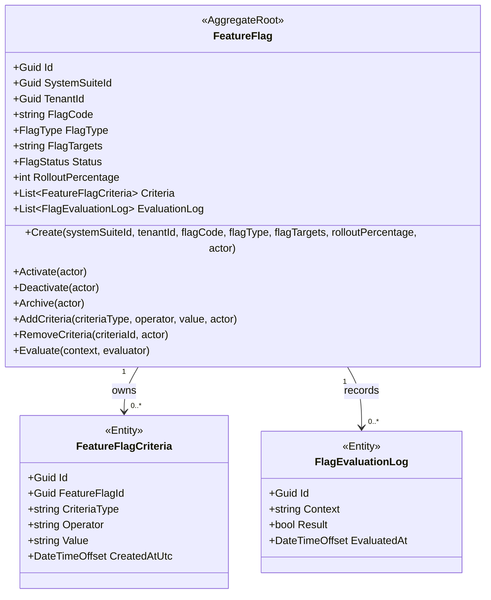
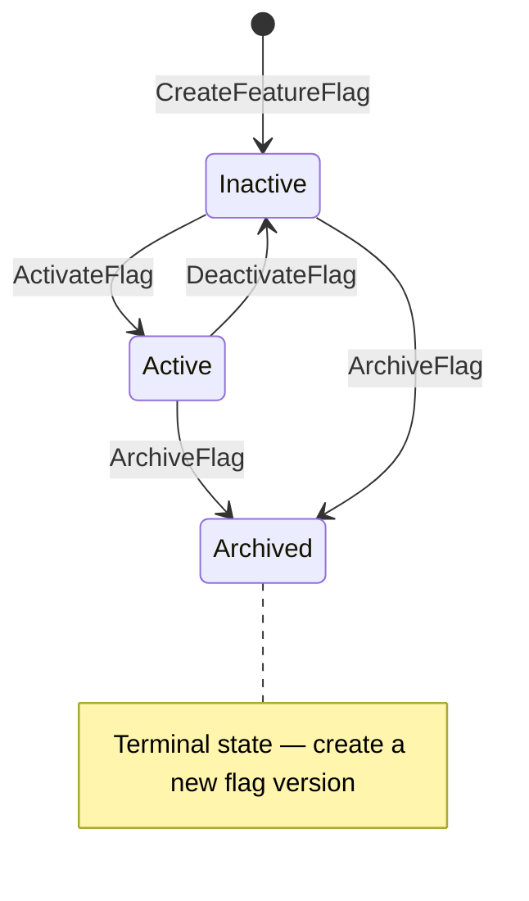
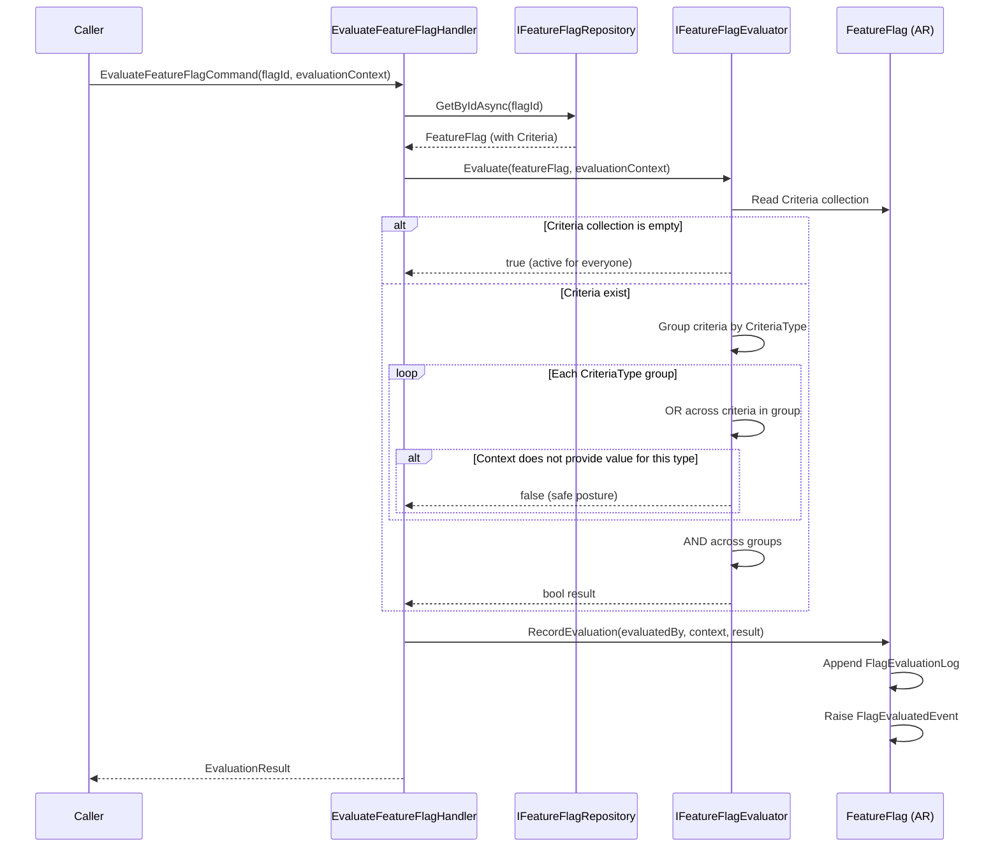
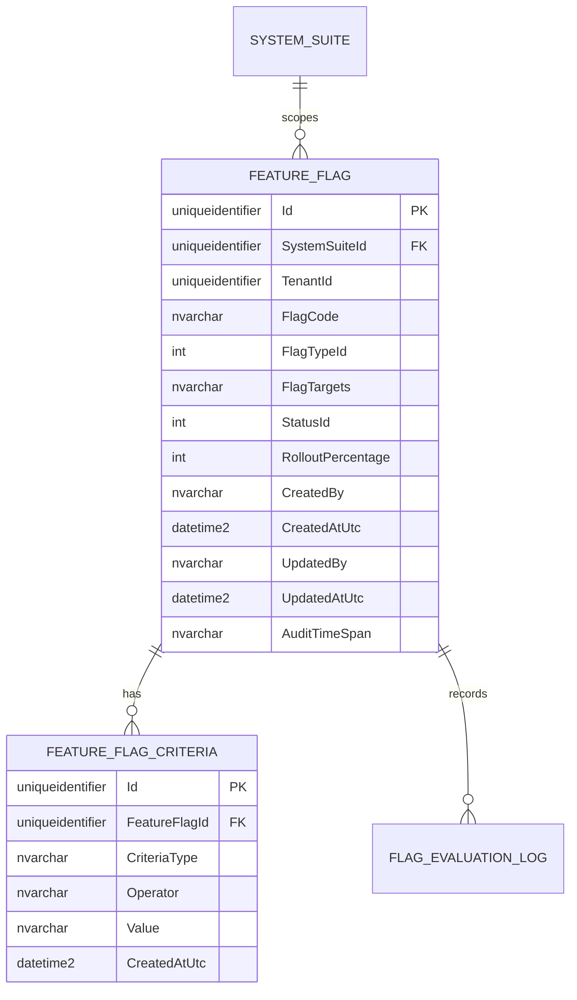

# FeatureFlag — Aggregate Architecture

> **Language:** [English](./feature-flag.md) | [Español](../../domain-es/configuration/feature-flag.md)

**Bounded Context:** Configuration (`Ums.Domain.Configuration`)
**Aggregate Root:** `FeatureFlag`
**Module:** `Ums.Domain.Configuration.FeatureFlag`
**Status:** Production

---

## 1. Aggregate Overview

### Purpose

The `FeatureFlag` aggregate controls runtime feature enablement scoped to a specific `SystemSuite`. It stores a technical flag code, flag type, target definitions, an optional dynamic criteria collection, rollout percentage, and state transitions across inactive, active, and archived states. Flags are never global — every flag belongs to exactly one `SystemSuite`.

### Business Responsibility

- Register feature switches scoped to a `SystemSuite`.
- Control lifecycle activation, deactivation, and archival.
- Support boolean, targeted, or percentage-oriented flag semantics.
- Manage a dynamic collection of evaluation criteria that determine when the flag is active for a given evaluation context.
- Record in-memory evaluation history within the aggregate instance.

### Aggregate Root

`FeatureFlag` is the aggregate root. It is an independent aggregate in BC-C (Configuration). It references `SystemSuite` (BC-B, Authorization) via the foreign key `SystemSuiteId`, but it is not a child of the `SystemSuite` aggregate. State transitions, criteria management, and evaluation behavior are coordinated through this aggregate.

### Invariants and Consistency Rules

| ID | Rule | Source |
|----|------|--------|
| INV-FF1 | `FlagCode` is unique within `(SystemSuiteId, FlagCode)` — not globally | ADR-0068 |
| INV-FF2 | Percentage flags require `RolloutPercentage` between `0` and `100` | FS-08 |
| INV-FF3 | Archived flags cannot be re-activated, deactivated, or have criteria modified | FS-08 |
| INV-FF4 | `SystemSuiteId` is mandatory and immutable once the flag is created | ADR-0068 |
| INV-FF5 | `DateRange` criteria require start date strictly before end date | ADR-0068 |
| INV-FF6 | No duplicate `(CriteriaType, Operator, Value)` combination is allowed within the same flag | ADR-0068 |

### Related Entities / Value Objects

| Entity / VO | Type | Ownership |
|---|---|---|
| `FeatureFlagId` | Value Object | Aggregate identifier |
| `SystemSuiteId` | Value Object (ref BC-B) | Mandatory scope; immutable |
| `TenantId` | Value Object | Optional tenant scope |
| `FlagType` | Enumeration | `BOOLEAN / VARIANT / PERCENTAGE` |
| `FlagStatus` | Enumeration | `Inactive`, `Active`, `Archived` |
| `FeatureFlagCriteria` | Entity | Aggregate-owned evaluation criteria |
| `FlagEvaluationLog` | Entity | Aggregate-owned evaluation history |

### Domain Events

| Event | Trigger |
|---|---|
| `FeatureFlagCreatedEvent(Guid FlagId, string FlagCode, Guid SystemSuiteId)` | New flag created |
| `FeatureFlagActivatedEvent` | Flag activated |
| `FeatureFlagDeactivatedEvent` | Flag deactivated |
| `FeatureFlagArchivedEvent` | Flag archived |
| `FeatureFlagStateChangedEvent` | State transition emitted |
| `FeatureFlagTargetingRulesUpdatedEvent(Guid FlagId, string FlagCode, Guid SystemSuiteId)` | Criteria collection replaced |
| `FeatureFlagCriteriaAddedEvent(Guid FlagId, string FlagCode, string CriteriaType)` | Single criterion added |
| `FeatureFlagCriteriaRemovedEvent(Guid FlagId, string FlagCode, Guid CriteriaId)` | Single criterion removed |
| `FlagEvaluatedEvent` | Runtime evaluation executed |

---

## 2. Domain Model

```text
FeatureFlag (Aggregate Root)
├── Props: FeatureFlagProps
│   ├── Id: IdValueObject
│   ├── SystemSuiteId: IdValueObject          [NEW — mandatory, immutable]
│   ├── TenantId: IdValueObject?              [NEW — optional]
│   ├── FlagCode: string                      [unique within SystemSuiteId]
│   ├── FlagType: FlagType
│   ├── FlagTargets: string
│   ├── Status: FlagStatus
│   ├── RolloutPercentage?: int
│   └── Audit: AuditValueObject
└── Children
    ├── IReadOnlyCollection<FeatureFlagCriteria>   [NEW]
    └── IReadOnlyCollection<FlagEvaluationLog>
```

---

## 3. Object Model Diagrams



---

## 4. Lifecycle



**Allowed transitions summary:**

| From | To | Command |
|---|---|---|
| — | `Inactive` | `CreateFeatureFlagCommand` |
| `Inactive` | `Active` | `ActivateFlagCommand` |
| `Active` | `Inactive` | `DeactivateFlagCommand` |
| `Active` | `Archived` | `ArchiveFlagCommand` |
| `Inactive` | `Archived` | `ArchiveFlagCommand` |

Criteria may be added or removed while the flag is in `Inactive` or `Active` state. Archived flags reject all mutations.

---

## 5. Sequence Diagrams

### Evaluate Flag Flow



---

## 6. ER Model



**Database constraints:**

- `FEATURE_FLAG`: Unique constraint on `(SystemSuiteId, FlagCode)` replaces the previous global unique constraint on `FlagCode`.
- `FEATURE_FLAG.SystemSuiteId`: FK to `ums_authorization.SystemSuites.Id`.
- `FEATURE_FLAG_CRITERIA`: No unique constraint on `CriteriaType` alone — a flag may have multiple criteria of the same type. Duplicate `(FeatureFlagId, CriteriaType, Operator, Value)` is rejected by INV-FF6.

---

## 7. Bounded Context Integration

`FeatureFlag` (BC-C, Configuration) references `SystemSuite` (BC-B, Authorization) through a Customer-Supplier relationship:

- **Supplier:** BC-B publishes `SystemSuite.Id` as a stable external identifier.
- **Customer:** BC-C stores `SystemSuiteId` as a FK and validates its existence at creation time.
- There is no runtime coupling during evaluation. The `SystemSuiteId` is resolved once at creation; evaluation does not call BC-B.

The port `IFeatureFlagEvaluator` is defined in the domain layer and implemented in the infrastructure layer, keeping evaluation logic free from external dependencies.

---

## 8. Application Layer

### Commands

| Command | Description |
|---|---|
| `CreateFeatureFlagCommand(systemSuiteId, tenantId, flagCode, flagType, flagTargets, rolloutPercentage, actor)` | Creates a new flag scoped to a SystemSuite |
| `UpdateFeatureFlagCommand(flagId, flagTargets, rolloutPercentage, actor)` | Updates mutable properties of an existing flag |
| `ActivateFlagCommand(flagId, actor)` | Transitions flag from Inactive to Active |
| `DeactivateFlagCommand(flagId, actor)` | Transitions flag from Active to Inactive |
| `ArchiveFlagCommand(flagId, actor)` | Archives the flag (terminal) |
| `AddFeatureFlagCriteriaCommand(flagId, criteriaType, operator, value, actor)` | Adds a single evaluation criterion |
| `RemoveFeatureFlagCriteriaCommand(flagId, criteriaId, actor)` | Removes a single evaluation criterion |
| `EvaluateFeatureFlagCommand(flagId, evaluationContext, evaluatedBy)` | Evaluates the flag against a typed EvaluationContext |

### Queries

| Query | Description |
|---|---|
| `GetFeatureFlagsBySystemSuiteQuery(systemSuiteId)` | Returns all flags scoped to a SystemSuite |
| `GetFeatureFlagCriteriaQuery(flagId)` | Returns all criteria for a specific flag |
| `GetFeatureFlagByIdQuery(flagId)` | Returns a single flag by identifier |

---

## 9. Infrastructure / Persistence

All tables reside in the `ums_configuration` schema.

| Table | Notes |
|---|---|
| `ums_configuration.FeatureFlags` | Stores aggregate root; `SystemSuiteId` FK references `ums_authorization.SystemSuites`; UK on `(SystemSuiteId, FlagCode)` |
| `ums_configuration.FeatureFlagCriteria` | Stores owned criteria entities; FK to `FeatureFlags.Id` with cascade delete |
| `ums_configuration.FlagEvaluationLogs` | Stores evaluation history; FK to `FeatureFlags.Id` |

Cross-schema FK: `ums_configuration.FeatureFlags.SystemSuiteId → ums_authorization.SystemSuites.Id`. This FK enforces referential integrity at the database level while keeping the aggregates in separate bounded contexts.

---

## 10. Security & Permissions

| Permission Code | Description |
|---|---|
| `FEATURE_FLAG_VIEW` | Read flags and their criteria for a given SystemSuite |
| `FEATURE_FLAG_CREATE` | Create a new flag within a SystemSuite |
| `FEATURE_FLAG_UPDATE` | Update mutable properties and criteria of an existing flag |
| `FEATURE_FLAG_TOGGLE` | Activate or deactivate a flag (change status) |
| `FEATURE_FLAG_ARCHIVE` | Archive a flag (terminal; irreversible) |

---

**[Back to Configuration Index](./index.md)** | **[FeatureFlagCriteria](./feature-flag-criteria.md)**
