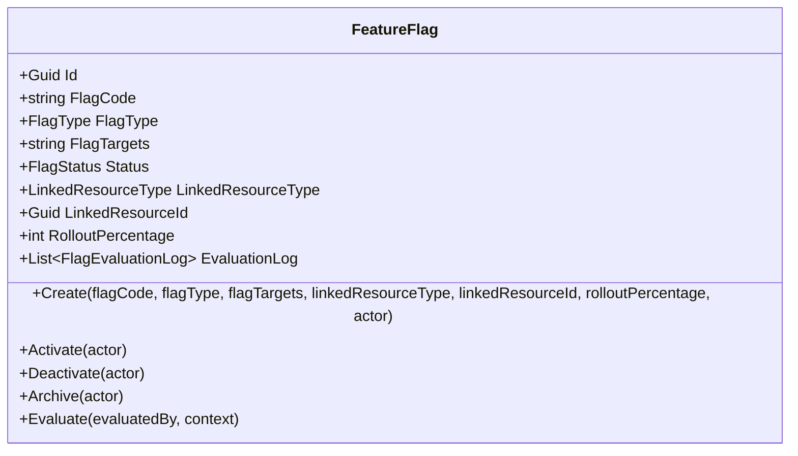
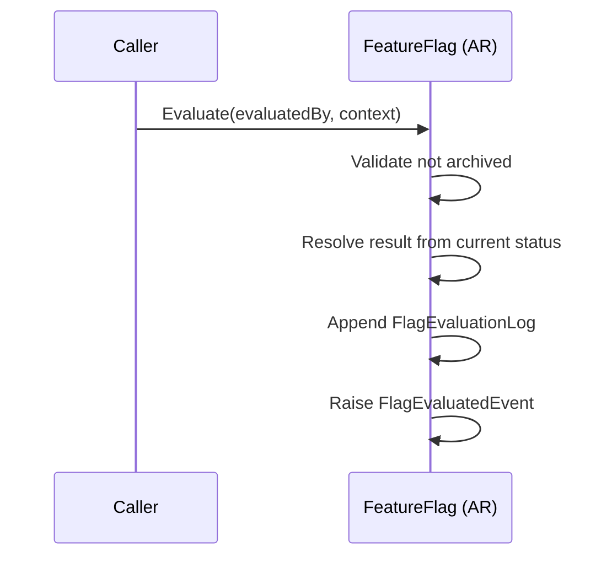
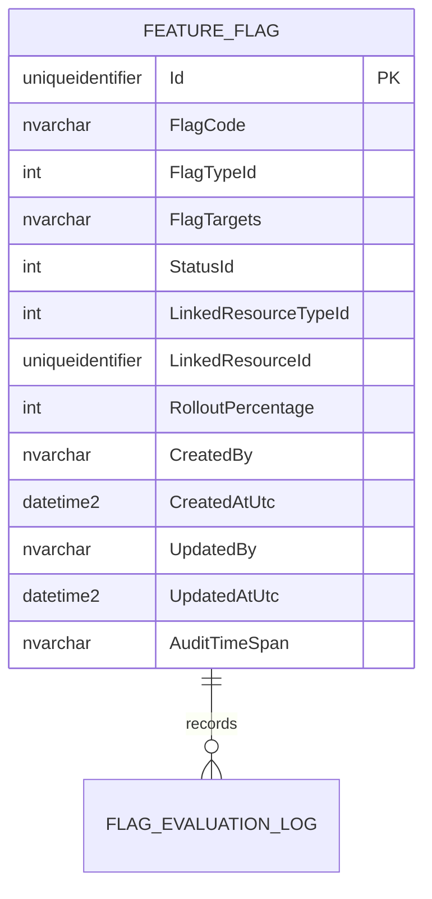

# FeatureFlag — Aggregate Architecture

**Bounded Context:** Configuration  
**Aggregate Root:** `FeatureFlag`  
**Module:** `Ums.Domain.Configuration.FeatureFlag`  
**Status:** Production

---

## 1. Aggregate Overview

### Purpose
The `FeatureFlag` aggregate controls runtime feature enablement in a simplified but operationally useful way. It stores a technical flag code, flag type, target definition, optional linked resource targeting, rollout percentage, and state transitions across inactive, active, and archived states.

### Business Responsibility
- Register feature switches.
- Control lifecycle activation, deactivation, and archival.
- Support boolean, targeted, or percentage-oriented flag semantics.
- Record in-memory evaluation history within the aggregate instance.

### Aggregate Root
`FeatureFlag` is the aggregate root. State transitions and evaluation behavior are coordinated through the aggregate.

### Invariants and Consistency Rules
1. Percentage flags require `RolloutPercentage` between `0` and `100`.
2. Archived flags cannot be re-activated or deactivated.
3. Activating an already active flag is invalid.
4. Deactivating an already inactive flag is invalid.
5. New flags start in `Inactive`.

### Related Entities / Value Objects
| Entity / VO | Type | Ownership |
|---|---|---|
| `FeatureFlagId` | Value Object | Aggregate identifier |
| `FlagType` | Enumeration | Current rollout category |
| `FlagStatus` | Enumeration | `Inactive`, `Active`, `Archived` |
| `LinkedResourceType` | Enumeration | Optional scoping target |
| `FlagEvaluationLog` | Entity | Aggregate-owned evaluation history |

### Domain Events
| Event | Trigger |
|---|---|
| `FeatureFlagCreatedEvent` | New flag created |
| `FeatureFlagActivatedEvent` | Flag activated |
| `FeatureFlagDeactivatedEvent` | Flag deactivated |
| `FeatureFlagArchivedEvent` | Flag archived |
| `FeatureFlagStateChangedEvent` | State transition emitted |
| `FlagEvaluatedEvent` | Runtime evaluation executed |

---

## 2. Domain Model

```text
FeatureFlag (Aggregate Root)
├── Props: FeatureFlagProps
│   ├── Id: IdValueObject
│   ├── FlagCode: string
│   ├── FlagType: FlagType
│   ├── FlagTargets: string
│   ├── Status: FlagStatus
│   ├── LinkedResourceType?: LinkedResourceType
│   ├── LinkedResourceId?: IdValueObject
│   ├── RolloutPercentage?: int
│   └── Audit: AuditValueObject
└── Children
    └── IReadOnlyCollection<FlagEvaluationLog>
```

---

## 3. Object Model Diagrams



---

## 4. Sequence Diagrams

### Evaluate Flag Flow


---

## 5. ER Model



### Tenant Isolation Rules
- The current domain model does not carry `TenantId` directly on the aggregate.
- Multi-tenant targeting is expressed through linked resources and target strings in the present implementation.

---

## 6. Bounded Context Integration
- Can be linked to contextual resources through `LinkedResourceType` and `LinkedResourceId`.
- Evaluation uses a free-form context string in the current implementation.

---

## 7. Application Layer
- The domain aggregate exists, but API/application implementation is still pending in the current codebase.

---

## 8. Infrastructure/Persistence
- Persistence and read model exposure are still pending for this aggregate.

---

## 9. Security & Compliance
- Archived flags are terminal from an operational change perspective.
- Evaluation logs help preserve runtime observability, though the current implementation stores them at aggregate level and not yet as an external analytics model.

---

## 10. Technical Decisions
- The current implemented model is intentionally simpler than older documentation that described advanced targeting-rule trees and environment-specific evaluation logs.
- This document now reflects the implemented domain shape as the authoritative version.

---

**[Back to Configuration Index](./index.md)**
