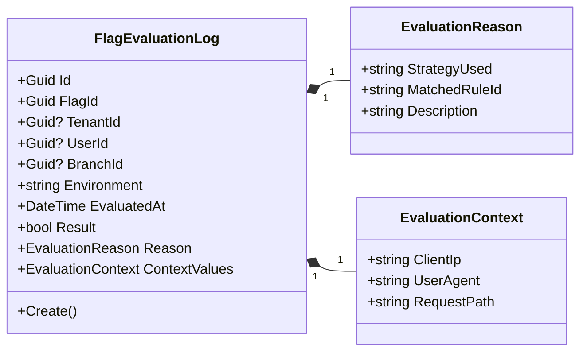
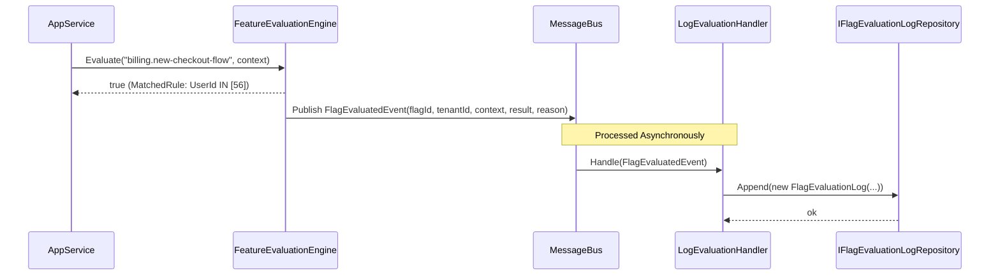
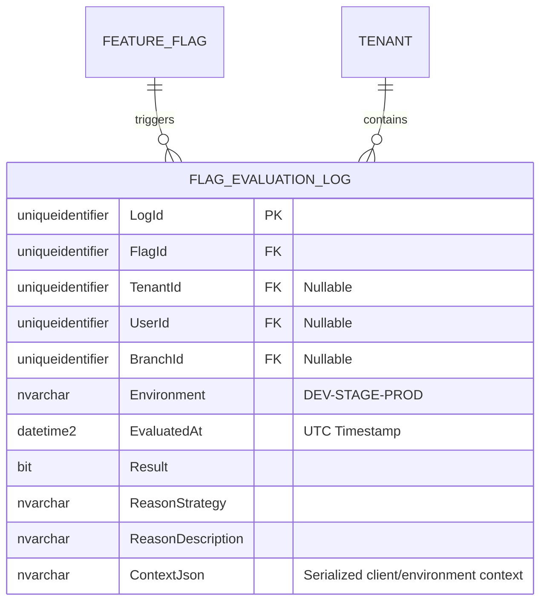

# FlagEvaluationLog — Aggregate/Entity Architecture

**Bounded Context:** Configuration  
**Aggregate Root:** `FeatureFlag` (Physically owned/contained)  
**Module:** `Ums.Domain.Configuration.FeatureFlag.FlagEvaluationLog`  
**Status:** Production

---

## 1. Aggregate Overview

### Purpose
The `FlagEvaluationLog` represents the persistent trace of a feature flag evaluation event at runtime. It serves as an immutable, audit-ready operational record detailing why a specific flag evaluated to `true` or `false` for a particular user, branch, or tenant. It is vital for debugging complex rollout conditions, checking system compliance, and performing security audits.

### Business Responsibility
- Record the exact inputs and outputs of feature flag evaluations in real-time.
- Capture the technical evaluation reason (e.g. rule matches, percentage calculations, or default fallbacks).
- Maintain an append-only ledger of dynamic system status modifications.
- Deliver data feeds for security SIEM tools or telemetry dashboards.

### Aggregate Root
In DDD terms, `FlagEvaluationLog` is an owned entity belonging to the `FeatureFlag` bounded context boundary, but behaves as an independent append-only aggregate for persistence performance. To maximize write performance and avoid concurrency lockouts on the main `FeatureFlag` aggregate root, evaluation logs are written via an asynchronous event-driven pattern.

### Invariants and Consistency Rules
1. `FlagEvaluationLog` is strictly **immutable** and **append-only**. No update or delete operations are exposed.
2. Every log record must reference a valid, existing `FlagId`.
3. The `TenantId` of the log record must match the `TenantId` context in which the evaluation was requested.
4. `EvaluatedAt` must represent the precise UTC timestamp at which the evaluation was resolved.

### Related Entities / Value Objects
| Entity / VO | Type | Ownership |
|---|---|---|
| `FlagEvaluationLogId` | Value Object | Guid-based unique record identifier |
| `EvaluationContext` | Value Object | Serialized metadata of the requesting environment and actor |
| `EvaluationReason` | Value Object | Structured text describing the rule or logic that triggered the outcome |

### Domain Events
| Event | Trigger |
|---|---|
| `FlagEvaluationLoggedEvent` | An evaluation result has been committed to the persistent log store |

### Commands / Use Cases
| Command / Query | Description |
|---|---|
| `LogFlagEvaluationCommand` | Write a new, immutable evaluation record to the database |
| `GetFlagEvaluationLogsQuery` | Retrieve evaluation logs filtered by Flag, Tenant, or User |

### Repository / Service Boundaries
- `IFlagEvaluationLogRepository` — Handles append-only log insertion and read-only query operations.
- Direct tenant queries are isolated by `TenantId`. Global evaluations (`TenantId IS NULL`) are viewable by platform admins.

---

## 2. Domain Model

### Classes / Entities / Value Objects
```
FlagEvaluationLog (Aggregate/Entity)
└── Props: FlagEvaluationLogProps
    ├── Id: FlagEvaluationLogId
    ├── FlagId: FeatureFlagId
    ├── TenantId?: TenantId
    ├── UserId?: UserId
    ├── BranchId?: BranchId
    ├── Environment: string (DEV|STAGE|PROD)
    ├── EvaluatedAt: DateTime
    ├── Result: bool
    ├── Reason: EvaluationReason
    └── ContextValues: EvaluationContext
```

### Validation Rules
- `FlagId`: Must not be empty.
- `Environment`: Must be a valid environment code (`DEV`, `STAGE`, `PROD`).
- `EvaluatedAt`: Must be a UTC datetime in the past or present.

---

## 3. Object Model Diagrams



---

## 4. Sequence Diagrams

### Log Flag Evaluation Flow (Asynchronous Event)


---

## 5. ER Model



### Tenant Isolation Rules
- Logs associated with a tenant-scoped flag or evaluated within a tenant context are strictly partitioned by `TenantId`.
- No operations can delete or update these records; they are safeguarded by structural and database user restrictions.

---

## 6. Bounded Context Integration
- **Upstream**: Features are queried from the `FeatureFlag` aggregate inside the same context.
- **Downstream**: Feeds into telemetry/analytics platforms to monitor feature usage and error rates.

---

## 7. Application Layer
- `LogFlagEvaluationCommand` -> Inputs: `FlagId, TenantId?, UserId?, BranchId?, Environment, Result, Reason, Context` -> Returns: `Guid`
- `GetFlagEvaluationLogsQuery` -> Inputs: `TenantId?, FlagId?, PageIndex, PageSize` -> Returns: `PagedList<FlagEvaluationLogDto>`

---

## 8. Infrastructure/Persistence
- Index: Non-clustered index on `TenantId, EvaluatedAt` and `FlagId, EvaluatedAt` for high-speed diagnostic queries.
- Storage: In high-volume systems, this entity is optimized for high-write tables (e.g., partitioned tables, or columnar store indexes).

---

## 9. Security & Compliance
- Compliance: Log tampering prevention is enforced by disabling SQL `UPDATE` and `DELETE` permissions for the application user on the `FLAG_EVALUATION_LOG` table.
- Personal Data: Dynamic context attributes (`ContextJson`) must exclude personally identifiable information (PII) like credit cards or cleartext passwords.

---

## 10. Technical Decisions
- Writing logs asynchronously via a message bus protects user transaction latencies from being impacted by the telemetry overhead of evaluating toggles.

---

**[Back to Configuration Index](./index.md)**
