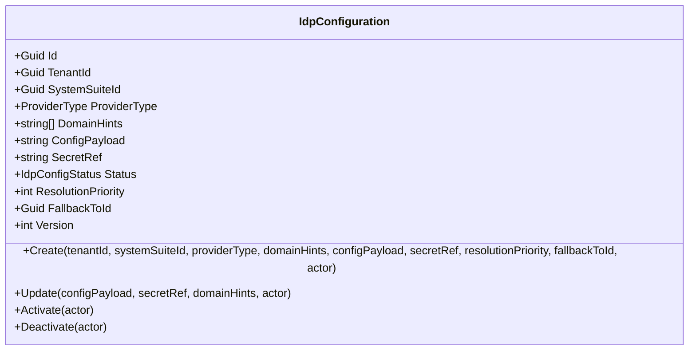
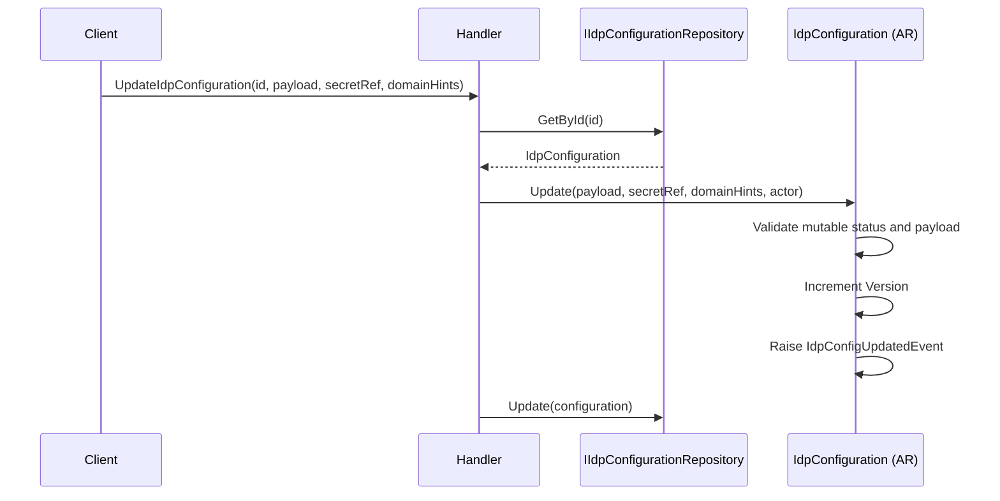
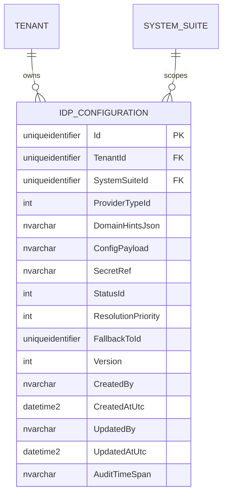

# IdpConfiguration — Aggregate Architecture

**Bounded Context:** Configuration  
**Aggregate Root:** `IdpConfiguration`  
**Module:** `Ums.Domain.Configuration.IdpConfiguration`  
**Status:** Production

---

## 1. Aggregate Overview

### Purpose
The `IdpConfiguration` aggregate stores a tenant and suite-specific identity-provider resolution rule. It encapsulates provider type, domain hints, external configuration payload, secret reference, activation state, fallback chaining, resolution priority, and versioning.

### Business Responsibility
- Register identity-provider configuration entries per tenant and suite.
- Store provider resolution metadata and payload references.
- Control activation/deactivation lifecycle.
- Allow updates while configuration is still mutable.
- Support ordered fallback resolution behavior.

### Aggregate Root
`IdpConfiguration` is the aggregate root. Secret references, payload changes, domain hints, and lifecycle transitions are coordinated through it.

### Invariants and Consistency Rules
1. `TenantId`, `SystemSuiteId`, and `ProviderType` are mandatory.
2. `ConfigPayload` must be non-empty.
3. New configurations start in `Draft`.
4. Only `Draft` and `Inactive` configurations may be updated.
5. Activating an already active configuration is invalid.
6. Deactivation is only valid from `Active`.
7. Every update increments the numeric `Version`.

### Related Entities / Value Objects
| Entity / VO | Type | Ownership |
|---|---|---|
| `IdpConfigurationId` | Value Object | Aggregate identifier |
| `TenantId` | Value Object | Tenant ownership boundary |
| `SystemSuiteId` | Value Object | Suite ownership boundary |
| `ProviderType` | Enumeration | Provider classification |
| `IdpConfigStatus` | Enumeration | `Draft`, `Active`, `Inactive` |

### Domain Events
| Event | Trigger |
|---|---|
| `IdpConfigRegisteredEvent` | New configuration created |
| `IdpConfigActivatedEvent` | Configuration activated |
| `IdpConfigDeactivatedEvent` | Configuration deactivated |
| `IdpConfigUpdatedEvent` | Mutable configuration updated |

---

## 2. Domain Model

```text
IdpConfiguration (Aggregate Root)
└── Props: IdpConfigurationProps
    ├── Id: IdValueObject
    ├── TenantId: TenantId
    ├── SystemSuiteId: SystemSuiteId
    ├── ProviderType: ProviderType
    ├── DomainHints: string[]
    ├── ConfigPayload: string
    ├── SecretRef: string
    ├── Status: IdpConfigStatus
    ├── ResolutionPriority: int
    ├── FallbackToId?: Guid
    ├── Version: int
    └── Audit: AuditValueObject
```

---

## 3. Object Model Diagrams



---

## 4. Sequence Diagrams

### Update IdP Configuration Flow


---

## 5. ER Model



### Tenant Isolation Rules
- Strictly tenant-owned through `TenantId`.
- Further scoped to a concrete `SystemSuiteId`.

---

## 6. Bounded Context Integration
- Bridges tenant identity configuration with suite-level resolution behavior.
- Can participate in multi-provider routing through `ResolutionPriority` and `FallbackToId`.

---

## 7. Application Layer
- The domain aggregate exists, but API/application implementation is still pending in the current codebase.

---

## 8. Infrastructure/Persistence
- Persistence and API exposure are still pending for this aggregate.

---

## 9. Security & Compliance
- `SecretRef` is the sensitive integration reference and should be resolved through secure secret-management infrastructure.
- `ConfigPayload` is authoritative for provider-specific runtime behavior and must be controlled administratively.

---

## 10. Technical Decisions
- The implemented model is a suite-aware provider-resolution aggregate, not the older client-id/authority/claim-mapping style document model.
- This document now reflects the current implemented aggregate as the source of truth.

---

**[Back to Configuration Index](./index.md)**
