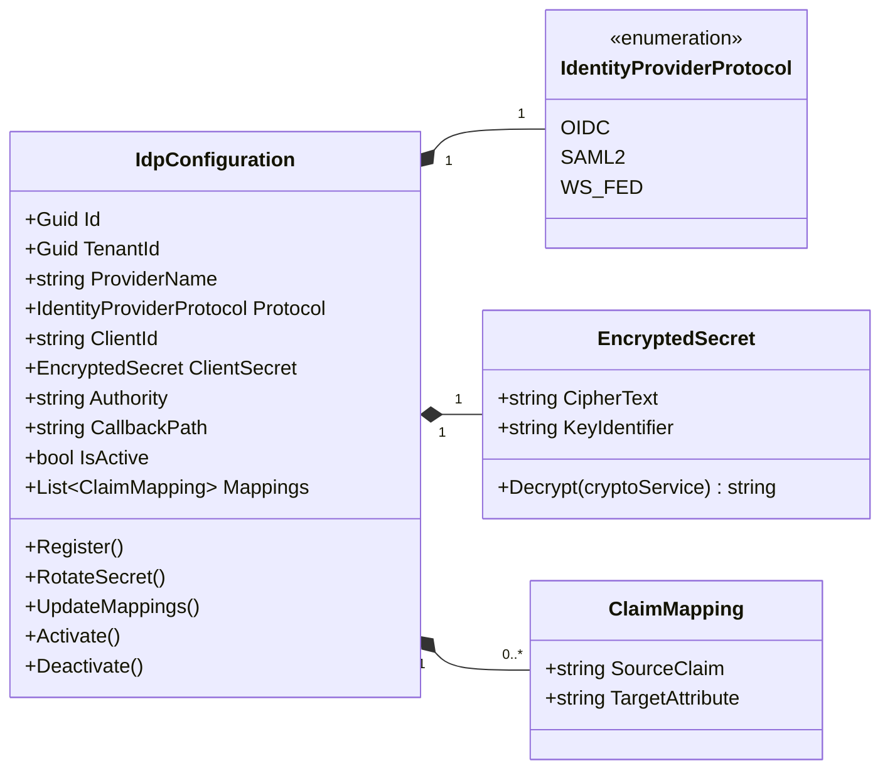
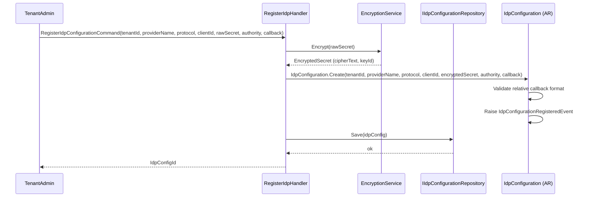
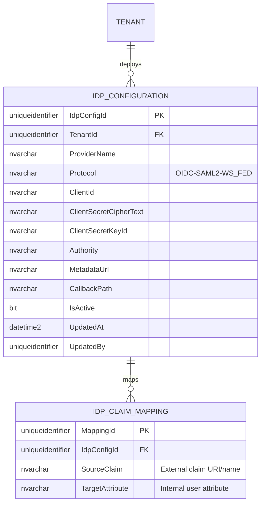

# IdpConfiguration — Aggregate Architecture

**Bounded Context:** Configuration  
**Aggregate Root:** `IdpConfiguration`  
**Module:** `Ums.Domain.Configuration.IdpConfiguration`  
**Status:** Production

---

## 1. Aggregate Overview

### Purpose
The `IdpConfiguration` aggregate establishes federated authentication integrations for specific tenants. It stores configuration details, cryptographic certificates, callback endpoints, and custom claim mappings for third-party Identity Providers (IdPs) using industry standards like OpenID Connect (OIDC) and SAML 2.0.

### Business Responsibility
- Register third-party Identity Providers (e.g., Azure Active Directory, Okta, Google, Auth0) for a tenant.
- Store client identifiers and securely encrypt provider secrets.
- Map external claims (e.g., email, groups, names) onto internal UMS profiles and attributes.
- Manage certificate keys for signature verification in SAML integrations.
- Control active federated authentication channels per tenant.

### Aggregate Root
`IdpConfiguration` is the aggregate root. All provider registrations, key rotations, or claim mapping adjustments must be coordinated via its commands.

### Invariants and Consistency Rules
1. Every `IdpConfiguration` must be bound to a valid, active `TenantId`. No cross-tenant configuration sharing is permitted.
2. The `CallbackPath` must be a valid relative path starting with `/` (e.g., `/signin-oidc-azure`).
3. For `OIDC` protocol, the `Authority` URL and `ClientId` are mandatory.
4. For `SAML2` protocol, either a valid `MetadataUrl` or a signing certificate is required.
5. All secrets (`ClientSecret`, private keys) must be stored in an encrypted format using security standards.
6. claim mappings must not map multiple external claims to the same internal system attribute to avoid identity conflicts.

### Related Entities / Value Objects
| Entity / VO | Type | Ownership |
|---|---|---|
| `IdpConfigurationId` | Value Object | Guid-based aggregate root identifier |
| `IdentityProviderProtocol` | Enum | OIDC · SAML2 · WS_FED |
| `EncryptedSecret` | Value Object | Double-encrypted string enclosing IdP credentials |
| `ClaimMapping` | Value Object | Map tuple linking external claims to internal attributes |
| `AuditValueObject` | Value Object | Tracks creation and modification metadata |

### Domain Events
| Event | Trigger |
|---|---|
| `IdpConfigurationRegisteredEvent` | A new IdP integration is successfully configured |
| `IdpConfigurationActivatedEvent` | An IdP configuration is enabled for active login flows |
| `IdpConfigurationDeactivatedEvent` | An IdP configuration is disabled, blocking federated logins |
| `IdpConfigurationSecretRotatedEvent` | The client secret has been rotated and encrypted |
| `ClaimMappingsUpdatedEvent` | External-to-internal claim attribute maps are altered |

### Commands / Use Cases
| Command | Description |
|---|---|
| `RegisterIdpConfigurationCommand` | Configure a new federated identity provider integration |
| `RotateIdpSecretCommand` | Re-encrypt and update the Client Secret or signing keys |
| `UpdateClaimMappingsCommand` | Modify the mapping between provider claims and system user properties |
| `ActivateIdpConfigurationCommand` | Set an integration state to active, exposing it to portal logins |
| `DeactivateIdpConfigurationCommand` | Terminate active logins via the specific provider |

### Repository / Service Boundaries
- `IIdpConfigurationRepository` — Persists and manages IdP setups. All reads and writes are strictly restricted by the active `TenantId` session.

---

## 2. Domain Model

### Classes / Entities / Value Objects
```
IdpConfiguration (Aggregate Root)
├── Props: IdpConfigurationProps
│   ├── Id: IdpConfigurationId
│   ├── TenantId: TenantId
│   ├── ProviderName: string
│   ├── Protocol: IdentityProviderProtocol
│   ├── ClientId: string
│   ├── ClientSecret: EncryptedSecret
│   ├── Authority: string
│   ├── MetadataUrl?: string
│   ├── CallbackPath: string
│   ├── IsActive: bool
│   └── Audit: AuditValueObject
└── Value Objects
    └── IReadOnlyList<ClaimMapping>
```

### Validation Rules
- `ProviderName`: Required, non-empty, alphanumeric (e.g. `AzureAD`).
- `Authority`: Must be a valid absolute HTTPS URL.
- `ClaimMapping`: Both `SourceClaim` and `TargetAttribute` must be populated.

---

## 3. Object Model Diagrams



---

## 4. Sequence Diagrams

### Register IdP Configuration Flow


---

## 5. ER Model



### Tenant Isolation Rules
- Every record in `IDP_CONFIGURATION` and `IDP_CLAIM_MAPPING` is linked to a `TenantId` (R-10).
- Cross-tenant queries are strictly prevented by repository filters to prevent data leaks.

---

## 6. Bounded Context Integration
- **Upstream**: Relies on the `TenantId` registered in the Identity context.
- **Downstream**: During federated logins, the authentication middleware fetches active provider settings to construct the external sign-in challenge. Claims are converted based on `ClaimMapping` before producing internal JWT tokens.

---

## 7. Application Layer
- `RegisterIdpConfigurationCommand` -> Inputs: `TenantId, ProviderName, Protocol, ClientId, ClientSecret, Authority, CallbackPath` -> Returns: `Guid`
- `RotateIdpSecretCommand` -> Inputs: `IdpConfigId, TenantId, NewSecret` -> Returns: `void`
- `UpdateClaimMappingsCommand` -> Inputs: `IdpConfigId, TenantId, List<ClaimMappingDto>` -> Returns: `void`
- `ActivateIdpConfigurationCommand` -> Inputs: `IdpConfigId, TenantId` -> Returns: `void`

---

## 8. Infrastructure/Persistence
- Index: Unique index on `TenantId, ProviderName` (a tenant cannot have duplicate providers with the same name).
- Security: Credentials are encrypted using AES-GCM or KMS integrations (AWS KMS / Azure Key Vault / HashiCorp Vault) before persisting to SQL Server.

---

## 9. Security & Compliance
- Adjusting federated IdP endpoints: Restricted to `Tenant:Admin` or higher roles.
- Compliance audit: External authentication routing is highly critical. A change in issuer authority, metadata endpoints, or claim mappings produces mandatory alerts and requires multi-factor verification from the administrator.

---

## 10. Technical Decisions
- Persisting claims mapping inside `IDP_CLAIM_MAPPING` decouples external authentication structures from the core `UserAccount` domain entities, safeguarding relational pureness.

---

**[Back to Configuration Index](./index.md)**
