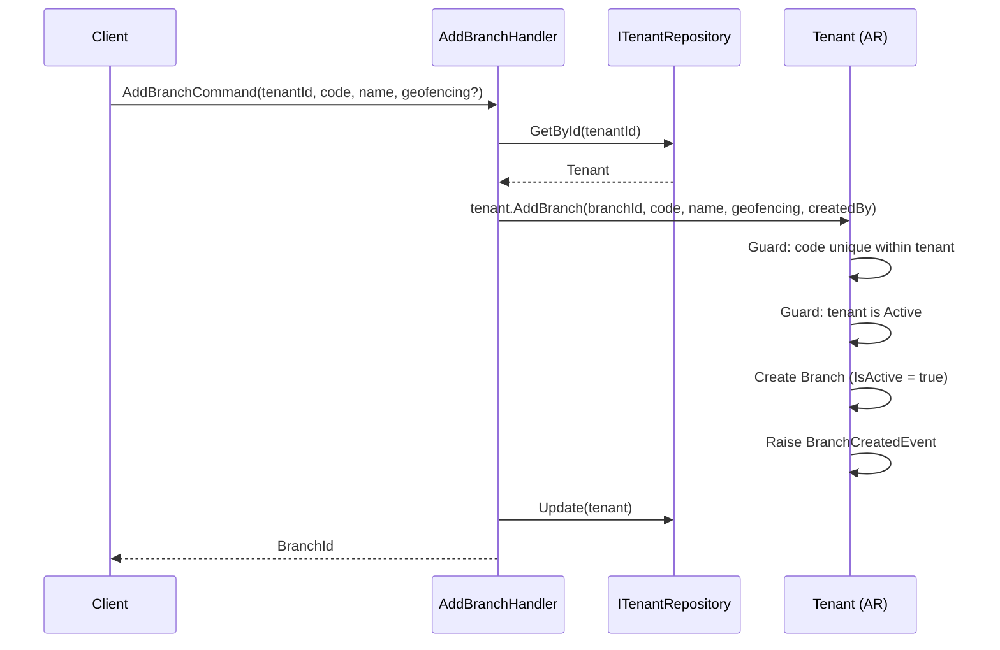
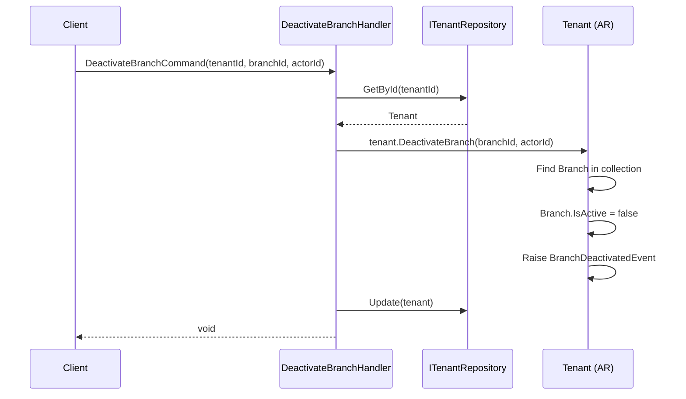
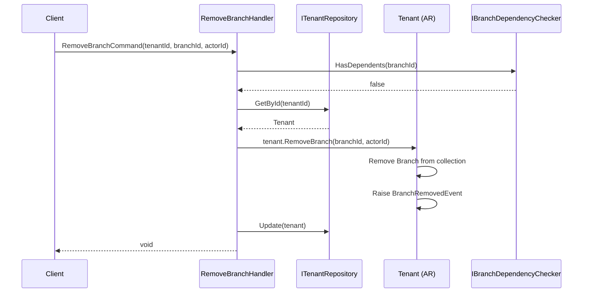
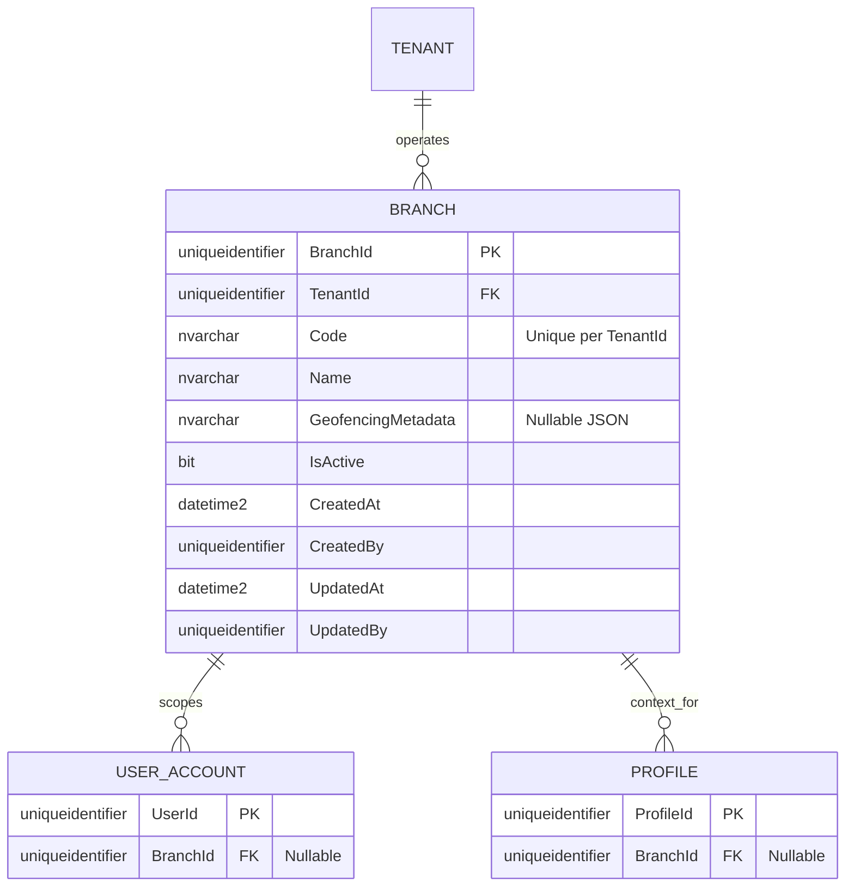
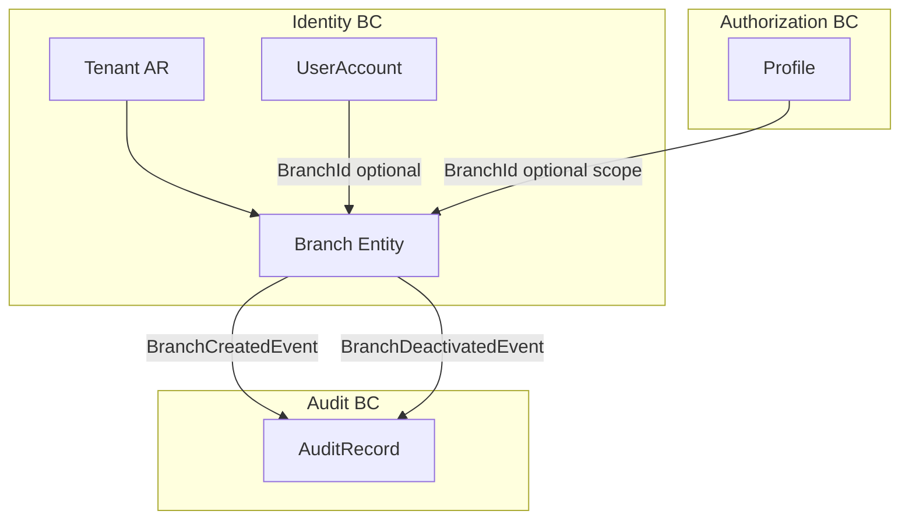

# Branch — Aggregate Architecture

**Bounded Context:** Identity  
**Aggregate Root:** `Tenant` (Branch is an owned entity within the Tenant aggregate)  
**Module:** `Ums.Domain.Identity.Tenant.Branch`  
**Status:** Production

> **DDD Note:** `Branch` does not have its own aggregate root. It is an owned entity managed exclusively through the `Tenant` aggregate. It is documented separately because it has its own lifecycle, persistence table, and is referenced by `UserAccount` and `Profile` via `BranchId`.

---

## 1. Aggregate Overview

### Purpose
A `Branch` represents a physical or logical location unit within a Tenant. It provides a geographic or organizational scope for `UserAccount` assignments and `Profile` context. Optionally includes geofencing metadata to restrict or control access based on location.

### Business Responsibility
- Group users and profiles under a location-based scope.
- Optionally enforce geofencing rules on access.
- Enable branch-level administration delegation.
- Participate in `ProfileScope = BRANCH` scenarios in Authorization.

### Aggregate Root
`Tenant` (parent aggregate root). All `Branch` mutations go through `Tenant` commands.

### Invariants and Consistency Rules
1. `Code` must be unique within the owning `Tenant`.
2. A `Branch` cannot be removed if active `UserAccount` or `Profile` records are scoped to it.
3. `GeofencingMetadata` must be valid JSON when provided.
4. Deactivation does not delete; records remain for historical traceability.

### Related Entities / Value Objects
| Entity / VO | Type | Ownership |
|---|---|---|
| `TenantId` | Value Object | FK to parent Tenant |
| `Code` | Value Object | Unique branch identifier |
| `Name` | Value Object | Display name |
| `GeofencingMetadata` | Value? | JSON coordinates (nullable) |

### Domain Events
Events raised on `TenantDomainEventsManager`:

| Event | Trigger |
|---|---|
| `BranchCreatedEvent` | New branch added to a tenant |
| `BranchDeactivatedEvent` | Branch deactivated |
| `BranchReactivatedEvent` | Branch reactivated |
| `BranchRemovedEvent` | Branch hard-deleted (no dependencies) |

### Commands / Use Cases
| Command | Description |
|---|---|
| `AddBranchCommand` | Create a new branch under a tenant |
| `DeactivateBranchCommand` | Deactivate (soft) a branch |
| `ReactivateBranchCommand` | Reactivate a deactivated branch |
| `RemoveBranchCommand` | Hard-remove a branch with no dependents |
| `UpdateBranchCommand` | Update name or geofencing metadata |

### Repository / Service Boundaries
- Access via `ITenantRepository` — no dedicated `IBranchRepository`.
- `IBranchDependencyChecker` — domain service that verifies no `UserAccount` or `Profile` depends on the branch before removal.

---

## 2. Object Model

### Classes / Entities / Value Objects

```
Tenant (Aggregate Root)
└── Branch (Owned Entity)
    └── Props: BranchProps
        ├── Id: IdValueObject
        ├── TenantId: TenantId
        ├── Code: Code
        ├── Name: Name
        ├── GeofencingMetadata?: Value (JSON)
        ├── IsActive: bool
        └── Audit: AuditValueObject
```

### Main Attributes
| Attribute | Type | Notes |
|---|---|---|
| `Id` | `Guid` | PK |
| `TenantId` | `Guid` | FK to parent tenant |
| `Code` | `string` | Unique per tenant |
| `Name` | `string` | Display name |
| `GeofencingMetadata` | `string?` | JSON polygon/coordinates |
| `IsActive` | `bool` | Soft activation flag |

### Lifecycle / Status Fields
```
Active (IsActive = true) ──► Deactivated (IsActive = false) ──► Active
                                     └──► Removed (if no dependents)
```

### Validation Rules
- `Code`: required, unique per tenant, alphanumeric + hyphens.
- `Name`: required, max 200 chars.
- `GeofencingMetadata`: valid JSON if provided.

---

## 3. Sequence Diagrams

### Create Branch Flow


### Deactivate Branch Flow


### Remove Branch Flow


---

## 4. Entity / Relationship Model



---

## 5. Bounded Context Model



**Context Ownership:** Identity BC (via Tenant aggregate).  
**Upstream:** Tenant owns Branch.  
**Downstream:** `BranchId` is referenced by `UserAccount` (optional scope) and `Profile` (location-based authorization scope).

---

## 6. API / Application Layer Contract

### Commands
| Command | Input | Output |
|---|---|---|
| `AddBranchCommand` | `tenantId, code, name, geofencingMetadata?, createdBy` | `Guid branchId` |
| `UpdateBranchCommand` | `tenantId, branchId, name?, geofencingMetadata?, updatedBy` | `void` |
| `DeactivateBranchCommand` | `tenantId, branchId, actorId` | `void` |
| `ReactivateBranchCommand` | `tenantId, branchId, actorId` | `void` |
| `RemoveBranchCommand` | `tenantId, branchId, actorId` | `void` |

### Queries
| Query | Filter | Returns |
|---|---|---|
| `GetTenantBranchesQuery` | `tenantId, isActive?` | `List<BranchDto>` |
| `GetBranchByIdQuery` | `tenantId, branchId` | `BranchDto?` |

### Error Cases
| Code | Condition |
|---|---|
| `BRANCH_CODE_DUPLICATE` | Code already exists within tenant |
| `BRANCH_NOT_FOUND` | Unknown branchId within tenant |
| `BRANCH_HAS_DEPENDENTS` | Remove blocked by active users or profiles |
| `BRANCH_ALREADY_INACTIVE` | Deactivate on already-inactive branch |

---

## 7. Persistence Notes

### Transaction Boundary
Branch mutations are committed as part of the `Tenant` aggregate SaveChanges.

### Indexes
| Index | Columns | Type |
|---|---|---|
| `IX_Branch_TenantId` | `TenantId` | Non-unique |
| `IX_Branch_TenantId_Code` | `TenantId, Code` | Unique |
| `IX_Branch_IsActive` | `IsActive` | Non-unique |

### Unique Constraints
- `(TenantId, Code)` unique.

### Soft Delete / Audit
- `IsActive = false` for deactivation; hard delete only via `RemoveBranch` with dependency check.

### Multi-Tenant Considerations
- All Branch queries must be filtered by `TenantId`.

---

## 8. Security and Audit

### Authorization Rules
| Operation | Required Role |
|---|---|
| Add / Remove Branch | `Tenant:Admin` |
| Deactivate / Reactivate | `Tenant:Admin` |
| List Branches | `Tenant:Admin`, `Tenant:UserManager` |

### Sensitive Data
- `GeofencingMetadata` contains location coordinates — may be commercially sensitive; restrict to admin roles.

### Audit Events
- `BRANCH_CREATED`, `BRANCH_DEACTIVATED`, `BRANCH_REACTIVATED`, `BRANCH_REMOVED`

### Compliance
- Deactivated branches must remain in the database for audit trail purposes.
- Any user or profile previously scoped to a deactivated branch retains the `BranchId` FK for historical traceability.
