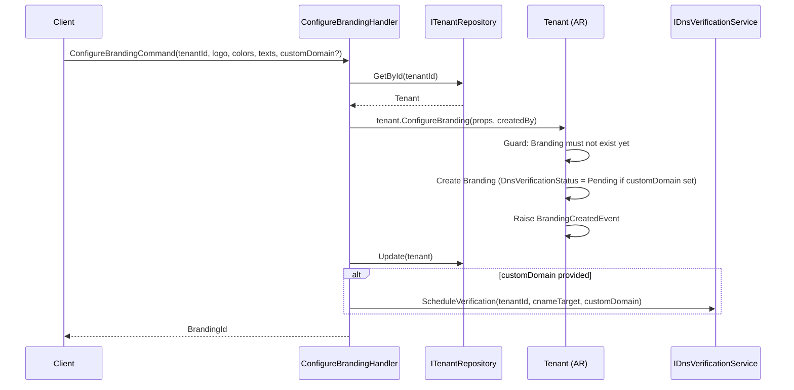
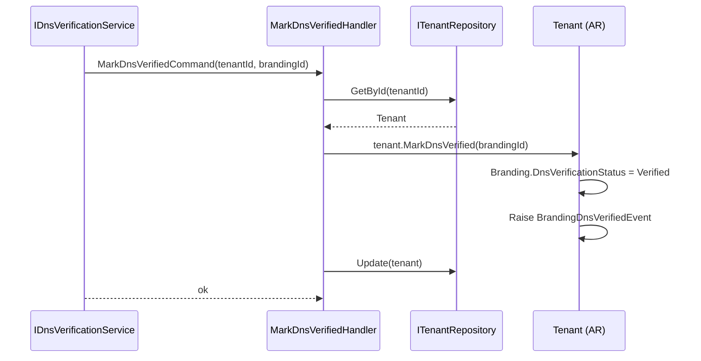
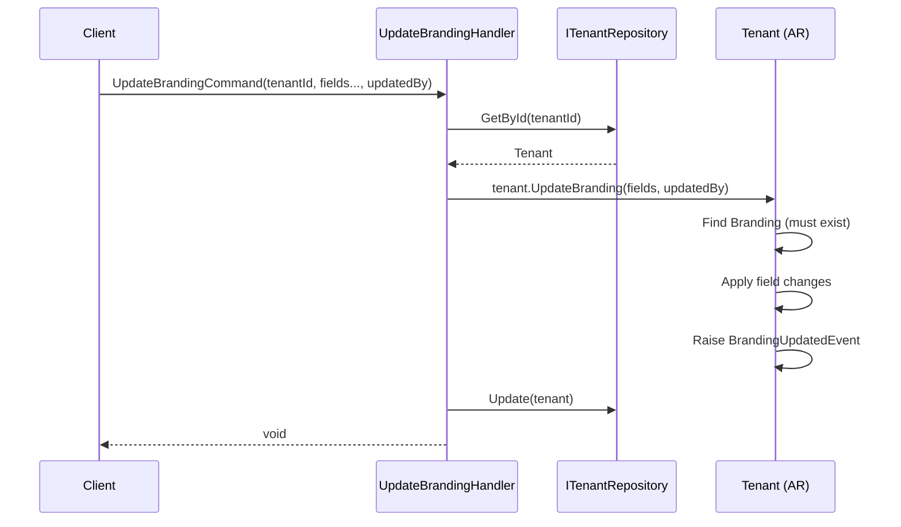
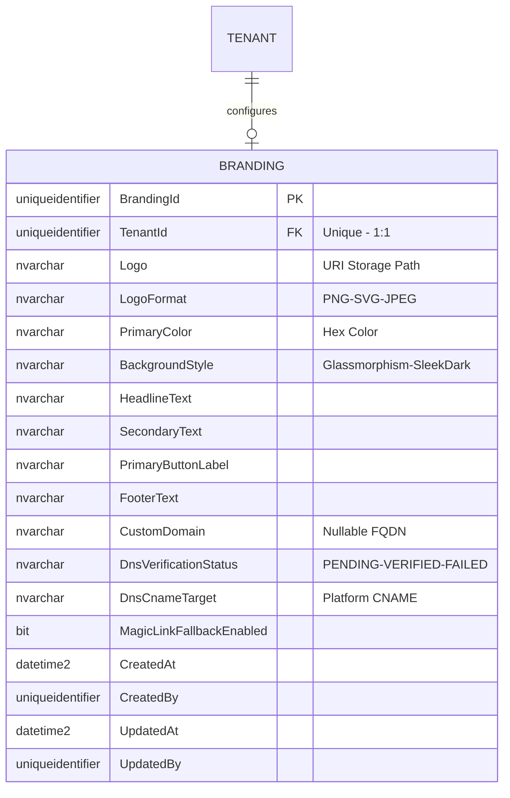
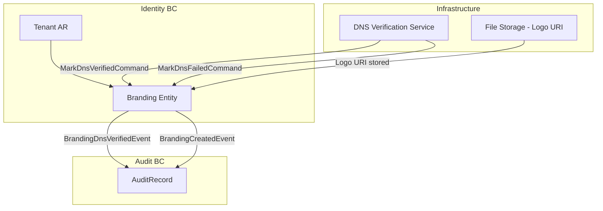

# Branding — Aggregate Architecture

**Bounded Context:** Identity  
**Aggregate Root:** `Tenant` (Branding is an owned entity within the Tenant aggregate)  
**Module:** `Ums.Domain.Identity.Tenant.Branding`  
**Status:** Production

> **DDD Note:** `Branding` is an owned 1:1 entity of `Tenant`. It is documented separately due to its distinct domain responsibility (visual identity and custom domain management), its DNS verification lifecycle, and its impact on the login experience across clients.

---

## 1. Aggregate Overview

### Purpose
The `Branding` entity holds the visual identity configuration for a Tenant — logo, colors, custom login texts, and optionally a custom domain with DNS-based verification. It controls how the tenant-specific login portal is rendered for all client applications.

### Business Responsibility
- Define and persist the tenant's visual brand for the login experience.
- Manage custom domain ownership via DNS CNAME verification.
- Control `MagicLinkFallbackEnabled` for passwordless login flows.
- Emit events when DNS verification succeeds or fails.

### Aggregate Root
`Tenant` (parent). Only one `Branding` record exists per Tenant. All mutations go through `Tenant` commands.

### Invariants and Consistency Rules
1. A Tenant may have at most one `Branding` record.
2. `CustomDomain` must be a valid hostname when provided.
3. `DnsVerificationStatus` starts as `PENDING` when `CustomDomain` is set.
4. `DnsVerificationStatus` cannot be manually set to `VERIFIED` — only the DNS verification service may do so.
5. `LogoFormat` must match the actual format of the uploaded `Logo` URI.

### Related Entities / Value Objects
| Entity / VO | Type | Notes |
|---|---|---|
| `TenantId` | Value Object | FK to parent Tenant |
| `Logo` | Value Object | URI storage path |
| `LogoFormat` | Enum | PNG · SVG · JPEG |
| `HexColor` | Value Object | Validated hex color |
| `BackgroundStyle` | Enum | Glassmorphism · SleekDark |
| `LoginText` | Value Object | Text field for login UI copy |
| `CustomDomain` | Value Object | Nullable hostname |
| `DnsVerificationStatus` | Enum | Pending · Verified · Failed |
| `DnsCnameTarget` | Value Object | Platform CNAME for DNS records |
| `AuditValueObject` | Value Object | CreatedAt/By, UpdatedAt/By |

### Domain Events
| Event | Trigger |
|---|---|
| `BrandingCreatedEvent` | Branding configured for the first time |
| `BrandingUpdatedEvent` | Any branding attribute updated |
| `BrandingRemovedEvent` | Branding configuration removed |
| `BrandingDnsVerifiedEvent` | Custom domain DNS CNAME verified |
| `BrandingDnsFailedEvent` | DNS verification attempt failed |

### Commands / Use Cases
| Command | Description |
|---|---|
| `ConfigureBrandingCommand` | Set up branding for the first time |
| `UpdateBrandingCommand` | Update visual attributes or texts |
| `SetCustomDomainCommand` | Add or replace the custom domain |
| `RemoveBrandingCommand` | Remove the branding configuration |
| `MarkDnsVerifiedCommand` | Internal — called by DNS verification service |
| `MarkDnsFailedCommand` | Internal — called by DNS verification service |

### Repository / Service Boundaries
- Access via `ITenantRepository`.
- `IDnsVerificationService` — infrastructure service that performs CNAME lookups and dispatches `MarkDnsVerified/Failed` commands.

---

## 2. Object Model

```
Tenant (Aggregate Root)
└── Branding (Owned Entity, 0..1)
    └── Props: BrandingProps
        ├── Id: IdValueObject
        ├── TenantId: TenantId
        ├── Logo: Logo
        ├── LogoFormat: LogoFormat
        ├── PrimaryColor: HexColor
        ├── BackgroundStyle: BackgroundStyle
        ├── HeadlineText: LoginText
        ├── SecondaryText: LoginText
        ├── PrimaryButtonLabel: LoginText
        ├── FooterText: LoginText
        ├── CustomDomain?: CustomDomain
        ├── DnsVerificationStatus: DnsVerificationStatus
        ├── DnsCnameTarget: DnsCnameTarget
        ├── MagicLinkFallbackEnabled: bool
        └── Audit: AuditValueObject
```

### Main Attributes
| Attribute | Type | Notes |
|---|---|---|
| `Logo` | `string` | URI to uploaded logo |
| `LogoFormat` | `LogoFormat` | PNG / SVG / JPEG |
| `PrimaryColor` | `string` | Hex color (e.g. `#1A2B3C`) |
| `BackgroundStyle` | `BackgroundStyle` | Glassmorphism / SleekDark |
| `HeadlineText` | `string` | Login page headline |
| `CustomDomain` | `string?` | Optional FQDN |
| `DnsVerificationStatus` | `DnsVerificationStatus` | Pending / Verified / Failed |
| `DnsCnameTarget` | `string` | CNAME value tenant must point to |
| `MagicLinkFallbackEnabled` | `bool` | Enables magic link on IdP failure |

### Lifecycle / Status Fields (DNS Verification)
```
(CustomDomain set) → DnsVerificationStatus = Pending
                        ├──► Verified  (DNS CNAME matches)
                        └──► Failed    (CNAME missing or wrong)
                                └──► Pending (on retry)
```

---

## 3. Sequence Diagrams

### Configure Branding Flow


### DNS Verification Flow


### Update Branding Flow


---

## 4. Entity / Relationship Model



---

## 5. Bounded Context Model



**Context Ownership:** Identity BC (via Tenant aggregate).  
**External Dependencies:**  
- DNS verification infrastructure service (async, scheduled).
- File storage service for logo URI (pre-signed upload URL pattern).

---

## 6. API / Application Layer Contract

### Commands
| Command | Input | Output |
|---|---|---|
| `ConfigureBrandingCommand` | `tenantId, logo, logoFormat, primaryColor, backgroundStyle, headlineText, secondaryText, primaryButtonLabel, footerText, customDomain?, cnameTarget, magicLinkFallback, createdBy` | `Guid brandingId` |
| `UpdateBrandingCommand` | `tenantId, brandingId, fields..., updatedBy` | `void` |
| `SetCustomDomainCommand` | `tenantId, brandingId, customDomain, updatedBy` | `void` |
| `RemoveBrandingCommand` | `tenantId, brandingId, actorId` | `void` |
| `MarkDnsVerifiedCommand` | `tenantId, brandingId` | `void` |
| `MarkDnsFailedCommand` | `tenantId, brandingId, reason` | `void` |

### Queries
| Query | Filter | Returns |
|---|---|---|
| `GetTenantBrandingQuery` | `tenantId` | `BrandingDto?` |
| `GetBrandingByDomainQuery` | `customDomain` | `BrandingDto?` |

### Error Cases
| Code | Condition |
|---|---|
| `BRANDING_ALREADY_EXISTS` | ConfigureBranding called twice |
| `BRANDING_NOT_FOUND` | No branding configured for tenant |
| `DNS_ALREADY_VERIFIED` | Attempt to re-verify an already-verified domain |
| `INVALID_CUSTOM_DOMAIN` | Not a valid FQDN format |

---

## 7. Persistence Notes

### Indexes
| Index | Columns | Type |
|---|---|---|
| `IX_Branding_TenantId` | `TenantId` | Unique |
| `IX_Branding_CustomDomain` | `CustomDomain` | Unique (partial — not null) |

### Unique Constraints
- `TenantId` unique (enforces 1:1 with Tenant).
- `CustomDomain` unique across all tenants (a domain cannot be claimed by two tenants).

### Multi-Tenant Considerations
- `CustomDomain` is a cross-tenant unique key — global uniqueness required.
- DNS verification is triggered asynchronously; polling or webhook pattern recommended.

---

## 8. Security and Audit

### Authorization Rules
| Operation | Required Role |
|---|---|
| Configure / Update Branding | `Tenant:Admin` |
| Set Custom Domain | `Tenant:Admin` |
| Mark DNS Verified/Failed | Internal service only (no user role) |

### Sensitive Data
- No sensitive PII in Branding. `Logo` is a URI — storage access control managed at file storage layer.

### Audit Events
- `BRANDING_CONFIGURED`, `BRANDING_UPDATED`, `BRANDING_REMOVED`
- `DNS_VERIFIED`, `DNS_FAILED`

### Compliance
- DNS verification state transitions must be immutably recorded.
- Custom domain changes require re-verification from `PENDING` state.
