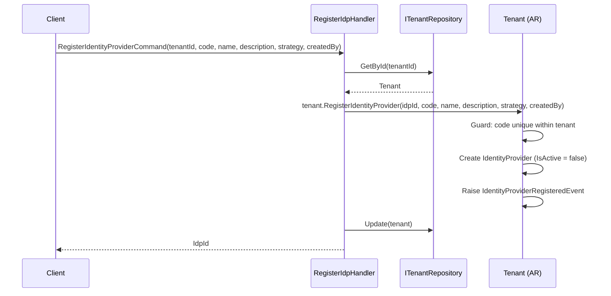
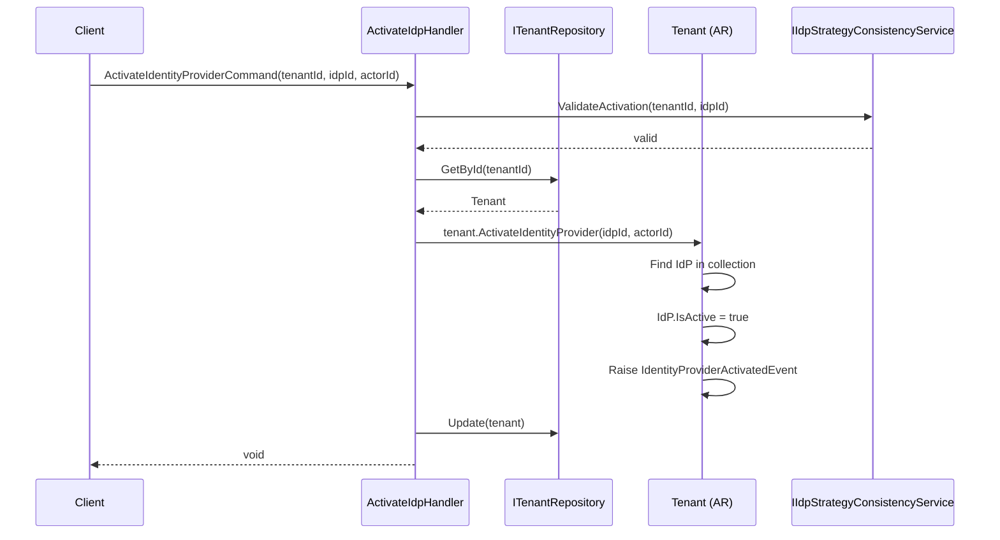
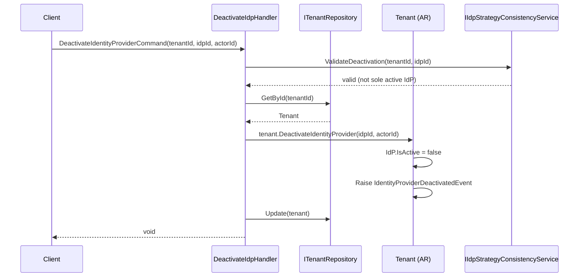
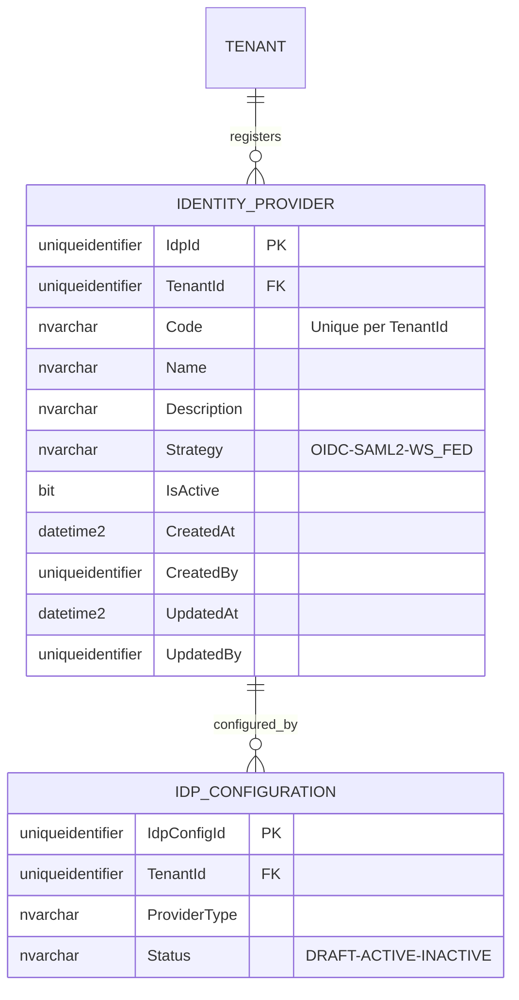
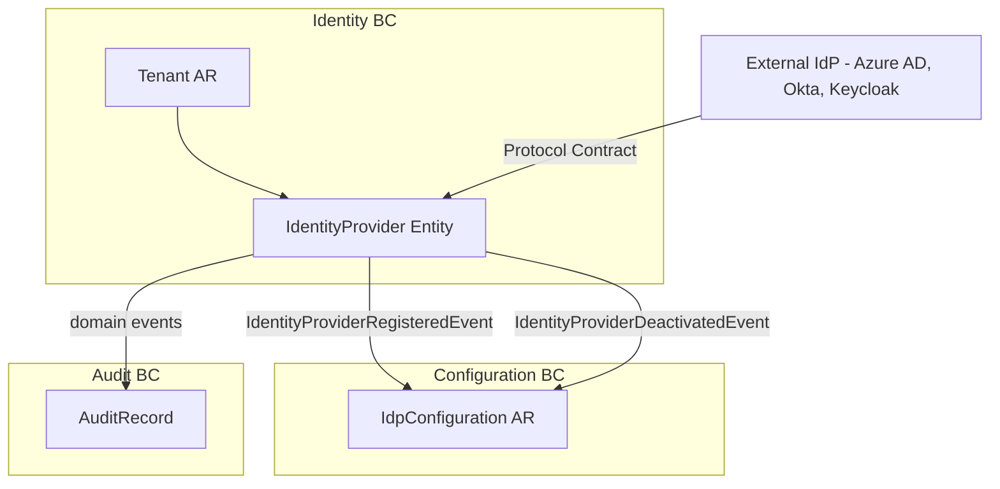

# IdentityProvider — Aggregate Architecture

**Bounded Context:** Identity  
**Aggregate Root:** `Tenant` (IdentityProvider is an owned entity within the Tenant aggregate)  
**Module:** `Ums.Domain.Identity.Tenant.IdentityProvider`  
**Status:** Production

> **DDD Note:** `IdentityProvider` is an owned entity within the `Tenant` aggregate. It is documented separately because it has its own lifecycle, distinct strategy semantics (OIDC/SAML/WS-FED), and is the domain-level record of an IdP contract for a tenant — distinct from the protocol-level `IDP_CONFIGURATION` in the Configuration BC.

---

## 1. Aggregate Overview

### Purpose
The `IdentityProvider` entity represents a registered external authentication provider for a Tenant. It records the strategic intent (which protocol) and the business-level contract (name, code, description) for that IdP. The technical configuration (endpoints, secrets, certificates) lives in `IDP_CONFIGURATION` in the Configuration BC.

### Business Responsibility
- Register an external Identity Provider for a Tenant.
- Track IdP activation/deactivation lifecycle.
- Define the authentication strategy (`OIDC`, `SAML2`, `WS_FED`) at the domain level.
- Serve as the domain reference that `IDP_CONFIGURATION` points to.

### Aggregate Root
`Tenant` (parent). All `IdentityProvider` mutations go through `Tenant` commands.

### Invariants and Consistency Rules
1. `Code` must be unique within the owning Tenant.
2. An `IdentityProvider` must be deactivated before it can be removed.
3. Deactivating an `IdentityProvider` that is the sole active IdP for a Federated tenant is not allowed unless the tenant's `IdpStrategy` is changed first.
4. `Strategy` cannot be changed after registration — it is immutable once set.

### Related Entities / Value Objects
| Entity / VO | Type | Notes |
|---|---|---|
| `TenantId` | Value Object | FK to parent Tenant |
| `Code` | Value Object | Unique IdP identifier within tenant |
| `Name` | Value Object | Display name |
| `Description` | Value Object | Purpose and protocol details |
| `IdpStrategy` | Enum | OIDC · SAML2 · WS_FED |
| `AuditValueObject` | Value Object | CreatedAt/By, UpdatedAt/By |

### Domain Events
| Event | Trigger |
|---|---|
| `IdentityProviderRegisteredEvent` | New IdP registered under a tenant |
| `IdentityProviderActivatedEvent` | IdP activated and available for auth routing |
| `IdentityProviderDeactivatedEvent` | IdP deactivated (auth routing suspended) |
| `IdentityProviderRemovedEvent` | IdP hard-removed after deactivation |

### Commands / Use Cases
| Command | Description |
|---|---|
| `RegisterIdentityProviderCommand` | Register a new IdP under a tenant |
| `ActivateIdentityProviderCommand` | Mark an IdP as active |
| `DeactivateIdentityProviderCommand` | Deactivate an active IdP |
| `RemoveIdentityProviderCommand` | Hard-remove an inactive IdP |

### Repository / Service Boundaries
- Access via `ITenantRepository`.
- `IIdpStrategyConsistencyService` — validates that deactivating an IdP doesn't leave the tenant without a valid auth path.

---

## 2. Object Model

```
Tenant (Aggregate Root)
└── IdentityProvider (Owned Entity, 0..N)
    └── Props: IdentityProviderProps
        ├── Id: IdValueObject
        ├── TenantId: TenantId
        ├── Code: Code
        ├── Name: Name
        ├── Description: Description
        ├── Strategy: IdpStrategy
        ├── IsActive: bool
        └── Audit: AuditValueObject
```

### Main Attributes
| Attribute | Type | Notes |
|---|---|---|
| `Id` | `Guid` | PK |
| `TenantId` | `Guid` | FK to parent Tenant |
| `Code` | `string` | Unique within tenant |
| `Name` | `string` | Human-readable name |
| `Description` | `string` | Protocol and purpose |
| `Strategy` | `IdpStrategy` | OIDC / SAML2 / WS_FED — immutable |
| `IsActive` | `bool` | Routing availability |

### Lifecycle / Status Fields
```
Registered (IsActive = false) ──► Activated (IsActive = true) ──► Deactivated ──► Removed
```

### Validation Rules
- `Code`: required, unique per tenant.
- `Strategy`: immutable after registration.
- `Description`: required, max 500 chars.

---

## 3. Sequence Diagrams

### Register IdP Flow


### Activate IdP Flow


### Deactivate / Remove IdP Flow


---

## 4. Entity / Relationship Model



---

## 5. Bounded Context Model



**Context Ownership:** Identity BC (via Tenant aggregate).  
**Downstream:** Configuration BC (`IDP_CONFIGURATION`) stores the protocol-level credential details for this IdP record.  
**Integration:** `IdentityProviderRegisteredEvent` → Configuration BC may seed an `IdpConfiguration` draft. `IdentityProviderDeactivatedEvent` → Configuration BC deactivates related `IdpConfiguration`.

---

## 6. API / Application Layer Contract

### Commands
| Command | Input | Output |
|---|---|---|
| `RegisterIdentityProviderCommand` | `tenantId, code, name, description, strategy, createdBy` | `Guid idpId` |
| `ActivateIdentityProviderCommand` | `tenantId, idpId, actorId` | `void` |
| `DeactivateIdentityProviderCommand` | `tenantId, idpId, actorId` | `void` |
| `RemoveIdentityProviderCommand` | `tenantId, idpId, actorId` | `void` |

### Queries
| Query | Filter | Returns |
|---|---|---|
| `GetTenantIdentityProvidersQuery` | `tenantId, isActive?` | `List<IdentityProviderDto>` |
| `GetIdentityProviderByCodeQuery` | `tenantId, code` | `IdentityProviderDto?` |

### Error Cases
| Code | Condition |
|---|---|
| `IDP_CODE_DUPLICATE` | Code exists in tenant |
| `IDP_NOT_FOUND` | Unknown idpId in tenant |
| `IDP_STRATEGY_IMMUTABLE` | Attempt to change Strategy |
| `IDP_SOLE_ACTIVE_PROVIDER` | Deactivation would leave tenant without auth |
| `IDP_NOT_INACTIVE` | Remove attempted on active IdP |

---

## 7. Persistence Notes

### Indexes
| Index | Columns | Type |
|---|---|---|
| `IX_IdentityProvider_TenantId_Code` | `TenantId, Code` | Unique |
| `IX_IdentityProvider_TenantId_IsActive` | `TenantId, IsActive` | Non-unique |

### Unique Constraints
- `(TenantId, Code)` unique.

### Soft Delete / Audit
- Hard delete only via `RemoveIdentityProvider` after deactivation.

---

## 8. Security and Audit

### Authorization Rules
| Operation | Required Role |
|---|---|
| Register / Remove IdP | `Tenant:Admin` |
| Activate / Deactivate IdP | `Tenant:Admin` |

### Sensitive Data
- `IdentityProvider` itself stores no credentials. Secrets live in `IDP_CONFIGURATION.SecretRef` (vault path).

### Audit Events
- `IDP_REGISTERED`, `IDP_ACTIVATED`, `IDP_DEACTIVATED`, `IDP_REMOVED`
