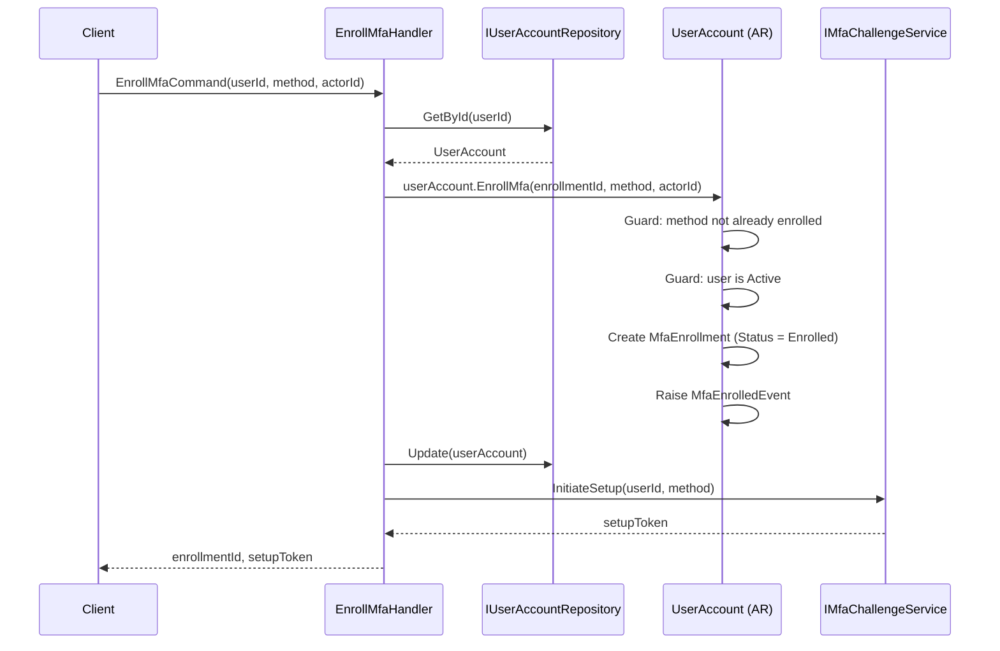
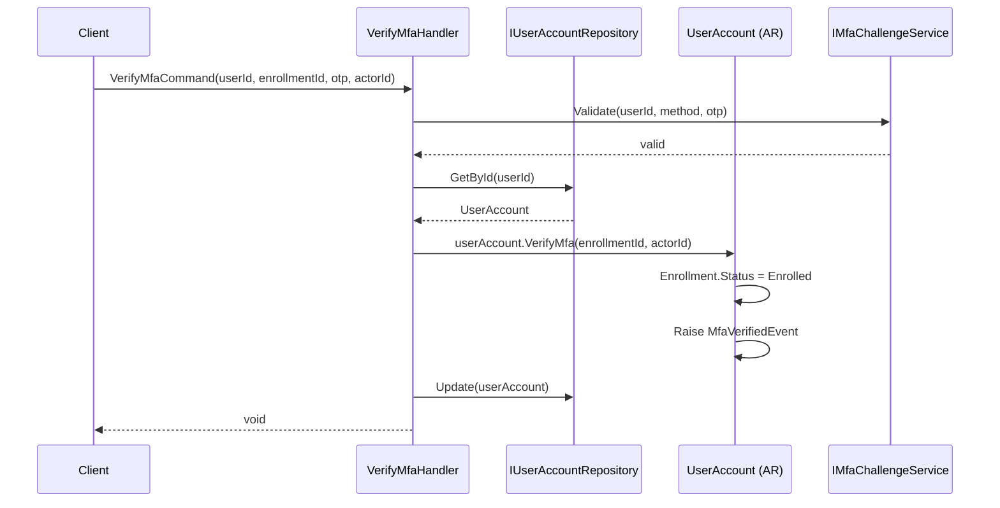
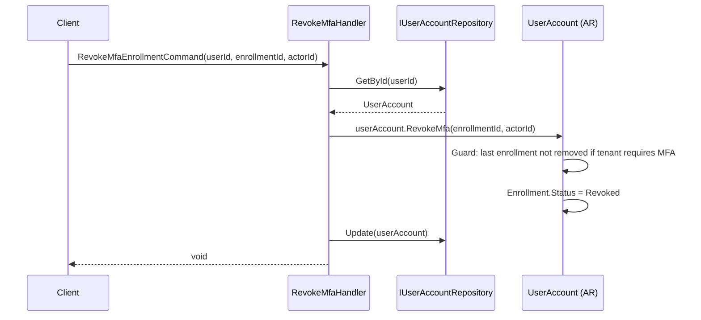
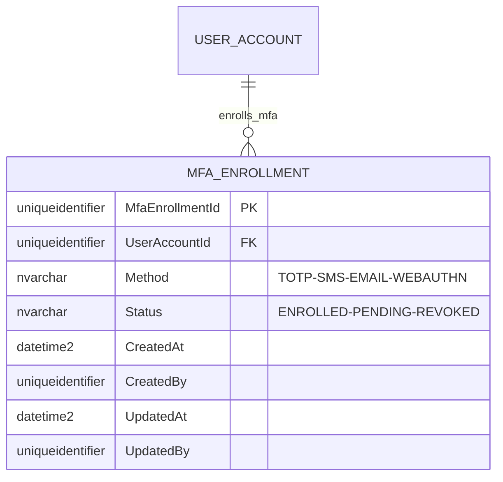
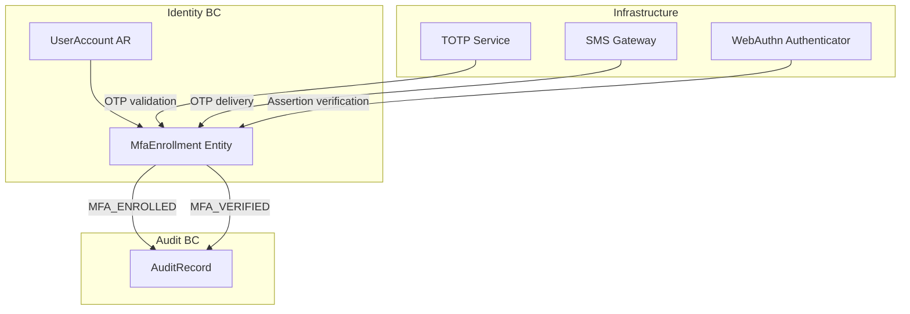

# MfaEnrollment — Aggregate Architecture

**Bounded Context:** Identity  
**Aggregate Root:** `UserAccount` (MfaEnrollment is an owned entity)  
**Module:** `Ums.Domain.Identity.UserAccount.MfaEnrollment`  
**Status:** Production

---

## 1. Aggregate Overview

### Purpose
`MfaEnrollment` records a user's enrollment in a specific MFA method (TOTP, SMS, Email, WebAuthn). Multiple methods can be enrolled per user. Each enrollment has its own lifecycle (Enrolled, Pending, Revoked), allowing users to manage their second-factor options independently.

### Business Responsibility
- Track which MFA methods a user has enrolled.
- Manage enrollment lifecycle: Pending → Enrolled → Revoked.
- Ensure one enrollment record per method per user.
- Feed authentication flows with the list of available second factors.

### Aggregate Root
`UserAccount` (parent). All enrollment mutations go through `UserAccount` commands.

### Invariants and Consistency Rules
1. A user can enroll each `MfaMethod` at most once — no duplicate methods.
2. Enrollment status transitions: `Pending → Enrolled → Revoked`.
3. `UserAccount.Status` must be `Active` to enroll a new method.
4. At least one enrolled method must remain if the tenant requires MFA.

### Related Entities / Value Objects
| Entity / VO | Type | Notes |
|---|---|---|
| `UserAccountId` | Value Object | FK to parent UserAccount |
| `MfaMethod` | Enum | TOTP · SMS · EMAIL · WEBAUTHN |
| `MfaEnrollmentStatus` | Enum | Enrolled · Pending · Revoked |
| `AuditValueObject` | Value Object | CreatedAt/By, UpdatedAt/By |

### Domain Events
| Event | Trigger |
|---|---|
| `MfaEnrolledEvent` | New MFA method enrolled |
| `MfaVerifiedEvent` | MFA challenge completed successfully |

### Commands / Use Cases
| Command | Description |
|---|---|
| `EnrollMfaCommand` | Enroll a new MFA method |
| `RevokeMfaEnrollmentCommand` | Revoke an enrolled method |
| `VerifyMfaCommand` | Confirm MFA challenge (transitions Pending → Enrolled) |

### Repository / Service Boundaries
- Access via `IUserAccountRepository`.
- `IMfaChallengeService` — infrastructure service handling OTP generation/TOTP validation (not domain).

---

## 2. Object Model

```
UserAccount (Aggregate Root)
└── MfaEnrollment (Owned Entity, 0..N)
    └── Props: MfaEnrollmentProps
        ├── Id: IdValueObject
        ├── UserAccountId: UserAccountId
        ├── Method: MfaMethod
        ├── Status: MfaEnrollmentStatus
        └── Audit: AuditValueObject
```

### Main Attributes
| Attribute | Type | Notes |
|---|---|---|
| `Id` | `Guid` | PK |
| `UserAccountId` | `Guid` | FK to UserAccount |
| `Method` | `MfaMethod` | TOTP / SMS / EMAIL / WEBAUTHN |
| `Status` | `MfaEnrollmentStatus` | Enrolled / Pending / Revoked |

### Lifecycle
```
Pending ──► Enrolled ──► Revoked
```

---

## 3. Sequence Diagrams

### Enroll MFA Flow


### Verify MFA Flow


### Revoke MFA Flow


---

## 4. Entity / Relationship Model



---

## 5. Bounded Context Model



---

## 6. API / Application Layer Contract

### Commands
| Command | Input | Output |
|---|---|---|
| `EnrollMfaCommand` | `userId, method, actorId` | `Guid enrollmentId, setupToken` |
| `VerifyMfaCommand` | `userId, enrollmentId, otp, actorId` | `void` |
| `RevokeMfaEnrollmentCommand` | `userId, enrollmentId, actorId` | `void` |

### Queries
| Query | Returns |
|---|---|
| `GetUserMfaEnrollmentsQuery(userId)` | `List<MfaEnrollmentDto>` |

### Error Cases
| Code | Condition |
|---|---|
| `MFA_METHOD_ALREADY_ENROLLED` | Same method enrolled twice |
| `MFA_ENROLLMENT_NOT_FOUND` | Unknown enrollmentId |
| `MFA_LAST_ENROLLMENT` | Revoke would leave user with no MFA (required) |
| `MFA_VERIFICATION_FAILED` | OTP invalid |

---

## 7. Persistence Notes

### Indexes
| Index | Columns | Type |
|---|---|---|
| `IX_MfaEnrollment_UserAccountId_Method` | `UserAccountId, Method` | Unique (active only) |

### Unique Constraints
- `(UserAccountId, Method)` — only one enrollment per method per user.

---

## 8. Security and Audit

### Authorization Rules
| Operation | Required Role |
|---|---|
| Enroll MFA | User themselves |
| Revoke MFA | User themselves or `Tenant:Admin` |
| Verify MFA | User themselves |

### Audit Events
- `MFA_ENROLLED`, `MFA_VERIFIED`, `MFA_REVOKED`

### Compliance
- MFA enrollment records must be retained for compliance audit trails even after revocation.
- WebAuthn credentials (passkeys) must never store raw FIDO attestation data in the domain model — that belongs in the infrastructure layer.
