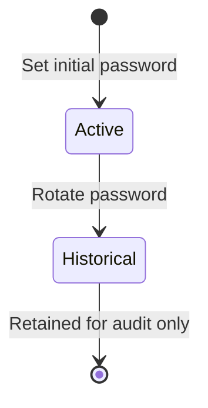

# PasswordCredential - Owned Entity Design

> **Language:** [English](./password-credential.md) | [Español](../../domain-es/identity/password-credential.md)

**Bounded Context:** Identity  
**Owner Aggregate:** `UserAccount`  
**Functional Traceability:** FS-18

## Purpose

`PasswordCredential` represents the protected local authentication secret of a `UserAccount`. It exists only for accounts using internal authentication. The web application manages it from `User Accounts > Credentials`; it never reads a password hash or historical credential identifier.

## Business Rules

1. A federated account must not receive an active local password.
2. A user can have at most one active local password.
3. Rotating a password creates a new active credential and keeps previous credentials inactive for audit.
4. Password hashes are write-only from the client perspective and must never enter user-facing errors or logs.

## Lifecycle

## Application Contract

| Surface | Contract | Behavior |
| :--- | :--- | :--- |
| REST command | `POST /user-accounts/{userAccountId}/passwords` | Sets or rotates a local password. The API creates the BCrypt hash. |
| GraphQL query | User account fields `hasActivePassword`, `passwordUpdatedAtUtc` | Returns status information only. |
| Web view | `User Accounts > Credentials` | Offers a compact set/rotate form for eligible internal accounts. |

## Security and Observability

- Requests provide the temporary password only through secured transport to the API; the API stores the BCrypt hash.
- `PasswordHash` is never returned in REST or GraphQL projections.
- Federated accounts show guidance to manage credentials through their external provider.
- Safe error responses display a human-readable reason and `ErrorId`; full diagnostics are kept in Serilog/Grafana Loki logs.
