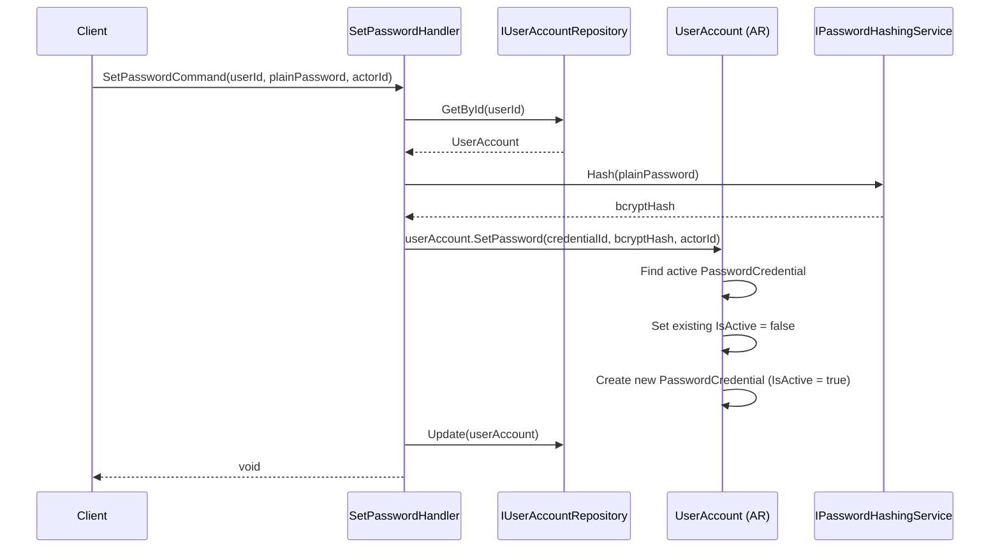
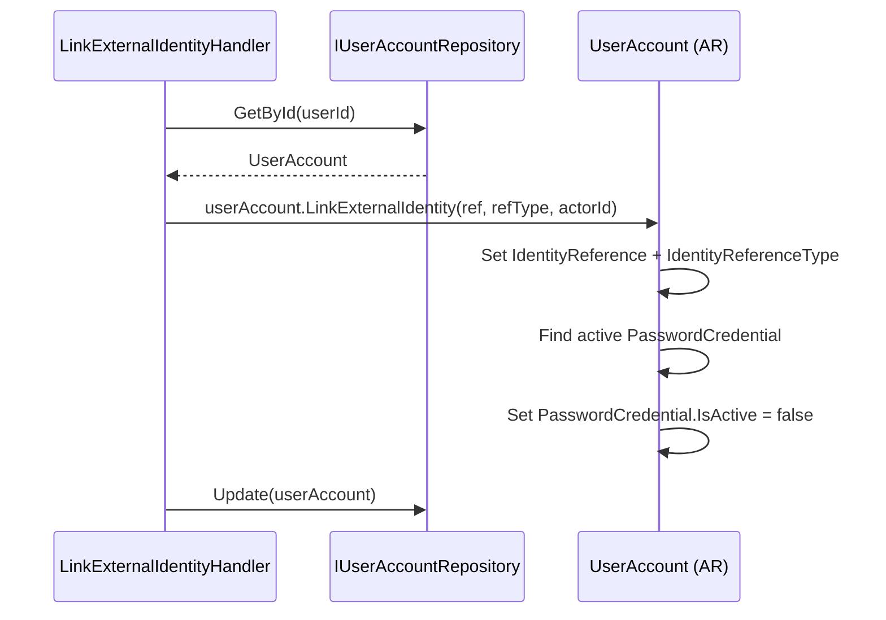
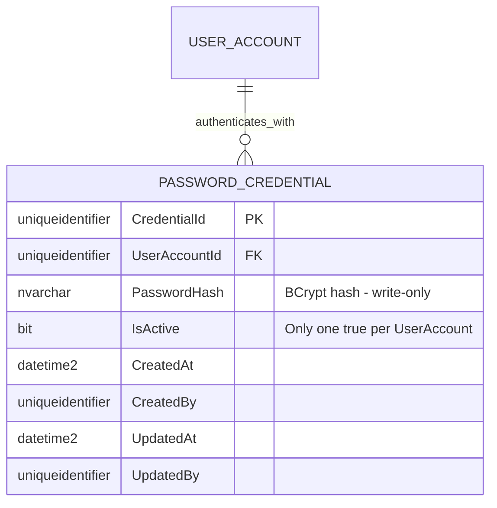
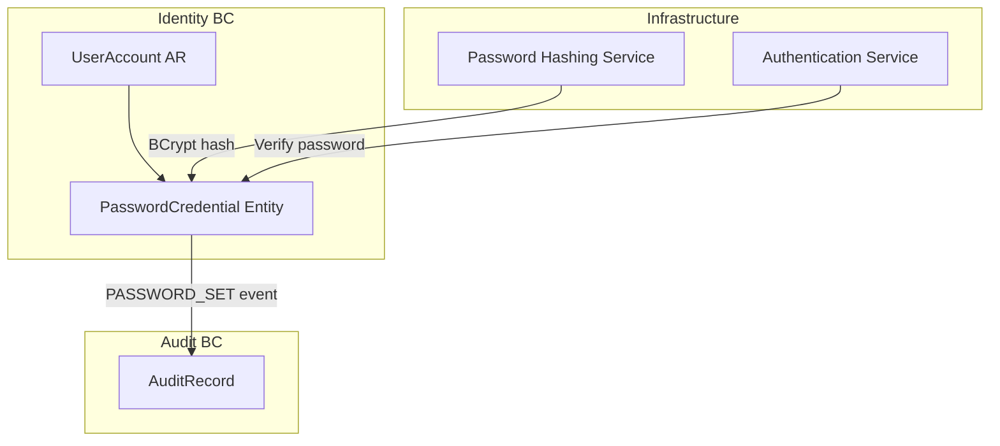

# PasswordCredential — Aggregate Architecture

**Bounded Context:** Identity  
**Aggregate Root:** `UserAccount` (PasswordCredential is an owned entity)  
**Module:** `Ums.Domain.Identity.UserAccount.PasswordCredential`  
**Status:** Production

> **DDD Note:** `PasswordCredential` is an owned entity within `UserAccount`. It is documented separately because it has distinct security semantics, a credential rotation lifecycle, and strict access controls that warrant explicit documentation.

---

## 1. Aggregate Overview

### Purpose
`PasswordCredential` stores the BCrypt-hashed password for a `UserAccount` with a local authentication strategy. It supports credential rotation — keeping historical records (inactive) while maintaining exactly one active credential at any time.

### Business Responsibility
- Store the current active BCrypt hash for password-based authentication.
- Support secure credential rotation with full history retention.
- Enforce that federated users (with `IdentityReference`) do not have an active credential.

### Aggregate Root
`UserAccount` (parent). Created and managed exclusively through `UserAccount` commands.

### Invariants and Consistency Rules
1. At most one `PasswordCredential` with `IsActive = true` per `UserAccount`.
2. Setting a new password automatically deactivates the previous active credential.
3. A `FEDERATED` user (has `IdentityReference`) should not have `IsActive = true`.
4. `PasswordHash` must be a valid BCrypt hash (validated by domain service before assignment).
5. Historical credentials (IsActive = false) are retained for audit — never physically deleted.

### Related Entities / Value Objects
| Entity / VO | Type | Notes |
|---|---|---|
| `UserAccountId` | Value Object | FK to parent UserAccount |
| `PasswordHash` | Value Object | Validated BCrypt hash string |

### Domain Events
*(Raised on UserAccountDomainEventsManager — no dedicated events for PasswordCredential, but `UserActivatedEvent` and password operations feed audit)*

### Commands / Use Cases
| Command | Description |
|---|---|
| `SetPasswordCommand` | Create or rotate the active password credential |
| `DeactivatePasswordCommand` | Deactivate credential (e.g. on account federation) |

### Repository / Service Boundaries
- Access via `IUserAccountRepository`.
- `IPasswordHashingService` — hashes plain passwords before the domain entity is created.
- `IPasswordVerificationService` — verifies a plain password against the stored hash (used in auth flows, not domain).

---

## 2. Object Model

```
UserAccount (Aggregate Root)
└── PasswordCredential (Owned Entity, 0..N stored, 0..1 active)
    └── Props: PasswordCredentialProps
        ├── Id: IdValueObject
        ├── UserAccountId: UserAccountId
        ├── PasswordHash: PasswordHash
        ├── IsActive: bool
        └── Audit: AuditValueObject
```

### Main Attributes
| Attribute | Type | Notes |
|---|---|---|
| `Id` | `Guid` | PK |
| `UserAccountId` | `Guid` | FK to UserAccount |
| `PasswordHash` | `string` | BCrypt hash — write-only |
| `IsActive` | `bool` | Only one `true` at a time |

### Lifecycle
```
New Credential (IsActive = true)
    ↓ (on SetPassword)
Previous Credential (IsActive = false) — retained for history
```

---

## 3. Sequence Diagrams

### Set Password Flow


### Deactivate Credential Flow (on federation)


---

## 4. Entity / Relationship Model



---

## 5. Bounded Context Model



**Context Ownership:** Identity BC (via UserAccount aggregate).  
**External:** Password hashing and verification are infrastructure services that do not cross bounded context boundaries.

---

## 6. API / Application Layer Contract

### Commands
| Command | Input | Output |
|---|---|---|
| `SetPasswordCommand` | `userId, plainPassword, actorId` | `void` |

### Error Cases
| Code | Condition |
|---|---|
| `USER_NOT_FOUND` | Unknown userId |
| `USER_IS_FEDERATED` | Cannot set password on federated user |
| `PASSWORD_HASH_INVALID` | Hash validation failed |

---

## 7. Persistence Notes

### Indexes
| Index | Columns | Type |
|---|---|---|
| `IX_PasswordCredential_UserAccountId_IsActive` | `UserAccountId, IsActive` | Non-unique |

### Unique Constraints
- Application-level: only one `IsActive = true` per `UserAccountId` enforced in domain logic.

### Security
- `PasswordHash` column must never appear in query projections returned to clients.
- `PasswordHash` must never appear in `AuditRecord.WhatChanged` payloads.
- Column must be encrypted at rest (SQL Server Always Encrypted or TDE).

---

## 8. Security and Audit

### Authorization Rules
| Operation | Required Role |
|---|---|
| Set Password | User themselves or `Tenant:Admin` |
| Read Credential (IsActive only) | `Tenant:Admin` |
| Read Hash | Nobody — write-only |

### Sensitive Data
- `PasswordHash` is the most sensitive field in the system. Read access must be blocked at the repository layer.

### Audit Events
- `PASSWORD_SET` — logged with `actorId`, `userId`, timestamp. Hash never logged.

### Compliance
- GDPR: Hash is not PII, but presence of a credential record implies a local account. On account erasure, hash must be zeroed.
- NIST 800-63B: BCrypt with appropriate cost factor required.
